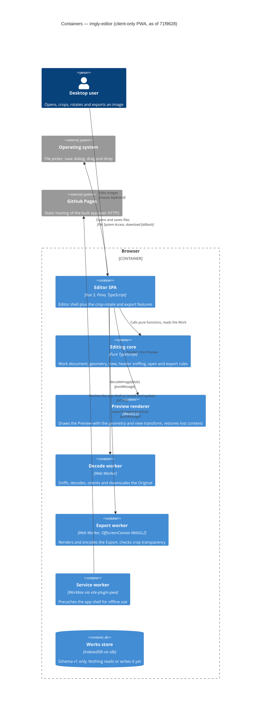

# Architecture map — imgly-editor

> **Current architecture.** The full re-survey of 2026-10-08 at `71f9628` produced this map, after
> roadmap steps 1–4 shipped: the skeleton, `open-and-view`, `export` and `crop-rotate`. Where the
> code differs from the plan, the map describes the code. Steps that are still planned are marked
> *(planned)*. The foundational decisions are in `docs/adr/`, and the feature decisions are in
> `docs/features/<slug>/adr/`.

## Stack

- Language and runtime: TypeScript 5.9 (`strict`), Node 24 toolchain, **pnpm** (`package.json`). See ADR [0001](adr/0001-build-a-client-only-vue-pwa.md)
- Frameworks: **Vue 3.5** (Composition API, `<script setup>`), **Pinia 4** (setup stores), **Vite 8**, **vite-plugin-pwa 2** (Workbox 7 service worker and web manifest)
- Rendering: one shared **WebGL2** program draws both the preview and the export (`src/render/shaders.ts:51`). It applies the geometry and the view transform in one pass (crop-rotate ADR-0002). The export renders and encodes in a dedicated **worker** on `OffscreenCanvas`, and falls back to the window when the worker has no WebGL2 (export ADR-0002/0003). Canvas 2D drawing is *(planned)*, see ADR [0004](adr/0004-render-adjustments-on-webgl2-and-drawing-on-canvas2d.md)
- Decoding: browser-native `createImageBitmap` in a dedicated decode worker, with no third-party codec libraries. Headers are parsed in `core` before decoding (open-and-view ADR-0001/0002)
- Persistence: **IndexedDB** via `idb` 8 (schema only so far) and **UUIDv7** IDs (`uuid` package). See ADR [0003](adr/0003-persist-works-in-indexeddb-as-original-plus-params-plus-layer.md)
- Build, test and lint:
  - `pnpm dev` runs the Vite dev server
  - `pnpm build` runs `vue-tsc -b && vite build` and writes to `dist/`
  - `pnpm test` runs `vitest run` (Vitest 5, happy-dom, fake-indexeddb)
  - `pnpm test:e2e` runs Playwright 1.63 on Chromium, Firefox and WebKit against `vite preview` of a hooks-enabled build in `dist-e2e/`. `@perf` tests run only with `PERF=1`
  - `pnpm lint` runs `eslint .` (ESLint 10 flat config: typescript-eslint and eslint-plugin-vue), and `pnpm format` runs Prettier 3
  - `pnpm typecheck` runs `vue-tsc -b --noEmit` (the "vet" gate)
- Hosting: a static site on **GitHub Pages**, deployed by GitHub Actions. Vite `base` is `/imgly/` (`vite.config.ts:11`)

## C4 — system as it is

There is no server. The whole system runs in the browser, and GitHub Pages only serves static files.

## Module inventory

`src/core/` must not import Vue, Pinia, DOM APIs, `features`, `infra` or `render`
(`eslint.config.js:41`). `src/infra/` may import `core` types **and pure, side-effect-free
functions** (open-and-view `sad.md` §1 Decision override 1) and `shared`, but never Vue, Pinia, a
feature or the app shell (`eslint.config.js:70`, `src/infra/import-rules.test.ts`). Features do not
import each other. They coordinate through the `editor` store.

| Module | Path | Layers | Wired at | Responsibility |
|---|---|---|---|---|
| app shell | `src/app/` | entry, router-less shell, PWA registration, e2e hooks | `src/main.ts`, `src/app/App.vue` | Creates the app and installs Pinia. Mounts `EditorView` and fills its slots with feature components. Runs the capability gate. Registers the SW in production. Installs `window.__imglyTest` only in the `VITE_E2E_HOOKS` build (`src/main.ts:11`) |
| core | `src/core/` | domain (pure TS) | `src/core/index.ts` | `document.ts` holds the Work, the Original, the revision and unsaved edits. `result.ts` holds `Result` and `AppError`. `geometry/` holds flip, turn, straighten, crop and proportions and their one forward transform. `view/` holds zoom, pan and fit. `image-header/` sniffs JPEG, PNG, GIF, WebP and ISOBMFF (AVIF/HEIC). `open/` holds the open policy, target size and drop rules. `export/` holds naming, format, quality, size and metadata |
| render | `src/render/` | infra (GPU) | `src/render/index.ts` | `capabilities.ts` runs the startup gate. `preview-renderer.ts` draws the WebGL2 Preview and handles context loss and restore. `shaders.ts` is the shared program. `view-transform.ts` builds the view transform. `export/` is the export worker and client with a window fallback. `fake-gl.ts` is a test stub |
| infra/db | `src/infra/db/` | infra (persistence) | `src/infra/db/index.ts` | `openDb()` with versioned upgrade steps. The `WorkRecord` schema is `{id, name, createdAt, updatedAt}`. **There is no repository and no caller yet**; the Gallery step *(planned)* adds them |
| infra/platform | `src/infra/platform/` | infra (OS APIs) | `src/infra/platform/index.ts` | `file-picker.ts` (open), `save-file.ts` (`showSaveFilePicker` with a download fallback), `data-transfer.ts` (drop intake) and `drop-guard.ts` (window drop guard). The clipboard and `launchQueue` are *(planned)* in the OS-integration step |
| infra/image-decode | `src/infra/image-decode/` | infra (worker) | `src/infra/image-decode/index.ts:8` | The decode worker runs `pipeline.ts`: header sniff → policy → `createImageBitmap` → orient → sRGB → alpha check → stepwise downscale. The `decodeImage` client handles supersede and error mapping. `probes.ts` checks format support |
| shared | `src/shared/` | ui primitives, notices, styles, utils | `src/shared/index.ts` | Tokens (`styles/tokens.css`), 10 UI primitives (`ui/`), the toast queue (`notices/`), `ids.ts` (UUIDv7) and `bitmap-ledger.ts` (ImageBitmap leak tracking) |
| feature: editor | `src/features/editor/` | ui + store | `src/features/editor/index.ts` | The shell screen (`EditorView.vue` with the `top-bar-actions`, `tool-canvas` and `tool-panel` slots). `components/` holds the preview canvas, empty canvas, drop overlay, replace dialog, status bar, zoom bar and gestures. `store.ts` holds the Work, View, phase, display state, active-tool slot and export snapshot. This is where open-and-view lives |
| feature: crop-rotate | `src/features/crop-rotate/` | ui + store | `src/features/crop-rotate/index.ts` | `CropRotateAction` (top bar, `C`), `CropRotateTool` and `CropRotateControls` (panel), and `CropOverlay` (DOM frame over the Preview). The draft geometry lives in `store.ts` and is committed through `editor.applyGeometry` |
| feature: export | `src/features/export/` | ui + store | `src/features/export/index.ts` | `ExportAction` (top bar, `E`) and `ExportPanel` (Popover: format, quality, size). `store.ts` takes the editor's export snapshot, encodes it, verifies it, then saves it |

Features that are not built yet: adjust (step 5), draw (6), undo/redo (7), gallery (8), install and
update (9), and OS integration (10). See `docs/roadmap.md`.

## Conventions (cited — the rules a new feature must match)

- **Module wiring and registration:** each feature exposes only `index.ts` (components, store and public types), as in `src/features/editor/index.ts:1`. `src/app/App.vue` fills the `EditorView` slots with feature components (top-bar action, canvas overlay, tool panel). A new tool adds a `ToolId` (`src/features/editor/store.ts:70`) and opens through `openTool()` (`store.ts:188`) into the single active-tool slot (crop-rotate ADR-0003)
- **Error handling:** `core` and `infra` return `Result<T, AppError>`. The `AppErrorCode` union is `src/core/result.ts:5`: `STORAGE_QUOTA`, `FILE_NOT_PERMITTED`, `NOT_AN_IMAGE`, `UNREADABLE`, `DECODE_FAILED`, `UNSUPPORTED_FORMAT`, `TOO_LARGE`, `UNSUPPORTED_BROWSER`, `DISPLAY_LOST` and the four `EXPORT_*` codes. They throw only for programmer errors. Each feature maps codes to text in its own `messages.ts`, and the UI shows them through the single notice boundary
- **Notices (the toast boundary):** one Pinia store, `useNotices` (`src/shared/notices/store.ts:21`). `info` notices dismiss themselves after 6 s, and `failure` notices stay until the user dismisses them. `ToastStack` renders them. Canvas-level states (unsupported browser, display lost) use `CanvasMessage` instead
- **IDs:** `newId()` returns a time-sortable UUIDv7 (`src/shared/ids.ts:4`)
- **Unsaved edits:** the Work carries `revision` and `cleanRevision` (`src/core/document.ts:33`, open-and-view ADR-0005). Edits go through `withEdit()`
- **Resource lifetime:** call `closeBitmap()` (`src/shared/bitmap-ledger.ts:17`) before you drop any `ImageBitmap`. In DEV and e2e builds the ledger counts what was received and closed, so e2e can assert that exactly one Original is retained
- **GPU capability and context loss:** `probeCapabilities()` (`src/render/capabilities.ts:42`) gates startup. It needs WebGL2 with a texture size of at least 4096, `createImageBitmap`, and OffscreenCanvas in a worker. The preview renderer handles `webglcontextlost` and `webglcontextrestored` (`src/render/preview-renderer.ts:116`). The editor's `DisplayState` is `checking`, `ok`, `unsupported`, `restoring` or `lost`
- **Workers:** each worker sits behind a client factory that takes a `createWorker` function (`src/infra/image-decode/index.ts:8`, `src/render/export/index.ts:19`), so tests inject a `FakeWorker`. The message handling lives in a separately tested `worker-handler.ts`
- **Persistence and DB access:** only `src/infra/db/*` touches IndexedDB, through repository functions that return `Result`. Images are stored as `Blob`s, never as data URLs. There are no repositories yet (`src/infra/db/open-db.ts:8`)
- **Migrations:** forward-only steps live in `src/infra/db/migrations/NNNN-<name>.ts`, each exporting `{ version, upgrade(db, tx) }`, and are appended to `migrations/index.ts`. The only step so far is `0001-init`, which creates `works` with keyPath `id` and an index on `updatedAt` (`src/infra/db/migrations/0001-init.ts:5`). `src/infra/db/migrations.test.ts` covers it with `fake-indexeddb/auto`
- **Tests:** Vitest unit and component tests sit next to the source as `*.test.ts` (`@vue/test-utils` on happy-dom). GPU code is tested against `src/render/fake-gl.ts`, and the editor against `src/features/editor/fake-renderer.ts` and `testing.ts`. e2e tests are `e2e/<feature>/*.spec.ts`, with fixtures generated by `e2e/fixtures/generate.sh`. They cover only what happy-dom can't: WebGL, the SW and offline reload, downloads and real decoding. e2e reads and prepares state only through `window.__imglyTest` (`src/app/test-hooks.ts:98`). WebGL pixel checks run only on Chromium
- **Inter-module communication:** direct imports in the allowed direction. Features coordinate through `useEditorStore` (`src/features/editor/store.ts:120`), for example `applyGeometry()` (`:241`), the export snapshot and the `phase` guards. There is no event bus
- **UI and styling:** plain CSS, `<style scoped>` and only `var(--…)` tokens. See §Frontend / UI foundation
- **Formatting and linting:** Prettier (single quotes, no semicolons, width 100) and the ESLint flat config (`eslint.config.js`). `vue-tsc --noEmit` must pass
- **Git and CI:** `.github/workflows/ci.yml` runs install → lint → typecheck → unit → build → Playwright on all three engines (Mesa GL under `xvfb-run`). On `main` it also deploys `dist/` to GitHub Pages

## Datastores

| Store | Engine | Accessed via | Notes |
|---|---|---|---|
| `works` (object store, keyPath `id`, index `updatedAt`) | IndexedDB (`imgly` DB, v1) | `src/infra/db/open-db.ts` (no repository yet) | Schema `WorkRecord {id, name, createdAt, updatedAt}` (`src/infra/db/schema.ts`). **Not read or written at runtime.** The open Work lives only in memory in the editor store. Gallery (step 8) widens the record (original Blob, geometry, params, layer, thumbnail) through new migration steps and adds the repository |
| app-shell cache | Cache Storage (Workbox precache) | `vite-plugin-pwa` (`vite.config.ts`) | Holds build assets only, never user data |

No `localStorage` or `sessionStorage` is used.

## Frontend / UI foundation

- **Component library and design system:** in-repo primitives only. The canon is `docs/design-system.md` (`status: Living`, `tool: code`), and every new primitive is registered there
- **Design tokens:** CSS custom properties in `src/shared/styles/tokens.css`: `--color-*` (surface, raised, canvas surround, border, text, muted, accent and its states, danger, focus ring), `--space-1…8` (4 px scale), `--radius-*`, layout sizes (`--control-height`, `--toolbar-size`, `--panel-width`, `--dialog-width`…), `--font-*` and `--z-*`. The theme is dark by default with a `prefers-color-scheme: light` override (`tokens.css:57`)
- **Styling approach:** plain CSS and `<style scoped>` only. There is no Tailwind, no CSS-in-JS and no UI kit
- **Shared primitives** (`src/shared/ui/`, exported from `ui/index.ts`, tested in `primitives.test.ts`): `BaseButton` (primary, secondary, ghost, toggle with `pressed`), `Spinner`, `Toast`, `ToastStack`, `Dialog` (alertdialog), `CanvasMessage`, `Popover` (non-modal, lockable), `SegmentedControl` (radiogroup with roving tabindex), `NumberField` and `SliderField` (a clamped slider with a number field and marks)
- **State:** Pinia setup stores, one per feature (`src/features/<f>/store.ts`), plus the shared `notices` store. There is no server cache
- **Closest UI precedents:** for a tool panel, `src/features/crop-rotate/CropRotateTool.vue` and `CropRotateControls.vue` (`SegmentedControl` and `SliderField` in the `tool-panel` slot). For a top-bar popover, `src/features/export/ExportPanel.vue`. For the screen shell, `src/features/editor/EditorView.vue`

## Where things live / closest precedents

- **A new editing tool** (adjust, draw…) goes in `src/features/<tool>/` with `<Tool>Action.vue`, `<Tool>Tool.vue`, `store.ts` (the draft), `messages.ts`, `shortcuts.ts` and `index.ts`. Add a `ToolId` in the editor store, fill the slots in `App.vue`, and put pure rules in `src/core/<tool>/`. The model is `crop-rotate`.
- **A new GPU effect** (adjustments) extends the shared program in `src/render/shaders.ts`, so the preview and the export stay pixel-identical (crop-rotate ADR-0002, export ADR-0002). It also adds a field to the Work in `src/core/document.ts` and to `ExportSnapshot`.
- **A new image format or open rule** goes in `src/core/image-header/` (parser and sniff) and `src/core/open/policy.ts`, then into the decode `pipeline.ts`. The model is `open-and-view`.
- **A new output option** goes in `src/core/export/` (rule) and `src/render/export/` (worker), surfaced in `ExportPanel.vue`. The model is `export`.
- **A new persisted field or store** needs a new `src/infra/db/migrations/NNNN-*.ts` step, a repository function in `src/infra/db/` and a `fake-indexeddb` test. The first one arrives with Gallery.
- **A new error** gets a code in the `AppErrorCode` union (`src/core/result.ts:5`) and text in the owning feature's `messages.ts`.

## Constraints & known tech-debt

- **Client-only, no backend** (ADR 0001): no feature may introduce a server, accounts or sync.
- **Desktop-first**: target the latest Chromium, Firefox and Safari on desktop. On mobile the app only has to not break.
- **WebGL2 required** (ADR 0004). The capability gate shows SCR-04 when it is missing. There is no CPU fallback.
- **Originals are downscaled on open** to the Downscale limit (`src/core/open/target-size.ts`), and are converted to sRGB (open-and-view ADR-0004).
- **GitHub Pages sub-path**: the Vite `base`, the manifest `scope` and `start_url`, and the SW scope all use `/imgly/`.
- **No persistence yet**: a reload loses the open Work, and Export is the only save. IndexedDB is not durable when it arrives either. `navigator.storage.persist()` and the gallery cap are open (roadmap D2).
- **No undo/redo yet**: edits are applied to the Work directly. Step 7 adds a command stack in `core`.
- **The editor store is the hub**: `src/features/editor/store.ts` (466 lines) owns the Work, View, phase, tool slot and export snapshot. Watch how big it grows as adjust, draw and undo land.
- **OS integration** (`file_handlers`, `launchQueue`, clipboard) is not built and is Chromium-leaning (roadmap D5).

## Reconciliation with the authored architecture doc

There is no separate authored architecture doc. The root `CLAUDE.md` (module boundaries and
conventions) and ADRs 0001–0004 are the authored inputs. This map matches them, with these updates
to the previous map version:
- `src/render/adjust.frag` doesn't exist: the GPU code lives in `src/render/shaders.ts`.
- The scaffold-era feature list (`crop`, `adjust`, `draw`, `gallery`, `os-integration`) is replaced by the real features `editor`, `crop-rotate` and `export`.
- `works-repository.ts` doesn't exist, and nothing persists yet.
