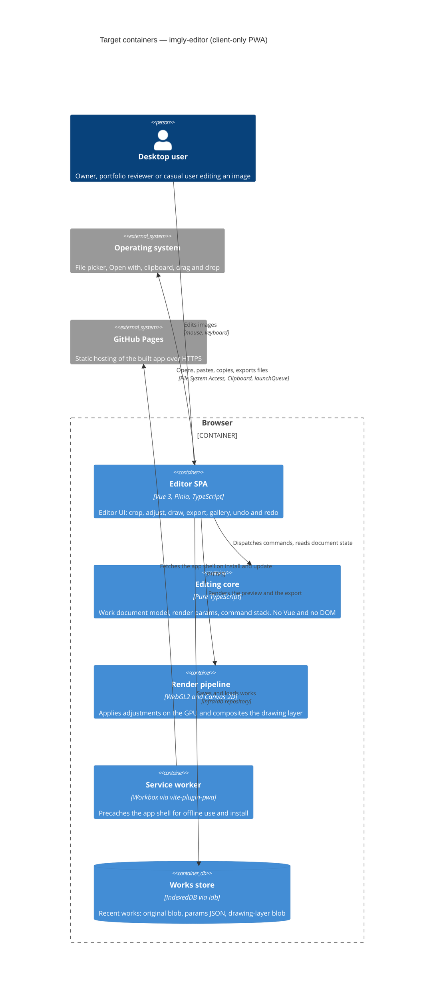

# Architecture map — imgly-editor

> **Materialized foundation.** `survey` produced this map from `docs/idea-brief.md` and the
> foundation session of 2026-10-02, and `/sdd:scaffold` built it on 2026-10-04. Paths marked
> *(scaffold)* now exist in the skeleton. The foundational decisions behind it are in `docs/adr/`.

## Stack

- Language / runtime: TypeScript 5 (`strict`), Node 24 toolchain, **pnpm** (`package.json` *(scaffold)*) — ADR [0001](adr/0001-build-a-client-only-vue-pwa.md)
- Frameworks: **Vue 3** (Composition API, `<script setup>`), **Pinia** (state), **Vite** (build/dev), **vite-plugin-pwa** (Workbox service worker + web manifest)
- Rendering: **WebGL2** fragment shader for the adjustment pipeline; **Canvas 2D** for the freehand drawing layer; `OffscreenCanvas.convertToBlob` for export — ADR [0004](adr/0004-render-adjustments-on-webgl2-and-drawing-on-canvas2d.md)
- Persistence: **IndexedDB** via `idb`; **UUIDv7** IDs (`uuid` package) — ADR [0003](adr/0003-persist-works-in-indexeddb-as-original-plus-params-plus-layer.md)
- Build / test / lint:
  - `pnpm dev` — Vite dev server
  - `pnpm build` — `vue-tsc -b && vite build` → `dist/`
  - `pnpm test` — `vitest run` (unit, happy-dom + fake-indexeddb)
  - `pnpm test:e2e` — `playwright test` on Chromium, Firefox and WebKit against `vite preview` of its own hooks-enabled build in `dist-e2e/` (never `dist/`); `@perf` tests are excluded unless `PERF=1`
  - `pnpm lint` — `eslint .` (flat config: typescript-eslint + eslint-plugin-vue) ; `pnpm format` — Prettier
  - `pnpm typecheck` — `vue-tsc -b --noEmit` (the "vet" gate)
- Hosting: static site on **GitHub Pages**, deployed by GitHub Actions; Vite `base` = `/imgly/` (repo name)

## C4 — system as it is

Target baseline (nothing is deployed yet). There is no server: the whole system runs in the browser,
and GitHub Pages only serves static files.

## Module inventory

Target layout. `src/core/` must not import Vue, Pinia, or DOM/browser APIs. `src/features/*` may import
`core`, `infra`, `shared`. `src/infra/` may import `core` types **and pure, side-effect-free
functions** (widened by open-and-view, `docs/features/open-and-view/sad.md` §1 Decision override 1:
the decode worker runs the same `sniffImageHeader` / `checkOpenPolicy` / target-size code the unit
tests cover) and `shared`, but never Vue, Pinia, a feature or the app shell — ESLint enforces this
for `src/infra/**`. Features do not import each other; cross-feature coordination goes through the
`editor` store or `core` commands.

| Module | Path | Layers | Wired at | Responsibility |
|---|---|---|---|---|
| app shell | `src/app/` *(scaffold)* | entry, router-less shell, PWA registration | `src/main.ts` *(scaffold)* | Create the Vue app, install Pinia, register the service worker, global error toast |
| core | `src/core/` *(scaffold)* | domain (pure TS) | imported by features | Work document (original ref + `AdjustParams` + crop/rotation + layer ref), command stack for undo/redo, `Result` type + error codes |
| render | `src/render/` *(scaffold)* | infra (GPU) | used by `features/editor` | WebGL2 adjustment shader, Canvas 2D drawing compositor, export encoder |
| infra/db | `src/infra/db/` *(scaffold)* | infra (persistence) | `src/infra/db/index.ts` *(scaffold)* | `openDb()` with versioned upgrade steps, `WorksRepository` (save, load, list recent, evict oldest) |
| infra/platform | `src/infra/platform/` *(scaffold)* | infra (OS APIs) | used by features | File open and save, clipboard, drag and drop, `launchQueue` file handling with fallbacks |
| shared | `src/shared/` *(scaffold)* | ui primitives, styles, utils | imported everywhere except `core` | Design tokens, base UI primitives, `ids.ts` (UUIDv7) |
| features | `src/features/<feature>/` | ui (components) + store (Pinia) | mounted by `src/app/App.vue` | One folder per feature: `editor`, `crop`, `adjust`, `draw`, `export`, `gallery`, `os-integration`. The scaffold creates only `editor` as the baseline |

## Conventions (cited — the rules a new feature must match)

- **Module wiring / registration:** each feature exposes `index.ts` (public components and store) and is mounted from `src/app/App.vue`. Nothing imports a feature's internals — `src/features/editor/index.ts` *(scaffold)*
- **Error handling:** `core` and `infra` return `Result<T, AppError>` (`{ ok: true, value } | { ok: false, error }`). `AppError` has a typed `code` (e.g. `DECODE_FAILED`, `STORAGE_QUOTA`). They throw only for programmer errors. The UI surfaces errors through one toast boundary — `src/core/result.ts` *(scaffold)*
- **IDs:** UUIDv7 strings generated in the app (`newId()`), time-sortable. They give the gallery order and the evict-oldest rule — `src/shared/ids.ts` *(scaffold)*
- **Persistence / DB access:** only `src/infra/db/*` touches IndexedDB, through repository functions that return `Result`. Images are stored as `Blob`s, never as data URLs. Stores and components never call `idb` directly — `src/infra/db/open-db.ts` *(scaffold)*. `works-repository.ts` arrives with the first persistence feature
- **Migrations:** IndexedDB schema versions are ordered upgrade steps `src/infra/db/migrations/NNNN-<name>.ts`, each exporting `{ version, upgrade(db, tx) }`. `openDb()` runs every step whose version is greater than `oldVersion`. Steps are forward-only (IndexedDB cannot downgrade). A "down" means a new forward step. The `0001-init` step creates the `works` store — `src/infra/db/migrations/0001-init.ts` *(scaffold)*
- **Tests:** Vitest. Unit tests are co-located as `*.test.ts` next to the source. IndexedDB tests use `fake-indexeddb/auto`. Component tests use `@vue/test-utils` + happy-dom. e2e tests live in `e2e/**/*.spec.ts` (Playwright) and cover what happy-dom cannot: WebGL, the service worker and offline reload, downloads. The functional e2e suite runs on **Chromium, Firefox and WebKit** in CI (widened by open-and-view, `sad.md` §1 Decision override 2); WebGL pixel checks stay Chromium-only. `@perf`-tagged tests run by hand on the reference machine before release (`PERF=1 pnpm test:e2e`). e2e reads and prepares state only through `window.__imglyTest` (`src/app/test-hooks.ts`), present only in the `VITE_E2E_HOOKS` build — `src/app/smoke.test.ts`, `e2e/smoke.spec.ts`, `e2e/open-and-view/`
- **Inter-module communication:** direct imports along the allowed direction (features → core/infra/render/shared). Features coordinate through the `editor` Pinia store. There is no event bus — `src/features/editor/store.ts` *(scaffold)*
- **UI / styling:** plain CSS. Tokens are CSS custom properties in `src/shared/styles/tokens.css`, and components use `<style scoped>`. There is no UI kit and no CSS framework — see §Frontend / UI foundation
- **Formatting / linting:** Prettier (single quotes, no semicolons, width 100) + ESLint flat config. `vue-tsc --noEmit` must pass — `eslint.config.js`, `.prettierrc` *(scaffold)*
- **Git / CI:** one workflow `.github/workflows/ci.yml` runs install → lint → typecheck → unit → build → e2e (three engines) on every push and PR. On `main` it also deploys `dist/` to GitHub Pages *(scaffold)*

## Datastores

| Store | Engine | Accessed via | Notes |
|---|---|---|---|
| `works` (object store, keyPath `id`, index `updatedAt`) | IndexedDB (`imgly` DB) | `src/infra/db/works-repository.ts` (first persistence feature) | One record per work: `{ id, name, createdAt, updatedAt, original: Blob, params: AdjustParams, crop, rotation, layer: Blob \| null, thumbnail: Blob }`. Capped at ~20 works, oldest evicted (cap is an open question in the brief). Eviction by the browser is possible. Export is the durable save |
| app-shell cache | Cache Storage (Workbox precache) | `vite-plugin-pwa` | Holds build assets only. It never stores user data |

## Frontend / UI foundation

- **Component library / design system:** in-repo primitives only, in `src/shared/ui/` *(scaffold)*. `/sdd:design-system` should establish the canon before the first UI feature
- **Design tokens:** CSS custom properties (colours, spacing scale, radii, typography, z-layers) with a dark theme by default and `prefers-color-scheme` light override — `src/shared/styles/tokens.css` *(scaffold)*
- **Styling approach:** plain CSS + `<style scoped>` in SFCs. This is the only approach, with no Tailwind and no CSS-in-JS
- **Shared primitives:** to be grown in `src/shared/ui/` (`BaseButton`, `IconButton`, `Slider`, `ColorSwatch`, `Toolbar`, `Toast`). The scaffold seeds only `BaseButton`
- **State / data-fetching:** Pinia setup stores, one per feature (`src/features/<f>/store.ts`). There is no server cache because there is no server
- **Closest UI precedent:** `src/features/editor/EditorView.vue` *(scaffold)*. It is the baseline screen that the other features compose into

## Where things live / closest precedents

- A new editing tool (crop, adjust, draw…) → `src/features/<tool>/` with `<Tool>Panel.vue` + `store.ts` + `index.ts`. Pure logic goes in `src/core/<tool>/` with co-located tests. The model is `src/features/editor/` *(scaffold)*.
- A new adjustment → a uniform plus a GLSL block in `src/render/adjust.frag` *(scaffold)* and a field in `AdjustParams` (`src/core/document.ts`). Bump the params schema only through a new DB migration step if persisted fields change.
- A new persisted field or store → a new `src/infra/db/migrations/NNNN-*.ts` step + repository function + `fake-indexeddb` test.
- A new screen / UI component → composed from `src/shared/ui/` primitives and `tokens.css`, modelled on `EditorView.vue`.

## Constraints & known tech-debt

- **Client-only, no backend** (ADR 0001): no feature may introduce a server, accounts or sync.
- **Desktop-first**: target the latest Chromium, Firefox and Safari on desktop. On mobile the app only has to not break.
- **WebGL2 required** for live adjustments (ADR 0004). If no WebGL2 context is available, show a clear "unsupported browser" message. There is no CPU fallback in the MVP.
- **Images are downscaled on open** to ≤ ~4096 px on the long side. The exact limit is an open question in the brief.
- **GitHub Pages sub-path**: the app is served under `/imgly/`. The Vite `base`, the manifest `scope` and `start_url`, and the service-worker scope must all use it.
- **IndexedDB is not durable**: the browser may evict it. The UI must say so, and export is the real save. `navigator.storage.persist()` is an open question.
- **OS integration (`file_handlers`, `launchQueue`) is Chromium-only**. Drag-and-drop, paste and the file picker are the cross-browser fallback. This is the last MVP step and the first one cut.

## Reconciliation with the authored architecture doc

No authored architecture doc; this map is the current reference. Intent and scope come from
`docs/idea-brief.md` (Draft, 2026-10-02).
