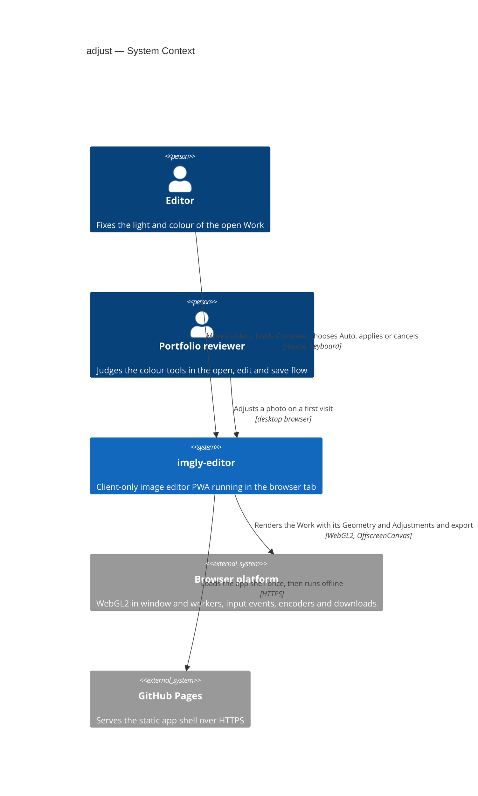
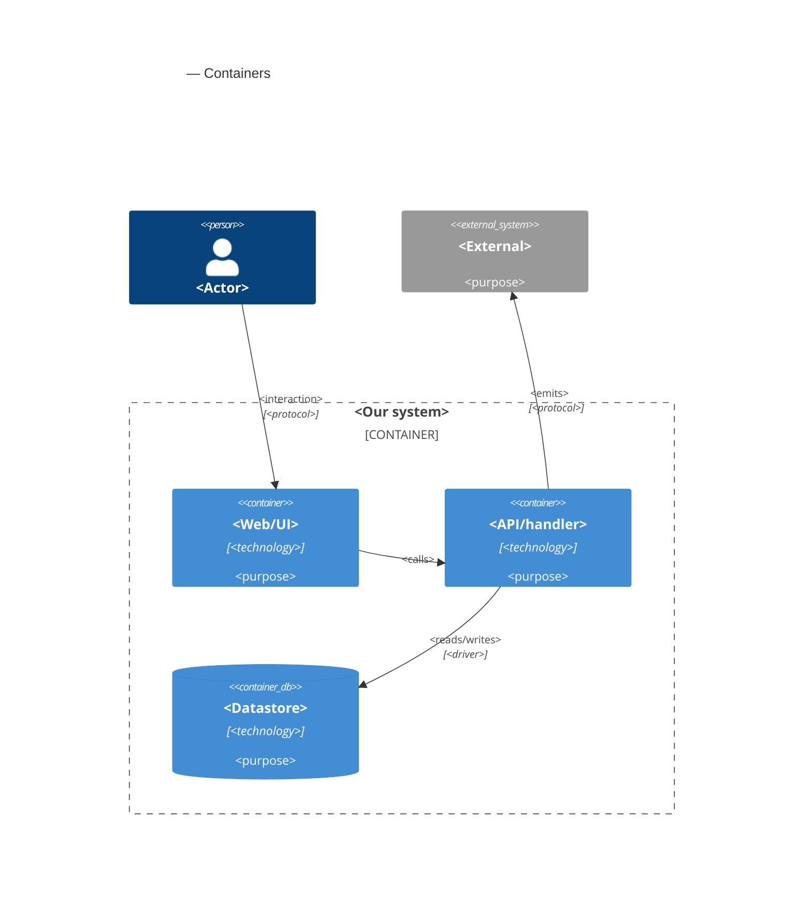

# Software Architecture Document — adjust

<!-- 12 Arc42 sections. Empty section → <!-- N/A: <one-line reason> -->. -->
<!-- C4 Context (L1) lives inline in §3. C4 Container (L2) lives inline in §5. -->
<!-- Numbers in §10 come VERBATIM from spec.md §6 NFR — no inventing, no rounding. -->

## 1. Introduction and goals

**Intent.** adjust gives the Editor one "Adjust" tool with seven sliders (brightness, contrast, saturation, temperature, tint, grayscale and sepia). The Preview follows every slider move live, while the Work changes only on Apply. Cancel returns to the Adjustments the Work had before. Reset and a per-slider reset return to neutral values, Compare shows the photo without any Adjustments while it is held, and Auto adjust sets brightness, contrast, temperature and tint from the photo itself (spec §1). The Adjustments are non-destructive: the Work stores only the seven values on top of its Original and Geometry, so any of them can be changed or reset until the Work is replaced, and resetting gives back exactly the image from before (spec §2). The Preview and every Export show exactly the values the Editor applied, in every target browser. This is the second editing tool and the first colour edit, so it also fixes how colour joins the shared rendering path that the drawing layer (roadmap step 6), undo and redo (step 7) and the gallery (step 8) build on.

**Top-3 quality goals (1-liners; full scenarios in §10):**

1. **Fidelity, Preview to Export**: what the Editor applies is exactly what every Export contains. A full-size Export is within 2 of 255 per channel of the Preview at 100% on all three engines, neutral values change no pixel at all, and transparency is kept exactly.
2. **Non-destructive and exact Adjustments**: the Adjustments are seven whole numbers on the Work, compared one by one and applied in one fixed order. Reset and Apply give back exactly the pixels from before, the same values reached by any path give the same pixels, and Unsaved edits change only when the applied values really differ.
3. **A responsive, leak-free tool**: the Preview follows a dragged slider at 30 or more updates per second on a 4096×3072 Work. Apply, Cancel, Reset, releasing Compare and opening the tool each respond within 150 ms, Auto within 300 ms, and 50 applied changes do not grow memory.

**Stakeholders.**

| Role | Interest | Sign-off owner? |
|---|---|---|
| Editor | Fixes the light and colour of a Work, or gives it a black-and-white or sepia look, in one tool, and trusts that nothing is lost and that the Export matches the Preview | No |
| Portfolio reviewer | Finds the tool and lightens a photo or fixes it automatically on the first try, by mouse or keyboard, in at most three actions | No |
| Tech Lead | SAD approval. The Adjustments model, the colour formulas and their place in the shared shader are inherited by roadmap steps 6, 7 and 8 | Yes |
| Security Lead | Spec §6.1: the photos are confidential and an Export never contains a Draft that was not applied (AC-16) or a Compare view (AC-08). No full security review is needed | Yes |

<!-- Decision overrides (¶4) — populated by the critic resolution loop, empty otherwise. -->

## 2. Constraints

**Technical.**
- TypeScript 5.9 (`strict`), Node 24 toolchain, pnpm — repo ADR [0001](../../adr/0001-build-a-client-only-vue-pwa.md)
- Vue 3.5 (Composition API, `<script setup>`), Pinia 4 setup stores, Vite 8 and vite-plugin-pwa 2. It is a client-only static app on GitHub Pages under `/imgly/`, with no server, accounts or sync — repo ADR 0001
- WebGL2 renders the Work, and the Preview and the Export share one shader source (`src/render/shaders.ts`). Colour adjustments were decided to run there — repo ADR [0004](../../adr/0004-render-adjustments-on-webgl2-and-drawing-on-canvas2d.md). The shader already maps each output pixel to the Original through `u_geometry` in one pass (crop-rotate [ADR-0002](../crop-rotate/adr/0002-render-the-geometry-in-the-shared-shader-in-one-pass.md)). The Original is one texture of premultiplied 8-bit sRGB values with mipmaps (open-and-view ADR-0003 and ADR-0004, `uploadTexture`): its colour is stored already multiplied by its opacity, and the values are the stored sRGB numbers, not linear light
- The Preview draws on `requestAnimationFrame` only after something changed (`src/render/preview-renderer.ts`), with nearest-texel magnification at 100% and above without a Straighten angle. The export worker renders the Crop on an `OffscreenCanvas` with the same program (export [ADR-0002](../export/adr/0002-render-and-encode-exports-in-a-dedicated-web-worker.md)), or in the window where the worker has no WebGL2 (export ADR-0003). It samples texel centres 1:1 at full size and uses the mipmaps for smaller sizes. Data crosses threads only by structured clone or transfer
- The Geometry is integer parameters on the Work, with its rules and the one transform in `src/core/geometry/` (crop-rotate ADR-0001). Tools open in the `editor` store's `activeTool` slot, with their draft in the tool's own store (crop-rotate ADR-0003). `ToolId` is `'crop-rotate'` only today
- Unsaved edits are a revision counter on the Work. Every edit goes through the `editor` store and `withEdit()`, which raises `revision`, and a successful Export sets `cleanRevision` (open-and-view ADR-0005)
- Functional core with feature folders: `core` is pure TypeScript, features never import each other and coordinate through the `editor` store, and `infra` and `render` may call pure `core` functions — repo ADR [0002](../../adr/0002-organize-code-as-functional-core-with-feature-folders.md), repo `CLAUDE.md` §Module boundaries
- Non-destructive editing as "Original plus parameters" — repo ADR [0003](../../adr/0003-persist-works-in-indexeddb-as-original-plus-params-plus-layer.md). No persistence in this feature: the Adjustments live in session memory only, and IndexedDB is not touched (spec §3, §6.1)
- No undo or redo in this feature (spec §3, roadmap step 7)
- Targets: the latest desktop Chromium, Firefox and Safari. On mobile the app only has to not break, with no touch gestures (spec §3, `docs/design-system.md` §Platform posture)

**Organisational.**
- Solo, spare-time project; owner Blazheiko. There is no per-feature effort budget beyond the 4–6 week MVP budget for the whole roadmap, and no hard deadline. Size M at its upper bound, route standard (`.size`, `.route`). If the budget slips, Auto adjust is cut first and Compare second (spec §1)
- TDD is on (`.claude/sdd.local.md`): Vitest units, and Playwright e2e on Chromium, Firefox and WebKit. `@perf` runs by hand on the reference machine (Apple M1 MacBook Air, latest stable Chrome, spec §6)

**Conventions.**
- Repo `CLAUDE.md` §Conventions: `core` returns `Result<T, AppError>` and throws only for programmer errors. Unit tests are co-located as `*.test.ts`, and e2e tests live in `e2e/adjust/*.spec.ts`, only for what happy-dom can't do (WebGL pixels, frame timing). Styling is plain CSS with tokens from `src/shared/styles/tokens.css`. Features expose `index.ts` and are mounted from `src/app/`
- A new editing tool follows the crop-rotate precedent (`docs/architecture-map.md` §Where things live): `src/features/adjust/` with an action, the tool, `store.ts`, `messages.ts`, `shortcuts.ts` and `index.ts`, pure rules in `src/core/adjust/`, a new `ToolId`, and slots filled in `App.vue`. The sliders reuse `SliderField` and `NumberField` from `src/shared/ui/`
- `docs/design-system.md` §Interaction & writing conventions: one notice boundary, every action reachable by keyboard, and short plain microcopy. Refusals are hints on the unavailable control (ux-flows §Platform decisions)
- Field input rules follow crop-rotate AC-07 and export AC-04: values are checked when the Editor leaves the field or presses Enter in it, never while typing, and only plain decimal notation counts as a number (spec AC-05)

**Regulatory / external.**
- Data classification: confidential (spec §6.1). Pixels never leave the device except as the file the Editor exports. The Adjustments change what that file looks like, so an Export holds only applied values: never a Draft (AC-16) and never the Compare view (AC-08)
- No accounts, so no AuthN/AuthZ. The only refusals are the app's own rules: no Adjustment change during an export (AC-15), no Export while the tool is open (AC-16) and one tool at a time (AC-18)
- Abuse cases are bounded by the input rules: every value is a whole number in its range (AC-05), and Auto stays within ±50 (AC-13). No setting makes the Work larger or the rendering heavier
- Security review: N/A per spec §6.1

## 3. Context and scope

imgly-editor is an offline, client-only image editor running entirely in the browser tab. adjust adds its first colour tool: the Editor changes the open Work's Adjustments inside the app, and the result reaches the outside world only through export, which already renders the Work and hands the file to the browser or the operating system. Auto adjust measures the Work's own pixels on the device. Nothing goes to a server, and GitHub Pages only serves the static app shell.

<!-- brownfield: docs/architecture-map.md reflects 71f9628 and only doc commits followed, so it is fresh. open-and-view, export and crop-rotate are shipped. The Work has `geometry` but no colour values. src/render/shaders.ts holds the one program (u_transform, u_geometry, u_flatten) over a premultiplied, mipmapped RGBA8 texture. The editor store has the activeTool slot (ToolId 'crop-rotate' only), previewGeometry, applyGeometry, activePanel and ExportSnapshot { original, geometry, ... }. The export worker-handler renders with FULL_QUAD and cropToOriginalUv, and also runs the crop-rotate alpha check. -->

**Trust boundary.** The tool adds no new input from outside the app. Its only inputs are the Editor's own pointer, keyboard and typed values, which the input rules bound (AC-05), and the Work's own pixels, which Auto adjust reads on the device (AC-12). The trust boundary stays where open-and-view and export put it: decoded files coming in, and what the browser's encoder and file system return going out. This feature's job at that boundary is that an Export holds only applied Adjustments (AC-14, AC-16).

**External systems (in / out):**

| Actor or system | Type | Interaction |
|---|---|---|
| Editor | Person | Opens the "Adjust" tool, moves the sliders or types values, holds Compare, chooses Auto, then applies, cancels or resets, by mouse or keyboard |
| Portfolio reviewer | Person | Tries the tool on a first visit, usually on a desktop browser, and judges how smoothly the Preview follows the sliders |
| Browser platform | System (external) | Provides WebGL2 in the window and in workers, pointer and keyboard events, and the encoders and downloads that export already uses |
| GitHub Pages | System (external) | Serves the static app shell and the worker scripts on first load and updates; never sees an image |

**External: no third-party service** — deliberate. There is no upload, no cloud enhancement and no remote image analysis: Auto adjust is a measurement of the Work's own pixels on the device (§2 Regulatory, spec §6.1).

**C4 Context (L1):**



The Editor and the Portfolio reviewer drive the app by mouse and keyboard. The app renders the Work with its Geometry and Adjustments through the browser's WebGL2, in the Preview and in the export worker, and GitHub Pages is only the first-load source of the code. The operating system's file dialog belongs to export and is unchanged.

## 4. Solution strategy

**Target surface.** `target_surfaces: [web-frontend]` (frontmatter). The feature extends the one runnable surface, the Editor SPA in the browser tab, and the export worker it changes is an internal container of that surface (§5). Decided inline: there is no server (repo ADR 0001) and no published library, so §2 excludes the other surfaces.

**UI architecture (web-frontend).** Inherited from open-and-view, export and crop-rotate: a client-rendered SPA with one editor view and no router. The "Adjust" tool (SCR-03) is a mode of that view in the same tool slot as "Crop and rotate": it takes over the tool panel in place and never opens a page (ux-flows §Platform decisions). State lives in Pinia setup stores, and components reuse `src/shared/ui/` primitives (`SliderField`, `NumberField`, `BaseButton`) and `tokens.css`. No new ADR: §2 excludes server rendering, and crop-rotate ADR-0003 already provides the tool-mode mechanism.

**Top strategic choices (the seeds for ADRs):**

1. **The Adjustments are seven integer fields on the Work, with their rules in `core`** — [ADR-0001](adr/0001-model-the-adjustments-as-seven-integer-fields-on-the-work.md). `Adjustments = { brightness, contrast, saturation, temperature, tint, grayscale, sepia }`, always all present and neutral at open. The pure module `src/core/adjust/` holds the ranges, neutral values, field-by-field equality (AC-11), the field rules (AC-05), the packing into shader uniforms and a CPU reference of the formulas for tests. These seven integers are what repo ADR 0003 will persist in step 8. Serves quality goal 2.
2. **Apply them in the shared fragment shader, in one pass, on unpremultiplied stored sRGB values** — [ADR-0002](adr/0002-apply-the-adjustments-in-the-shared-fragment-shader-on-stored-srgb-values.md). After sampling the Original through `u_geometry`, the shader divides the colour by its opacity, runs the seven steps in their fixed order with a clamp after each, and multiplies back; alpha is never touched (AC-06). All-neutral values skip the block through `u_adjust`, so they give today's pixels bit for bit. The Preview and the export worker set the same uniforms from the same `core` function, and a slider move is a uniform change and one frame. Serves quality goals 1 and 3.
3. **Each Adjustment is a fixed formula that keeps black in place** — [ADR-0003](adr/0003-define-each-adjustment-by-a-fixed-formula-that-keeps-black-in-place.md):
   - brightness is a gamma curve (mid-grey 128 → 181 at +100, → 64 at −100)
   - contrast is a linear stretch around exactly 128, up to ×4
   - saturation mixes with Rec. 709 lightness, up to ×2
   - temperature and tint are ±20% channel gains, so black is never tinted
   - grayscale uses Rec. 709 weights and sepia uses the CSS `sepia()` matrix

   This answers spec §8's first open question with an anchor table that the unit and e2e tests pin. Serves quality goals 1 and 2.
4. **Auto adjust measures a bounded sample of the Crop in the Preview's WebGL2 context and computes the values in `core`** — [ADR-0004](adr/0004-measure-auto-adjust-on-a-bounded-sample-in-the-preview-context.md). The renderer draws the Crop with its Geometry and no Adjustments into a framebuffer of at most 512 px on the long side, sampling exact texels, and reads it back. Then `core/adjust/auto.ts` derives the four values from the lightness median and percentiles and the grey-world channel means, inverting ADR-0003's formulas, and rounds and clamps them to ±50. It is deterministic and takes tens of milliseconds against a 300 ms budget. Serves quality goal 3.

Decided inline, below the ADR gate (the same mechanism as crop-rotate ADR-0003):
- **The Draft and Compare live in the new `adjust` store.** The Preview reads `editor.previewAdjustments`, which the adjust store sets to the Draft, or to neutral values while Compare is held (AC-08). With no adjust tool open, `previewAdjustments` is null and the Preview draws `work.adjustments`, including while "Crop and rotate" is open (AC-18).
- **Apply goes through `editor.applyAdjustments(next)`.** It stores the values and raises the revision through `withEdit()` only when `adjustmentsEquals(next, current)` is false, where `current` is the Work's value from when the tool opened, because nothing else can change it while the tool is open (AC-11).
- **No undo and no persistence.** The tool keeps the Adjustments from when it opened for Cancel (AC-09). Undo (step 7) and saving the Adjustments with the Work (step 8, with a new migration then) are out of scope (§2).

Each tactical decision in later sections traces to one of these seeds. A tactical decision that contradicts one is surfaced in §11.

## 5. Building block view

<!-- 🎯 Why: INTERNAL DECOMPOSITION — modules, containers, datastores. The static topology: who
     may talk to whom. Without §5, §6 (the flows) has no vocabulary of participants.
     📋 Write: 1 ¶ on the style (layered / hexagonal / clean / event-driven) + a folder tree + a
     C4Container block.
     📌 Draw ONE Container per declared `target_surface` (frontmatter): a fullstack
     [backend-service, web-frontend] = a backend-API container + a web/SPA container; a
     [backend-service, mobile-app] = the API + the mobile app. The Container(web, …) line below is
     just one surface's container — swap/add per what was declared in §4. → _shared/surfaces.md
     📌 e.g. «web app, content API, media worker, datastore, object store, CDN». -->

<One paragraph: layered / hexagonal / clean / event-driven, and why.>

**Internal decomposition:**

```
<e.g. modules/<feature>/>
├── domain/       <entities + sentinel errors>
├── app/          <use cases / services>
├── infra/        <repository + integration impl>
├── ports/        <handlers, DTOs, error mapping>
└── wiring        <self-wiring entry point>
```

**C4 Container (L2):** <!-- syntax → references/c4-mermaid-syntax.md. Real names, no <placeholder> stubs. ONE Container per declared target_surface (frontmatter); the web container below is one example surface. -->



## 6. Runtime view

<!-- 🎯 Why: the RUNTIME FLOW of 1–2 critical scenarios — who talks to whom, when, in what order.
     Without §6, §5 is just boxes with no life.
     📋 Write: a Mermaid sequenceDiagram. Participants are names from §5 (don't invent new ones).
     Messages are semantic («saves a draft»), NO HTTP verbs / paths / status codes — endpoint-level
     sequences arrive at the `api` stage.
     📌 e.g. «author → web: composes draft → web → content API: save». Seed the primary flow(s) here;
     the `sequences` stage then covers every §5 AC (no cap). Never N/A for M+; XS/S keeps ≥1 happy-path flow. -->

**Critical flow 1: <flow name>**

```mermaid
sequenceDiagram
    actor Actor
    participant Web
    participant Service
    participant Store
    Actor->>Web: <action>
    Web->>Service: <call>
    Service->>Store: <write>
    Store-->>Service: ok
    Service-->>Web: result
    Web-->>Actor: confirmation
```

**Critical flow 2: <e.g. async event propagation>** — <if applicable, otherwise N/A>.

## 7. Deployment view

<!-- 🎯 Why: the TOPOLOGY DevOps must know without reading the deploy charts — how many replicas,
     where the background worker lives, AT WHAT NUMBERS we scale.
     📋 Write: 2–3 sentences on topology + monitoring + concrete threshold numbers.
     📌 e.g. «500 authors → partition by quarter» (not «we'll think about scale later»).
     🎯 N/A allowed for XS/S that reuses an existing deployment unit with no change.
     Deployment-diagram scaffold → templates/deployment.md. -->

<Topology in 2–3 sentences. Where it runs, replicas, scaling thresholds.>

**Monitoring:**
- <Metrics — e.g. `<metric_name>`>
- <Alerts — e.g. «worker lag > 10 min → page on-call»>
- <Tracing — e.g. spans on the request boundary>

**Scaling thresholds:**
- <e.g. comfortable in one table up to N rows/year>
- <e.g. partition by quarter above N rows/year>

<!-- For XS/S with no deployment change: <!-- N/A: reuses existing deployment unit, no infra change --> -->

## 8. Crosscutting concepts

<!-- 🎯 Why: CROSS-CUTTING PATTERNS spanning several modules: logging, errors, authorization, ID
     strategy, events, caching. ⭐ The second-densest section. A pattern inside one module is NOT
     here; a project-wide convention belongs in the convention file.
     📋 Write: a table — concept / convention / where defined. One row per concept.
     📌 e.g. «sortable time-based IDs generated in the app layer» as a default from the convention file. -->

| Concept | Convention | Where defined |
|---|---|---|
| Logging | <e.g. structured, fields `module=<name>`> | <convention file §X or here> |
| Authentication | <e.g. token-based via middleware> | <convention file §X> |
| Error handling | <e.g. domain sentinel → ports error mapping → JSON> | <convention file §X> |
| ID strategy | <e.g. sortable time-based ID in the app layer> | <convention file §X> |
| Internationalisation | <e.g. N/A, single language> | — |
| Observability | <e.g. tracing on the request boundary> | — |
| Events | <module-specific patterns, if any> | <here> |

## 9. Architecture decisions

<!-- 🎯 Why: the REVERSE INDEX onto the adr/ folder. `ls adr/` gives the files; §9 gives the
     semantics — why they exist, which SAD section they attach to, what status.
     📋 Write: a 4-column table, one row per ADR. Mixed status is fine.
     📌 e.g. «0001 | Store content as a table of typed blocks | Accepted | §4». -->

| # | Title | Status | Section |
|---|---|---|---|
| <NNNN> | <imperative — e.g. "Use a sliding-window counter for rate limiting"> | Accepted | §<N> |
| <NNNN> | <imperative — e.g. "Co-locate the worker in the API process"> | Accepted | §<N> |

ADR files live under `docs/features/<slug>/adr/NNNN-<title>.md`.

## 10. Quality requirements

<!-- 🎯 Why: the QUALITY TREE — take a goal from §1 and break it into concrete leaves: tests,
     metrics, configs, drills. ⭐ Without §10, §1 is a manifesto. With §10 each declaration maps
     to something PROVABLE.
     📋 Write: per §1 goal — When / Then / How-verify. Numbers from spec §6 NFR VERBATIM (don't
     round ≤250ms to ≤300ms — that's a critic F6 hit).
     📌 e.g. «p95 ≤ 500 ms on a block update, verified by a 100 req/s load test». -->

Each top-3 goal from §1 expanded into a full scenario:

**QG-1. <quality attribute>**
- **When:** <trigger condition>
- **Then:** <expected behaviour with numbers from spec §6 NFR>
- **How verify:** <test / chaos drill / load test / metric>

**QG-2. <quality attribute>**
- **When:** <trigger>
- **Then:** <expected>
- **How verify:** <how>

**QG-3. <quality attribute>**
- **When:** <trigger>
- **Then:** <expected>
- **How verify:** <how>

## 11. Risks and technical debt

<!-- 🎯 Why: ⭐ collects EVERYTHING that can break — not only the technical. Without §11 risks get
     discussed at standups and lost; debt lives only in the head of whoever accepted it.
     📋 Write: a risk/debt table — severity — mitigation — owner. Accepted debt in its own block.
     📌 The first risk is often a product risk, not a technical one. That's normal. -->

<!-- Severity literals: Low / Medium / High for regular risks; "Open question" for rows created by
     a Save-as-OQ resolution during the Socratic walk (see references/socratic.md). -->

| Risk / debt | Severity | Mitigation | Owner |
|---|---|---|---|
| <e.g. Worker lag may reach hours during a downstream outage> | Medium | <alert >10 min, on-call playbook, retry backoff> | <DevOps> |
| <e.g. No event-schema versioning in v1> | Medium | <ADR-NNNN planned for v2, tolerate unknown fields> | <Backend> |
| Open architectural decision: <decision-headline> | Open question | Resolve before <stage trigger or YYYY-MM-DD>; <inline rationale from the Save-as-OQ> | <owner> |

**Accepted debt (acceptable in v1, plan to fix later):**
- <e.g. the entity is immutable / unversioned — OK for v1, may need audit versioning in v2>

## 12. Glossary

<!-- 🎯 Why: ⭐ the DOMAIN GLOSSARY that ends arguments a year later («checkpoint — weekly or
     biweekly? quarter — calendar or fiscal?»).
     📋 Write: a term / meaning table. Business + technical terms mixed.
     📌 e.g. «Lesson | a unit inside a course made of blocks (text, video)». -->

| Term | Meaning |
|---|---|
| <e.g. domain object A> | <its meaning in this domain> |
| <e.g. domain object B> | <its meaning> |
| <e.g. domain invariant name> | <the rule, in plain language> |
