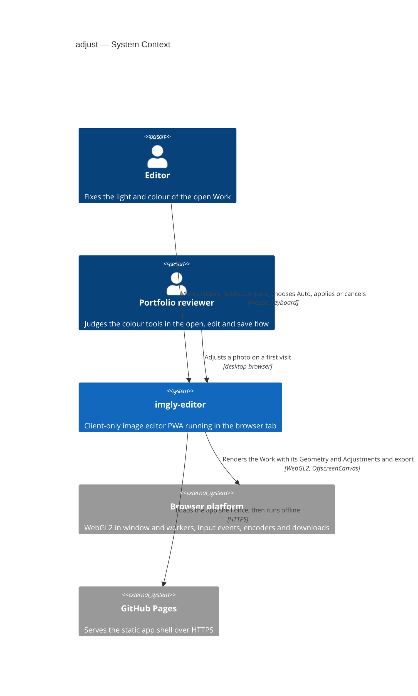
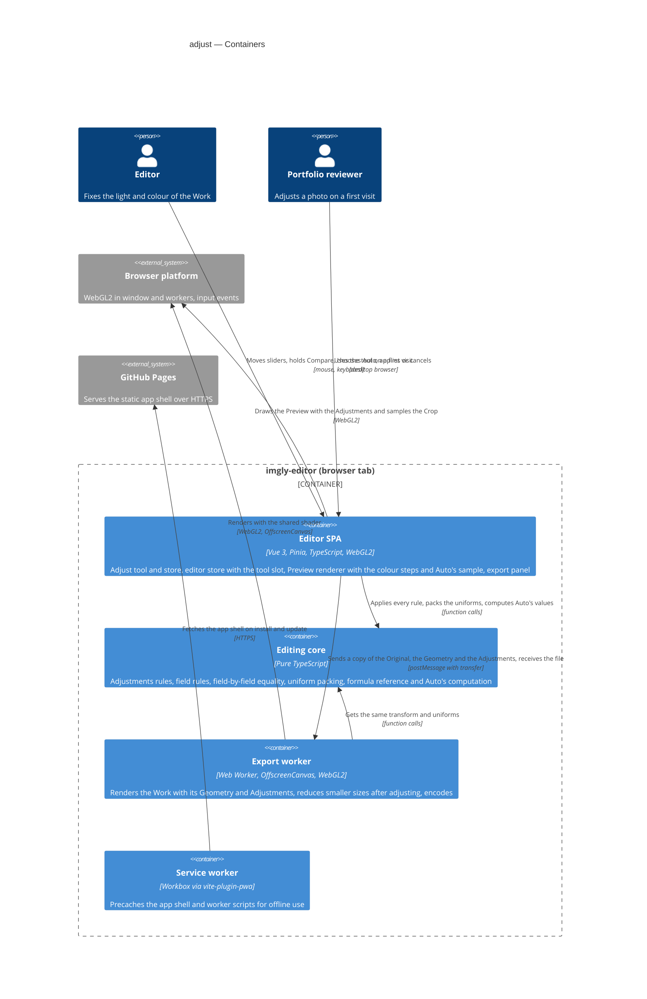
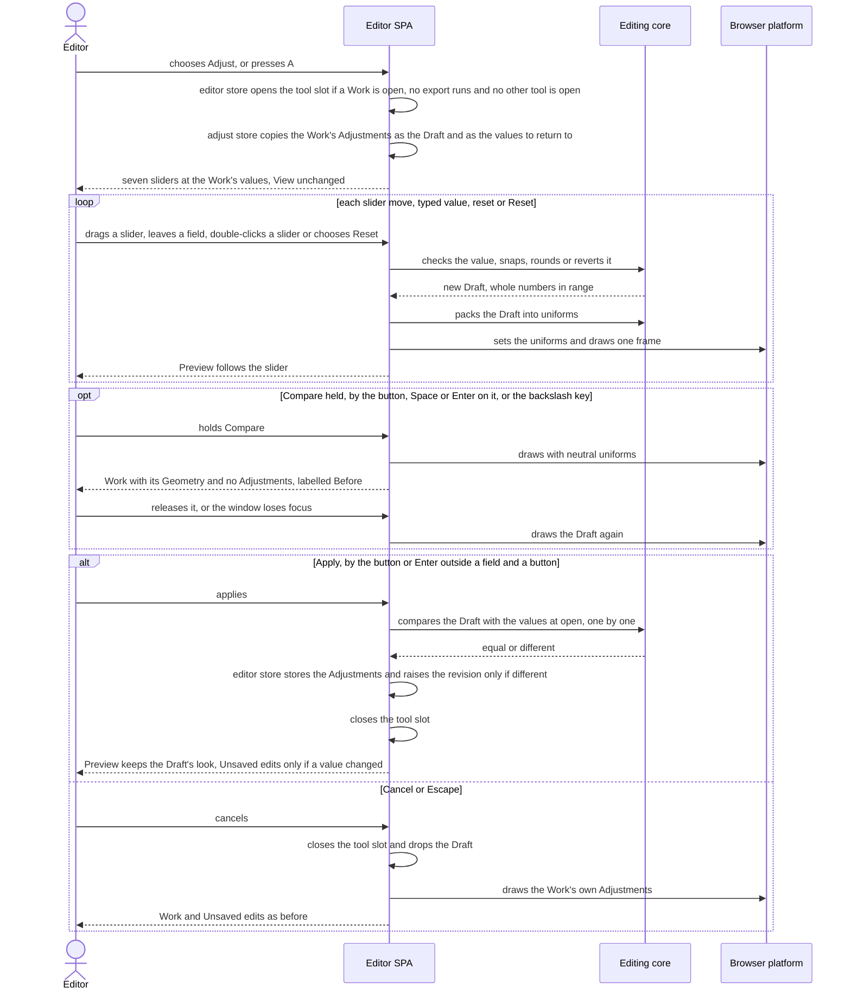
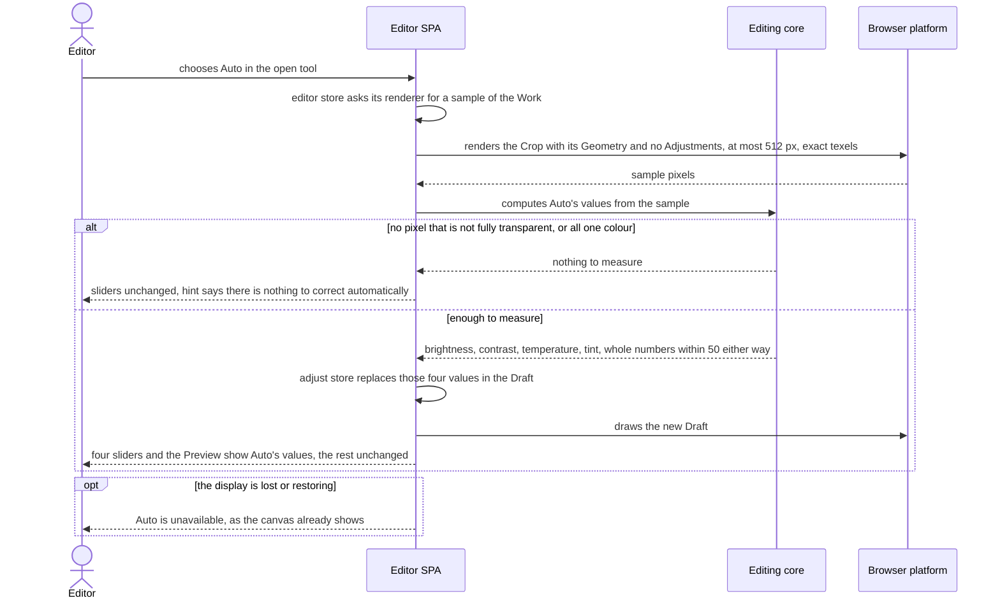
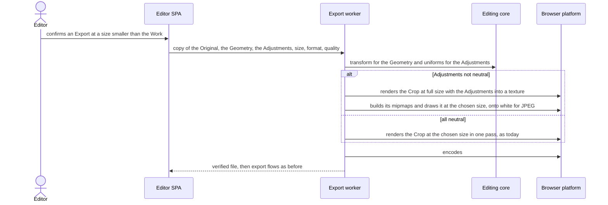

# Software Architecture Document — adjust

<!-- 12 Arc42 sections. Empty section → <!-- N/A: <one-line reason> -->. -->
<!-- C4 Context (L1) lives inline in §3. C4 Container (L2) lives inline in §5. -->
<!-- Numbers in §10 come VERBATIM from spec.md §6 NFR — no inventing, no rounding. -->

## 1. Introduction and goals

**Intent.** adjust gives the Editor one "Adjust" tool with seven sliders (brightness, contrast, saturation, temperature, tint, grayscale and sepia). The Preview follows every slider move live, while the Work changes only on Apply. Cancel returns to the Adjustments the Work had before. Reset and a per-slider reset return to neutral values, Compare shows the photo without any Adjustments while it is held, and Auto adjust sets brightness, contrast, temperature and tint from the photo itself (spec §1). The Adjustments are non-destructive: the Work stores only the seven values on top of its Original and Geometry, so any of them can be changed or reset until the Work is replaced, and resetting gives back exactly the image from before (spec §2). The Preview and every Export show exactly the values the Editor applied, in every target browser. This is the second editing tool and the first colour edit, so it also fixes how colour joins the shared rendering path that the drawing layer (roadmap step 6), undo and redo (step 7) and the gallery (step 8) build on.

**Top-3 quality goals (1-liners; full scenarios in §10):**

1. **Fidelity, Preview to Export**: what the Editor applies is exactly what every Export contains. A full-size Export is within 2 of 255 per channel of the Preview at 100% on all three engines, neutral values change no pixel at all, and transparency is kept exactly.
2. **Non-destructive and exact Adjustments**: the Adjustments are seven whole numbers on the Work, compared one by one and applied in one fixed order. Reset and Apply give back exactly the pixels from before, the same values reached by any path give the same pixels, and Unsaved edits change only when the applied values really differ.
3. **A responsive, leak-free tool**: the Preview follows a dragged slider at 30 or more updates per second on a 4096×3072 Work. Apply, Cancel, Reset, releasing Compare and opening the tool each respond within 150 ms, Auto within 300 ms, and 50 applied changes do not grow memory.

**Stakeholders.**

| Role | Interest | Sign-off owner? |
|---|---|---|
| Editor | Fixes the light and colour of a Work, or gives it a black-and-white or sepia look, in one tool, and trusts that nothing is lost and that the Export matches the Preview | No |
| Portfolio reviewer | Finds the tool and lightens a photo or fixes it automatically on the first try, by mouse or keyboard, in at most three actions | No |
| Tech Lead | SAD approval. The Adjustments model, the colour formulas and their place in the shared shader are inherited by roadmap steps 6, 7 and 8 | Yes |
| Security Lead | Spec §6.1: the photos are confidential and an Export never contains a Draft that was not applied (AC-16) or a Compare view (AC-08). No full security review is needed | Yes |

<!-- Decision overrides (¶4) — populated by the critic resolution loop, empty otherwise. -->

## 2. Constraints

**Technical.**
- TypeScript 5.9 (`strict`), Node 24 toolchain, pnpm — repo ADR [0001](../../adr/0001-build-a-client-only-vue-pwa.md)
- Vue 3.5 (Composition API, `<script setup>`), Pinia 4 setup stores, Vite 8 and vite-plugin-pwa 2. It is a client-only static app on GitHub Pages under `/imgly/`, with no server, accounts or sync — repo ADR 0001
- WebGL2 renders the Work, and the Preview and the Export share one shader source (`src/render/shaders.ts`). Colour adjustments were decided to run there — repo ADR [0004](../../adr/0004-render-adjustments-on-webgl2-and-drawing-on-canvas2d.md). The shader already maps each output pixel to the Original through `u_geometry` in one pass (crop-rotate [ADR-0002](../crop-rotate/adr/0002-render-the-geometry-in-the-shared-shader-in-one-pass.md)). The Original is one texture of premultiplied 8-bit sRGB values with mipmaps (open-and-view ADR-0003 and ADR-0004, `uploadTexture`): its colour is stored already multiplied by its opacity, and the values are the stored sRGB numbers, not linear light
- The Preview draws on `requestAnimationFrame` only after something changed (`src/render/preview-renderer.ts`), with nearest-texel magnification at 100% and above without a Straighten angle. The export worker renders the Crop on an `OffscreenCanvas` with the same program (export [ADR-0002](../export/adr/0002-render-and-encode-exports-in-a-dedicated-web-worker.md)), or in the window where the worker has no WebGL2 (export ADR-0003). It samples texel centres 1:1 at full size and uses the mipmaps for smaller sizes. Data crosses threads only by structured clone or transfer
- The Geometry is integer parameters on the Work, with its rules and the one transform in `src/core/geometry/` (crop-rotate ADR-0001). Tools open in the `editor` store's `activeTool` slot, with their draft in the tool's own store (crop-rotate ADR-0003). `ToolId` is `'crop-rotate'` only today
- Unsaved edits are a revision counter on the Work. Every edit goes through the `editor` store and `withEdit()`, which raises `revision`, and a successful Export sets `cleanRevision` (open-and-view ADR-0005)
- Functional core with feature folders: `core` is pure TypeScript, features never import each other and coordinate through the `editor` store, and `infra` and `render` may call pure `core` functions — repo ADR [0002](../../adr/0002-organize-code-as-functional-core-with-feature-folders.md), repo `CLAUDE.md` §Module boundaries
- Non-destructive editing as "Original plus parameters" — repo ADR [0003](../../adr/0003-persist-works-in-indexeddb-as-original-plus-params-plus-layer.md). No persistence in this feature: the Adjustments live in session memory only, and IndexedDB is not touched (spec §3, §6.1)
- No undo or redo in this feature (spec §3, roadmap step 7)
- Targets: the latest desktop Chromium, Firefox and Safari. On mobile the app only has to not break, with no touch gestures (spec §3, `docs/design-system.md` §Platform posture)

**Organisational.**
- Solo, spare-time project; owner Blazheiko. There is no per-feature effort budget beyond the 4–6 week MVP budget for the whole roadmap, and no hard deadline. Size M at its upper bound, route standard (`.size`, `.route`). If the budget slips, Auto adjust is cut first and Compare second (spec §1)
- TDD is on (`.claude/sdd.local.md`): Vitest units, and Playwright e2e on Chromium, Firefox and WebKit. `@perf` runs by hand on the reference machine (Apple M1 MacBook Air, latest stable Chrome, spec §6)

**Conventions.**
- Repo `CLAUDE.md` §Conventions: `core` returns `Result<T, AppError>` and throws only for programmer errors. Unit tests are co-located as `*.test.ts`, and e2e tests live in `e2e/adjust/*.spec.ts`, only for what happy-dom can't do (WebGL pixels, frame timing). Styling is plain CSS with tokens from `src/shared/styles/tokens.css`. Features expose `index.ts` and are mounted from `src/app/`
- A new editing tool follows the crop-rotate precedent (`docs/architecture-map.md` §Where things live): `src/features/adjust/` with an action, the tool, `store.ts`, `messages.ts`, `shortcuts.ts` and `index.ts`, pure rules in `src/core/adjust/`, a new `ToolId`, and slots filled in `App.vue`. The sliders reuse `SliderField` and `NumberField` from `src/shared/ui/`
- `docs/design-system.md` §Interaction & writing conventions: one notice boundary, every action reachable by keyboard, and short plain microcopy. Refusals are hints on the unavailable control (ux-flows §Platform decisions)
- Field input rules follow crop-rotate AC-07 and export AC-04: values are checked when the Editor leaves the field or presses Enter in it, never while typing, and only plain decimal notation counts as a number (spec AC-05)

**Regulatory / external.**
- Data classification: confidential (spec §6.1). Pixels never leave the device except as the file the Editor exports. The Adjustments change what that file looks like, so an Export holds only applied values: never a Draft (AC-16) and never the Compare view (AC-08)
- No accounts, so no AuthN/AuthZ. The only refusals are the app's own rules: no Adjustment change during an export (AC-15), no Export while the tool is open (AC-16) and one tool at a time (AC-18)
- Abuse cases are bounded by the input rules: every value is a whole number in its range (AC-05), and Auto stays within ±50 (AC-13). No setting makes the Work larger or the rendering heavier
- Security review: N/A per spec §6.1

## 3. Context and scope

imgly-editor is an offline, client-only image editor running entirely in the browser tab. adjust adds its first colour tool: the Editor changes the open Work's Adjustments inside the app, and the result reaches the outside world only through export, which already renders the Work and hands the file to the browser or the operating system. Auto adjust measures the Work's own pixels on the device. Nothing goes to a server, and GitHub Pages only serves the static app shell.

<!-- brownfield: docs/architecture-map.md reflects 71f9628 and only doc commits followed, so it is fresh. open-and-view, export and crop-rotate are shipped. The Work has `geometry` but no colour values. src/render/shaders.ts holds the one program (u_transform, u_geometry, u_flatten) over a premultiplied, mipmapped RGBA8 texture. The editor store has the activeTool slot (ToolId 'crop-rotate' only), previewGeometry, applyGeometry, activePanel and ExportSnapshot { original, geometry, ... }. The export worker-handler renders with FULL_QUAD and cropToOriginalUv, and also runs the crop-rotate alpha check. -->

**Trust boundary.** The tool adds no new input from outside the app. Its only inputs are the Editor's own pointer, keyboard and typed values, which the input rules bound (AC-05), and the Work's own pixels, which Auto adjust reads on the device (AC-12). The trust boundary stays where open-and-view and export put it: decoded files coming in, and what the browser's encoder and file system return going out. This feature's job at that boundary is that an Export holds only applied Adjustments (AC-14, AC-16).

**External systems (in / out):**

| Actor or system | Type | Interaction |
|---|---|---|
| Editor | Person | Opens the "Adjust" tool, moves the sliders or types values, holds Compare, chooses Auto, then applies, cancels or resets, by mouse or keyboard |
| Portfolio reviewer | Person | Tries the tool on a first visit, usually on a desktop browser, and judges how smoothly the Preview follows the sliders |
| Browser platform | System (external) | Provides WebGL2 in the window and in workers, pointer and keyboard events, and the encoders and downloads that export already uses |
| GitHub Pages | System (external) | Serves the static app shell and the worker scripts on first load and updates; never sees an image |

**External: no third-party service** — deliberate. There is no upload, no cloud enhancement and no remote image analysis: Auto adjust is a measurement of the Work's own pixels on the device (§2 Regulatory, spec §6.1).

**C4 Context (L1):**



The Editor and the Portfolio reviewer drive the app by mouse and keyboard. The app renders the Work with its Geometry and Adjustments through the browser's WebGL2, in the Preview and in the export worker, and GitHub Pages is only the first-load source of the code. The operating system's file dialog belongs to export and is unchanged.

## 4. Solution strategy

**Target surface.** `target_surfaces: [web-frontend]` (frontmatter). The feature extends the one runnable surface, the Editor SPA in the browser tab, and the export worker it changes is an internal container of that surface (§5). Decided inline: there is no server (repo ADR 0001) and no published library, so §2 excludes the other surfaces.

**UI architecture (web-frontend).** Inherited from open-and-view, export and crop-rotate: a client-rendered SPA with one editor view and no router. The "Adjust" tool (SCR-03) is a mode of that view in the same tool slot as "Crop and rotate": it takes over the tool panel in place and never opens a page (ux-flows §Platform decisions). State lives in Pinia setup stores, and components reuse `src/shared/ui/` primitives (`SliderField`, `NumberField`, `BaseButton`) and `tokens.css`. No new ADR: §2 excludes server rendering, and crop-rotate ADR-0003 already provides the tool-mode mechanism.

**Top strategic choices (the seeds for ADRs):**

1. **The Adjustments are seven integer fields on the Work, with their rules in `core`** — [ADR-0001](adr/0001-model-the-adjustments-as-seven-integer-fields-on-the-work.md). `Adjustments = { brightness, contrast, saturation, temperature, tint, grayscale, sepia }`, always all present and neutral at open. The pure module `src/core/adjust/` holds the ranges, neutral values, field-by-field equality (AC-11), the field rules (AC-05), the packing into shader uniforms and a CPU reference of the formulas for tests. These seven integers are what repo ADR 0003 will persist in step 8. Serves quality goal 2.
2. **Apply them in the shared fragment shader, in one pass, on unpremultiplied stored sRGB values** — [ADR-0002](adr/0002-apply-the-adjustments-in-the-shared-fragment-shader-on-stored-srgb-values.md). After sampling the Original through `u_geometry`, the shader divides the colour by its opacity, runs the seven steps in their fixed order with a clamp after each, and multiplies back; alpha is never touched (AC-06). All-neutral values skip the block through `u_adjust`, so they give today's pixels bit for bit. The Preview and the export worker set the same uniforms from the same `core` function, and a slider move is a uniform change and one frame. Serves quality goals 1 and 3.
3. **Each Adjustment is a fixed formula that keeps black in place** — [ADR-0003](adr/0003-define-each-adjustment-by-a-fixed-formula-that-keeps-black-in-place.md):
   - brightness is a gamma curve (mid-grey 128 → 181 at +100, → 64 at −100)
   - contrast is a linear stretch around exactly 128, up to ×4
   - saturation mixes with Rec. 709 lightness, up to ×2
   - temperature and tint are ±20% channel gains, so black is never tinted
   - grayscale uses Rec. 709 weights and sepia uses the CSS `sepia()` matrix

   This answers spec §8's first open question with an anchor table that the unit and e2e tests pin. Serves quality goals 1 and 2.
4. **Auto adjust measures a bounded sample of the Crop in the Preview's WebGL2 context and computes the values in `core`** — [ADR-0004](adr/0004-measure-auto-adjust-on-a-bounded-sample-in-the-preview-context.md). The renderer draws the Crop with its Geometry and no Adjustments into a framebuffer of at most 512 px on the long side, sampling exact texels, and reads it back. Then `core/adjust/auto.ts` derives the four values from the lightness median and percentiles and the grey-world channel means, inverting ADR-0003's formulas, and rounds and clamps them to ±50. It is deterministic and takes tens of milliseconds against a 300 ms budget. Serves quality goal 3.

Decided inline, below the ADR gate (the same mechanism as crop-rotate ADR-0003):
- **The Draft and Compare live in the new `adjust` store.** The Preview reads `editor.previewAdjustments`, which the adjust store sets to the Draft, or to neutral values while Compare is held (AC-08). With no adjust tool open, `previewAdjustments` is null and the Preview draws `work.adjustments`, including while "Crop and rotate" is open (AC-18).
- **Apply goes through `editor.applyAdjustments(next)`.** It stores the values and raises the revision through `withEdit()` only when `adjustmentsEquals(next, current)` is false, where `current` is the Work's value from when the tool opened, because nothing else can change it while the tool is open (AC-11).
- **No undo and no persistence.** The tool keeps the Adjustments from when it opened for Cancel (AC-09). Undo (step 7) and saving the Adjustments with the Work (step 8, with a new migration then) are out of scope (§2).

Each tactical decision in later sections traces to one of these seeds. A tactical decision that contradicts one is surfaced in §11.

## 5. Building block view

The feature follows the repo's functional core with feature folders (repo ADR 0002), on the crop-rotate model. Every rule about the values is pure TypeScript in the new `src/core/adjust/` and is unit-tested without a browser (ADR-0001). That covers the ranges, neutral values, field-by-field equality, the field input rules, the uniform packing, the CPU reference of the formulas (ADR-0003) and Auto adjust's computation (ADR-0004). Rendering the Adjustments is a change to the one shared shader in `src/render/`, used by the Preview and the export worker alike (ADR-0002). adjust is a **new feature folder**, `src/features/adjust/`, holding the toolbar action, the tool panel, the Compare label, its keyboard handling and its store. Like crop-rotate, its only cross-feature import is `useEditorStore` from `@/features/editor` (repo `CLAUDE.md` §Module boundaries). Through it the tool opens and closes the editor's tool slot, previews its Draft, applies the result and asks for Auto's sample. The app shell places the action in the top bar next to "Crop and rotate" and mounts the tool into the editor's existing tool slot.

**A smaller Export is reduced after the Adjustments, in two passes** (decided inline: it touches only the export render and is reversible in a day). AC-14 requires a smaller Export to be the full-size adjusted Export reduced to that size. When the size is smaller than the Work and the Adjustments are not neutral, the export render first draws the Crop at full size with the Adjustments into a texture of the same context. It then builds that texture's mipmaps and draws it at the export size through the existing mipmapped minification, flattening onto white for JPEG in that second pass. A full-size Export, and any Export with neutral Adjustments, keeps today's single pass, so neutral Exports stay identical at every size. The window fallback (export ADR-0003) runs the same code.

**Cross-feature changes (open-and-view, export and crop-rotate):**
- `Work` gains `adjustments: Adjustments`, neutral at open (ADR-0001). `ExportSnapshot` and `ExportRequest` gain `adjustments`. The crop-rotate transparency check (crop-rotate ADR-0004) is unchanged, because Adjustments never change alpha (AC-06), so its cached answer stays valid across Adjustment changes.
- The `editor` store gains:
  - `ToolId` `'adjust'` next to `'crop-rotate'`. `openTool` already refuses during an export, under the export panel, during the replace confirmation and while another tool is open (AC-15, AC-18, AC-21)
  - `previewAdjustments` (the Draft, or neutral while Compare is held; null when the adjust tool is closed) and `applyAdjustments(next)`, which raises the revision only when the values differ (AC-11)
  - `sampleWork()`, which asks the renderer it created for Auto's sample (ADR-0004)
  - `closeTool()` already runs on a successful replace of the Work, so the Draft is dropped with the old Work (AC-17)
- `PreviewCanvas` passes `previewAdjustments ?? work.adjustments` to `renderer.setAdjustments`. Because of that, "Crop and rotate" shows the applied Adjustments over the whole turned image with no new code there (AC-18). `PreviewRenderer` gains `setAdjustments(a)` and `sampleCrop(geometry, maxSide)`.
- export: the hint for Export and Ctrl/Cmd+S while a tool is open names the open tool. "Apply or cancel the adjustments first" is shown for adjust (AC-16), and the crop text is kept for crop-rotate. The export store sends `adjustments` with the request, and the worker sets the uniforms and uses the two-pass reduction above.
- crop-rotate: while the adjust tool is open, its action shows "apply or cancel the open tool first" and the C key shows the same hint, but stays silent while a text field has focus (AC-18). The adjust action mirrors this while "Crop and rotate" is open.

**Internal decomposition:**

```
src/
├── core/
│   ├── document.ts               Work + adjustments (neutral at open)
│   └── adjust/                   Adjustments type, keys in the fixed order, ranges, NEUTRAL_ADJUSTMENTS, isNeutral,
│                                 adjustmentsEquals (AC-11), parseAdjustmentField (AC-05), toUniforms,
│                                 applyAdjustmentsToPixel (CPU reference of ADR-0003), autoAdjust (ADR-0004)
├── render/
│   ├── shaders.ts                u_adjust and the seven-step colour block after sampling (ADR-0002)
│   ├── preview-renderer.ts       setAdjustments(a); sampleCrop(geometry, maxSide) into a small framebuffer (ADR-0004)
│   └── export/
│       ├── worker-handler.ts     sets the Adjustment uniforms; two-pass reduction for smaller adjusted sizes
│       └── client.ts             exportImage(request with adjustments)
├── features/editor/              store: ToolId 'adjust', previewAdjustments, applyAdjustments, sampleWork;
│                                 PreviewCanvas passes the Adjustments to the renderer
├── features/export/              sends adjustments; the tool-open hint names the open tool (AC-16)
├── features/crop-rotate/         action and C key: "apply or cancel the open tool first" while adjust is open (AC-18)
├── features/adjust/
│   ├── store.ts                  `adjust` store: Draft, Adjustments at open, Compare held, field state,
│   │                             apply / cancel / reset / reset one / auto
│   ├── AdjustAction.vue          the toolbar action with its hints (SCR-01, SCR-02; AC-15, AC-18, AC-19, AC-21)
│   ├── AdjustTool.vue            SCR-03, mounted in the editor's tool slot: the panel beside the canvas and the "Before" label over it
│   ├── AdjustControls.vue        seven SliderFields with number fields and neutral marks, Compare, Auto, Reset, Cancel, Apply
│   ├── shortcuts.ts              A to open; inside the tool Enter, Escape and the held \ key (by key code, AC-08, AC-21)
│   ├── messages.ts               the tool's hint catalog ("nothing to correct automatically", refusals)
│   └── index.ts                  public surface: AdjustAction, AdjustTool, useAdjustStore
└── app/App.vue                   mounts AdjustAction next to CropRotateAction, and AdjustTool into the editor's tool slot
```

Dependency direction stays `features → core | infra | render | shared`. `render` imports `core` for the `Adjustments` type and `toUniforms`, as repo `CLAUDE.md` §Module boundaries allows. No new `AppError` code: the field rules never fail (they snap, round or revert), "nothing to correct" is a result, not an error, and a failed sample is the existing `DISPLAY_LOST`.

**C4 Container (L2):**



The Editor SPA does all the interactive work. It applies every Adjustment rule through the editing core, draws the Preview with the Draft's uniforms through WebGL2, and samples the Crop there for Auto. For an Export it sends a copy of the Original with the Geometry and the Adjustments to the export worker, which gets the same transform and uniforms from the core and renders with the same shader. The decode worker is unchanged and out of this view.

## 6. Runtime view

**Critical flow 1: open the tool, drag a slider, hold Compare, then Apply or Cancel**



Opening needs a Work, no export in progress and no other tool open (AC-15, AC-18, AC-19). The tool starts from the Work's values, which are neutral for a new Work, and leaves the View alone (AC-01, AC-20). Every change goes through the core rules, so the Draft holds whole numbers in range (AC-05). A slider move only changes uniforms and draws one frame, and a fast drag may skip values but always shows the last one (AC-01, ADR-0002). Compare draws neutral uniforms without touching the Draft, and ends on release, on window blur or when the tool closes (AC-08). Apply stores the Draft and raises the revision only when a value differs (AC-11). Cancel drops it (AC-09).

**Critical flow 2: Auto adjust**



Auto measures the Work with its Geometry and without Adjustments, so choosing it twice gives the same values (AC-12). The sample is at most 512 px on the long side and samples exact texels, so it is deterministic. The values are computed in `core` by inverting ADR-0003's formulas, rounded half up and kept within ±50 (AC-13, ADR-0004). A single colour, or nothing but transparency, gives the "nothing to correct" hint (AC-13). The four values replace the Draft's, reach the Work only on Apply, and saturation, grayscale and sepia stay as they were (AC-12).

**Critical flow 3: export an adjusted Work at a smaller size**



A smaller Export is the full-size adjusted Export reduced to that size (AC-14): with non-neutral Adjustments the worker adjusts at full size first, then reduces through mipmaps. A full-size Export, or one with neutral values, is the single pass of today. The transparency hint is unchanged, because Adjustments never change alpha (AC-06). From the verified file on, export's own flows are unchanged (export sad.md §6).

**Branches the `sequences` stage draws:**
- No image open: the action and A show "open an image first" (AC-19).
- Export in progress: the action is disabled and A does nothing; the request is refused, not queued (AC-15).
- A while the export panel is open, while the tool is open or while a text field has focus: nothing happens (AC-21).
- Export or Ctrl/Cmd+S while the tool is open: "apply or cancel the adjustments first"; the browser's "Save page" never opens (AC-16).
- One tool open, the other's button or shortcut: "apply or cancel the open tool first", or nothing while a text field has focus (AC-18).
- Typed value out of range, fractional, empty or not a number, with or without a trailing "%": snapped, rounded half up or reverted when the field is left or Enter is pressed in it. Enter there never applies the tool (AC-05).
- Draft changed while Compare is held: the Draft changes, and "Before" stays until release (AC-08).
- Open image or a drop while the tool is open: the tool stays through reading and the replace confirmation. A successful replace closes it and drops the Draft, and the new Work starts neutral. A failed read or a declined replace keeps it (AC-17).
- Zoom and pan inside the tool change neither the Draft nor the Work (AC-20).
- "Crop and rotate" opened on an adjusted Work: the whole turned image is shown with the applied Adjustments, and applying a Geometry keeps them (AC-18).

## 7. Deployment view

The topology is unchanged. The feature ships inside the existing static app on GitHub Pages under `/imgly/`, as part of the same Vite build, and runs entirely in one browser tab. There is no server, replica or scaling unit to add. The service worker precaches the larger app shell and the changed export worker script exactly as it does today, so the tool works offline after the first load. No new hosting configuration, header, permission or browser capability is needed: WebGL2 in the window and in workers is already a start-up requirement (open-and-view capability gate, export ADR-0003).

**Monitoring:**
- No runtime telemetry, by design: the app sends nothing anywhere (§2 Regulatory).
- Performance marks in the e2e build are the measurement points for spec §6. There is a "tool ready" mark when SCR-03 is first drawn, a mark from choosing Auto to the frame that shows its values, frame timing through the existing performance trace, and whole-page memory through `e2e/perf-memory.ts`. The `@perf` suite (`PERF=1`) reads them on the reference machine, not in CI.
- CI runs the fidelity, neutral-value and transparency pixel checks on Chromium, Firefox and WebKit with every push (§10).

**Scaling thresholds:**
- The Downscale limit bounds everything: the Original's long side is at most 4096 px, so the Crop and the Export are at most 4096 × 4096 px (about 64 MB of RGBA).
- The Preview allocates nothing per Adjustment change (ADR-0002). Auto's sample is at most 512 × 512 px (1 MB), freed before it returns (ADR-0004). A smaller adjusted Export holds one extra full-size texture with mipmaps in the export worker (at most about 85 MB) for the length of that export only (§5).
- 50 applied changes stay within spec §6's ≤ 110% of memory after the first Apply.

## 8. Crosscutting concepts

| Concept | Convention | Where defined |
|---|---|---|
| Error handling | `Result<T, AppError>` in `core` and `render`, with no new error codes. The field rules never fail: out-of-range values snap, fractional values round half up, and empty or non-numeric values revert (AC-05). "Nothing to correct" is a result of `autoAdjust`, shown as a hint in the tool, not a notice (AC-13). A failed sample is the existing `DISPLAY_LOST`, and a failed Preview render is open-and-view's display-lost path, unchanged | repo `CLAUDE.md` §Conventions; here |
| Edit entry point | Every change to the Work goes through the `editor` store. The tool calls `applyAdjustments(next)`, which stores it and raises the revision through `withEdit()` only when the values differ one by one (AC-11). The tool never writes the Work directly | open-and-view ADR-0005; crop-rotate ADR-0003 |
| Tool state | One tool at a time in `editor.activeTool`, separate from the editor's phase. The Draft and the Compare flag live in the `adjust` Pinia setup store and reach the Preview only through `editor.previewAdjustments`. The Draft never counts as Unsaved edits (AC-17) | crop-rotate ADR-0003; §4 |
| Colour pipeline | The Original is sampled through the Geometry, then the seven steps run on unpremultiplied stored sRGB values in the fixed order brightness, contrast, saturation, temperature, tint, grayscale, sepia, with a clamp after each, then JPEG's flatten onto white. Alpha is never changed. The drawing layer (step 6) composites after the steps and is never adjusted | ADR-0002, ADR-0003; root CONTEXT "Adjustments" |
| Units and rounding | Every value is a whole number: −100 to 100 for the first five, 0 to 100 (shown with a "%" label) for grayscale and sepia. Typed and computed values round half up (2.5 → 3, −2.5 → −2), the same rule for the fields (AC-05) and for Auto (AC-13) | ADR-0001, ADR-0004 |
| Keyboard shortcuts | Each feature owns its keys. adjust owns A, which is silent while the export panel is open, while the tool is open or while a field has focus. Inside the tool it owns Enter (apply, except in a field or on a focused button), Escape (cancel from anywhere, discarding a value being typed) and the held \ key for Compare, matched by `KeyboardEvent.code === 'Backslash'` so it works on any layout (AC-08, AC-21). The sliders' arrow keys (±1, ±10 with Shift) come from `SliderField`. export turns Ctrl/Cmd+S into the "apply or cancel the adjustments first" hint while adjust is open (AC-16). crop-rotate's C shows "apply or cancel the open tool first" (AC-18). Zoom and pan keys stay with the editor and keep working in the tool (AC-20) | here; crop-rotate sad.md §8; export sad.md §8 |
| Field input | Checked only when the field is left or Enter is pressed in it, never while typing, and Enter in a field never applies the tool. Only plain decimal notation, with one decimal point or comma, counts as a number, and a trailing "%" is accepted in the grayscale and sepia fields (AC-05). A double-click on a slider or typing 0 sets it to neutral (AC-10) | crop-rotate AC-07; export AC-04; here |
| Accessibility | Every slider, field and button is a focusable DOM control with a role and label from the shared primitives. Each slider reports its value, with "%" for grayscale and sepia. Compare is a button that reports itself pressed while held, and the "Before" label is announced when Compare starts. Hints on unavailable controls are reachable by keyboard | `docs/design-system.md`; `src/shared/ui/` |
| Resource lifetime | A Preview Adjustment change allocates nothing on the GPU. Auto's framebuffer and its texture are deleted before `sampleCrop` returns, in every branch. The export worker's full-size pass texture is deleted with the export's context, as the bitmap copy is closed today. The bitmap ledger and the memory test cover all three | open-and-view sad.md §8; ADR-0002, ADR-0004 |
| Privacy | An Export holds only the applied Adjustments: Export is unavailable while the tool is open (AC-16), and Compare changes only what the Preview draws (AC-08). Auto reads only the Work's own pixels on the device. Nothing about the Adjustments is logged or sent anywhere | spec §6.1 |
| ID strategy | No new entities and no new IDs | repo `CLAUDE.md` §Conventions |
| Persistence | None: the Adjustments live in session memory and end with the Work (spec §3). Step 8 adds them to `WorkRecord` with a new forward migration step | repo ADR 0003; ADR-0001 |
| Internationalisation | N/A: English microcopy in the feature's `messages.ts`, as in the shipped features | — |
| Test hooks | The e2e build's `window.__imglyTest` gains a way to set Adjustments directly, so the fidelity tests reach every slider at −100, −50, +50 and +100 (0%, 50% and 100%), with and without a Geometry, without driving the UI. The existing `previewAt100()` hook (the Preview's own rendering at 100%, `src/app/test-hooks.ts`) renders with the Work's Adjustments too, so the fidelity comparison stays Preview against Export | repo `CLAUDE.md` §Commands; here |

## 9. Architecture decisions

| # | Title | Status | Section |
|---|---|---|---|
| [0001](adr/0001-model-the-adjustments-as-seven-integer-fields-on-the-work.md) | Model the Adjustments as seven integer fields on the Work, with their rules in core | Accepted | §4 |
| [0002](adr/0002-apply-the-adjustments-in-the-shared-fragment-shader-on-stored-srgb-values.md) | Apply the Adjustments in the shared fragment shader, in one pass, on unpremultiplied stored sRGB values | Accepted | §4 |
| [0003](adr/0003-define-each-adjustment-by-a-fixed-formula-that-keeps-black-in-place.md) | Define each Adjustment by a fixed formula that keeps black in place, in one fixed order | Accepted | §4 |
| [0004](adr/0004-measure-auto-adjust-on-a-bounded-sample-in-the-preview-context.md) | Measure Auto adjust on a bounded sample of the Crop in the Preview's WebGL2 context, and compute the values in core | Accepted | §4 |

ADR files live under `docs/features/adjust/adr/`. Four ADRs sit just below the 5–12 expected for size M. That is deliberate: the tool mechanism, the Draft store and the shared shader path are already decided by crop-rotate ADR-0002 and ADR-0003, and the two-pass reduction for smaller Exports (§5) stayed inline because it touches only the export render. Inherited and still binding: repo ADRs 0002, 0003 and 0004; open-and-view ADR-0003 (WebGL2 Preview) and ADR-0005 (revision counter); export ADR-0002 (export worker) and ADR-0003 (window fallback); crop-rotate ADR-0001 (Geometry and its transform), ADR-0002 (one-pass shader) and ADR-0003 (tool slot and Draft store).

## 10. Quality requirements

Each top-3 goal from §1 expanded into full scenarios. Every number is quoted from spec §6 or §7. The reference machine, the 4096×3072 Work and "p95 over 20 runs after 2 warm-up runs" are as spec §6 defines them.

**QG-1. Fidelity, Preview to Export**

*QG-1a. An adjusted Export matches the Preview*
- **When:** each slider alone is set to −100, −50, +50 and +100 (0%, 50% and 100% for grayscale and sepia), and one setting has all seven values away from neutral. Each is applied with and without a Geometry and exported as a full-size PNG.
- **Then:** "each pixel of a full-size PNG Export within 2 of 255 per channel of the Preview's own rendering of the Work at 100%, compared as in export §6".
- **How verify:** e2e pixel comparison on Chromium, Firefox and WebKit. A test hook sets the Adjustments directly (§8), and `previewAt100()` reads back the Preview with the same Adjustments. The same fixtures feed spec §7's KPI "100% of Exports within the §6 fidelity tolerance".

*QG-1b. Neutral values change nothing*
- **When:** a Work is exported as a full-size PNG before any Adjustment, then the tool is opened, every value is set away from neutral and back to neutral, applied, and the Work is exported again.
- **Then:** "difference 0 per channel between a full-size PNG Export with all values neutral and one of the same Work before any Adjustment was applied".
- **How verify:** e2e exact comparison on Chromium, Firefox and WebKit. It holds by construction through ADR-0002's `u_adjust` bypass, and a unit test asserts `toUniforms(NEUTRAL_ADJUSTMENTS)` turns the bypass on.

*QG-1c. Transparency is kept*
- **When:** a fixture with fully transparent, partly transparent (alpha 1, 64, 128 and 254) and opaque pixels, and an opaque fixture, are exported at every setting of QG-1a.
- **Then:** "100% of pixels keep their exact transparency at every setting of the fidelity row; an Original with no transparent pixels stays 100% opaque".
- **How verify:** e2e alpha comparison on all three engines against the Export with neutral values. A unit test of the CPU reference asserts that a partly transparent pixel gets the same colour as the same opaque pixel (AC-06).

*QG-1d. The directions and the anchors*
- **When:** each slider moves alone on the anchor colours (mid-grey 128, black, white, the primaries and yellow).
- **Then:** the directions of AC-02 to AC-04 hold and the values match ADR-0003's anchor table. Mid-grey stays 128 at any contrast, a higher brightness never darkens a channel, saturation −100 and grayscale 100% give equal channels, and sepia 100% gives red ≥ green ≥ blue whatever the other values.
- **How verify:** `core/adjust` unit tests on the CPU reference, including property tests over random colours and random Adjustments. One e2e fixture renders the anchor colours through the shader on all three engines and compares with the table within 2 of 255.

*QG-1e. Export time with Adjustments*
- **When:** all seven values are away from neutral on the 4096×3072 Work, and it is exported at full size.
- **Then:** "within export §6 targets: full-size JPEG at quality 90 p95 ≤ 1 s, full-size PNG p95 ≤ 2 s".
- **How verify:** export's `@perf` e2e test (`e2e/export/perf.spec.ts`), repeated with all seven values set, on the reference machine.

**QG-2. Non-destructive and exact Adjustments**
- **When:** for each reference image, any Adjustments are applied, then the tool is reopened, Reset and applied. Separately, the same seven values are reached by different paths (contrast before or after brightness, a slider dragged far out and back), and Applies are made with no change or with a change undone by hand in the same tool.
- **Then:** "for 100% of reference images, applying any Adjustments, then Reset and Apply, gives a full-size PNG Export with a difference of 0 per channel from the Export made before adjusting" (spec §7). The same values give the same pixels (AC-07). Unsaved edits change only when the applied values differ one by one from the values at open (AC-11).
- **How verify:** the round trip as an e2e exact comparison on Chromium, Firefox and WebKit. AC-07 is covered by unit tests of the CPU reference, which depends only on the seven values, and by an e2e comparison of two paths to the same values. AC-11 has store-level tests with a real `editor` store, including the "change, export, change back in a later Apply" case.

**QG-3. A responsive, leak-free tool**
- **When:** on the reference machine with the 4096×3072 Work, the Editor drags each slider, chooses Apply, Cancel and Reset, releases Compare, opens the tool, chooses Auto, and applies 50 Adjustment changes.
- **Then:**
  - Preview update while dragging: "p95 frame interval ≤ 33 ms (at least 30 updates per second)".
  - Apply, Cancel or Reset, or releasing Compare, to the updated Preview: "p95 ≤ 150 ms".
  - Choosing "Adjust" to the tool being ready: "p95 ≤ 150 ms".
  - Choosing Auto to the sliders and the Preview showing its values: "p95 ≤ 300 ms".
  - Memory after 50 applied changes: "≤ 110% of memory after the first Apply".
  - Auto's values are whole numbers within ±50, the same every time in one browser, and "between the target browsers each value differs by at most 1" (AC-13).
- **How verify:**
  - A new `e2e/adjust/perf.spec.ts` tagged `@perf` (run with `PERF=1` on the reference machine). It uses a frame-timing trace while dragging, performance marks from the action to the redrawn Preview, to the tool-ready mark and to Auto's frame (§7), and whole-page memory as export §6 measures it (`e2e/perf-memory.ts`), Chromium only.
  - AC-13 is covered by `autoAdjust` unit tests and an e2e test that records Auto's values for the reference images on all three engines and compares them within 1.
  - Spec §7's "≤ 3 actions" KPI is the e2e tool flow of AC-21.

## 11. Risks and technical debt

| Risk / debt | Severity | Mitigation | Owner |
|---|---|---|---|
| The ±2/255 tolerance between an adjusted Export and the Preview at 100% may not hold on every engine. The steps use `pow` and divisions in float, which GPUs and drivers round differently. Linux WebKit already needs 3/255 for any Export of a semi-transparent Original, because it renders in the window (export ADR-0003, `e2e/export/fidelity.spec.ts`) | High | Same shader source, same uniforms from the same `core` function, and the same texel sampling at 100% in the Preview and the Export (ADR-0002). QG-1a runs on all three engines from the first shader task. `plan-tests` decides whether semi-transparent fixtures reuse export's per-engine limit on Linux WebKit or stay opaque. The spec's 2/255 stays the target everywhere else, and a miss is a recorded engine deviation, never a silent loosening | Blazheiko — resolve before `/sdd:plan-tests` |
| Unpremultiplying an 8-bit premultiplied texel is coarse for very transparent pixels, so AC-06's "a partly transparent pixel changes colour exactly as the same opaque pixel would" can be off by a few levels of colour at alpha below about 16 | Medium | The error is in colour that is almost invisible at that opacity. QG-1c asserts alpha exactly and checks colour at alpha 64 and above. The texture format is open-and-view's and stays | Blazheiko |
| Auto's cross-engine "at most 1" (AC-13) depends on every engine decoding the Original to the same sRGB values. Colour management differs between engines for some files (ICC profiles), and the sampled texels then differ | Medium | The sampled texels are the same, so only decoding can differ (ADR-0004). The AC-13 e2e uses sRGB fixtures without embedded profiles, and a differing engine is a recorded deviation in the test plan | Blazheiko |
| ADR-0003's formulas become a stored-data contract once the gallery (step 8) saves Works: changing a formula after that changes the look of every saved Work | Medium | Tuning is free until step 8 ships. Step 8 stores a formula version with the Adjustments, so a later change can keep old Works as they were | Blazheiko — before `/sdd:design` of roadmap step 8 |
| The `editor` store keeps growing (466 lines before this feature) with a second tool, `previewAdjustments`, `applyAdjustments` and `sampleWork` | Medium | Tools only add small, tested actions to it. Extract the tool slot and its previews into a `src/features/editor/tool-slot.ts` module before the drawing layer (step 6) adds a third tool, or as soon as the store passes 600 lines | Blazheiko — before `/sdd:tasks` of roadmap step 6 |
| Scope sits at the upper bound of M (spec §1) | Medium | Auto adjust is cut first, then Compare. Without Auto, ADR-0004, `sampleCrop` and QG-3's 300 ms row fall away. Without Compare, only the adjust store's flag and the "Before" label go | Blazheiko |
| Brownfield: crop-rotate's C key and action are silent or generic while any tool is open, and export's tool-open hint says "the crop" (`src/features/export/messages.ts`, `CropRotateAction.vue`). With a second tool both are wrong for adjust (AC-16, AC-18) | Low | One task makes both hints name the open tool, and AC-16 and AC-18 e2e tests run with each tool open | Blazheiko |
| Auto's sample of at most 512 px can judge a photo that is one colour except for a few pixels as one colour and show "nothing to correct" (ADR-0004) | Low | AC-13's fixtures are truly one colour. A photo with so few differing pixels has nothing useful to correct anyway. Raise `maxSide` if a real photo shows it | Blazheiko |
| A smaller adjusted Export holds an extra full-size texture with mipmaps (up to about 85 MB) in the export worker while it renders (§5) | Low | Freed with the export's context. The memory row of QG-3 measures applied changes, and export's own memory test is repeated with Adjustments | Blazheiko |

**Accepted debt (acceptable in v1, plan to fix later):**
- Below 100% zoom the Preview applies the steps to the mipmapped sample, so it can differ slightly from a reduced Export at the same scale. Only the Preview at 100% is held to the Export, as spec §6 measures.
- There is no formula version on the Work until step 8 (see the risk above).
- Auto is a statistic of a sample, not of every pixel (ADR-0004).
- Spec §8's first open question (the strength of each slider) is answered by ADR-0003's formulas and anchor table. The spec's checkbox is left for the owner to tick. The second open question (a KPI for Auto's look) stays with the spec, due before `/sdd:plan-tests`.

## 12. Glossary

Domain terms come from the glossaries ([root CONTEXT](../../../CONTEXT.md) and [adjust CONTEXT](./CONTEXT.md)), which stay canonical. Technical terms are this document's.

| Term | Meaning |
|---|---|
| Adjustments | The Work's seven colour values: brightness, contrast, saturation, temperature and tint from −100 to +100, and grayscale and sepia from 0% to 100%. Each has a neutral value at which it changes no pixel, and together they change only colour, never transparency, size or position (root CONTEXT) |
| Draft | The Adjustments being changed in the open "Adjust" tool. They reach the Work only on Apply and never count as Unsaved edits on their own (adjust CONTEXT) |
| Compare | Holding a control in the tool to see the Preview with the Work's Geometry and no Adjustments, labelled "Before". It never changes the Work or the Draft (adjust CONTEXT) |
| Auto adjust | The action that sets the Draft's brightness, contrast, temperature and tint from the pixels inside the Crop, the same values for the same Work and Geometry (adjust CONTEXT) |
| Neutral value | 0 for the first five Adjustments and 0% for grayscale and sepia. All seven neutral is `NEUTRAL_ADJUSTMENTS`, which the shader skips entirely (ADR-0001, ADR-0002) |
| Work, Original, Geometry, Crop, Preview, Export, View, Unsaved edits | As in the root CONTEXT |
| Stored sRGB value | A pixel's channel as the 0–255 number the image holds, not linear light. Every rule of AC-02 to AC-04 and every formula of ADR-0003 works on these values (ADR-0002) |
| Premultiplied | Colour stored already multiplied by its opacity, as the Original's texture holds it. The shader divides it out before the steps and multiplies it back after them (ADR-0002) |
| Rec. 709 lightness | `0.2126 R + 0.7152 G + 0.0722 B`, the weighting that grayscale, saturation and Auto use for perceived lightness (ADR-0003) |
| Uniform | A value passed to the shader for a whole draw. The seven Adjustments and `u_adjust` reach the GPU as uniforms, so a slider move is a uniform change and one frame (ADR-0002) |
| Sample | The pixels of the Crop that Auto measures: at most 512 px on the long side, rendered with the Geometry and without Adjustments, one exact texel per pixel (ADR-0004) |
| Two-pass reduction | A smaller adjusted Export: the Crop is rendered at full size with the Adjustments, then reduced through mipmaps to the chosen size (§5) |
