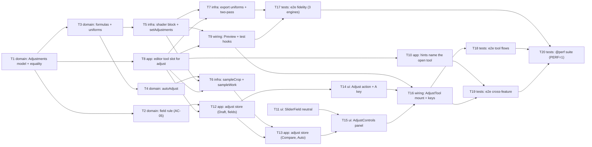

# Epic — adjust

> **Spec:** [spec.md](../spec.md) · **Design:** [sad.md](../sad.md) · **Screens:** [screens.md](../screens.md) · **UX flows:** [ux-flows.md](../ux-flows.md) · **ADRs:** [adr/](../adr/)
> No `data-model.md` (no schema change — the Adjustments live in session memory, `sad.md` §2, §8 Persistence) and no `contracts/` (no external interface, `target_surfaces: [web-frontend]`).

## Goal

Ship roadmap step 5, the second editing tool: one "Adjust" tool with seven sliders (brightness, contrast, saturation, temperature, tint, grayscale, sepia), Compare and Auto, where the Preview follows every move live and the Work changes only on Apply (spec §2 goal 1). The Adjustments are seven whole numbers on the Work on top of its Original and Geometry, so they never destroy pixels and Reset gives back exactly the image from before (goal 2). The Preview and every Export render them through the one shared shader, so the Export matches the Preview in every target browser (goal 3). Size M (upper bound), route standard.

## Scope

- **In:** the pure `src/core/adjust/` module and `Work.adjustments` (ADR-0001, ADR-0003, ADR-0004); the seven-step block in the shared shader, `PreviewRenderer.setAdjustments` and `sampleCrop`, and the export worker's uniforms plus two-pass reduction (ADR-0002, `sad.md` §5); the `editor` store's `'adjust'` tool with per-tool slot side effects, `previewAdjustments`, `applyAdjustments`, `sampleWork`; the export and crop-rotate hints that name the open tool; a `neutral` option on `SliderField`; the new `src/features/adjust/` feature (store, action, A key, controls, tool mount, keys, messages); functional and `@perf` e2e.
- **Out** (spec §3): curves, levels, exposure, highlights/shadows, vibrance, hue, blur, sharpen, vignette, noise reduction; presets, filters, LUTs, saved looks; local (brush, gradient, selection) adjustments; a histogram or colour readout; undo/redo of slider changes; persisting the Adjustments or copying them to another Work; judging whether Auto's look is good.

## Task map

**Waves** (topological levels of `deps`; tasks in one wave can run in parallel unless they share a lane):

| Wave | Tasks |
|---|---|
| 1 | T1, T11 |
| 2 | T2, T3, T8 |
| 3 | T4, T5, T10, T12 |
| 4 | T6, T7, T9, T14 |
| 5 | T13, T17 |
| 6 | T15 |
| 7 | T16 |
| 8 | T18, T19 |
| 9 | T20 |

**Lanes** (overlapping `files_hint`, serialized by `implement`): `src/core/adjust/index.ts` — T1, T2, T3, T4 · `src/render/preview-renderer.ts` + `src/features/editor/fake-renderer.ts` — T5, T6 · `src/features/editor/store.ts` — T6, T8 · `src/features/adjust/store.ts` — T12, T13 · `src/features/adjust/index.ts` — T12, T14, T16 · `src/features/adjust/messages.ts` — T14, T15 · `src/features/adjust/shortcuts.ts` + `src/app/App.vue` — T14, T16 · `src/features/adjust/AdjustControls.vue` — T15, T20 · `e2e/adjust/helpers.ts` — T17, T18, T19.

**Compile-coupled changes, folded in** (tasks step 5): `PreviewRenderer` gains `setAdjustments` (T5) and `sampleCrop` (T6), each updating the fake renderer in the same task; `ExportRequest` gains `adjustments` in T7, which also updates the export store and the format-check probe; `Work.adjustments` (T1) and `ExportSnapshot.adjustments` (T8) are set by their single constructors in the same task.

## Tasks

See [tracker.md](./tracker.md) for status. Machine contract: [tasks.json](../tasks.json).

| # | Task | Layer | Blocked by | DoD (short) |
|---|---|---|---|---|
| [T1](./t01-core-adjustments-model-and-equality.md) | Add the Adjustments to the Work: type, fixed key order, ranges, NEUTRAL_ADJUSTMENTS, isNeutral and adjustmentsEquals | domain | — | equality, ranges, createWork neutral |
| [T2](./t02-core-adjustment-field-rule.md) | Add parseAdjustmentField: plain decimal only, trailing % for grayscale and sepia, snap to range, round half up, revert on empty or non-numeric | domain | T1 | table tests of AC-05 rule |
| [T3](./t03-core-formulas-and-uniforms.md) | Write the CPU reference of the seven formulas (applyAdjustmentsToPixel) and toUniforms, pinned to ADR-0003's anchor table | domain | T1 | ADR-0003 anchors + direction properties |
| [T4](./t04-core-auto-adjust.md) | Add autoAdjust(sample): unpremultiply, median and percentiles of Rec. 709 lightness, grey-world gains, rounded half up within ±50, or nothing | domain | T3 | synthetic samples, ±50, nothing cases |
| [T5](./t05-render-shader-adjust-block.md) | Add the seven-step colour block to the shared shader (u_adjust) and PreviewRenderer.setAdjustments | infra | T3 | uniform wiring, neutral bypass, one frame |
| [T6](./t06-render-sample-crop-and-sample-work.md) | Add PreviewRenderer.sampleCrop(geometry, maxSide) into a temporary framebuffer and the editor store's sampleWork() | infra | T4, T5, T8 | sizing, NEAREST, cleanup, DISPLAY_LOST |
| [T7](./t07-export-adjustments-and-two-pass.md) | Send the applied Adjustments to the export worker, set them as uniforms, and reduce smaller adjusted Exports in two passes | infra | T5, T8 | one vs two passes, request carries values |
| [T8](./t08-editor-tool-slot-for-adjust.md) | Give the editor's tool slot the 'adjust' tool: per-tool open/close side effects, previewAdjustments, applyAdjustments and the snapshot's Adjustments | app | T1 | revision rules, View untouched for adjust |
| [T9](./t09-preview-follows-adjustments-and-test-hooks.md) | Make PreviewCanvas draw previewAdjustments ?? work.adjustments, and give the e2e hooks setAdjustments and an adjusted previewAt100 | wiring | T5, T8 | renderer gets Draft ?? Work values |
| [T10](./t10-hints-name-the-open-tool.md) | Make the export refusal name the open tool and make 'Crop and rotate' and C hint 'apply or cancel the open tool first' while Adjust is open | app | T8 | export + crop hints per open tool |
| [T11](./t11-shared-slider-neutral-double-click.md) | Add an optional 'neutral' to SliderField: double-clicking the range sets it, and register the option in the design system | ui | — | double-click emits neutral |
| [T12](./t12-adjust-store-draft-fields-apply-cancel.md) | Add the adjust store: Draft and values at open, set / commit typed fields, reset one or all, apply and cancel | app | T2, T8 | AC-05/09/10/11/17 store tests |
| [T13](./t13-adjust-store-compare-and-auto.md) | Add Compare (held flag, neutral preview, ends on blur and close) and Auto (sampleWork → autoAdjust → four values or the nothing hint) to the adjust store | app | T6, T12 | Compare hidden changes, Auto replace |
| [T14](./t14-adjust-action-a-key-and-messages.md) | Add the 'Adjust' toolbar action with its hints, the A shortcut and the tool's message catalog, mounted next to 'Crop and rotate' | ui | T12 | A rows + action states |
| [T15](./t15-adjust-controls-panel.md) | Build AdjustControls: seven SliderFields in three groups with neutral marks, press-and-hold Compare, Auto with its hint line, Reset / Cancel / Apply | ui | T11, T13 | panel states + Compare hold |
| [T16](./t16-adjust-tool-mount-keys-before-label.md) | Mount AdjustTool in the editor's tool slot with the 'Before' label, Enter / Escape / held backslash keys, window-blur end of Compare, focus handling and the tool-ready mark | wiring | T9, T14, T15 | keys, Before label, slot gating, focus |
| [T17](./t17-e2e-fidelity-neutral-alpha-round-trip.md) | Add the e2e fidelity suite: each slider at its anchors vs Preview, all seven combined, with and without a Geometry, neutral = 0 difference, exact alpha, lossless round trip, smaller sizes | tests | T7, T9 | ±2/255, 0 neutral, exact alpha |
| [T18](./t18-e2e-tool-flows.md) | Add the e2e tool-flow suite: three-action paths, live Preview on drag, Compare by mouse, keys and backslash, Cancel and Reset, Auto values and the nothing hint, keyboard-only use | tests | T16 | 3-action paths, Compare, Auto ±1 |
| [T19](./t19-e2e-cross-feature.md) | Add the e2e cross-feature suite: Unsaved edits, export and crop refusals in both directions, replace while open, no-image hint, View untouched, Crop and rotate shows the adjusted image | tests | T10, T16 | refusals, replace, View, seam |
| [T20](./t20-perf-suite.md) | Add the @perf suite: drag frame interval, Apply / Cancel / Reset / Compare-release and tool-ready times, Auto time, memory after 50 Applies, and export time with all seven set | tests | T17, T18, T19 | spec §6 rows on reference machine |

## Risks / Hard rules

- **Module boundaries** (repo `CLAUDE.md`): `core` imports nothing outside `core` (no Vue, Pinia, DOM); `render` imports only `core` and `shared`; features never import each other — adjust's only cross-feature import is `useEditorStore` from `@/features/editor`. T14 and T16 mirror crop-rotate's shortcut helpers instead of importing them.
- **Fidelity ±2/255 on every engine** (`sad.md` §11, High): the GLSL in T5 must match T3's CPU reference line for line; T17 runs from the first shader task's output on all three engines, and a miss is a recorded engine deviation, never a silent loosening. Owner resolves the Linux WebKit semi-transparent limit before `/sdd:plan-tests`.
- **Neutral values change no pixel** (spec §6): `u_adjust` false bypasses the block; every step's neutral value is an exact identity (ADR-0002).
- **Alpha is never written** (AC-06): the shader and the CPU reference unpremultiply for `a > 0` only and multiply back; the export transparency check is unchanged.
- **The Draft never counts as Unsaved edits** (AC-11, AC-17): only `editor.applyAdjustments` raises the revision, and only when a value differs from the values at open.
- **Editor store growth** (`sad.md` §11): extract the tool slot to `src/features/editor/tool-slot.ts` if T6/T8 push the store past 600 lines.
- **Open question carried** (`sad.md` §6 F4, owner review due before `/sdd:plan-tests`): the display-lost branch, the 512 px sample, and "skip alpha 0, then unpremultiply". T4/T6/T13 implement ADR-0004 as written.
- **Cut order if the budget slips** (spec §1): Auto first (T4, T6, T13's Auto half, Auto rows of T18/T20), then Compare.
- No new `AppError` code, no IndexedDB, no new IDs (`sad.md` §5, §8).
