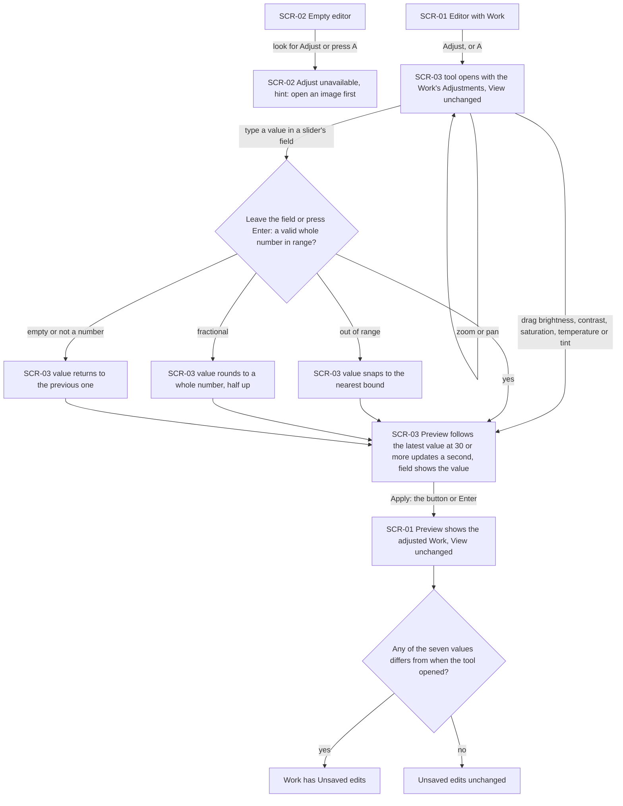
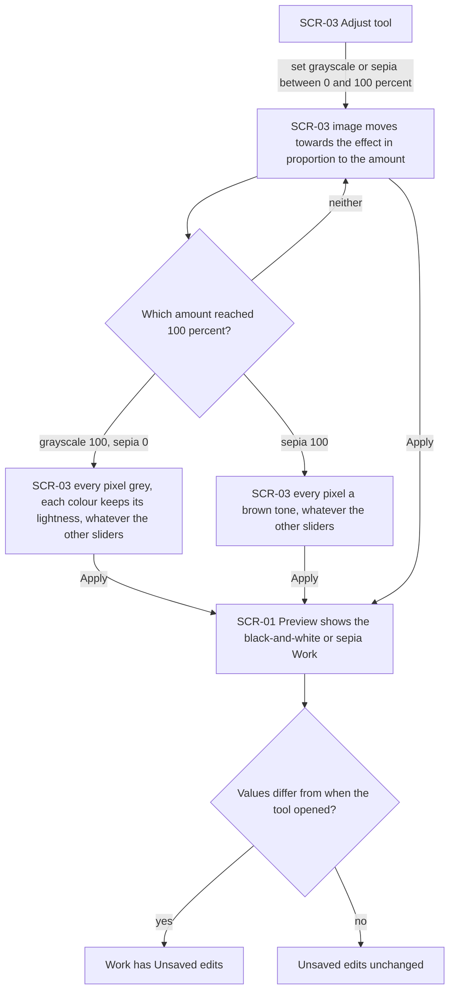
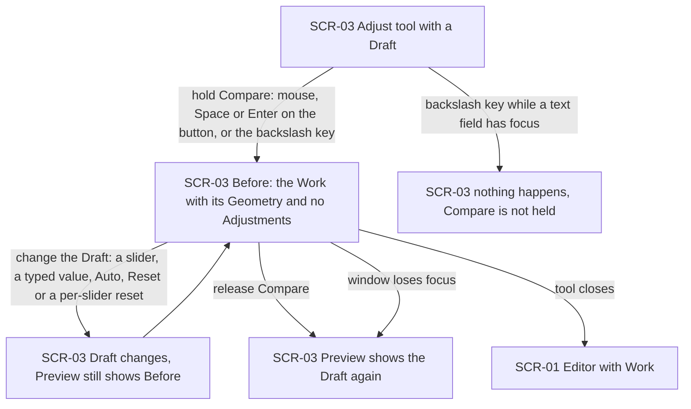
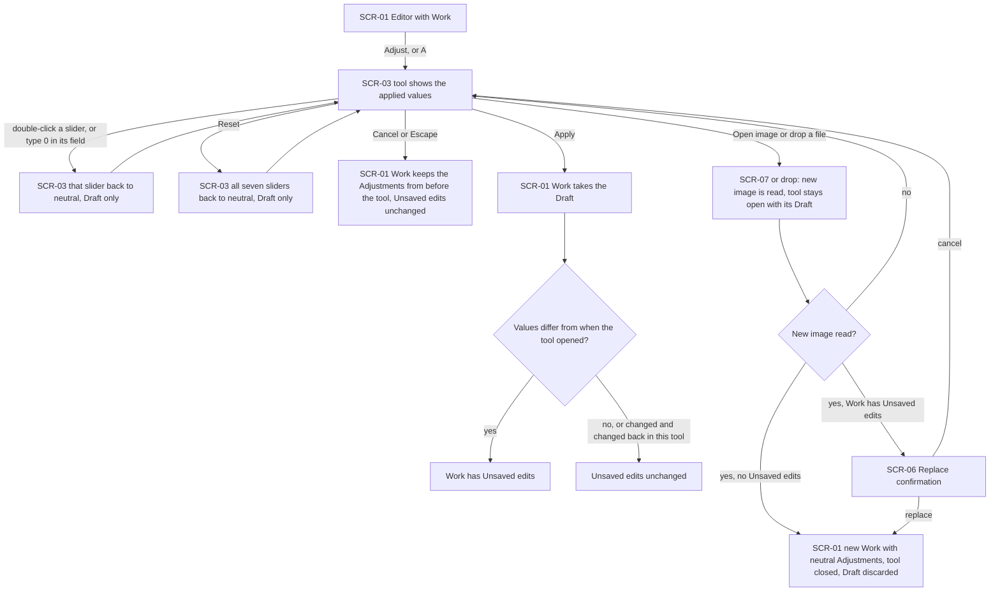
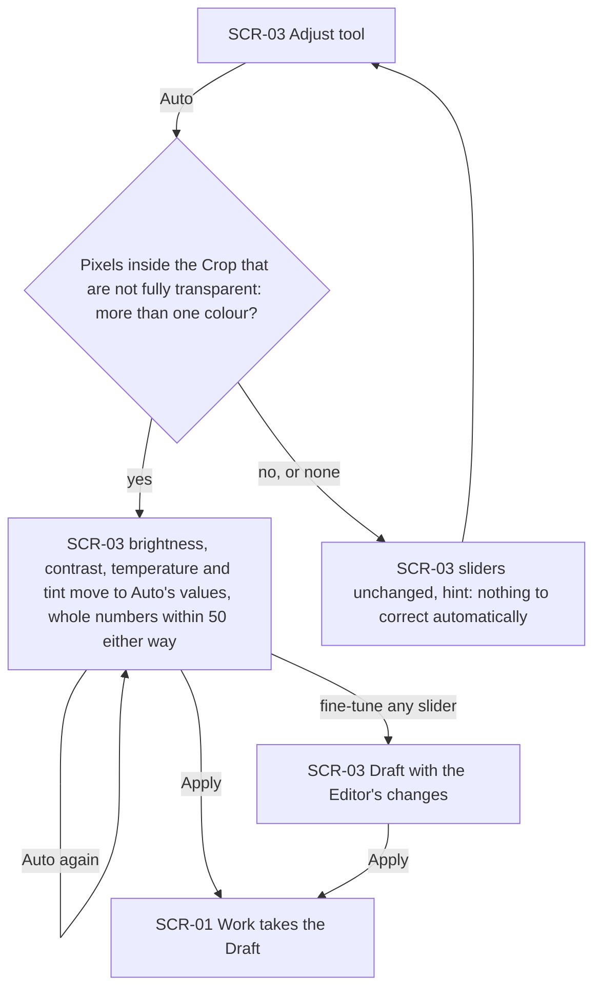
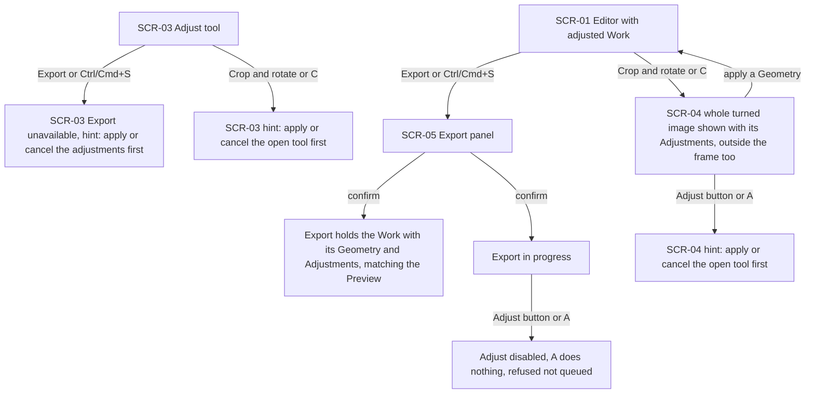
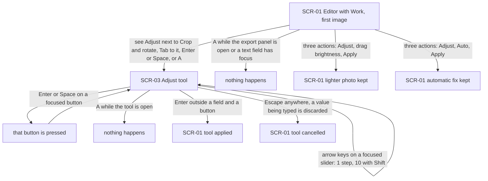

# UX flows — adjust

> User flows for every UI-touching §4 user story, produced by `ux-flows` (after `clarify`, before
> `design`) and read by `design` (evidence for the target-surface + UI-architecture decisions),
> `sequences` (UI-driven flows align on SCR ids), `screens` (details every inventory row) and
> `plan-tests` (the e2e-through-UI paths). **Always markdown + mermaid `flowchart`**, whatever the
> design tool — this artifact is flow-altitude, not visual design.

## Platform decisions

- **Posture:** desktop-first, as in `docs/design-system.md` §Platform posture. The mouse (dragging sliders, double-clicking a slider, holding Compare) and the keyboard (Tab, Enter, Space, Escape, the arrow keys, the A key and holding the \ key, AC-08, AC-21) are the primary paths. Below 1024 px the same screens apply. Touch works only as far as the browser turns a touch into a pointer press or drag, and there are no touch gestures (spec §3 and design-system posture).
- **Navigation shape:** one editor view with no page navigation, as in open-and-view, export and crop-rotate. The "Adjust" tool (SCR-03) is a mode of the editor, opened in the same tool slot as "Crop and rotate" (SCR-04). It never opens a new page, and Apply, Cancel or Escape return to the editor with the Work (SCR-01).
- **Modality:** while the tool is open, the Editor can still zoom and pan (AC-20) and open another image (AC-17). Export and Ctrl/Cmd+S only show a hint to apply or cancel the adjustments first (AC-16), and "Crop and rotate" only shows a hint to apply or cancel the open tool first (AC-18). The Draft is held apart from the Work until Apply: Cancel, Escape and replacing the Work discard it, and it never counts as Unsaved edits on its own (AC-09, AC-17).
- **One way out per outcome:** Apply (the button, or Enter outside a field and outside a focused button) keeps the Draft. Cancel (the button, or Escape from anywhere in the tool) discards it. Reset, the per-slider reset and Auto only change the Draft and take effect on Apply (AC-10, AC-12). Opening, applying and cancelling never change the View (AC-20).
- **Compare is a held state, not a screen:** while Compare is held (the button with the mouse, Space or Enter on the focused button, or the \ key), SCR-03 shows "Before". Releasing it, the window losing focus or the tool closing returns to the Draft (AC-08).
- **Field checking:** the slider number fields are checked when the Editor leaves the field or presses Enter in it, never while typing, and Enter in a field never applies the tool (AC-05).
- **Outcomes are shown in place:** the result of the tool is the Preview (AC-01). Refusals are hints on the unavailable control (AC-15, AC-16, AC-18, AC-19), and Auto's "nothing to correct" is a hint in the tool (AC-13), not a notice.
- **Design input (Tech Lead flag, not decided here):** (1) the Draft must reach the Preview at 30 or more updates per second on a 4096×3072 Work while a slider is dragged (spec §6), and the same seven values must render identically in the Preview and the Export (AC-14). `design` decides how the Adjustments join the rendering path that already draws the Geometry. (2) Auto reads the pixels inside the Crop, without Adjustments, in at most 300 ms (spec §6), and gives the same values within 1 across browsers (AC-13). `design` decides where that measurement runs. (3) Compare needs the Preview to switch between the Draft and "no Adjustments" without changing the Draft (AC-08). (4) "Crop and rotate" must now show the whole turned image with the applied Adjustments, outside the frame too (AC-18).

## Screen inventory

| ID | Screen | Purpose | Entry | Exit |
|---|---|---|---|---|
| SCR-01 | Editor with Work | open-and-view's editor with a Work open. The Preview shows the Work with its applied Geometry and Adjustments, and an "Adjust" action sits next to "Crop and rotate" and Export | A successful open; Apply or Cancel on SCR-03 or SCR-04; a successful Export | SCR-03 (Adjust, A), SCR-04 (Crop and rotate, C), SCR-05 (Export, Ctrl/Cmd+S), SCR-07 (Open image) |
| SCR-02 | Empty editor | open-and-view's empty editor. "Adjust" is shown as unavailable, with a hint to open an image first | App load; no Work open | SCR-01 once an image is opened (open-and-view flows) |
| SCR-03 | Adjust tool | The Preview of the Work with the Draft, at the current View. The seven sliders (brightness, contrast, saturation, temperature, tint, grayscale, sepia) with their number fields and neutral marks, Compare, Auto, Reset, Cancel and Apply. While Compare is held it shows "Before" | Adjust (the button, Enter or Space on it, or A) on SCR-01 | SCR-01 (Apply, Cancel, Escape, or a confirmed replacement of the Work), SCR-07 (Open image), SCR-06 (a new image read while the Work has Unsaved edits) |
| SCR-04 | Crop and rotate tool | crop-rotate's tool (its SCR-03). It now shows the whole turned image with the Work's applied Adjustments, outside the frame too | Crop and rotate (the button or C) on SCR-01 | SCR-01 (crop-rotate flows) |
| SCR-05 | Export panel | export's panel. The Export contains the Work with its Geometry and Adjustments | Export or Ctrl/Cmd+S on SCR-01 | SCR-01 (export flows) |
| SCR-06 | Replace confirmation | open-and-view's warning before a new image replaces a Work with Unsaved edits | A new image read successfully while the Work has Unsaved edits, from SCR-01 or SCR-03 | SCR-01 with the new Work (replace), or the screen it came from unchanged (cancel) |
| SCR-07 | System file dialog | The operating system's own file picker (not designed by us) | "Open image" on SCR-01 or SCR-03 | Open pipeline (file chosen), or the screen it came from unchanged (cancelled) |

## Flows

### Flow: US-01 and US-02 — Make a dull photo lighter or punchier, and fix the colours

From the editor with a Work open, the Editor chooses "Adjust" or presses A. The tool opens with the Work's current Adjustments (neutral for a new Work) and leaves the View as it was. Zooming and panning keep working and never count as an edit (AC-01, AC-20). Dragging brightness, contrast, saturation, temperature or tint updates the Preview with the slider's latest value at least 30 times a second, and the field next to it shows the value (AC-01 to AC-03). A typed value is checked when the Editor leaves the field or presses Enter in it. Out of range snaps to the nearest bound, a fractional value rounds to a whole number with a half rounding up, and an empty or non-numeric value returns to the previous one. Enter in a field never applies the tool (AC-05). Apply, by the button or Enter, closes the tool, and the Preview shows the adjusted Work with the View unchanged. The Work gets Unsaved edits only when one of the seven values differs from when the tool opened (AC-11). With no image open, Adjust is unavailable, and both the control and the A key show a hint to open an image first (AC-19). Whatever the values, only colours change: transparency, size and Geometry stay as they are (AC-06), and the same values always give the same image whatever order they were set in (AC-07).

### Flow: US-03 — Give the photo a black-and-white or vintage look

In the tool the Editor sets grayscale or sepia anywhere from 0% to 100%, by the slider or by typing in its field, where a trailing "%" is accepted (AC-05). The image moves towards the effect in proportion to the amount (AC-04). At grayscale 100% with sepia at 0%, every pixel is grey and each colour keeps its lightness, whatever the other sliders say. At sepia 100% every pixel is a brown tone, again whatever the other sliders say, because grayscale and sepia act last. Apply shows the result in the Preview, and the Work gets Unsaved edits only when a value changed (AC-11). Transparency is untouched, and partly transparent pixels change colour as opaque ones would (AC-06).

### Flow: US-04 — See before and after

With the tool open, the Editor holds Compare: with the mouse, with Space or Enter on the focused Compare button, or with the \ key (the key in that position on a US keyboard, whatever the layout) while no text field has focus. While it is held, the Preview shows "Before": the Work with its Geometry and no Adjustments at all. Any change to the Draft while Compare is held changes the Draft, but the Preview keeps showing "Before". Releasing Compare, or the window losing focus, shows the Draft again. If the tool closes, Compare ends with it. Compare never changes the Work, the Draft or the Unsaved edits (AC-08).

### Flow: US-05 — Change my mind without losing anything

Reopening the tool on a Work with applied Adjustments shows those values (AC-10). Double-clicking a slider, or typing 0 in its field, puts that slider back to neutral. Reset puts all seven back to neutral. Both change only the Draft and take effect on Apply, and Reset followed by Apply gives back exactly the image from before any Adjustment (AC-06, AC-10). Cancel or Escape closes the tool and the Work keeps the Adjustments it had before, with its Unsaved edits unchanged (AC-09). Apply counts as an edit only when the values differ from when the tool opened; changing a value and changing it back in the same tool does not count (AC-11). Opening another image, by "Open image" or by dropping a file, keeps the tool open with its Draft while the image is read. If the image cannot be read, or the Editor cancels the replace confirmation, the tool stays open with its Draft. If the replacement goes ahead (directly, or after confirming when the Work has Unsaved edits), the tool closes, the Draft is discarded with the old Work, and the new Work starts with neutral Adjustments (AC-17).

### Flow: US-06 — Fix a photo in one click

In the tool the Editor chooses Auto. When the pixels inside the Crop that are not fully transparent have more than one colour, brightness, contrast, temperature and tint move to values measured from the Work with its Geometry and without any Adjustments. The values are whole numbers between −50 and +50, and saturation, grayscale and sepia stay as they were. The values replace the four sliders' values, so choosing Auto again gives the same values, and the same Work gets the same values in the same browser, within 1 between browsers (AC-12, AC-13). The Editor can fine-tune any slider, and nothing reaches the Work until Apply. When those pixels are all one colour, or every pixel is fully transparent, the sliders stay as they were and a hint says there is nothing to correct automatically (AC-13).

### Flow: US-07 — Export what I see after adjusting

From the editor with an adjusted Work, the Editor opens the export panel by Export or Ctrl/Cmd+S and confirms. The Export holds the Work with its Geometry and its Adjustments, matching the Preview at full size, and a smaller Export is the full-size adjusted Export reduced to that size. The transparency hint appears exactly as it would without the Adjustments (AC-14). While an export is in progress, the Adjust button is disabled and A does nothing; the request is refused, not queued (AC-15). While the Adjust tool is open, Export is unavailable and both Export and Ctrl/Cmd+S show a hint to apply or cancel the adjustments first, so a Draft never reaches an Export (AC-16). "Crop and rotate" shows the whole turned image with the applied Adjustments, outside the frame too, and applying a Geometry keeps the Adjustments. Only one of the two tools can be open at a time: the other tool's button and shortcut show a hint to apply or cancel the open tool first, except that a shortcut typed while a text field has focus does nothing (AC-18).

### Flow: US-08 — Adjust on the first try

A Portfolio reviewer who has opened an image sees an "Adjust" action in the toolbar next to "Crop and rotate". They can reach it with Tab and press it with Enter or Space, or press A. A does nothing while the export panel is open, while the tool is already open, or while a text field has focus. Inside the tool every control can be reached with Tab. The arrow keys move a focused slider by 1, or 10 with Shift. Enter or Space on a focused button presses it, Enter anywhere else outside a field applies the tool, and Escape cancels it from anywhere, discarding a value still being typed. Lightening a photo and keeping it takes three actions (Adjust, drag brightness, Apply), and so does an automatic fix (Adjust, Auto, Apply) (AC-21).

## AC coverage

| AC | Shown by | Notes |
|---|---|---|
| AC-01 | Flow US-01 and US-02 → T, D, A | Opening with the Work's values, live Preview, Apply |
| AC-02 | Flow US-01 and US-02 → D | Brightness and contrast directions are a property of the Preview at D, not a branch |
| AC-03 | Flow US-01 and US-02 → D | Saturation, temperature and tint directions, as AC-02 |
| AC-04 | Flow US-03 → G, GG, SP | |
| AC-05 | Flow US-01 and US-02 → TF, TS, TR, TV; Flow US-03 prose (trailing "%") | |
| AC-06 | Flow US-01 and US-02 prose; Flow US-03 prose; Flow US-05 → RA | An invariant on every outcome, not a branch. Checked through the Preview and the Export, not the flow |
| AC-07 | Flow US-01 and US-02 prose | An invariant on the Preview at D and A, not a branch |
| AC-08 | Flow US-04 → B, BC, T2, C, TN | |
| AC-09 | Flow US-05 → X | |
| AC-10 | Flow US-05 → T, R1, RA | |
| AC-11 | Flow US-01 and US-02 → U; Flow US-03 → U; Flow US-05 → U | |
| AC-12 | Flow US-06 → AV, T2 | |
| AC-13 | Flow US-06 → M, AH, AV | |
| AC-14 | Flow US-07 → X | |
| AC-15 | Flow US-07 → EX, EXR | |
| AC-16 | Flow US-07 → TH | |
| AC-17 | Flow US-05 → O, OR, RC, N | |
| AC-18 | Flow US-07 → TC, CR, CRA | |
| AC-19 | Flow US-01 and US-02 → EH | |
| AC-20 | Flow US-01 and US-02 → T (zoom or pan loop), A | |
| AC-21 | Flow US-08 → all nodes | |

No §4 user story is backend-only: all eight touch the UI and have a flow (US-01 and US-02 share one, because their flow is identical and only the sliders differ).
