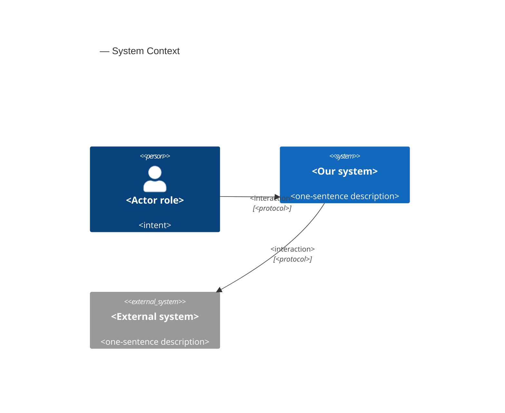
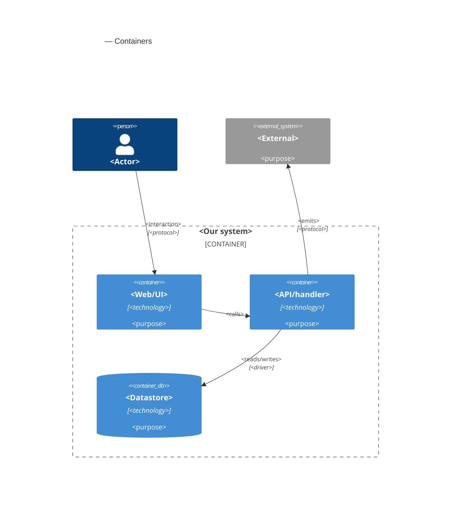

# Software Architecture Document — crop-rotate

<!-- 12 Arc42 sections. Empty section → <!-- N/A: <one-line reason> -->. -->
<!-- C4 Context (L1) lives inline in §3. C4 Container (L2) lives inline in §5. -->
<!-- Numbers in §10 come VERBATIM from spec.md §6 NFR — no inventing, no rounding. -->

## 1. Introduction and goals

**Intent.** crop-rotate gives the Editor one "Crop and rotate" tool that turns the open Work in quarter turns, mirrors it, levels it with a Straighten angle of up to ±45°, and sets its Crop by dragging, by a fixed proportion or by exact pixel sizes. Apply keeps the result, Cancel restores the Geometry the Work had before, and Reset returns to no Geometry (spec §1). The Geometry is non-destructive: it is a small set of parameters on the Work, never a cut of the Original, so a Crop can always be widened back and the area outside it returns exactly as it was (spec §2). The Preview and every Export show exactly the applied Geometry, in every target browser. This is the first real edit in the open, edit and save flow, so it also fixes the Geometry that the adjustments (roadmap step 5), the drawing layer (step 6) and the gallery (step 8) build on.

**Top-3 quality goals (1-liners; full scenarios in §10):**

1. **Fidelity, Preview to Export**: what the Editor applies is exactly what every Export contains. Rotation, Flip and Crop lose no pixel, a straightened Export matches the Preview at 100%, opaque images stay opaque, and no pixel from outside the Crop ever leaves the app.
2. **Non-destructive and exact Geometry**: the Geometry is whole-pixel parameters on the Work, compared field by field. Widening the Crop back or Reset gives back exactly the pixels from before, and Unsaved edits change only when the applied Geometry really differs.
3. **A responsive, leak-free tool**: the Preview follows the crop frame and the straighten slider at 30 or more updates per second on a 4096×3072 Work, every button responds within 150 ms, and 50 applied changes do not grow memory.

**Stakeholders.**

| Role | Interest | Sign-off owner? |
|---|---|---|
| Editor | Turns, mirrors, levels and crops a Work in one tool, and trusts that nothing is lost and that the Export matches the Preview | No |
| Portfolio reviewer | Finds the tool and crops or rotates on the first try, by mouse or keyboard, in at most three actions | No |
| Tech Lead | SAD approval; the Geometry model, the shared shader path and the editor's tool slot are inherited by roadmap steps 5, 6 and 8 | Yes |
| Security Lead | The one privacy rule: an Export never contains pixels from outside the Crop (AC-14); spec §6.1 needs no full security review | Yes |

## 2. Constraints

**Technical.**
- TypeScript 5 (`strict`), Node 24 toolchain, pnpm — repo ADR [0001](../../adr/0001-build-a-client-only-vue-pwa.md)
- Vue 3 (Composition API, `<script setup>`) + Pinia + Vite + vite-plugin-pwa; a client-only static app on GitHub Pages under `/imgly/`, with no server, accounts or sync — repo ADR 0001
- WebGL2 renders the Work, and the Preview and the Export share one shader source (`src/render/shaders.ts`) — repo ADR [0004](../../adr/0004-render-adjustments-on-webgl2-and-drawing-on-canvas2d.md). The Preview is one WebGL2 canvas whose View is a `mat3` uniform over a unit quad, drawn only when something changed, with the premultiplied Original as one texture (open-and-view [ADR-0003](../open-and-view/adr/0003-render-the-preview-in-one-webgl2-canvas-with-a-view-transform.md)). Every Original is sRGB (open-and-view ADR-0004)
- Exports render in a short-lived Web Worker on an `OffscreenCanvas` with the same shaders (export [ADR-0002](../export/adr/0002-render-and-encode-exports-in-a-dedicated-web-worker.md)), or in the window where the worker has no WebGL2 (export ADR-0003). Data crosses threads only by structured clone or transfer (no `SharedArrayBuffer` on GitHub Pages)
- Unsaved edits are a revision counter on the Work: every edit goes through the `editor` store's `applyEdit()` and raises `revision`; a successful Export sets `cleanRevision` (open-and-view [ADR-0005](../open-and-view/adr/0005-track-unsaved-edits-with-a-revision-counter-on-the-work.md), export §4)
- Functional core with feature folders: `core` is pure TypeScript; features never import each other and coordinate through the `editor` store; `infra` and `render` may call pure `core` functions — repo ADR [0002](../../adr/0002-organize-code-as-functional-core-with-feature-folders.md), repo `CLAUDE.md` §Module boundaries
- The Original stays the Original: non-destructive editing as "Original plus parameters" (repo ADR [0003](../../adr/0003-persist-works-in-indexeddb-as-original-plus-params-plus-layer.md)). No persistence in this feature: the Geometry lives in session memory only, and IndexedDB is not touched (spec §3, §6.1)
- No undo or redo in this feature (spec §3, roadmap step 7)
- Targets: the latest desktop Chromium, Firefox and Safari; on mobile the app only has to not break, with no touch gestures (spec §3, `docs/design-system.md` §Platform posture)

**Organisational.**
- Solo, spare-time project; owner Blazheiko. No per-feature effort budget beyond the 4–6 week MVP budget for the whole roadmap and no hard deadline. Size M at its upper bound, route standard (`.size`, `.route`); the Straighten angle (US-04) is the first thing cut if the budget slips (spec §1)
- TDD is on (`.claude/sdd.local.md`): Vitest units, Playwright e2e on Chromium, Firefox and WebKit; `@perf` runs by hand on the reference machine (Apple M1 MacBook Air, latest stable Chrome, spec §6)

**Conventions.**
- Repo `CLAUDE.md` §Conventions: `core` returns `Result<T, AppError>` and throws only for programmer errors; unit tests co-located as `*.test.ts`; e2e in `e2e/crop-rotate/*.spec.ts`, only for what happy-dom can't do (WebGL pixels, frame timing); plain CSS with tokens from `src/shared/styles/tokens.css`; features expose `index.ts` and are mounted from `src/app/`
- `docs/design-system.md` §Interaction & writing conventions: one notice boundary, every action reachable by keyboard, short plain microcopy; refusals are hints on the unavailable control (ux-flows §Platform decisions); new primitives are registered in the inventory
- Field input rules follow export AC-04: values are checked when the Editor leaves the field or presses Enter in it, never while typing (spec AC-07, AC-10)
- Patterns reused from open-and-view and export: a messages catalog per feature, the bitmap ledger and whole-page memory measure for leak tests, `window.__imglyTest` hooks in the e2e build

**Regulatory / external.**
- Data classification: confidential (spec §6.1). Pixels never leave the device except as the file the Editor exports, and the Geometry decides which part of them does: an Export never contains a pixel from outside the Crop (AC-14), and the file is plain pixels with no hidden layers or metadata (export AC-16)
- No accounts, so no AuthN/AuthZ. The only refusals are the app's own rules: no Geometry change during an export (AC-15) and no Export while the tool is open (AC-16)
- Abuse cases are bounded by the input rules: sizes by the image, angles by ±45°, and only plain decimal notation counts as a number (AC-07, AC-10), so the Work can never grow beyond the Downscale limit
- Security review: N/A per spec §6.1; AC-14 is verified by tests

## 3. Context and scope

<!-- 🎯 Why: draws the SYSTEM BOUNDARY — who talks to it from outside, where the trust zone ends.
     Without §3, §5 and §8 (authorization) blur — unclear what's «inside» vs «outside».
     📋 Write: 2–3 sentences of business context + an external-systems table + a C4Context block.
     📌 «External: none (deliberate, no third-party in v1)» is itself a decision worth stating.
     Trust boundary — the line past which you don't trust data without checking it.
     Never N/A — greenfield still draws the planned actors + external systems. -->

<Business context in 2–3 sentences. What the system does for whom.>

<!-- brownfield: <one-line scan summary> (or «N/A — greenfield repo» if no source existed) -->

**External systems (in / out):**

| Actor or system | Type | Interaction |
|---|---|---|
| <author role> | Person | <what they do> |
| <external service> | System (internal/external) | <interaction> |
| <identity provider> | System (external) | <provides auth tokens> |

**C4 Context (L1):** <!-- syntax → references/c4-mermaid-syntax.md. Real names, no <placeholder> stubs. -->



## 4. Solution strategy

<!-- 🎯 Why: the 3–4 STRATEGIC PILLARS every ADR grows from. Without §4 each ADR looks random —
     there's no umbrella. ⭐ The densest section — the blast-radius gate fires almost always here
     (decisions are irreversible + multi-module).
     📋 Write: 3–4 choices; each a heading + 2–3 sentences of rationale.
     📌 «Store content as a table of typed blocks» is a pillar — ADR-0001 grows from it. -->

**Top strategic choices (the seeds for ADRs):**

1. **<e.g. Module isolation through events>** — <2–3 sentences citing quality goals + constraints>.
2. **<e.g. Single-store persistence>** — <2–3 sentences>.
3. **<e.g. Server-rendered read side>** — <2–3 sentences>.

Each tactical decision in later sections should trace to one of these seeds. Tactical decisions that *contradict* a strategic choice are red flags — surface them in §11.

## 5. Building block view

<!-- 🎯 Why: INTERNAL DECOMPOSITION — modules, containers, datastores. The static topology: who
     may talk to whom. Without §5, §6 (the flows) has no vocabulary of participants.
     📋 Write: 1 ¶ on the style (layered / hexagonal / clean / event-driven) + a folder tree + a
     C4Container block.
     📌 Draw ONE Container per declared `target_surface` (frontmatter): a fullstack
     [backend-service, web-frontend] = a backend-API container + a web/SPA container; a
     [backend-service, mobile-app] = the API + the mobile app. The Container(web, …) line below is
     just one surface's container — swap/add per what was declared in §4. → _shared/surfaces.md
     📌 e.g. «web app, content API, media worker, datastore, object store, CDN». -->

<One paragraph: layered / hexagonal / clean / event-driven, and why.>

**Internal decomposition:**

```
<e.g. modules/<feature>/>
├── domain/       <entities + sentinel errors>
├── app/          <use cases / services>
├── infra/        <repository + integration impl>
├── ports/        <handlers, DTOs, error mapping>
└── wiring        <self-wiring entry point>
```

**C4 Container (L2):** <!-- syntax → references/c4-mermaid-syntax.md. Real names, no <placeholder> stubs. ONE Container per declared target_surface (frontmatter); the web container below is one example surface. -->



## 6. Runtime view

<!-- 🎯 Why: the RUNTIME FLOW of 1–2 critical scenarios — who talks to whom, when, in what order.
     Without §6, §5 is just boxes with no life.
     📋 Write: a Mermaid sequenceDiagram. Participants are names from §5 (don't invent new ones).
     Messages are semantic («saves a draft»), NO HTTP verbs / paths / status codes — endpoint-level
     sequences arrive at the `api` stage.
     📌 e.g. «author → web: composes draft → web → content API: save». Seed the primary flow(s) here;
     the `sequences` stage then covers every §5 AC (no cap). Never N/A for M+; XS/S keeps ≥1 happy-path flow. -->

**Critical flow 1: <flow name>**

```mermaid
sequenceDiagram
    actor Actor
    participant Web
    participant Service
    participant Store
    Actor->>Web: <action>
    Web->>Service: <call>
    Service->>Store: <write>
    Store-->>Service: ok
    Service-->>Web: result
    Web-->>Actor: confirmation
```

**Critical flow 2: <e.g. async event propagation>** — <if applicable, otherwise N/A>.

## 7. Deployment view

<!-- 🎯 Why: the TOPOLOGY DevOps must know without reading the deploy charts — how many replicas,
     where the background worker lives, AT WHAT NUMBERS we scale.
     📋 Write: 2–3 sentences on topology + monitoring + concrete threshold numbers.
     📌 e.g. «500 authors → partition by quarter» (not «we'll think about scale later»).
     🎯 N/A allowed for XS/S that reuses an existing deployment unit with no change.
     Deployment-diagram scaffold → templates/deployment.md. -->

<Topology in 2–3 sentences. Where it runs, replicas, scaling thresholds.>

**Monitoring:**
- <Metrics — e.g. `<metric_name>`>
- <Alerts — e.g. «worker lag > 10 min → page on-call»>
- <Tracing — e.g. spans on the request boundary>

**Scaling thresholds:**
- <e.g. comfortable in one table up to N rows/year>
- <e.g. partition by quarter above N rows/year>

<!-- For XS/S with no deployment change: <!-- N/A: reuses existing deployment unit, no infra change --> -->

## 8. Crosscutting concepts

<!-- 🎯 Why: CROSS-CUTTING PATTERNS spanning several modules: logging, errors, authorization, ID
     strategy, events, caching. ⭐ The second-densest section. A pattern inside one module is NOT
     here; a project-wide convention belongs in the convention file.
     📋 Write: a table — concept / convention / where defined. One row per concept.
     📌 e.g. «sortable time-based IDs generated in the app layer» as a default from the convention file. -->

| Concept | Convention | Where defined |
|---|---|---|
| Logging | <e.g. structured, fields `module=<name>`> | <convention file §X or here> |
| Authentication | <e.g. token-based via middleware> | <convention file §X> |
| Error handling | <e.g. domain sentinel → ports error mapping → JSON> | <convention file §X> |
| ID strategy | <e.g. sortable time-based ID in the app layer> | <convention file §X> |
| Internationalisation | <e.g. N/A, single language> | — |
| Observability | <e.g. tracing on the request boundary> | — |
| Events | <module-specific patterns, if any> | <here> |

## 9. Architecture decisions

<!-- 🎯 Why: the REVERSE INDEX onto the adr/ folder. `ls adr/` gives the files; §9 gives the
     semantics — why they exist, which SAD section they attach to, what status.
     📋 Write: a 4-column table, one row per ADR. Mixed status is fine.
     📌 e.g. «0001 | Store content as a table of typed blocks | Accepted | §4». -->

| # | Title | Status | Section |
|---|---|---|---|
| <NNNN> | <imperative — e.g. "Use a sliding-window counter for rate limiting"> | Accepted | §<N> |
| <NNNN> | <imperative — e.g. "Co-locate the worker in the API process"> | Accepted | §<N> |

ADR files live under `docs/features/<slug>/adr/NNNN-<title>.md`.

## 10. Quality requirements

<!-- 🎯 Why: the QUALITY TREE — take a goal from §1 and break it into concrete leaves: tests,
     metrics, configs, drills. ⭐ Without §10, §1 is a manifesto. With §10 each declaration maps
     to something PROVABLE.
     📋 Write: per §1 goal — When / Then / How-verify. Numbers from spec §6 NFR VERBATIM (don't
     round ≤250ms to ≤300ms — that's a critic F6 hit).
     📌 e.g. «p95 ≤ 500 ms on a block update, verified by a 100 req/s load test». -->

Each top-3 goal from §1 expanded into a full scenario:

**QG-1. <quality attribute>**
- **When:** <trigger condition>
- **Then:** <expected behaviour with numbers from spec §6 NFR>
- **How verify:** <test / chaos drill / load test / metric>

**QG-2. <quality attribute>**
- **When:** <trigger>
- **Then:** <expected>
- **How verify:** <how>

**QG-3. <quality attribute>**
- **When:** <trigger>
- **Then:** <expected>
- **How verify:** <how>

## 11. Risks and technical debt

<!-- 🎯 Why: ⭐ collects EVERYTHING that can break — not only the technical. Without §11 risks get
     discussed at standups and lost; debt lives only in the head of whoever accepted it.
     📋 Write: a risk/debt table — severity — mitigation — owner. Accepted debt in its own block.
     📌 The first risk is often a product risk, not a technical one. That's normal. -->

<!-- Severity literals: Low / Medium / High for regular risks; "Open question" for rows created by
     a Save-as-OQ resolution during the Socratic walk (see references/socratic.md). -->

| Risk / debt | Severity | Mitigation | Owner |
|---|---|---|---|
| <e.g. Worker lag may reach hours during a downstream outage> | Medium | <alert >10 min, on-call playbook, retry backoff> | <DevOps> |
| <e.g. No event-schema versioning in v1> | Medium | <ADR-NNNN planned for v2, tolerate unknown fields> | <Backend> |
| Open architectural decision: <decision-headline> | Open question | Resolve before <stage trigger or YYYY-MM-DD>; <inline rationale from the Save-as-OQ> | <owner> |

**Accepted debt (acceptable in v1, plan to fix later):**
- <e.g. the entity is immutable / unversioned — OK for v1, may need audit versioning in v2>

## 12. Glossary

<!-- 🎯 Why: ⭐ the DOMAIN GLOSSARY that ends arguments a year later («checkpoint — weekly or
     biweekly? quarter — calendar or fiscal?»).
     📋 Write: a term / meaning table. Business + technical terms mixed.
     📌 e.g. «Lesson | a unit inside a course made of blocks (text, video)». -->

| Term | Meaning |
|---|---|
| <e.g. domain object A> | <its meaning in this domain> |
| <e.g. domain object B> | <its meaning> |
| <e.g. domain invariant name> | <the rule, in plain language> |
