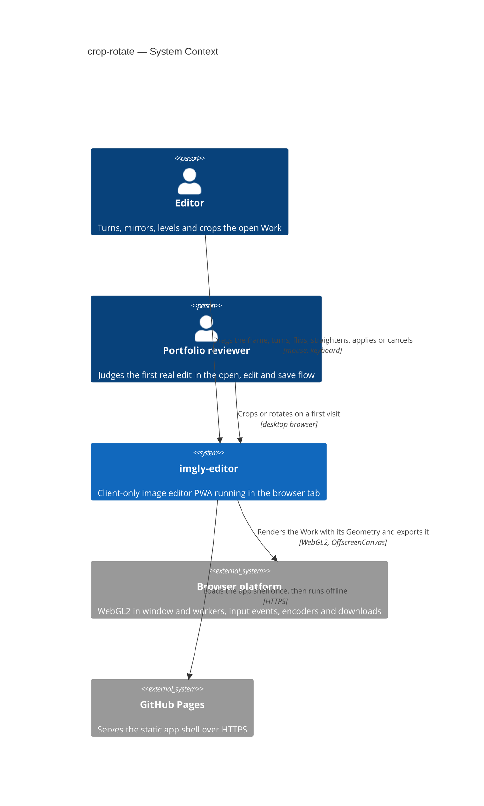
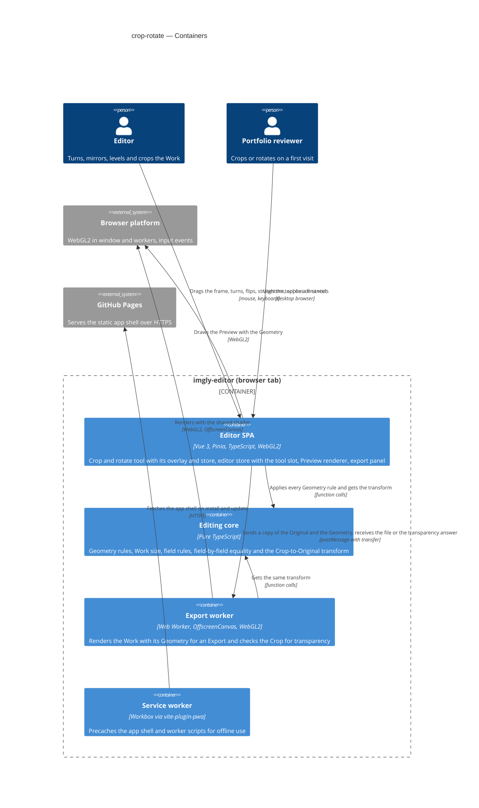

# Software Architecture Document — crop-rotate

<!-- 12 Arc42 sections. Empty section → <!-- N/A: <one-line reason> -->. -->
<!-- C4 Context (L1) lives inline in §3. C4 Container (L2) lives inline in §5. -->
<!-- Numbers in §10 come VERBATIM from spec.md §6 NFR — no inventing, no rounding. -->

## 1. Introduction and goals

**Intent.** crop-rotate gives the Editor one "Crop and rotate" tool that turns the open Work in quarter turns, mirrors it, levels it with a Straighten angle of up to ±45°, and sets its Crop by dragging, by a fixed proportion or by exact pixel sizes. Apply keeps the result, Cancel restores the Geometry the Work had before, and Reset returns to no Geometry (spec §1). The Geometry is non-destructive: it is a small set of parameters on the Work, never a cut of the Original, so a Crop can always be widened back and the area outside it returns exactly as it was (spec §2). The Preview and every Export show exactly the applied Geometry, in every target browser. This is the first real edit in the open, edit and save flow, so it also fixes the Geometry that the adjustments (roadmap step 5), the drawing layer (step 6) and the gallery (step 8) build on.

**Top-3 quality goals (1-liners; full scenarios in §10):**

1. **Fidelity, Preview to Export**: what the Editor applies is exactly what every Export contains. Rotation, Flip and Crop lose no pixel, a straightened Export matches the Preview at 100%, opaque images stay opaque, and no pixel from outside the Crop ever leaves the app.
2. **Non-destructive and exact Geometry**: the Geometry is whole-pixel parameters on the Work, compared field by field. Widening the Crop back or Reset gives back exactly the pixels from before, and Unsaved edits change only when the applied Geometry really differs.
3. **A responsive, leak-free tool**: the Preview follows the crop frame and the straighten slider at 30 or more updates per second on a 4096×3072 Work, every button responds within 150 ms, and 50 applied changes do not grow memory.

**Stakeholders.**

| Role | Interest | Sign-off owner? |
|---|---|---|
| Editor | Turns, mirrors, levels and crops a Work in one tool, and trusts that nothing is lost and that the Export matches the Preview | No |
| Portfolio reviewer | Finds the tool and crops or rotates on the first try, by mouse or keyboard, in at most three actions | No |
| Tech Lead | SAD approval; the Geometry model, the shared shader path and the editor's tool slot are inherited by roadmap steps 5, 6 and 8 | Yes |
| Security Lead | The one privacy rule: an Export never contains pixels from outside the Crop (AC-14); spec §6.1 needs no full security review | Yes |

## 2. Constraints

**Technical.**
- TypeScript 5 (`strict`), Node 24 toolchain, pnpm — repo ADR [0001](../../adr/0001-build-a-client-only-vue-pwa.md)
- Vue 3 (Composition API, `<script setup>`) + Pinia + Vite + vite-plugin-pwa; a client-only static app on GitHub Pages under `/imgly/`, with no server, accounts or sync — repo ADR 0001
- WebGL2 renders the Work, and the Preview and the Export share one shader source (`src/render/shaders.ts`) — repo ADR [0004](../../adr/0004-render-adjustments-on-webgl2-and-drawing-on-canvas2d.md). The Preview is one WebGL2 canvas whose View is a `mat3` uniform over a unit quad, drawn only when something changed, with the premultiplied Original as one texture (open-and-view [ADR-0003](../open-and-view/adr/0003-render-the-preview-in-one-webgl2-canvas-with-a-view-transform.md)). Every Original is sRGB (open-and-view ADR-0004)
- Exports render in a short-lived Web Worker on an `OffscreenCanvas` with the same shaders (export [ADR-0002](../export/adr/0002-render-and-encode-exports-in-a-dedicated-web-worker.md)), or in the window where the worker has no WebGL2 (export ADR-0003). Data crosses threads only by structured clone or transfer (no `SharedArrayBuffer` on GitHub Pages)
- Unsaved edits are a revision counter on the Work: every edit goes through the `editor` store's `applyEdit()` and raises `revision`; a successful Export sets `cleanRevision` (open-and-view [ADR-0005](../open-and-view/adr/0005-track-unsaved-edits-with-a-revision-counter-on-the-work.md), export §4)
- Functional core with feature folders: `core` is pure TypeScript; features never import each other and coordinate through the `editor` store; `infra` and `render` may call pure `core` functions — repo ADR [0002](../../adr/0002-organize-code-as-functional-core-with-feature-folders.md), repo `CLAUDE.md` §Module boundaries
- The Original stays the Original: non-destructive editing as "Original plus parameters" (repo ADR [0003](../../adr/0003-persist-works-in-indexeddb-as-original-plus-params-plus-layer.md)). No persistence in this feature: the Geometry lives in session memory only, and IndexedDB is not touched (spec §3, §6.1)
- No undo or redo in this feature (spec §3, roadmap step 7)
- Targets: the latest desktop Chromium, Firefox and Safari; on mobile the app only has to not break, with no touch gestures (spec §3, `docs/design-system.md` §Platform posture)

**Organisational.**
- Solo, spare-time project; owner Blazheiko. No per-feature effort budget beyond the 4–6 week MVP budget for the whole roadmap and no hard deadline. Size M at its upper bound, route standard (`.size`, `.route`); the Straighten angle (US-04) is the first thing cut if the budget slips (spec §1)
- TDD is on (`.claude/sdd.local.md`): Vitest units, Playwright e2e on Chromium, Firefox and WebKit; `@perf` runs by hand on the reference machine (Apple M1 MacBook Air, latest stable Chrome, spec §6)

**Conventions.**
- Repo `CLAUDE.md` §Conventions: `core` returns `Result<T, AppError>` and throws only for programmer errors; unit tests co-located as `*.test.ts`; e2e in `e2e/crop-rotate/*.spec.ts`, only for what happy-dom can't do (WebGL pixels, frame timing); plain CSS with tokens from `src/shared/styles/tokens.css`; features expose `index.ts` and are mounted from `src/app/`
- `docs/design-system.md` §Interaction & writing conventions: one notice boundary, every action reachable by keyboard, short plain microcopy; refusals are hints on the unavailable control (ux-flows §Platform decisions); new primitives are registered in the inventory
- Field input rules follow export AC-04: values are checked when the Editor leaves the field or presses Enter in it, never while typing (spec AC-07, AC-10)
- Patterns reused from open-and-view and export: a messages catalog per feature, the bitmap ledger and whole-page memory measure for leak tests, `window.__imglyTest` hooks in the e2e build

**Regulatory / external.**
- Data classification: confidential (spec §6.1). Pixels never leave the device except as the file the Editor exports, and the Geometry decides which part of them does: an Export never contains a pixel from outside the Crop (AC-14), and the file is plain pixels with no hidden layers or metadata (export AC-16)
- No accounts, so no AuthN/AuthZ. The only refusals are the app's own rules: no Geometry change during an export (AC-15) and no Export while the tool is open (AC-16)
- Abuse cases are bounded by the input rules: sizes by the image, angles by ±45°, and only plain decimal notation counts as a number (AC-07, AC-10), so the Work can never grow beyond the Downscale limit
- Security review: N/A per spec §6.1; AC-14 is verified by tests

## 3. Context and scope

imgly-editor is an offline, client-only image editor running entirely in the browser tab. crop-rotate adds its first editing tool: the Editor changes the open Work's Geometry inside the app, and the result reaches the outside world only through export, which already renders the Work and hands the file to the browser or the operating system. Nothing goes to a server; GitHub Pages only serves the static app shell.

<!-- brownfield: open-and-view and export are shipped. src/core (Work with revision/cleanRevision, Source name and format, View maths, header parser, export rules), src/render (WebGL2 PreviewRenderer, shared shaders.ts, view-transform.ts, export worker-handler with a FULL_QUAD transform), src/features/editor (store with phases idle/reading/confirming/exporting, applyEdit, beginExport/finishExport, status bar reading original.width/height), src/features/export (store sizing from original, transparency hint from original.hasTransparency, Ctrl/Cmd+S shortcuts). The Work has no Geometry yet. docs/architecture-map.md reflects 7d26cf9, 146 commits behind HEAD; this SAD read the code directly (explorer scan at 1f0fa57). -->

**Trust boundary.** The tool adds no new input from outside the app: the only inputs are the Editor's own pointer, keyboard and typed values, and those are bounded by the input rules (AC-02, AC-07, AC-10). The trust boundary stays where open-and-view and export put it: decoded files coming in, and what the browser's encoder and file system return going out. This feature's job at that boundary is the privacy rule that an Export holds no pixel from outside the Crop (AC-14).

**External systems (in / out):**

| Actor or system | Type | Interaction |
|---|---|---|
| Editor | Person | Opens the "Crop and rotate" tool, turns, mirrors, straightens and crops by mouse or keyboard, then applies, cancels or resets |
| Portfolio reviewer | Person | Tries the tool on a first visit, usually on a desktop browser, and judges it in the first minute |
| Browser platform | System (external) | Provides WebGL2 in the window and in workers, pointer and keyboard events, and the encoders and downloads that export already uses |
| GitHub Pages | System (external) | Serves the static app shell and the worker scripts on first load and updates; never sees an image |

**External: no third-party service** — deliberate. No upload, no cloud processing, no remote image analysis (§2 Regulatory; automatic straightening is a non-goal, spec §3).

**C4 Context (L1):**



The Editor and the Portfolio reviewer drive the app by mouse and keyboard. The app renders the Work with its Geometry through the browser's WebGL2, in the Preview and in the export worker, and GitHub Pages is only the first-load source of the code. The operating system's file dialog belongs to export and is unchanged.

## 4. Solution strategy

**Target surface.** `target_surfaces: [web-frontend]` (frontmatter). The feature extends the one runnable surface, the Editor SPA in the browser tab; the export worker it reuses is an internal container of that surface (§5). Decided inline: there is no server (repo ADR 0001) and no published library, so the other surfaces are excluded by §2.

**UI architecture (web-frontend).** Inherited from open-and-view and export: a client-rendered SPA with one editor view and no router. The "Crop and rotate" tool (SCR-03) is a mode of that view: it takes over the canvas and the editing controls in place and never opens a page (ux-flows §Platform decisions). State lives in Pinia setup stores; components reuse `src/shared/ui/` primitives and `tokens.css`. No new ADR: server rendering is excluded by §2, and the tool-mode mechanism is ADR-0003.

**Top strategic choices (the seeds for ADRs):**

1. **The Geometry is integer parameters on the Work, with every rule and the one transform in `core`** — [ADR-0001](adr/0001-model-the-geometry-as-integer-parameters-with-one-core-transform.md). `Geometry = { flipH, flipV, rotation, straighten, crop }`: `rotation` is 0, 90, 180 or 270; `straighten` is an integer number of tenths of a degree from −450 to 450; `crop` is whole pixels in the image as it stands after its Flip, Rotation and Straighten angle (CONTEXT "Crop"). Integers make AC-13's field-by-field comparison exact, and the parameters are what repo ADR 0003 will persist in step 8. The pure module `src/core/geometry/` is the single place that turns an on-screen action into a change of the stored fields (AC-03, AC-04's sign rule), keeps the Crop inside the turned image (AC-02, AC-06), does the proportion and size maths (AC-08–AC-10), and derives the one `mat3` from a Crop pixel to an Original texture coordinate that every renderer uses. Serves quality goals 1 and 2.
2. **Render the Geometry in the shared shader, in one pass** — [ADR-0002](adr/0002-render-the-geometry-in-the-shared-shader-in-one-pass.md). The shader gains a second matrix, `u_geometry`, that maps each output pixel back to its place in the Original, so the Preview and the export worker both sample the Original directly with the same code; no baked bitmap and no intermediate texture exist. Rotation, Flip and Crop land on exact pixels; a Straighten angle switches magnification to bilinear sampling in both the Preview and the Export, so a full-size Export equals the Preview at 100%. Serves quality goals 1 and 3, and keeps open-and-view ADR-0003's "steps 5 and 6 add to the same program".
3. **Tools open in an `activeTool` slot on the `editor` store; the draft lives in the tool's own store** — [ADR-0003](adr/0003-open-tools-in-an-active-tool-slot-with-the-draft-in-the-feature-store.md). The slot is separate from the editor's phase, so opening another image still runs its normal phases while the tool is open (AC-17), and Export reads one flag to refuse (AC-16). A new `crop-rotate` feature store owns the draft Geometry, the remembered proportion and the field rules; the Preview draws the draft through `editor.previewGeometry`, and Apply hands the result to `editor.applyGeometry()`. This is the pattern roadmap steps 5 and 6 reuse. Serves quality goal 2.
4. **Check for transparency inside the Crop on the GPU, with the export shader** — [ADR-0004](adr/0004-check-crop-transparency-on-the-gpu-with-the-export-shader.md). When the Original has any transparent pixel and the Work has a Geometry, the export feature asks the export worker to render the Work's alpha at full size and report whether any pixel is below fully opaque; the answer is cached per Work revision. The transparency hint then appears only when a pixel inside the Crop is not opaque (AC-14), judged by the exact sampling the Export will use. Serves quality goal 1.

Decided inline, below the ADR gate:
- **The Work's size is `workSize(work)`**, the Crop's width and height, read by the status bar (AC-01, AC-14), the export panel's full size and presets (AC-14), and fit-View after Apply or Cancel (AC-19). Nothing outside `core/geometry` reads `original.width` or `original.height` as the Work's size any more.
- **Unsaved edits follow AC-13 by comparing fields.** `editor.applyGeometry(next)` stores the Geometry and raises the revision through `applyEdit()` only when `geometryEquals(next, current)` is false. The tool can change nothing else while it is open, so `current` is the Geometry from when it opened.
- **No undo, no persistence.** The tool keeps the Geometry from when it opened for Cancel (AC-11); undo (step 7) and saving the Geometry with the Work (step 8, a new migration then) are out of scope (§2).

Each tactical decision in later sections traces to one of these seeds. A tactical decision that contradicts one is surfaced in §11.

## 5. Building block view

The feature follows the repo's functional core with feature folders (repo ADR 0002). Every rule the tool enforces (quarter turns, on-screen flips and the angle's sign, re-anchoring and shrinking the Crop, proportions, whole-pixel rounding, the field input rules, field-by-field equality, the Work's size and the one transform) is pure TypeScript in `src/core/geometry/` and unit-tested without a browser (ADR-0001). Rendering the Geometry lives in `src/render/` beside the existing Preview and export code, as a change to the one shared shader (ADR-0002). crop-rotate is a **new feature folder**, `src/features/crop-rotate/`: the toolbar action, the tool's controls, the crop-frame overlay, its keyboard handling and its store. Like export, its only cross-feature import is `useEditorStore` from `@/features/editor` (repo `CLAUDE.md` §Module boundaries). Through it the tool opens and closes the editor's tool slot, previews its draft and applies the result (ADR-0003). The app shell places the action in the top bar's actions slot next to Export, and places the overlay and controls in a new tool slot of the editor view.

**The crop frame is a DOM overlay over the Preview canvas** — [ADR-0005](adr/0005-draw-the-crop-frame-as-a-dom-overlay-over-the-preview.md). The dimmed outside, the frame, its eight handles and both grids are absolutely positioned elements over the WebGL canvas. The frame and every handle are focusable, with roles and labels, so the keyboard rules of AC-20 are plain DOM focus. The overlay is positioned from the View and the draft Geometry through `core` maths, so it lines up with the pixels the shader draws.

**Cross-feature changes (open-and-view and export):**
- `Work` gains `geometry: Geometry` (identity at open). `src/core/geometry/` adds `workSize(work)`, and every reader of the Work's size moves to it.
- The `editor` store gains the tool slot of ADR-0003: `activeTool`, `openTool(id)`, `closeTool()`, `previewGeometry`, `applyGeometry(next)`.
  - `beginExport()` also refuses while a tool is open.
  - A confirmed replace closes the tool.
  - fit-View uses the turned, uncropped image while a tool is open, and `workSize` otherwise (AC-19).
  - It also gains `activePanel: 'export' | null`, which the export feature sets when its panel opens and closes, so the C key can stay silent while the panel is open (AC-20) without crop-rotate importing export.
- `PreviewCanvas` draws `previewGeometry ?? work.geometry` and hands it to the renderer with `setGeometry(g)`. `EditorView` gets a `tool` slot over the canvas area for the overlay and the tool's controls.
- `EditorStatusBar` shows `workSize` followed by "from W×H" of the Original whenever the width or the height differs, compared in order (AC-01). `DimensionsReadout` gains the optional "from" part.
- The export store sizes from `workSize(work)`. A remembered long side that is larger than the Work snaps to it for display but stays remembered, and comes back when the Crop is widened (AC-14). The request carries `geometry`, and `transparencyHint` uses the GPU check of ADR-0004. Export and Ctrl/Cmd+S check `editor.activeTool` and show "apply or cancel the crop first" instead (AC-16).

**Internal decomposition:**

```
src/
├── core/
│   ├── document.ts               Work + geometry (identity at open)
│   └── geometry/                 Geometry type and identity, geometryEquals (AC-13), workSize,
│                                 rotateQuarter (AC-03), flipOnScreen (AC-04), setStraighten + fitCropInside (AC-05/06),
│                                 clampCrop + rounding (AC-02), proportions and sizes (AC-08/09),
│                                 parseAngle / parseCropSize (AC-07/10), cropToOriginalUv, overlay maths (ADR-0001)
├── render/
│   ├── shaders.ts                u_geometry in the vertex shader, transparent outside the Original (ADR-0002)
│   ├── preview-renderer.ts       setGeometry(g); LINEAR magnification while straightened; quad sized by the shown size
│   └── export/
│       ├── worker-handler.ts     renders with geometry at the export size; new 'alpha' check (ADR-0004)
│       └── client.ts             exportImage(request with geometry); checkCropTransparency(original, geometry)
├── features/editor/              store: tool slot, previewGeometry, applyGeometry, activePanel (ADR-0003);
│                                 PreviewCanvas, EditorView tool slot, EditorStatusBar "from" size
├── features/export/              sizes from workSize, sends geometry, transparency via the check, refuses while a tool is open
├── features/crop-rotate/
│   ├── store.ts                  `cropRotate` store: draft, Geometry at open, proportion per Work (AC-08), field state, apply / cancel / reset
│   ├── CropRotateAction.vue      the toolbar action with its hints (SCR-01, SCR-02; AC-15, AC-18, AC-20)
│   ├── CropRotateControls.vue    SCR-03 controls: rotate, flip, straighten slider and field, proportion, width and height, Reset, Cancel, Apply
│   ├── CropOverlay.vue           SCR-03 frame: dimmed outside, frame, handles, rule-of-thirds and fine grids (ADR-0005)
│   ├── shortcuts.ts              C to open; inside the tool Enter, Escape and the arrow keys (AC-20)
│   ├── messages.ts               the tool's hint catalog
│   └── index.ts                  public surface: CropRotateAction, CropRotateTool, useCropRotateStore
└── app/App.vue                   mounts CropRotateAction next to ExportAction, and CropRotateTool into the editor's tool slot
```

Dependency direction stays `features → core | infra | render | shared`. `render` imports `core` for the Geometry type and `cropToOriginalUv`, as repo `CLAUDE.md` §Module boundaries allows. No new `AppError` code: the field rules never fail (they snap or revert), and a failed transparency check is handled inside export.

**C4 Container (L2):**



The Editor SPA does all the interactive work. It applies every Geometry rule through the editing core, draws the Preview with the Geometry through WebGL2, and shows the crop frame as page elements over the canvas. For an Export, or to check the Crop for transparency, it sends a copy of the Original and the Geometry to the export worker. The worker gets the same transform from the core and renders with the same shader. The decode worker is unchanged and out of this view. The service worker precaches the larger app shell as before.

## 6. Runtime view

<!-- 🎯 Why: the RUNTIME FLOW of 1–2 critical scenarios — who talks to whom, when, in what order.
     Without §6, §5 is just boxes with no life.
     📋 Write: a Mermaid sequenceDiagram. Participants are names from §5 (don't invent new ones).
     Messages are semantic («saves a draft»), NO HTTP verbs / paths / status codes — endpoint-level
     sequences arrive at the `api` stage.
     📌 e.g. «author → web: composes draft → web → content API: save». Seed the primary flow(s) here;
     the `sequences` stage then covers every §5 AC (no cap). Never N/A for M+; XS/S keeps ≥1 happy-path flow. -->

**Critical flow 1: <flow name>**

```mermaid
sequenceDiagram
    actor Actor
    participant Web
    participant Service
    participant Store
    Actor->>Web: <action>
    Web->>Service: <call>
    Service->>Store: <write>
    Store-->>Service: ok
    Service-->>Web: result
    Web-->>Actor: confirmation
```

**Critical flow 2: <e.g. async event propagation>** — <if applicable, otherwise N/A>.

## 7. Deployment view

<!-- 🎯 Why: the TOPOLOGY DevOps must know without reading the deploy charts — how many replicas,
     where the background worker lives, AT WHAT NUMBERS we scale.
     📋 Write: 2–3 sentences on topology + monitoring + concrete threshold numbers.
     📌 e.g. «500 authors → partition by quarter» (not «we'll think about scale later»).
     🎯 N/A allowed for XS/S that reuses an existing deployment unit with no change.
     Deployment-diagram scaffold → templates/deployment.md. -->

<Topology in 2–3 sentences. Where it runs, replicas, scaling thresholds.>

**Monitoring:**
- <Metrics — e.g. `<metric_name>`>
- <Alerts — e.g. «worker lag > 10 min → page on-call»>
- <Tracing — e.g. spans on the request boundary>

**Scaling thresholds:**
- <e.g. comfortable in one table up to N rows/year>
- <e.g. partition by quarter above N rows/year>

<!-- For XS/S with no deployment change: <!-- N/A: reuses existing deployment unit, no infra change --> -->

## 8. Crosscutting concepts

<!-- 🎯 Why: CROSS-CUTTING PATTERNS spanning several modules: logging, errors, authorization, ID
     strategy, events, caching. ⭐ The second-densest section. A pattern inside one module is NOT
     here; a project-wide convention belongs in the convention file.
     📋 Write: a table — concept / convention / where defined. One row per concept.
     📌 e.g. «sortable time-based IDs generated in the app layer» as a default from the convention file. -->

| Concept | Convention | Where defined |
|---|---|---|
| Logging | <e.g. structured, fields `module=<name>`> | <convention file §X or here> |
| Authentication | <e.g. token-based via middleware> | <convention file §X> |
| Error handling | <e.g. domain sentinel → ports error mapping → JSON> | <convention file §X> |
| ID strategy | <e.g. sortable time-based ID in the app layer> | <convention file §X> |
| Internationalisation | <e.g. N/A, single language> | — |
| Observability | <e.g. tracing on the request boundary> | — |
| Events | <module-specific patterns, if any> | <here> |

## 9. Architecture decisions

<!-- 🎯 Why: the REVERSE INDEX onto the adr/ folder. `ls adr/` gives the files; §9 gives the
     semantics — why they exist, which SAD section they attach to, what status.
     📋 Write: a 4-column table, one row per ADR. Mixed status is fine.
     📌 e.g. «0001 | Store content as a table of typed blocks | Accepted | §4». -->

| # | Title | Status | Section |
|---|---|---|---|
| <NNNN> | <imperative — e.g. "Use a sliding-window counter for rate limiting"> | Accepted | §<N> |
| <NNNN> | <imperative — e.g. "Co-locate the worker in the API process"> | Accepted | §<N> |

ADR files live under `docs/features/<slug>/adr/NNNN-<title>.md`.

## 10. Quality requirements

<!-- 🎯 Why: the QUALITY TREE — take a goal from §1 and break it into concrete leaves: tests,
     metrics, configs, drills. ⭐ Without §10, §1 is a manifesto. With §10 each declaration maps
     to something PROVABLE.
     📋 Write: per §1 goal — When / Then / How-verify. Numbers from spec §6 NFR VERBATIM (don't
     round ≤250ms to ≤300ms — that's a critic F6 hit).
     📌 e.g. «p95 ≤ 500 ms on a block update, verified by a 100 req/s load test». -->

Each top-3 goal from §1 expanded into a full scenario:

**QG-1. <quality attribute>**
- **When:** <trigger condition>
- **Then:** <expected behaviour with numbers from spec §6 NFR>
- **How verify:** <test / chaos drill / load test / metric>

**QG-2. <quality attribute>**
- **When:** <trigger>
- **Then:** <expected>
- **How verify:** <how>

**QG-3. <quality attribute>**
- **When:** <trigger>
- **Then:** <expected>
- **How verify:** <how>

## 11. Risks and technical debt

<!-- 🎯 Why: ⭐ collects EVERYTHING that can break — not only the technical. Without §11 risks get
     discussed at standups and lost; debt lives only in the head of whoever accepted it.
     📋 Write: a risk/debt table — severity — mitigation — owner. Accepted debt in its own block.
     📌 The first risk is often a product risk, not a technical one. That's normal. -->

<!-- Severity literals: Low / Medium / High for regular risks; "Open question" for rows created by
     a Save-as-OQ resolution during the Socratic walk (see references/socratic.md). -->

| Risk / debt | Severity | Mitigation | Owner |
|---|---|---|---|
| <e.g. Worker lag may reach hours during a downstream outage> | Medium | <alert >10 min, on-call playbook, retry backoff> | <DevOps> |
| <e.g. No event-schema versioning in v1> | Medium | <ADR-NNNN planned for v2, tolerate unknown fields> | <Backend> |
| Open architectural decision: <decision-headline> | Open question | Resolve before <stage trigger or YYYY-MM-DD>; <inline rationale from the Save-as-OQ> | <owner> |

**Accepted debt (acceptable in v1, plan to fix later):**
- <e.g. the entity is immutable / unversioned — OK for v1, may need audit versioning in v2>

## 12. Glossary

<!-- 🎯 Why: ⭐ the DOMAIN GLOSSARY that ends arguments a year later («checkpoint — weekly or
     biweekly? quarter — calendar or fiscal?»).
     📋 Write: a term / meaning table. Business + technical terms mixed.
     📌 e.g. «Lesson | a unit inside a course made of blocks (text, video)». -->

| Term | Meaning |
|---|---|
| <e.g. domain object A> | <its meaning in this domain> |
| <e.g. domain object B> | <its meaning> |
| <e.g. domain invariant name> | <the rule, in plain language> |
