# Software Architecture Document — crop-rotate

## 1. Introduction and goals

**Intent.** crop-rotate gives the Editor one "Crop and rotate" tool that turns the open Work in quarter turns, mirrors it, levels it with a Straighten angle of up to ±45°, and sets its Crop by dragging, by a fixed proportion or by exact pixel sizes. Apply keeps the result, Cancel restores the Geometry the Work had before, and Reset returns to no Geometry (spec §1). The Geometry is non-destructive: it is a small set of parameters on the Work, never a cut of the Original, so a Crop can always be widened back and the area outside it returns exactly as it was (spec §2). The Preview and every Export show exactly the applied Geometry, in every target browser. This is the first real edit in the open, edit and save flow, so it also fixes the Geometry that the adjustments (roadmap step 5), the drawing layer (step 6) and the gallery (step 8) build on.

**Top-3 quality goals (1-liners; full scenarios in §10):**

1. **Fidelity, Preview to Export**: what the Editor applies is exactly what every Export contains. Rotation, Flip and Crop lose no pixel, a straightened Export matches the Preview at 100%, opaque images stay opaque, and no pixel from outside the Crop ever leaves the app.
2. **Non-destructive and exact Geometry**: the Geometry is whole-pixel parameters on the Work, compared field by field. Widening the Crop back or Reset gives back exactly the pixels from before, and Unsaved edits change only when the applied Geometry really differs.
3. **A responsive, leak-free tool**: the Preview follows the crop frame and the straighten slider at 30 or more updates per second on a 4096×3072 Work, rotate, flip, Apply, Cancel, Reset and opening the tool each respond within 150 ms, and 50 applied changes do not grow memory.

**Stakeholders.**

| Role | Interest | Sign-off owner? |
|---|---|---|
| Editor | Turns, mirrors, levels and crops a Work in one tool, and trusts that nothing is lost and that the Export matches the Preview | No |
| Portfolio reviewer | Finds the tool and crops or rotates on the first try, by mouse or keyboard, in at most three actions | No |
| Tech Lead | SAD approval; the Geometry model, the shared shader path and the editor's tool slot are inherited by roadmap steps 5, 6 and 8 | Yes |
| Security Lead | The one privacy rule: an Export never contains pixels from outside the Crop (AC-14); spec §6.1 needs no full security review | Yes |

## 2. Constraints

**Technical.**
- TypeScript 5 (`strict`), Node 24 toolchain, pnpm — repo ADR [0001](../../adr/0001-build-a-client-only-vue-pwa.md)
- Vue 3 (Composition API, `<script setup>`) + Pinia + Vite + vite-plugin-pwa; a client-only static app on GitHub Pages under `/imgly/`, with no server, accounts or sync — repo ADR 0001
- WebGL2 renders the Work, and the Preview and the Export share one shader source (`src/render/shaders.ts`) — repo ADR [0004](../../adr/0004-render-adjustments-on-webgl2-and-drawing-on-canvas2d.md). The Preview is one WebGL2 canvas whose View is a `mat3` uniform over a unit quad, drawn only when something changed, with the premultiplied Original as one texture (open-and-view [ADR-0003](../open-and-view/adr/0003-render-the-preview-in-one-webgl2-canvas-with-a-view-transform.md)). Every Original is sRGB (open-and-view ADR-0004)
- Exports render in a short-lived Web Worker on an `OffscreenCanvas` with the same shaders (export [ADR-0002](../export/adr/0002-render-and-encode-exports-in-a-dedicated-web-worker.md)), or in the window where the worker has no WebGL2 (export ADR-0003). Data crosses threads only by structured clone or transfer (no `SharedArrayBuffer` on GitHub Pages)
- Unsaved edits are a revision counter on the Work: every edit goes through the `editor` store's `applyEdit()` and raises `revision`; a successful Export sets `cleanRevision` (open-and-view [ADR-0005](../open-and-view/adr/0005-track-unsaved-edits-with-a-revision-counter-on-the-work.md), export §4)
- Functional core with feature folders: `core` is pure TypeScript; features never import each other and coordinate through the `editor` store; `infra` and `render` may call pure `core` functions — repo ADR [0002](../../adr/0002-organize-code-as-functional-core-with-feature-folders.md), repo `CLAUDE.md` §Module boundaries
- The Original stays the Original: non-destructive editing as "Original plus parameters" (repo ADR [0003](../../adr/0003-persist-works-in-indexeddb-as-original-plus-params-plus-layer.md)). No persistence in this feature: the Geometry lives in session memory only, and IndexedDB is not touched (spec §3, §6.1)
- No undo or redo in this feature (spec §3, roadmap step 7)
- Targets: the latest desktop Chromium, Firefox and Safari; on mobile the app only has to not break, with no touch gestures (spec §3, `docs/design-system.md` §Platform posture)

**Organisational.**
- Solo, spare-time project; owner Blazheiko. No per-feature effort budget beyond the 4–6 week MVP budget for the whole roadmap and no hard deadline. Size M at its upper bound, route standard (`.size`, `.route`); the Straighten angle (US-04) is the first thing cut if the budget slips (spec §1)
- TDD is on (`.claude/sdd.local.md`): Vitest units, Playwright e2e on Chromium, Firefox and WebKit; `@perf` runs by hand on the reference machine (Apple M1 MacBook Air, latest stable Chrome, spec §6)

**Conventions.**
- Repo `CLAUDE.md` §Conventions: `core` returns `Result<T, AppError>` and throws only for programmer errors; unit tests co-located as `*.test.ts`; e2e in `e2e/crop-rotate/*.spec.ts`, only for what happy-dom can't do (WebGL pixels, frame timing); plain CSS with tokens from `src/shared/styles/tokens.css`; features expose `index.ts` and are mounted from `src/app/`
- `docs/design-system.md` §Interaction & writing conventions: one notice boundary, every action reachable by keyboard, short plain microcopy; refusals are hints on the unavailable control (ux-flows §Platform decisions); new primitives are registered in the inventory
- Field input rules follow export AC-04: values are checked when the Editor leaves the field or presses Enter in it, never while typing (spec AC-07, AC-10)
- Patterns reused from open-and-view and export: a messages catalog per feature, the bitmap ledger and whole-page memory measure for leak tests, `window.__imglyTest` hooks in the e2e build

**Regulatory / external.**
- Data classification: confidential (spec §6.1). Pixels never leave the device except as the file the Editor exports, and the Geometry decides which part of them does: an Export never contains a pixel from outside the Crop (AC-14), and the file is plain pixels with no hidden layers or metadata (export AC-16)
- No accounts, so no AuthN/AuthZ. The only refusals are the app's own rules: no Geometry change during an export (AC-15) and no Export while the tool is open (AC-16)
- Abuse cases are bounded by the input rules: sizes by the image, angles by ±45°, and only plain decimal notation counts as a number (AC-07, AC-10), so the Work can never grow beyond the Downscale limit
- Security review: N/A per spec §6.1; AC-14 is verified by tests

## 3. Context and scope

imgly-editor is an offline, client-only image editor running entirely in the browser tab. crop-rotate adds its first editing tool: the Editor changes the open Work's Geometry inside the app, and the result reaches the outside world only through export, which already renders the Work and hands the file to the browser or the operating system. Nothing goes to a server; GitHub Pages only serves the static app shell.

<!-- brownfield: open-and-view and export are shipped. src/core (Work with revision/cleanRevision, Source name and format, View maths, header parser, export rules), src/render (WebGL2 PreviewRenderer, shared shaders.ts, view-transform.ts, export worker-handler with a FULL_QUAD transform), src/features/editor (store with phases idle/reading/confirming/exporting, applyEdit, beginExport/finishExport, status bar reading original.width/height), src/features/export (store sizing from original, transparency hint from original.hasTransparency, Ctrl/Cmd+S shortcuts). The Work has no Geometry yet. docs/architecture-map.md reflects 7d26cf9, 146 commits behind HEAD; this SAD read the code directly (explorer scan at 1f0fa57). -->

**Trust boundary.** The tool adds no new input from outside the app: the only inputs are the Editor's own pointer, keyboard and typed values, and those are bounded by the input rules (AC-02, AC-07, AC-10). The trust boundary stays where open-and-view and export put it: decoded files coming in, and what the browser's encoder and file system return going out. This feature's job at that boundary is the privacy rule that an Export holds no pixel from outside the Crop (AC-14).

**External systems (in / out):**

| Actor or system | Type | Interaction |
|---|---|---|
| Editor | Person | Opens the "Crop and rotate" tool, turns, mirrors, straightens and crops by mouse or keyboard, then applies, cancels or resets |
| Portfolio reviewer | Person | Tries the tool on a first visit, usually on a desktop browser, and judges it in the first minute |
| Browser platform | System (external) | Provides WebGL2 in the window and in workers, pointer and keyboard events, and the encoders and downloads that export already uses |
| GitHub Pages | System (external) | Serves the static app shell and the worker scripts on first load and updates; never sees an image |

**External: no third-party service** — deliberate. No upload, no cloud processing, no remote image analysis (§2 Regulatory; automatic straightening is a non-goal, spec §3).

**C4 Context (L1):**

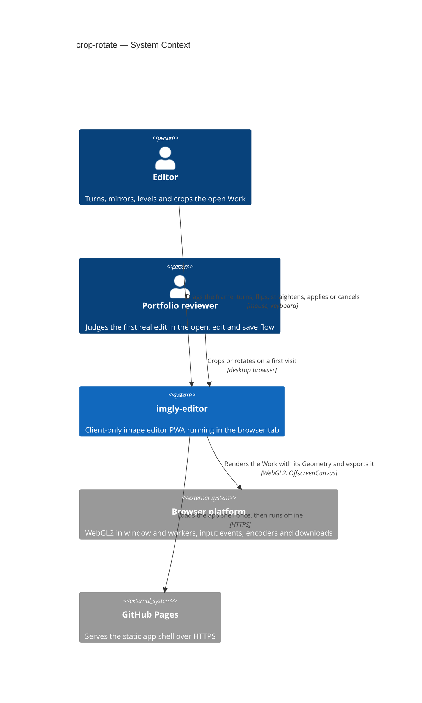

The Editor and the Portfolio reviewer drive the app by mouse and keyboard. The app renders the Work with its Geometry through the browser's WebGL2, in the Preview and in the export worker, and GitHub Pages is only the first-load source of the code. The operating system's file dialog belongs to export and is unchanged.

## 4. Solution strategy

**Target surface.** `target_surfaces: [web-frontend]` (frontmatter). The feature extends the one runnable surface, the Editor SPA in the browser tab; the export worker it reuses is an internal container of that surface (§5). Decided inline: there is no server (repo ADR 0001) and no published library, so the other surfaces are excluded by §2.

**UI architecture (web-frontend).** Inherited from open-and-view and export: a client-rendered SPA with one editor view and no router. The "Crop and rotate" tool (SCR-03) is a mode of that view: it takes over the canvas and the editing controls in place and never opens a page (ux-flows §Platform decisions). State lives in Pinia setup stores; components reuse `src/shared/ui/` primitives and `tokens.css`. No new ADR: server rendering is excluded by §2, and the tool-mode mechanism is ADR-0003.

**Top strategic choices (the seeds for ADRs):**

1. **The Geometry is integer parameters on the Work, with every rule and the one transform in `core`** — [ADR-0001](adr/0001-model-the-geometry-as-integer-parameters-with-one-core-transform.md). `Geometry = { flipH, flipV, rotation, straighten, crop }`: `rotation` is 0, 90, 180 or 270; `straighten` is an integer number of tenths of a degree from −450 to 450; `crop` is whole pixels in the image as it stands after its Flip, Rotation and Straighten angle (CONTEXT "Crop"). Integers make AC-13's field-by-field comparison exact, and the parameters are what repo ADR 0003 will persist in step 8. The pure module `src/core/geometry/` is the single place that turns an on-screen action into a change of the stored fields (AC-03, AC-04's sign rule), keeps the Crop inside the turned image (AC-02, AC-06), does the proportion and size maths (AC-08–AC-10), and derives the one `mat3` from a Crop pixel to an Original texture coordinate that every renderer uses. Serves quality goals 1 and 2.
2. **Render the Geometry in the shared shader, in one pass** — [ADR-0002](adr/0002-render-the-geometry-in-the-shared-shader-in-one-pass.md). The shader gains a second matrix, `u_geometry`, that maps each output pixel back to its place in the Original, so the Preview and the export worker both sample the Original directly with the same code; no baked bitmap and no intermediate texture exist. Rotation, Flip and Crop land on exact pixels; a Straighten angle switches magnification to bilinear sampling in both the Preview and the Export, so a full-size Export equals the Preview at 100%. Serves quality goals 1 and 3, and keeps open-and-view ADR-0003's "steps 5 and 6 add to the same program".
3. **Tools open in an `activeTool` slot on the `editor` store; the draft lives in the tool's own store** — [ADR-0003](adr/0003-open-tools-in-an-active-tool-slot-with-the-draft-in-the-feature-store.md). The slot is separate from the editor's phase, so opening another image still runs its normal phases while the tool is open (AC-17), and Export reads one flag to refuse (AC-16). A new `crop-rotate` feature store owns the draft Geometry, the remembered proportion and the field rules; the Preview draws the draft through `editor.previewGeometry`, and Apply hands the result to `editor.applyGeometry()`. This is the pattern roadmap steps 5 and 6 reuse. Serves quality goal 2.
4. **Check for transparency inside the Crop on the GPU, with the export shader** — [ADR-0004](adr/0004-check-crop-transparency-on-the-gpu-with-the-export-shader.md). When the Original has any transparent pixel and the Work has a Geometry, the export feature asks the export worker to render the Work's alpha at full size and report whether any pixel is below fully opaque; the answer is cached per Work revision. The transparency hint then appears only when a pixel inside the Crop is not opaque (AC-14), judged by the exact sampling the Export will use. Serves quality goal 1.

Decided inline, below the ADR gate:
- **The Work's size is `workSize(work)`**, the Crop's width and height, read by the status bar (AC-01, AC-14), the export panel's full size and presets (AC-14), and fit-View after Apply or Cancel (AC-19). Nothing outside `core/geometry` reads `original.width` or `original.height` as the Work's size any more.
- **Unsaved edits follow AC-13 by comparing fields.** `editor.applyGeometry(next)` stores the Geometry and raises the revision through `applyEdit()` only when `geometryEquals(next, current)` is false. The tool can change nothing else while it is open, so `current` is the Geometry from when it opened.
- **No undo, no persistence.** The tool keeps the Geometry from when it opened for Cancel (AC-11); undo (step 7) and saving the Geometry with the Work (step 8, a new migration then) are out of scope (§2).

Each tactical decision in later sections traces to one of these seeds. A tactical decision that contradicts one is surfaced in §11.

## 5. Building block view

The feature follows the repo's functional core with feature folders (repo ADR 0002). Every rule the tool enforces (quarter turns, on-screen flips and the angle's sign, re-anchoring and shrinking the Crop, proportions, whole-pixel rounding, the field input rules, field-by-field equality, the Work's size and the one transform) is pure TypeScript in `src/core/geometry/` and unit-tested without a browser (ADR-0001). Rendering the Geometry lives in `src/render/` beside the existing Preview and export code, as a change to the one shared shader (ADR-0002). crop-rotate is a **new feature folder**, `src/features/crop-rotate/`: the toolbar action, the tool's controls, the crop-frame overlay, its keyboard handling and its store. Like export, its only cross-feature import is `useEditorStore` from `@/features/editor` (repo `CLAUDE.md` §Module boundaries). Through it the tool opens and closes the editor's tool slot, previews its draft and applies the result (ADR-0003). The app shell places the action in the top bar's actions slot next to Export, and places the overlay and controls in a new tool slot of the editor view.

**The crop frame is a DOM overlay over the Preview canvas** — [ADR-0005](adr/0005-draw-the-crop-frame-as-a-dom-overlay-over-the-preview.md). The dimmed outside, the frame, its eight handles and both grids are absolutely positioned elements over the WebGL canvas. The frame and every handle are focusable, with roles and labels, so the keyboard rules of AC-20 are plain DOM focus. The overlay is positioned from the View and the draft Geometry through `core` maths, so it lines up with the pixels the shader draws.

**Cross-feature changes (open-and-view and export):**
- `Work` gains `geometry: Geometry` (identity at open). `src/core/geometry/` adds `workSize(work)`, and every reader of the Work's size moves to it.
- The `editor` store gains the tool slot of ADR-0003: `activeTool`, `openTool(id)`, `closeTool()`, `previewGeometry`, `applyGeometry(next)`.
  - `beginExport()` also refuses while a tool is open.
  - A successful replace of the Work, confirmed or not, closes the tool.
  - fit-View uses the turned, uncropped image while a tool is open, and `workSize` otherwise (AC-19).
  - It also gains `activePanel: 'export' | null`, which the export feature sets when its panel opens and closes, so the C key can stay silent while the panel is open (AC-20) without crop-rotate importing export.
- `PreviewCanvas` draws the Work with `work.geometry`, cropped, when no tool is open. While a tool is open it draws `previewGeometry` in **whole-turned-image mode**: `core/geometry`'s `turnedImageToOriginalUv(g, original)` and `turnedBounds(g)` give the same transform as the Crop's but over the bounding box of the whole turned image, so the empty corners render transparent and the overlay draws the Crop over it (AC-12, AC-19). The Crop itself never leaves the turned image, so ADR-0001's invariant holds. The renderer takes this as `setGeometry(g, mode)` with `mode` `'crop'` or `'whole'`. `EditorView` gets a `tool` slot over the canvas area for the overlay and the tool's controls.
- `EditorStatusBar` shows `workSize` followed by "from W×H" of the Original whenever the width or the height differs, compared in order (AC-01). `DimensionsReadout` gains the optional "from" part.
- The export store sizes from `workSize(work)`. A remembered long side that is larger than the Work snaps to it for display but stays remembered, and comes back when the Crop is widened (AC-14). The request carries `geometry`, and `transparencyHint` uses the GPU check of ADR-0004. Export and Ctrl/Cmd+S check `editor.activeTool` and show "apply or cancel the crop first" instead (AC-16).

**Internal decomposition:**

```
src/
├── core/
│   ├── document.ts               Work + geometry (identity at open)
│   └── geometry/                 Geometry type and identity, geometryEquals (AC-13), workSize,
│                                 rotateQuarter (AC-03), flipOnScreen (AC-04), setStraighten + fitCropInside (AC-05/06),
│                                 clampCrop + rounding (AC-02), proportions and sizes (AC-08/09),
│                                 parseAngle / parseCropSize (AC-07/10), cropToOriginalUv, turnedImageToOriginalUv + turnedBounds
│                                 (the tool's whole-image view), overlay maths (ADR-0001)
├── render/
│   ├── shaders.ts                u_geometry in the vertex shader, transparent outside the Original (ADR-0002)
│   ├── preview-renderer.ts       setGeometry(g, mode) with mode 'crop' or 'whole'; LINEAR magnification while straightened; quad sized by the shown size
│   └── export/
│       ├── worker-handler.ts     renders with geometry at the export size; new 'alpha' check (ADR-0004)
│       └── client.ts             exportImage(request with geometry); checkCropTransparency(original, geometry)
├── features/editor/              store: tool slot, previewGeometry, applyGeometry, activePanel (ADR-0003);
│                                 PreviewCanvas, EditorView tool slot, EditorStatusBar "from" size
├── features/export/              sizes from workSize, sends geometry, transparency via the check, refuses while a tool is open
├── features/crop-rotate/
│   ├── store.ts                  `cropRotate` store: draft, Geometry at open, proportion per Work (AC-08), field state, apply / cancel / reset
│   ├── CropRotateAction.vue      the toolbar action with its hints (SCR-01, SCR-02; AC-15, AC-18, AC-20)
│   ├── CropRotateTool.vue        SCR-03 wrapper mounted in the editor's tool slot: CropOverlay over the canvas, CropRotateControls beside it
│   ├── CropRotateControls.vue    SCR-03 controls: rotate, flip, straighten slider and field, proportion, width and height, Reset, Cancel, Apply
│   ├── CropOverlay.vue           SCR-03 frame: dimmed outside, frame, handles, rule-of-thirds and fine grids (ADR-0005)
│   ├── shortcuts.ts              C to open; inside the tool Enter, Escape and the arrow keys (AC-20)
│   ├── messages.ts               the tool's hint catalog
│   └── index.ts                  public surface: CropRotateAction, CropRotateTool, useCropRotateStore
└── app/App.vue                   mounts CropRotateAction next to ExportAction, and CropRotateTool into the editor's tool slot
```

Dependency direction stays `features → core | infra | render | shared`. `render` imports `core` for the Geometry type and `cropToOriginalUv`, as repo `CLAUDE.md` §Module boundaries allows. No new `AppError` code: the field rules never fail (they snap or revert), and a failed transparency check is handled inside export.

**C4 Container (L2):**

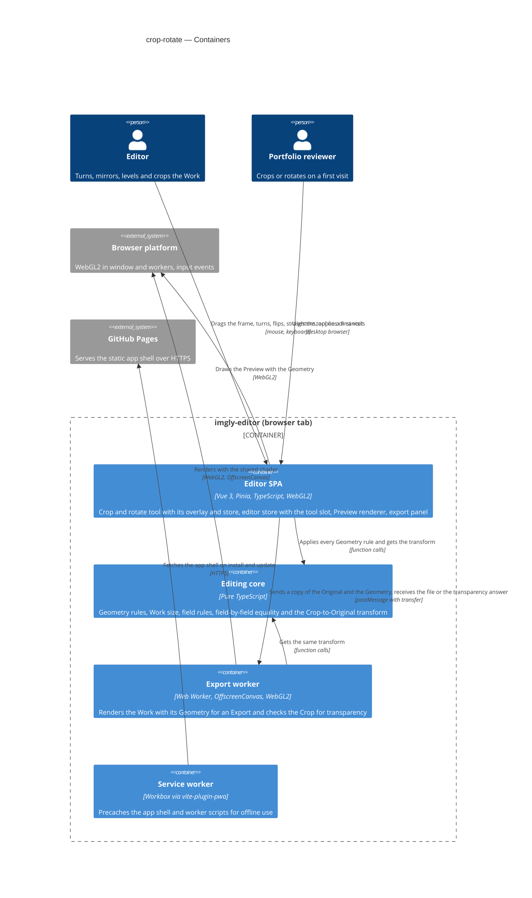

The Editor SPA does all the interactive work. It applies every Geometry rule through the editing core, draws the Preview with the Geometry through WebGL2, and shows the crop frame as page elements over the canvas. For an Export, or to check the Crop for transparency, it sends a copy of the Original and the Geometry to the export worker. The worker gets the same transform from the core and renders with the same shader. The decode worker is unchanged and out of this view. The service worker precaches the larger app shell as before.

## 6. Runtime view

**Critical flow 1: open the tool, change the Geometry, then Apply or Cancel**

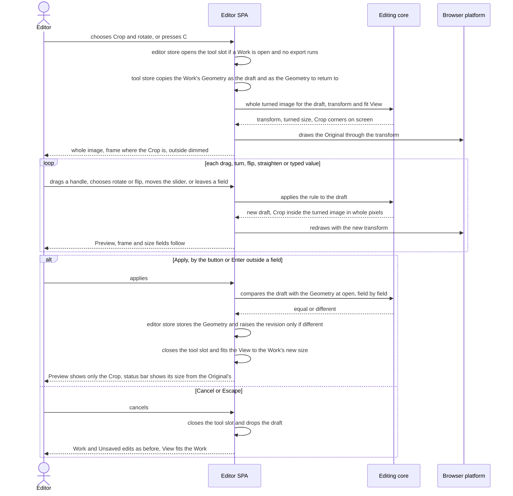

Opening the tool needs a Work and no export in progress (AC-15, AC-18). The tool store copies the Work's Geometry as its draft, and the Preview shows the whole turned image with the frame where the Crop is (AC-12, AC-19). Every change goes through the core rules, so the Crop stays whole pixels inside the turned image, turns and flips with the image, and shrinks under a Straighten angle (AC-02 to AC-10). The Preview redraws with a new transform only, so nothing is allocated per change (ADR-0002). Apply stores the draft and raises the revision only when it differs field by field (AC-13). Cancel drops the draft (AC-11). Either way the View then fits the Work (AC-19).

**Critical flow 2: export a Work with a Geometry**

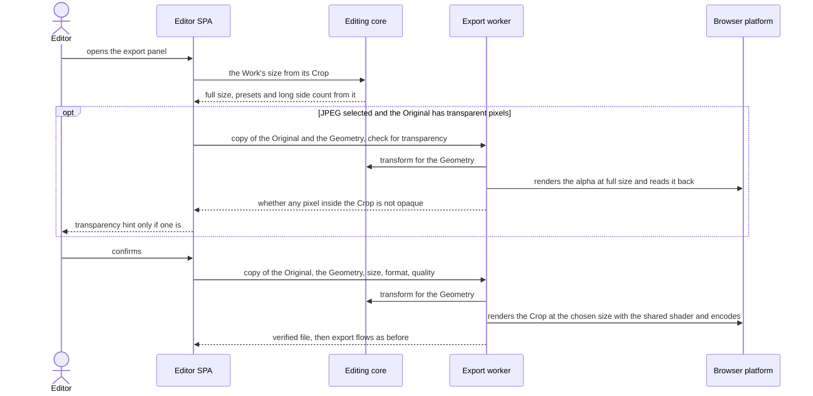

The export panel counts every size from the Crop (AC-14). For a transparent Original with a Geometry, the transparency hint waits for a GPU check of the pixels inside the Crop (ADR-0004). On confirm, the export worker renders exactly the Crop with the same transform and shader as the Preview, so the file holds no pixel from outside the Crop (AC-14, ADR-0002). From the verified file on, export's own flows are unchanged (export sad.md §6).

**Branches the `sequences` stage draws:**
- No image open: the action and C show "open an image first" (AC-18).
- Export in progress: the action is disabled and C does nothing; the request is refused, not queued (AC-15).
- Export or Ctrl/Cmd+S while the tool is open: the hint "apply or cancel the crop first"; the browser's "Save page" never opens (AC-16).
- Open image or a drop while the tool is open: the tool stays open through reading and the replace confirmation. A successful replace, confirmed or not, closes it and drops the draft; a failed read or a declined replace keeps it as it was (AC-17).
- Typed angle or size out of range, fractional, empty or not a number: snapped, rounded or reverted when the field is left or Enter is pressed in it (AC-07, AC-10).
- Reset then Apply, or Reset then Cancel (AC-12); a proportion remembered even after Cancel (AC-08).
- The transparency check fails: the hint shows, the safe side (ADR-0004).

<!-- Flows below were added by `sequences` and use the generic participant vocabulary: <user> is the Editor or the Portfolio reviewer, <ui> is the editor view with the Crop and rotate action, the tool's controls and the crop overlay (SCR-01 to SCR-06 of ux-flows.md), <service> is the feature logic (the crop-rotate and editor stores with the core Geometry rules), <service> (render) is the Preview renderer and the export worker, <external-system> is the browser and the operating system. Nothing in these flows is written to persistent storage: every "keeps" or "remembers" note is in-memory session state, so there are no persist notes for data-model. -->

### F1 — Open the tool, and the refusals to open

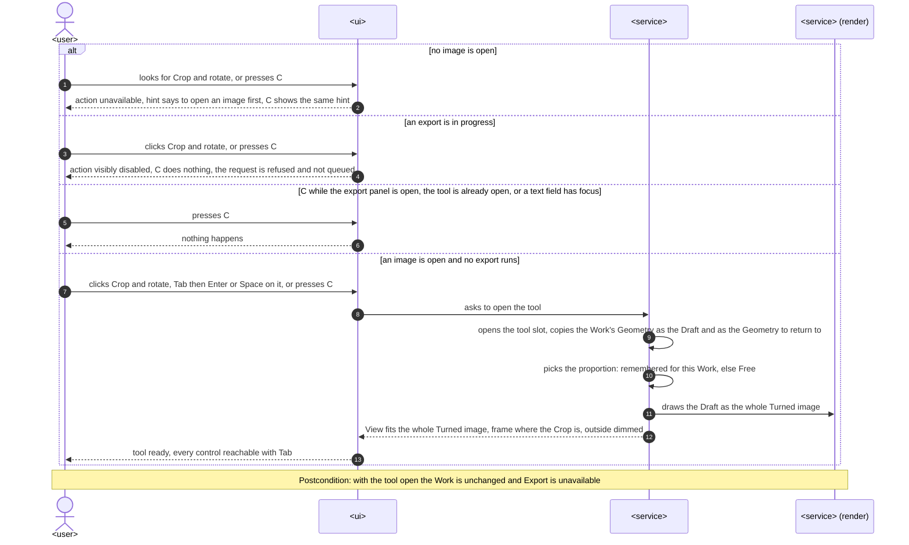

Opening needs an image (AC-18) and no export in progress, and a refused request is not queued (AC-15). The C key is silent while the export panel is open, while the tool is open, or while a text field has focus (AC-20). On opening, the tool copies the Work's Geometry as the Draft, picks the remembered proportion or Free (AC-08), and shows the whole Turned image with the frame where the Crop is and the View fitted to it (AC-12, AC-19).

### F2 — Drag, move and resize the crop frame

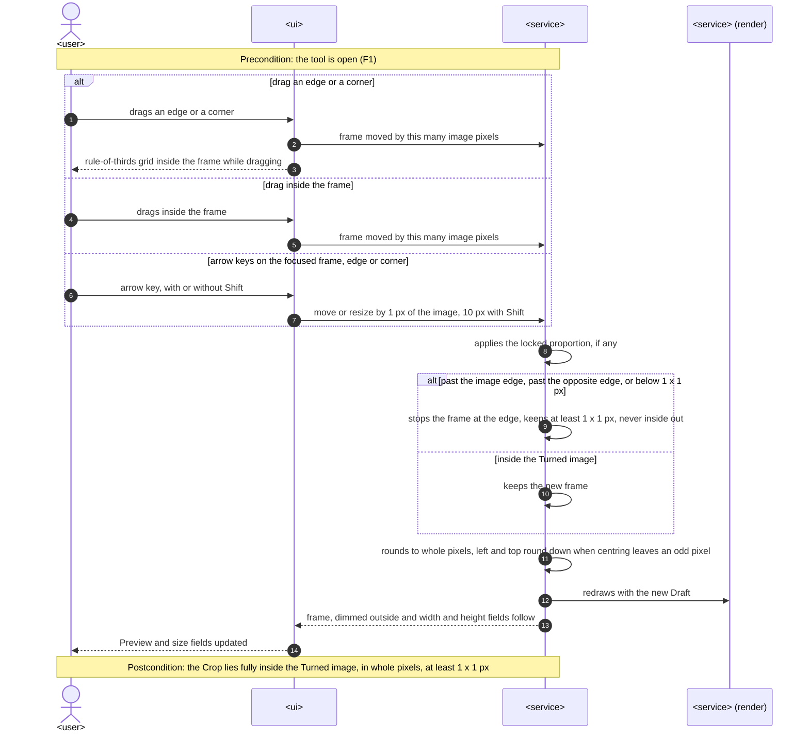

Dragging an edge or a corner resizes the frame, and dragging inside it moves it. The outside stays dimmed, and a rule-of-thirds grid shows while dragging (AC-01). The arrow keys do the same by 1 px, or 10 px with Shift, and a locked proportion follows (AC-20). The frame stops at the image edge, never goes below 1×1 px and never turns inside out. It stays in whole pixels, and an odd pixel goes to the right or the bottom (AC-02). The size fields follow while dragging (AC-09).

### F3 — Turn and mirror

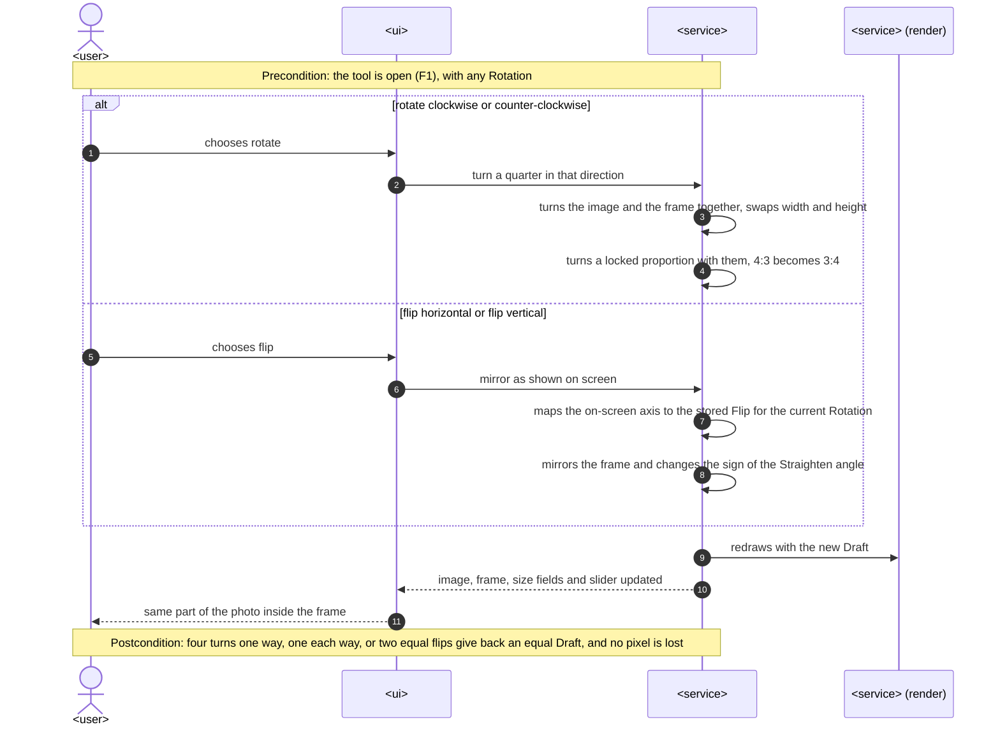

Rotate turns the image and the frame together by exactly 90°, so the same part of the photo stays inside. Width and height swap, and a locked proportion turns with them (AC-03). Flip mirrors the image as it is shown on screen, whatever the Rotation, and mirrors the frame with it. The Straighten angle changes sign so a level horizon stays level, and the slider shows the new value (AC-04). Four turns, one each way or two equal flips give back an equal Draft, and nothing is resampled.

### F4 — Straighten

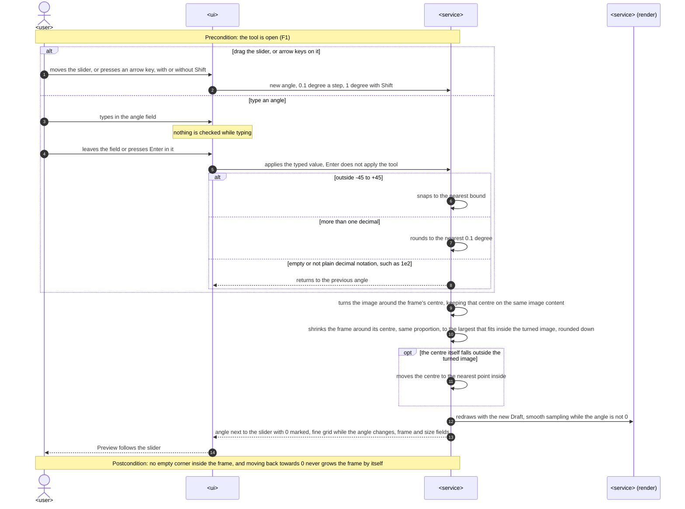

The slider, its arrow keys (0.1° a step, 1° with Shift) or a typed angle set the Straighten angle from −45° to +45° (AC-05, AC-20). A typed value is checked only when the field is left or Enter is pressed in it. Out of range snaps to the bound, extra decimals round, and empty or non-numeric text (including `1e2`) reverts. Enter there never applies the tool (AC-07). The image turns around the frame's centre and a fine grid shows. The frame then shrinks around its centre, keeping its proportion, to the largest size that fits, so no empty corner can enter. It moves only when the centre itself would fall outside, and it never grows back by itself (AC-06).

### F5 — Lock a proportion, or type an exact size

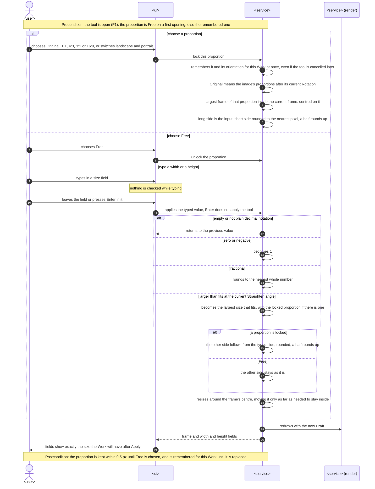

Choosing a proportion makes the frame the largest frame of that proportion inside the current one, centred on it. The long side is the input and the short side is rounded, with a half rounding up. "Original" follows the current Rotation. The choice and its orientation are remembered for the Work at once, even if the tool is then cancelled (AC-08). A typed width or height is checked when the field is left or Enter is pressed in it. Empty or non-numeric text reverts, zero or negative becomes 1, a fraction rounds, and too large becomes the largest size that fits at the current angle (AC-10). With a proportion locked, the other side follows the typed side; with Free it stays. The frame resizes around its centre, and the fields always show exactly the size the Work and a full-size Export will have (AC-09).

### F6 — Apply, Cancel, Reset and widening back

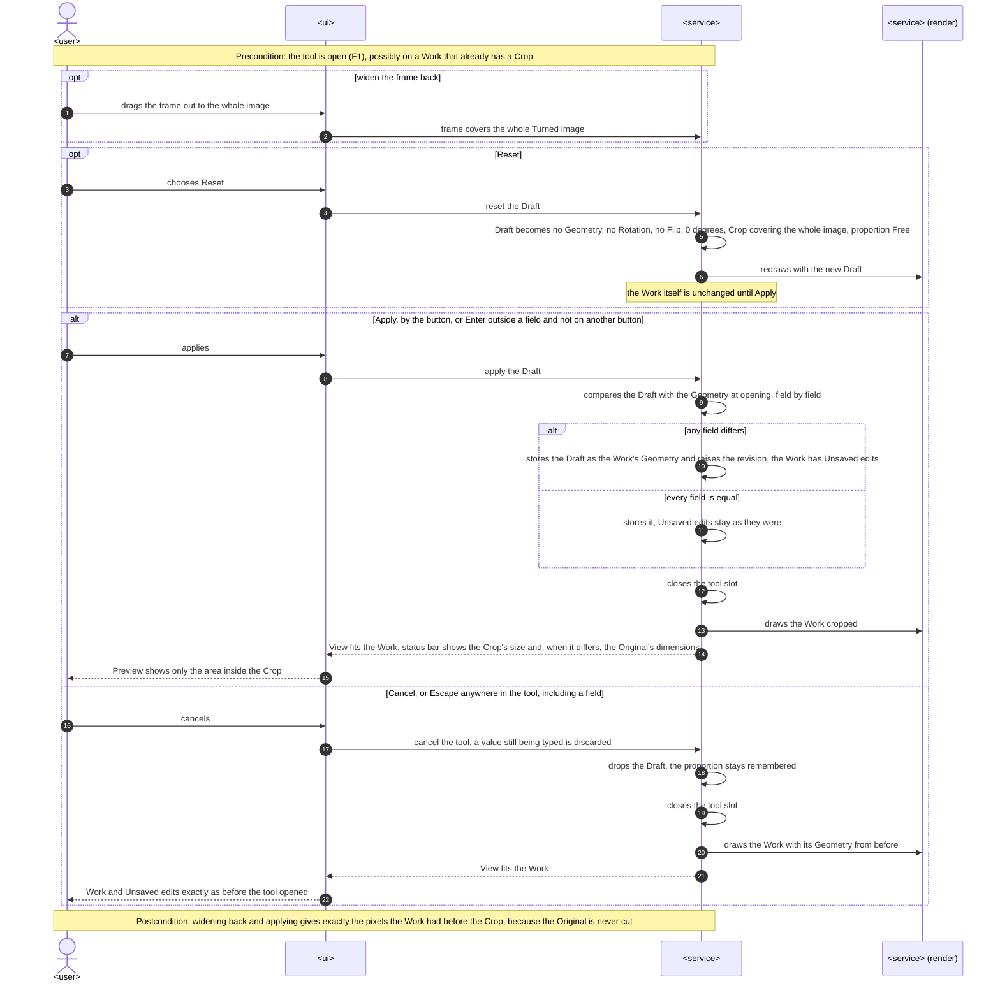

Widening the frame back to the whole image, or Reset, works on the Draft only. Reset clears every field and sets the proportion to Free, but takes effect only on Apply (AC-12). Apply compares the Draft with the Geometry from when the tool opened, field by field. The revision is raised, so the Work has Unsaved edits, only when something differs: four turns or an Apply with no change leave them as they were (AC-13). The tool then closes, the Preview shows only the Crop, and the View fits the Work (AC-19). The status bar shows the Crop's size, followed by the Original's dimensions whenever width or height differs in order (AC-01). Cancel or Escape, from anywhere including a field, drops the Draft and any half-typed value, and leaves the Work and its Unsaved edits exactly as they were (AC-11). Because the Original is never cut, widening back gives exactly the earlier pixels.

### F7 — Export around the tool

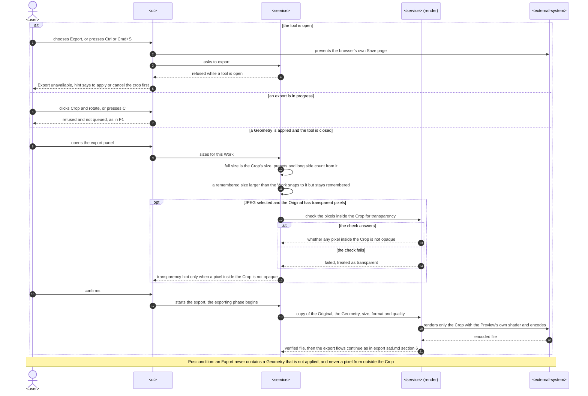

While the tool is open, Export and Ctrl/Cmd+S never start an export and never open the browser's "Save page". They show a hint to apply or cancel the crop first (AC-16). During an export the tool can't open (AC-15, as in F1). With a Geometry applied, the export panel counts its full size, presets and long side from the Crop. A remembered larger size snaps to the Work for display but is kept, and comes back if the Crop is widened again. The transparency hint is shown only when a pixel inside the Crop is not opaque, and a failed check shows it, which is the safe side. The export worker renders only the Crop with the Preview's own shader (AC-14), and export's own flows take over from the verified file.

### F8 — Open another image while the tool is open

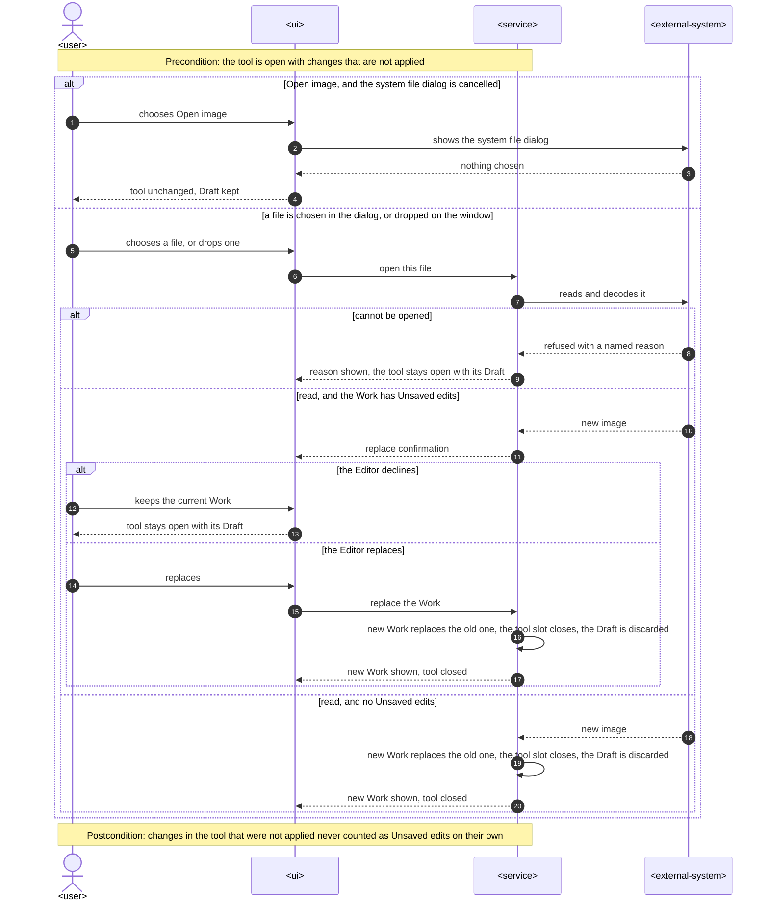

Opening another image or dropping a file doesn't close the tool straight away. A cancelled file dialog, or a file that can't be opened, leaves the tool exactly as it was. When the new image has been read and the Work has Unsaved edits, the replace confirmation appears: declining keeps the tool and its Draft, and replacing closes the tool and discards the Draft with the old Work. With no Unsaved edits the new Work replaces it directly, and the tool closes the same way (AC-17). The Draft alone never counts as Unsaved edits, so it never triggers the confirmation.

### Coverage — user stories and acceptance criteria

| Spec item | Shown by |
|---|---|
| US-01 Cut away what I don't want | F1, F2, F6 |
| US-02 Turn the image upright | F3, F6 |
| US-03 Mirror the image | F3, F6 |
| US-04 Level a tilted horizon | F4 |
| US-05 Crop to a set shape | F5 |
| US-06 Crop to an exact size | F5 |
| US-07 Change my mind without losing pixels | F6 |
| US-08 Export what I see after cropping | F7, F8; Critical flow 2 |
| US-09 Crop and rotate on the first try | F1 (and the keyboard branches of F2, F4, F6) |
| AC-01 | F2 (dimmed outside, thirds grid, move by dragging inside), F6 (Apply, status bar size "from" the Original) |
| AC-02 | F2 (stops at the edge, at least 1×1 px, whole pixels, odd pixel right or bottom) |
| AC-03 | F3 (rotate branch) |
| AC-04 | F3 (flip branch, sign of the Straighten angle) |
| AC-05 | F4 (slider, turn around the frame's centre, fine grid, angle shown) |
| AC-06 | F4 (shrink around the centre, centre moved only when outside, no growing back). The opacity half is not a runtime flow: it is the §10 QG-1b opacity check |
| AC-07 | F4 (typed angle: snap, round, revert; Enter does not apply) |
| AC-08 | F5 (choose a proportion, remembered at once), F1 (Free or remembered on opening), F6 (remembered after Cancel) |
| AC-09 | F5 (fields always show the size after Apply), F2 (fields follow while dragging) |
| AC-10 | F5 (typed size: revert, 1, round, largest that fits, other side) |
| AC-11 | F6 (Cancel or Escape branch) |
| AC-12 | F1 (whole Turned image, frame where the Crop is), F6 (widen back, Reset only on Apply) |
| AC-13 | F6 (field-by-field compare, revision raised only when different) |
| AC-14 | F7 (sizes from the Crop, transparency hint inside the Crop, only the Crop rendered); Critical flow 2. Fidelity to the Preview is the §10 QG-1 measurement, not a flow |
| AC-15 | F1 (export in progress branch), F7 (same refusal from the export side) |
| AC-16 | F7 (tool open branch) |
| AC-17 | F8 (all branches) |
| AC-18 | F1 (no image branch) |
| AC-19 | F1 (View fits the whole Turned image on opening), F6 (View fits the Work after Apply or Cancel). Zoom and pan inside the tool reuse the editor's View flows unchanged and never touch the Draft |
| AC-20 | F1 (C key and its guards, Tab), F2 (arrow keys on the frame, edges, corners), F4 (arrow keys on the slider), F6 (Enter applies outside a field, Escape cancels from anywhere). The "three actions" counts are a path length, F1 then F3 or F5 then F6, checked by e2e, not a separate flow |

**Flags for design:** none. Every participant is in §5 (the Editor SPA as `<ui>` and `<service>`, the Preview renderer and the export worker as `<service> (render)`, the browser and operating system as `<external-system>`). No flow is async, and nothing is persisted, so data-model has no indexes to derive.

## 7. Deployment view

Unchanged topology: the feature ships inside the existing static app on GitHub Pages under `/imgly/`, as part of the same Vite build, and runs entirely in one browser tab. There is no server, replica or scaling unit to add. The service worker precaches the larger app shell and the changed export worker script exactly as it does today, so the tool works offline after the first load. No new hosting configuration, header, permission or browser capability is needed: WebGL2 in the window and in workers is already a start-up requirement (open-and-view capability gate, export ADR-0003).

**Monitoring:**
- No runtime telemetry, by design: the app sends nothing anywhere (§2 Regulatory).
- Performance marks in the e2e build are the measurement points for spec §6: a "tool ready" mark when SCR-03 is first drawn, frame timing through the existing performance trace, and whole-page memory through `e2e/perf-memory.ts`. They are read by the `@perf` suite (`PERF=1`) on the reference machine, not in CI.
- CI runs the fidelity, opacity and AC-14 pixel checks on Chromium, Firefox and WebKit with every push (§10).

**Scaling thresholds:**
- The Downscale limit bounds everything: the Original's long side is at most 4096 px, so the Crop, the Export and the transparency check's full-size readback are at most 4096 × 4096 px (about 64 MB of RGBA).
- The Geometry adds no memory per change (ADR-0002); 50 applied changes stay within spec §6's ≤ 110% of memory after the first Apply.

## 8. Crosscutting concepts

| Concept | Convention | Where defined |
|---|---|---|
| Error handling | `Result<T, AppError>` in `core` and `render`; no new error codes. The field rules never fail: out-of-range values snap, fractional values round, and empty or non-numeric values revert (AC-07, AC-10). A failed transparency check stays inside export and shows the hint (ADR-0004). A failed Preview render is open-and-view's display-lost path, unchanged | repo `CLAUDE.md` §Conventions; here |
| Edit entry point | Every change to the Work goes through the `editor` store. The tool calls `applyGeometry(next)`, which stores it and raises the revision through `applyEdit()` only when the Geometry differs field by field (AC-13). The tool never writes the Work directly | open-and-view ADR-0005; ADR-0003 |
| Tool state | One tool at a time in `editor.activeTool`, separate from the editor's phase. The draft lives in the tool's own Pinia setup store and reaches the Preview only through `editor.previewGeometry` | ADR-0003 |
| Coordinate spaces | Three spaces: screen pixels, the Crop's frame (the image after Flip, Rotation and Straighten angle, in whole pixels) and the Original's texture coordinates. Only `core/geometry` converts between them: the shader's `u_geometry`, the overlay's positions and drag deltas all come from it | ADR-0001, ADR-0002, ADR-0005 |
| Units | The Straighten angle is stored in integer tenths of a degree and shown in degrees with one decimal. Crop position and size are whole pixels of the image; the overlay works in device pixels through the View | ADR-0001 |
| Keyboard shortcuts | Each feature owns its keys. crop-rotate owns C (silent while the export panel is open, while the tool is open or while a field has focus, read from `editor.activePanel` and the focus target) and, inside the tool, Enter, Escape and the arrow keys (AC-20). export owns Ctrl/Cmd+S and turns it into the "apply or cancel the crop first" hint while `editor.activeTool` is set (AC-16). Zoom shortcuts stay with the editor and keep working in the tool (AC-19) | here; export sad.md §8 |
| Field input | Checked only when the field is left or Enter is pressed in it, never while typing. Enter in a field never applies the tool, and Escape anywhere cancels the tool and discards a value still being typed (AC-07, AC-10, AC-20). Only plain decimal notation counts as a number | export AC-04; here |
| Accessibility | The frame, its edges and corners, the slider and every button are focusable DOM elements with roles and labels (the slider reports its value in degrees). Hints on unavailable controls are reachable by keyboard | ADR-0005; `docs/design-system.md` |
| Resource lifetime | The Geometry allocates nothing on the GPU. The transparency check's bitmap copy is closed in every branch, like an export's. The bitmap ledger in the leak tests covers both | open-and-view sad.md §8; ADR-0002, ADR-0004 |
| Privacy | No pixel from outside the Crop reaches an Export. The shader samples only through the Crop's transform, and the Crop invariant keeps it inside the turned image (AC-14). Nothing about the Geometry is logged or sent anywhere | spec §6.1; ADR-0002 |
| ID strategy | No new entities and no new IDs. The remembered proportion is keyed by the Work's existing `id` (`newId()`, UUIDv7) | repo `CLAUDE.md` §Conventions |
| Persistence | None: the Geometry and the remembered proportion live in session memory and end with the Work (spec §3). Step 8 adds the Geometry to `WorkRecord` with a new forward migration | repo ADR 0003 |
| Internationalisation | N/A: English microcopy in the feature's `messages.ts`, as in open-and-view and export | — |
| Test hooks | The e2e build's `window.__imglyTest` gains a way to set a Geometry directly, so the fidelity tests reach all 16 Rotation × Flip combinations and the four angles without driving the UI | repo `CLAUDE.md` §Commands; here |

## 9. Architecture decisions

| # | Title | Status | Section |
|---|---|---|---|
| [0001](adr/0001-model-the-geometry-as-integer-parameters-with-one-core-transform.md) | Model the Geometry as integer parameters on the Work, with every rule and one transform in core | Accepted | §4 |
| [0002](adr/0002-render-the-geometry-in-the-shared-shader-in-one-pass.md) | Render the Geometry in the shared shader in one pass, sampling the Original directly | Accepted | §4 |
| [0003](adr/0003-open-tools-in-an-active-tool-slot-with-the-draft-in-the-feature-store.md) | Open tools in an activeTool slot on the editor store, with the draft in the tool's own store | Accepted | §4 |
| [0004](adr/0004-check-crop-transparency-on-the-gpu-with-the-export-shader.md) | Check for transparency inside the Crop on the GPU with the export shader | Accepted | §4 |
| [0005](adr/0005-draw-the-crop-frame-as-a-dom-overlay-over-the-preview.md) | Draw the crop frame as a DOM overlay over the Preview canvas | Accepted | §5 |

ADR files live under `docs/features/crop-rotate/adr/`. Inherited and still binding: repo ADRs 0002, 0003 and 0004; open-and-view ADR-0003 (WebGL2 Preview) and ADR-0005 (revision counter); export ADR-0002 (export worker) and ADR-0003 (window fallback).

## 10. Quality requirements

Each top-3 goal from §1 expanded into full scenarios. Every number is quoted from spec §6 or §7. The reference machine, the 4096×3072 Work and "p95 over 20 runs after 2 warm-up runs" are as spec §6 defines them.

**QG-1. Fidelity, Preview to Export**

*QG-1a. Rotation, Flip and Crop are lossless*
- **When:** each of the 16 Rotation × Flip combinations (4 Rotations × no Flip, horizontal, vertical, both) is applied, with and without a Crop, and exported as a full-size PNG.
- **Then:** "each pixel of a full-size PNG Export is within 2 of 255 per channel of the Original pixel it comes from".
- **How verify:** e2e pixel comparison on Chromium, Firefox and WebKit. A test hook sets each Geometry directly (§8). The test decodes the Export and compares every pixel with the Original pixel that `core`'s inverse mapping names, which is computed independently in the test, not by the shader.

*QG-1b. A straightened Export matches the Preview*
- **When:** a Straighten angle of −45°, −0.1°, +1° and +45° is applied and exported as a full-size PNG.
- **Then:** "full-size PNG Export within 2 of 255 per channel of the Preview's own rendering of the Work at 100%, compared as in export §6"; and "100% of pixels fully opaque after any Straighten angle, for an Original with no transparent pixels".
- **How verify:** e2e pixel comparison on Chromium, Firefox and WebKit at those four angles, reading back the Preview at 100% through the existing test hook (export sad.md §10). An alpha check runs on the same Exports. The Crop's edge pixels are included, not masked out (spec §8 open question, §11).

*QG-1c. Nothing from outside the Crop*
- **When:** a Work whose Original has a distinctly coloured band outside the Crop is exported, with and without a Straighten angle.
- **Then:** the Export contains no pixel from outside the Crop (AC-14), and its size is exactly the Crop's width and height shown in the tool (AC-09).
- **How verify:** e2e on all three engines: assert the Export's dimensions, and that no pixel has the band's colour. Unit tests of `cropToOriginalUv` assert that every Crop pixel centre maps inside the Crop's source area.

*QG-1d. Export time with a Geometry*
- **When:** a 90° Rotation, a Flip and a 10° Straighten angle are applied to the 4096×3072 Work and exported.
- **Then:** "within export §6 targets: full-size JPEG at quality 90 p95 ≤ 1 s, full-size PNG p95 ≤ 2 s".
- **How verify:** export's `@perf` e2e test (`e2e/export/perf.spec.ts`), repeated with that Geometry on the reference machine.

**QG-2. Non-destructive and exact Geometry**
- **When:** for each reference image, a Crop is applied, then the tool is reopened, Reset and applied. Separately, Geometries are applied that are equal field by field to the one at open (four quarter turns, two equal Flips, an Apply with no change), or that look the same but differ (a horizontal and a vertical Flip on a 180° Rotation).
- **Then:** "for 100% of reference images, applying a Crop, then Reset and Apply, gives a full-size PNG Export within 2 of 255 per channel of the Export made before the Crop" (spec §7). Unsaved edits change only when the applied Geometry differs field by field (AC-13).
- **How verify:** the round trip as an e2e pixel comparison on Chromium, Firefox and WebKit. AC-13 and the invariants of AC-02, AC-03, AC-04 and AC-06 as `core/geometry` unit tests, including property tests over random Geometries: the Crop is always whole pixels inside the turned image, and turning four times or flipping twice gives back an equal Geometry. AC-13 at store level with a real `editor` store.

**QG-3. A responsive, leak-free tool**
- **When:** on the reference machine with the 4096×3072 Work, the Editor drags the crop frame and the straighten slider, chooses rotate, flip, Apply, Cancel and Reset, opens the tool, and applies 50 Geometry changes (Rotations, Flips, Crops, Straighten angles).
- **Then:** Preview update while dragging "p95 frame interval ≤ 33 ms (at least 30 updates per second)". Rotate, flip, Apply, Cancel or Reset to the updated Preview "p95 ≤ 150 ms". Choosing "Crop and rotate" to the tool being ready "p95 ≤ 150 ms". Memory after 50 applied changes "≤ 110% of memory after the first Apply".
- **How verify:** a new `e2e/crop-rotate/perf.spec.ts` tagged `@perf` (run with `PERF=1` on the reference machine). It uses a frame-timing trace while dragging, performance marks from the action to the redrawn Preview and to the tool-ready mark (§7), and whole-page memory as export §6 measures it (`e2e/perf-memory.ts`), Chromium only.

## 11. Risks and technical debt

| Risk / debt | Severity | Mitigation | Owner |
|---|---|---|---|
| The ±2/255 tolerance between a straightened Export and the Preview at 100% may not hold on every engine, especially at the Crop's edge pixels (spec §8). Bilinear sampling at the same coordinates can still differ by GPU and driver. Linux WebKit already needs 3/255 for any Export of a semi-transparent Original, with or without a Geometry, because it renders in the window (export ADR-0003, commit `840d4b0`, `e2e/export/fidelity.spec.ts`); the same deviation therefore also threatens QG-1a and QG-2 on CI when their fixtures are semi-transparent | High | Same shader, same matrix function and same filter rule in Preview and Export (ADR-0002). The QG-1b e2e runs at the four angles on all three engines from the first task, edge pixels included. `plan-tests` decides whether QG-1a, QG-1b and QG-2 reuse export's per-engine limit for semi-transparent fixtures on Linux WebKit or keep those fixtures opaque; the spec's 2/255 stays the target everywhere else. A miss is a recorded engine deviation, never a silent loosening of the spec | Blazheiko — resolve before `/sdd:plan-tests` (spec §8) |
| Exact pixel mapping for Rotation and Flip relies on sampling at texel centres in float32. A mapping that lands on a texel edge can pick the neighbour on one engine and fail QG-1a | Medium | `cropToOriginalUv` maps output pixel centres (p + 0.5) to texel centres. Unit tests assert it for all 16 combinations, and the 16-combination e2e catches any engine difference | Blazheiko |
| Brownfield: code reads `original.width`/`height` as the Work's size: the status bar, the export store, fit-View and the e2e helpers. A missed call site shows the wrong size only once a Crop is applied | Medium | One task moves every reader to `workSize(work)`, guarded by a search in review. The AC-01 and AC-14 tests run with a non-identity Geometry | Blazheiko |
| AC-06's maths (largest frame of the same proportion inside the turned image, re-anchoring around the frame's centre, whole-pixel rounding) has edge cases: ±45°, a centre that falls outside, a 1×1 Crop, very thin frames | Medium | Pure functions in `core/geometry` with property tests: the result is always inside, whole pixels, at least 1×1, with the proportion kept within 0.5 px (AC-08) | Blazheiko |
| Scope sits at the upper bound of M (spec §1) | Medium | The Straighten angle (US-04) is the first thing cut if the budget slips. Without it, ADR-0002's bilinear rule, ADR-0004's edge cases and QG-1b fall away, and nothing else changes | Blazheiko |
| Roadmap decision D3 is still open: whether the drawing layer (step 6) stays anchored to the Original and follows the Geometry (spec §8). The default is yes, and ADR-0002 assumes it: the layer is sampled through the same `u_geometry` | Medium | If step 6 decides otherwise, only the layer's sampling changes. The Geometry model and the shader path stay. Revisit ADR-0002's Consequences then | Blazheiko — before `/sdd:specify` of roadmap step 6 (spec §8) |
| The crop overlay (DOM) and the Preview (WebGL) can disagree by half a pixel at high zoom (ADR-0005) | Low | Both use the same View and `core` maths. An e2e screenshot check of the frame on the image edge at 100% and 800% | Blazheiko |
| For a transparent Original with a Geometry, the JPEG transparency hint appears a moment late, after a GPU check (ADR-0004) | Low | The hint is hidden while the check runs and shown if it fails. Opaque Originals never run it | Blazheiko |
| The export save-point question for undo (spec §8) now only concerns undo, which this feature does not add | Low | Its due moves to roadmap step 7, as the spec's default says | Blazheiko — before `/sdd:specify` of roadmap step 7 |
| `docs/architecture-map.md` reflects `7d26cf9`, 146 commits behind; this SAD read the code directly | Low | Run `/sdd:survey` to refresh the map before the next feature's design | Blazheiko |

**Accepted debt (acceptable in v1, plan to fix later):**
- No undo or redo of Geometry changes. Cancel, Reset and widening the Crop are the ways back until roadmap step 7 (spec §3).
- The Geometry is not persisted and ends with the Work. Step 8 adds it to `WorkRecord` with a new forward migration (repo ADR 0003).
- Above 100% zoom, a straightened image looks slightly soft instead of showing pixel blocks (ADR-0002).

## 12. Glossary

Terms from `CONTEXT.md` (canonical, repo root) used in this SAD:

| Term | Meaning |
|---|---|
| Crop | The rectangle of the image, as it stands after its Flip, Rotation and Straighten angle, that the Work keeps; always fully inside that image and at least 1×1 px; not a destructive cut |
| Downscale limit | The maximum long side of an opened image, 4096 px; it bounds every Crop and Export |
| Editor | The person editing an image in the app |
| Export | An image file saved from the Work, rendered with all its edits, independent of the View |
| Flip | Mirroring the image horizontally, vertically or both, kept as chosen |
| Geometry | The Work's Flip, Rotation, Straighten angle and Crop, applied in that order |
| Original | The opened image after orientation and the Downscale limit; the Geometry never changes it |
| Portfolio reviewer | A recruiter or engineer judging the app on a first visit |
| Preview | What the canvas shows: the Work with all its edits at the current View |
| Rotation | The Work's turn in quarter turns, 0°, 90°, 180° or 270° clockwise; lossless |
| Straighten angle | A small free turn between −45° and +45°, applied after the Rotation |
| Unsaved edits | Changes to the Work since it was opened or last exported successfully |
| View | Zoom and pan of the Preview; never part of the Work |
| Work | One image being edited: its Original, Source name and Source format plus its Geometry and later edits |

Terms this SAD uses that are not in `CONTEXT.md` (flagged for `/sdd:glossary crop-rotate`):

| Term | Meaning |
|---|---|
| Draft | The Geometry being edited in the open tool; it reaches the Work only on Apply and never counts as Unsaved edits on its own (AC-11, AC-17) |
| Turned image | The image as it stands after its Flip, Rotation and Straighten angle; the frame the Crop's coordinates are in (ADR-0001) |
| Proportion | The crop frame's locked width-to-height ratio (Free, Original, 1:1, 4:3, 3:2, 16:9, landscape or portrait), remembered per Work (AC-08) |
| Tool slot | The `editor` store's `activeTool`: which tool, if any, is open; one at a time (ADR-0003) |
