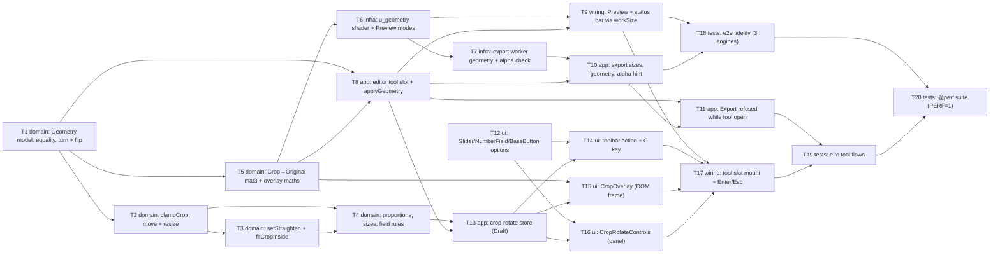

# Epic — crop-rotate

> **Spec:** [spec.md](../spec.md) · **Design:** [sad.md](../sad.md) · **Screens:** [screens.md](../screens.md) · **UX flows:** [ux-flows.md](../ux-flows.md) · **ADRs:** [adr/](../adr/)
> No `data-model.md` (no schema change — the Geometry lives in session memory, `sad.md` §2, §8 Persistence) and no `contracts/` (no external interface, `target_surfaces: [web-frontend]`).

## Goal

Ship roadmap step 4, the first editing tool: one "Crop and rotate" tool turns, mirrors, levels and crops any open Work, and the Preview shows the result straight away (spec §2 goal 1). The Geometry is integer parameters on the Work, never a cut of the Original, so any Crop can be widened back or Reset (goal 2), and every Export contains exactly the applied Geometry in every target browser (goal 3). Size M (upper bound), route standard.

## Scope

- **In:** the pure `src/core/geometry/` module and `Work.geometry` (ADR-0001); `u_geometry` in the shared shader, the Preview's `'crop'`/`'whole'` modes and the export worker's Geometry + alpha check (ADR-0002, ADR-0004); the `editor` store's tool slot, `applyGeometry` and `activePanel` (ADR-0003); every reader of the Work's size moved to `workSize`; export's sizes, transparency hint and refusal while a tool is open; the new `src/features/crop-rotate/` feature (store, action, C key, overlay, controls, tool mount); options on `SliderField`, `NumberField`, `BaseButton`; functional and `@perf` e2e.
- **Out** (spec §3): undo/redo of Geometry changes; persisting the Geometry; perspective, skew, free transform or angles beyond ±45°; automatic straightening and generated fill; non-rectangular crops; scaling the Work; touch gestures; turning the View.

## Task map

**Waves** (topological levels of `deps`; tasks in one wave can run in parallel unless they share a lane):

| Wave | Tasks |
|---|---|
| 1 | T1, T12 |
| 2 | T2, T5 |
| 3 | T3, T6, T8 |
| 4 | T4, T7, T9 |
| 5 | T10, T13 |
| 6 | T11, T14, T15, T16, T18 |
| 7 | T17 |
| 8 | T19 |
| 9 | T20 |

**Lanes** (overlapping `files_hint`, serialized by `implement`): T1 ↔ T2 (`src/core/geometry/index.ts`); T1 ↔ T3 (`src/core/geometry/index.ts`); T1 ↔ T4 (`src/core/geometry/index.ts`); T1 ↔ T5 (`src/core/geometry/index.ts`); T2 ↔ T3 (`src/core/geometry/index.ts`); T2 ↔ T4 (`src/core/geometry/index.ts`); T2 ↔ T5 (`src/core/geometry/index.ts`); T3 ↔ T4 (`src/core/geometry/index.ts`); T3 ↔ T5 (`src/core/geometry/index.ts`); T4 ↔ T5 (`src/core/geometry/index.ts`); T10 ↔ T11 (`src/features/export/store.test.ts`, `src/features/export/store.ts`); T13 ↔ T14 (`src/features/crop-rotate/index.ts`); T13 ↔ T17 (`src/features/crop-rotate/index.ts`); T14 ↔ T17 (`src/app/App.vue`, `src/features/crop-rotate/index.ts`, `src/features/crop-rotate/shortcuts.test.ts`, `src/features/crop-rotate/shortcuts.ts`); T18 ↔ T19 (`e2e/crop-rotate/helpers.ts`); T18 ↔ T20 (`e2e/crop-rotate/helpers.ts`); T19 ↔ T20 (`e2e/crop-rotate/helpers.ts`). No compile-coupled pair: the `Work` shape change is folded into T1 with its only constructor, `createWork`.

**Parallel branches:** T12 (shared primitives) has no dependency and runs beside the core chain from day one; T5 (transforms) runs beside T2–T4 once T1 lands (it shares only `src/core/geometry/index.ts` with them, so `implement` serializes the commits, not the thinking); after T8, the export branch (T10 → T11) and the crop-rotate branch (T13 → T14/T15/T16) are independent; T18 (fidelity e2e) needs no tool UI and runs beside the UI tasks.

**Suggested PR grouping** (inside size M's 5–15 PRs): PR 1 — T1, T2, T3, T4, T5 (pure geometry); PR 2 — T6, T7 (render); PR 3 — T8, T9 (editor slot, Preview, status bar); PR 4 — T10, T11 (export follows the Geometry); PR 5 — T12, T13 (primitives, tool store); PR 6 — T14, T15, T16, T17 (tool UI); PR 7 — T18, T19, T20 (e2e). If the budget slips, US-04 (Straighten) is cut first (spec §1): T3 drops to a no-op angle, and the angle rows of T6, T7, T12, T16, T18 and T20 fall away.

## Tasks

See [tracker.md](./tracker.md) for status. Machine contract: [tasks.json](../tasks.json).

| # | Task | Layer | Blocked by | DoD (short) |
|---|---|---|---|---|
| T1 | Add the Geometry to the Work: type, identity, geometryEquals, workSize, rotateQuarter and flipOnScreen | domain | — | AC-03/04 round trips + AC-13 field equality unit-tested; Work carries identity Geometry |
| T2 | Keep the Crop inside the turned image: clampCrop, whole-pixel rounding, move and resize by edge or corner | domain | T1 | AC-02 invariant property-tested for move, edge and corner drags |
| T3 | Add the Straighten angle rules: setStraighten around the frame's centre and fitCropInside with no empty corner | domain | T2 | AC-05 angle range/step and AC-06 shrink-around-centre property-tested |
| T4 | Add proportions, typed crop sizes and the field input rules (parseAngle, parseCropSize, plain decimal only) | domain | T2, T3 | AC-07/08/09/10 rules unit-tested, incl. 1e2 and half-up rounding |
| T5 | Derive the one transform: cropToOriginalUv, turnedImageToOriginalUv, turnedBounds and the overlay's screen maths | domain | T1 | every Crop pixel centre maps inside its source for all 16 Rotation×Flip combos |
| T6 | Render the Geometry in the shared shader (u_geometry) and give the Preview renderer setGeometry(g, 'crop' | 'whole') | infra | T5 | renderer sets u_geometry per mode, LINEAR when straightened; identity unchanged |
| T7 | Export with the Geometry in the worker and add the GPU alpha check (checkCropTransparency) | infra | T6 | worker renders only the Crop at export size; alpha message answers Result<boolean> |
| T8 | Add the editor store's tool slot: activeTool, openTool/closeTool, previewGeometry, applyGeometry, activePanel and tool-aware fit-View | app | T1, T5 | store tests: refusals, field-equal Apply, replace closes tool, fit-View per mode |
| T9 | Make the Preview and the status bar follow the Geometry, and add the setGeometry test hook | wiring | T6, T8 | status bar shows 'w × h px, from W × H px'; Preview draws per mode; hook sets a Geometry |
| T10 | Size the export from workSize, send the Geometry, and base the transparency hint on the GPU check | app | T7, T8 | panel sizes from the Crop, remembered size snaps and returns, hint per GPU check |
| T11 | Refuse Export and Ctrl/Cmd+S while a tool is open with the 'apply or cancel the crop first' hint, and report the open panel | app | T8, T10 | Export + Ctrl/Cmd+S show the hint and preventDefault while activeTool is set |
| T12 | Extend SliderField (step, decimals, marks), NumberField (signed decimal input) and BaseButton (pressed), and register them | ui | — | primitive tests for 0.1 steps, 0 mark, signed decimal text, aria-pressed; inventory rows updated |
| T13 | Add the crop-rotate store: Draft, Geometry at open, remembered proportion per Work, field state, apply / cancel / reset | app | T4, T8 | store tests with a real editor store: open, edits, apply, cancel, reset, proportion memory, replace |
| T14 | Add the 'Crop and rotate' toolbar action, its hints, the C shortcut and the tool's message catalog | ui | T12, T13 | action states SCR-01/02 + C guards component-tested; mounted before Export |
| T15 | Build CropOverlay: dimmed outside, frame with 8 focusable handles, both grids, pointer drags and arrow keys | ui | T5, T13 | happy-dom tests: drag/move/resize + arrow keys call the store; grids only while active |
| T16 | Build CropRotateControls: rotate and flip buttons, straighten slider and field, proportion, width and height, Reset / Cancel / Apply | ui | T12, T13 | component tests: each control calls the store; fields commit on blur/Enter only |
| T17 | Mount CropRotateTool in a new EditorView tool slot, with Enter to apply, Escape to cancel, focus handling and fit-View | wiring | T9, T14, T15, T16 | tool takes over the canvas area; Enter applies outside fields, Esc cancels anywhere; focus moves |
| T18 | Add the e2e Geometry fidelity suite: 16 Rotation × Flip, straightened vs Preview, opacity, nothing outside the Crop, lossless round trip | tests | T9, T10 | QG-1a/1b/1c + QG-2 round trip pass on Chromium, Firefox, WebKit |
| T19 | Add the e2e tool-flow suite: three-action paths, export refusals, replace while open, View fit and frame alignment | tests | T11, T17 | UI paths pass on 3 engines; frame aligned at 100% and 800% |
| T20 | Add the @perf suite: drag and slider frame interval, action-to-Preview and tool-ready times, memory after 50 Applies, export time with a Geometry | tests | T18, T19 | @perf specs report every spec §6 timing/memory row; run with PERF=1 |

## Risks / Hard rules

- **Module boundaries** (`CLAUDE.md`, repo ADR 0002): `core` stays pure (no Vue, Pinia or DOM); crop-rotate imports only `@/features/editor` across features; export never imports crop-rotate — they meet in `editor.activeTool` and `editor.activePanel`.
- **One transform** (ADR-0001): only `core/geometry` composes Flip, Rotation and Straighten; the shader, the export worker and the overlay all use its matrices. Nothing outside `core/geometry` reads `original.width/height` as the Work's size (`sad.md` §11 risk 3 — grep in review).
- **No allocation per change** (ADR-0002): the only image on the GPU is the Original's texture; the memory NFR (≤110% after 50 Applies) depends on it.
- **Draft never touches the Work** (ADR-0003): only `editor.applyGeometry` writes it, and the revision rises only when `geometryEquals` is false (AC-13).
- **Privacy** (spec §6.1, AC-14): no pixel from outside the Crop in any Export; verified by T5 (unit) and T18 (e2e).
- **Tolerance** (`sad.md` §11 risk 1, spec §8 OQ 2): 2/255 stays the target; any engine deviation is recorded by `plan-tests`, never a silent loosening.
- **Field input** (export AC-04): checked only on leave/Enter; plain decimal only (`1e2` is not a number); Enter in a field never applies the tool; Escape always cancels.
