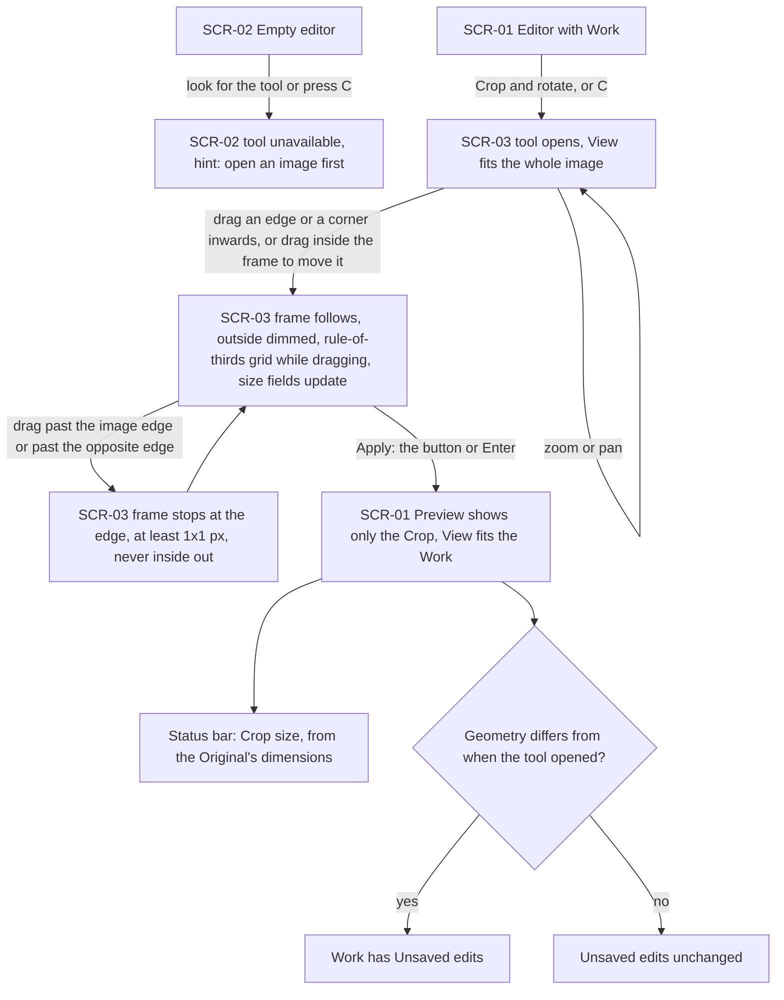
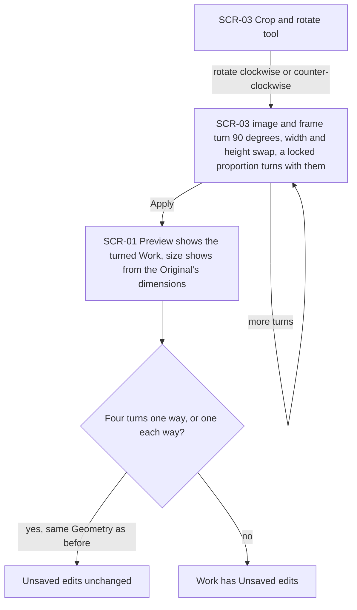
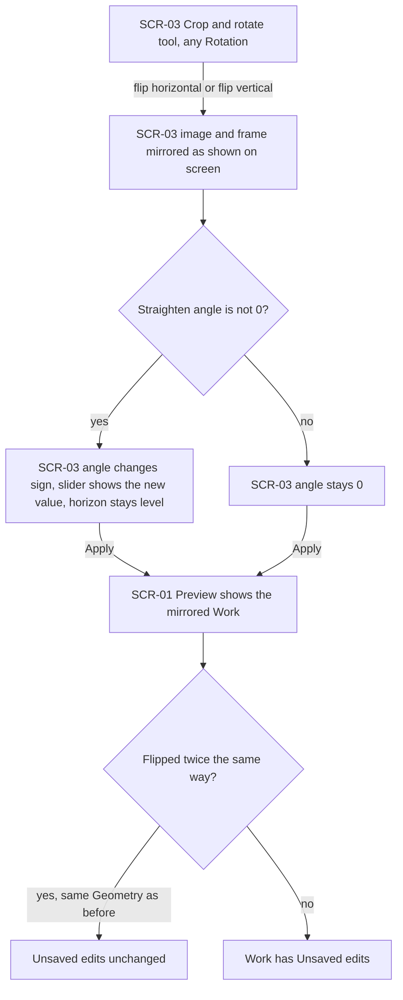
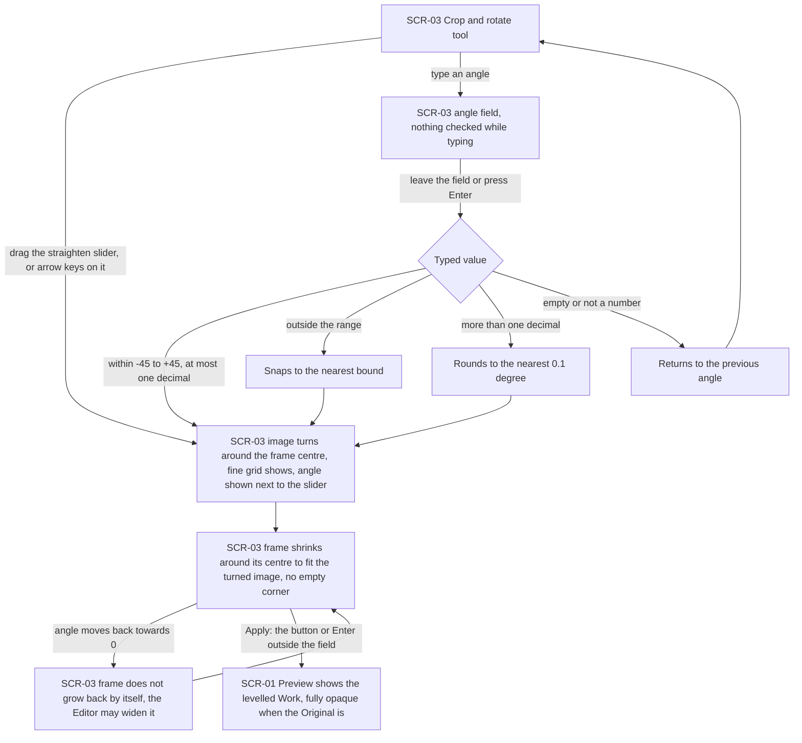
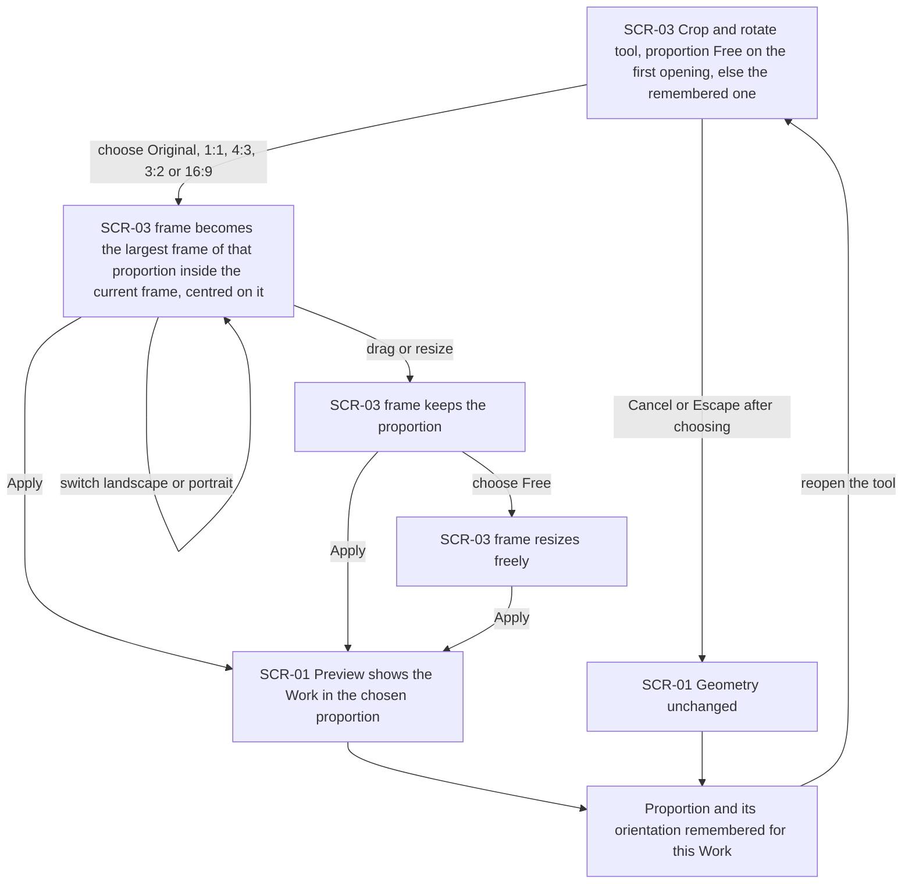
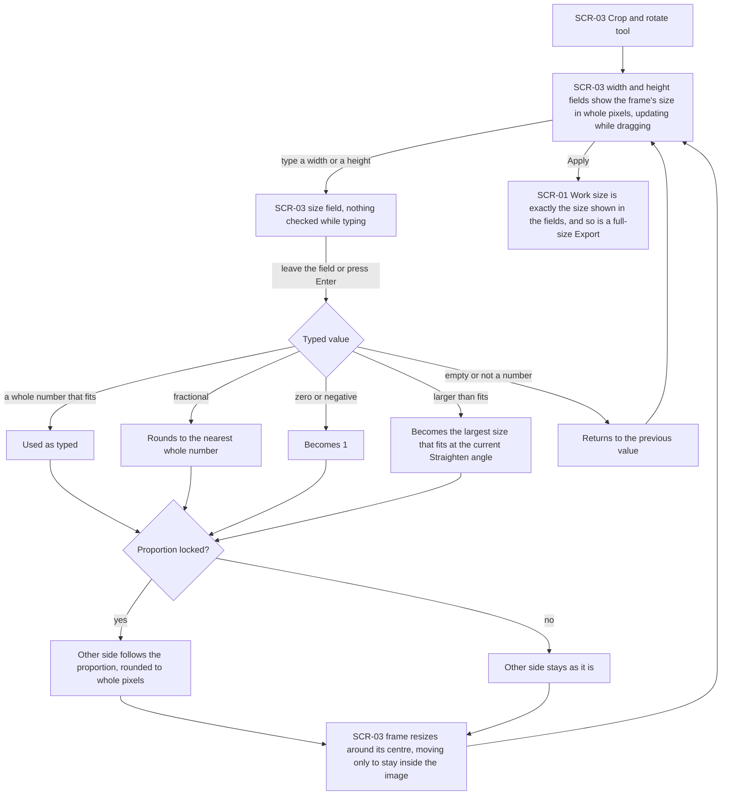
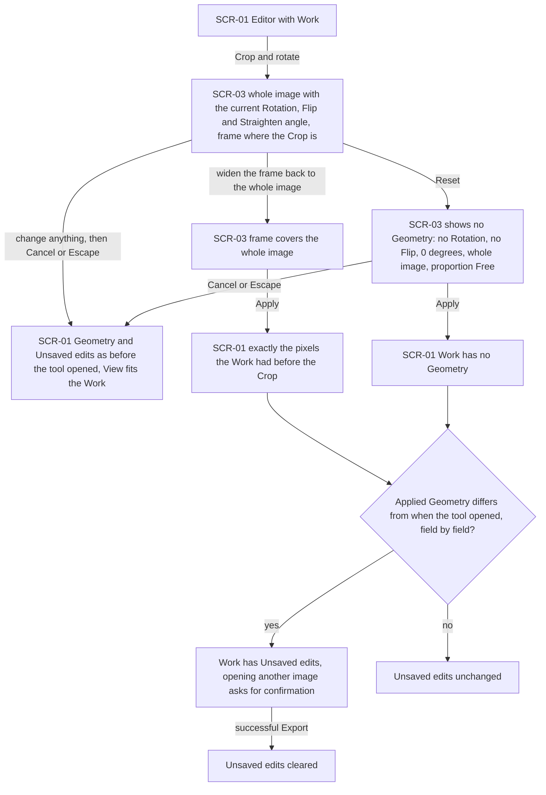
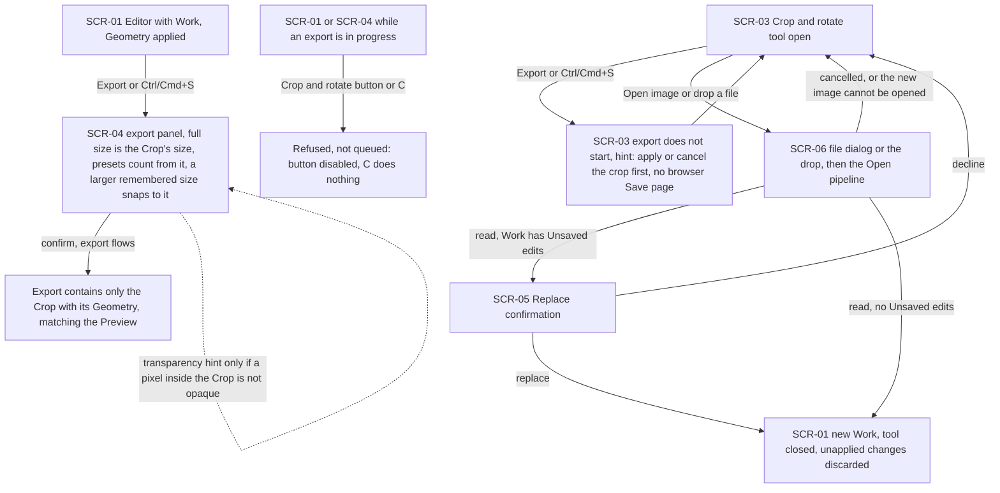
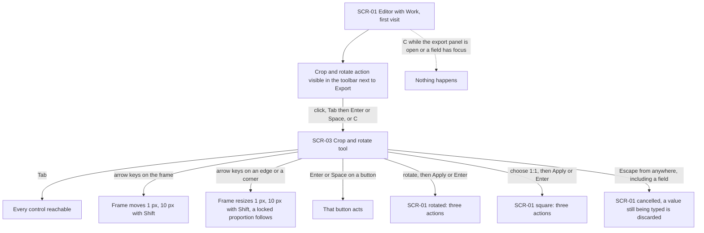

# UX flows — crop-rotate

> User flows for every UI-touching §4 user story, produced by `ux-flows` (after `clarify`, before
> `design`) and read by `design` (evidence for the target-surface + UI-architecture decisions),
> `sequences` (UI-driven flows align on SCR ids), `screens` (details every inventory row) and
> `plan-tests` (the e2e-through-UI paths). **Always markdown + mermaid `flowchart`**, whatever the
> design tool — this artifact is flow-altitude, not visual design.

## Platform decisions

- **Posture:** desktop-first, as in `docs/design-system.md` §Platform posture. The mouse (dragging the frame, its edges and corners, the straighten slider) and the keyboard (Tab, Enter, Space, Escape, the arrow keys and the C key, AC-20) are the primary paths. Below 1024 px the same screens apply. Touch works only as far as the browser turns a one-finger drag into a pointer drag, and there are no touch gestures (spec §3).
- **Navigation shape:** one editor view with no page navigation, as in open-and-view and export. The "Crop and rotate" tool (SCR-03) is a mode of the editor. It takes over the canvas and the editing controls in place and never opens a new page, and Apply, Cancel or Escape return to the editor with the Work (SCR-01).
- **Modality:** while the tool is open, the Editor can still zoom and pan (AC-19) and open another image (AC-17). Export and Ctrl/Cmd+S only show a hint to apply or cancel first (AC-16). The tool's changes are held apart from the Work until Apply: Cancel, Escape and replacing the Work discard them, and they never count as Unsaved edits on their own (AC-11, AC-17).
- **One way out per outcome:** Apply (the button, or Enter outside a field) keeps the changes. Cancel (the button or Escape from anywhere in the tool) discards them. Reset only changes what the tool shows and takes effect on Apply (AC-12). After Apply or Cancel the View fits the Work (AC-19).
- **Field checking:** the angle field and the size fields are checked when the Editor leaves the field or presses Enter in it, never while typing, and Enter in a field never applies the tool (AC-07, AC-10).
- **Outcomes are shown in place:** the result of the tool is the Preview and the size in the status bar (AC-01, AC-14). Refusals are hints on the unavailable control (AC-15, AC-16, AC-18), not notices.
- **Design input (Tech Lead flag, not decided here):** (1) the tool edits a draft Geometry that is held apart from the Work until Apply (AC-11, AC-13, AC-17). `design` decides where that draft lives (the `editor` store or the feature's own store). (2) The Preview must follow the frame and the straighten slider at 30 or more updates per second on a 4096×3072 Work (spec §6), which constrains how the Preview renders the Geometry. (3) A Flip changes the sign of the Straighten angle (AC-04), so the Geometry model needs a single place that turns an on-screen action into a change to the stored fields.

## Screen inventory

| ID | Screen | Purpose | Entry | Exit |
|---|---|---|---|---|
| SCR-01 | Editor with Work | open-and-view's editor with a Work open. The Preview shows the Work with its applied Geometry, the status bar shows the Work's size with the Original's dimensions when they differ, and a "Crop and rotate" action sits next to Export | A successful open; Apply or Cancel on SCR-03; a successful Export | SCR-03 (Crop and rotate, C), SCR-04 (Export, Ctrl/Cmd+S), SCR-06 (Open image) |
| SCR-02 | Empty editor | open-and-view's empty editor. "Crop and rotate" is shown as unavailable, with a hint to open an image first | App load; no Work open | SCR-01 once an image is opened (open-and-view flows) |
| SCR-03 | Crop and rotate tool | The whole image with its current Rotation, Flip and Straighten angle, the crop frame over it with the outside dimmed, rotate and flip actions, the straighten slider and angle field, the proportion choice, the width and height fields, and Reset, Cancel and Apply | Crop and rotate (button, Enter or Space on it, or C) on SCR-01 | SCR-01 (Apply, Cancel, Escape, or a confirmed replacement of the Work), SCR-06 (Open image), SCR-05 (a new image read while the Work has Unsaved edits) |
| SCR-04 | Export panel | export's panel. Its full size and size presets count from the Work's size after its Geometry | Export or Ctrl/Cmd+S on SCR-01 | SCR-01 (export flows) |
| SCR-05 | Replace confirmation | open-and-view's warning before a new image replaces a Work with Unsaved edits | A new image read successfully while the Work has Unsaved edits, from SCR-01 or SCR-03 | SCR-01 with the new Work (replace), or the screen it came from unchanged (cancel) |
| SCR-06 | System file dialog | The operating system's own file picker (not designed by us) | "Open image" on SCR-01 or SCR-03 | Open pipeline (file chosen), or the screen it came from unchanged (cancelled) |

## Flows

### Flow: US-01 — Cut away what I don't want

From the editor with a Work open, the Editor chooses "Crop and rotate" or presses C, and the tool opens with the View fitted to the whole image so every edge of the frame can be reached (AC-19). Zooming and panning keep working and never count as an edit. The Editor drags an edge or a corner inwards, or drags inside the frame to move it. The area outside is dimmed, a rule-of-thirds grid shows while dragging, and the size fields update (AC-01, AC-09). Dragging past the edge of the image or past the opposite edge stops the frame at the edge: it never leaves the image, never goes below 1×1 px and never turns inside out (AC-02). Apply, by the button or Enter, closes the tool. The Preview shows only the Crop, the View fits the Work, and the status bar shows the Crop's size with the Original's dimensions (AC-01, AC-19). The Work gets Unsaved edits only when the Geometry differs from when the tool opened (AC-13). With no image open, the tool is unavailable and both the control and the C key show a hint to open an image first (AC-18).

### Flow: US-02 — Turn the image upright

In the tool the Editor chooses rotate clockwise or counter-clockwise. The image and the crop frame turn by exactly 90°, the same part of the photo stays inside the frame, width and height swap, and a locked proportion turns with them, so 4:3 becomes 3:4 (AC-03). Further turns repeat this. On Apply the Preview shows the turned Work, and the status bar shows its size followed by the Original's dimensions, because a 90° turn alone changes the order of width and height (AC-01). Four turns in one direction, or one each way, give back the same Geometry, so Apply leaves the Unsaved edits as they were. Any other result gives the Work Unsaved edits (AC-13).

### Flow: US-03 — Mirror the image

In the tool, with any Rotation, the Editor chooses flip horizontal or flip vertical. The image is mirrored as it is shown on screen, so flip horizontal always swaps left and right as the Editor sees them, and the crop frame is mirrored with it (AC-04). If the image has a Straighten angle, the angle changes sign and the slider shows the new value, so a level horizon stays level. Apply shows the mirrored Work in the Preview. Flipping twice the same way gives back the same Geometry and leaves the Unsaved edits unchanged. Any other result gives the Work Unsaved edits (AC-13).

### Flow: US-04 — Level a tilted horizon

In the tool the Editor drags the straighten slider or uses the arrow keys on it (0.1° a step, 1° with Shift, AC-20). The image turns around the centre of the crop frame, a fine grid shows while the angle changes, and the angle is shown next to the slider with 0° marked (AC-05). The Editor can also type an angle. Nothing is checked while typing. When the Editor leaves the field or presses Enter in it, a value in range is used, a value outside −45° to +45° snaps to the nearest bound, extra decimals round to 0.1°, and an empty or non-numeric value returns to the previous angle. Enter in the field never applies the tool (AC-07). Whenever the angle changes, the frame shrinks around its own centre, keeping its proportions, to the largest size that fits inside the turned image, so no empty corner can enter the Work (AC-06). Moving the angle back towards 0° does not grow the frame back, but the Editor can widen it again. Apply shows the levelled Work, and it stays fully opaque when the Original has no transparent pixels.

### Flow: US-05 — Crop to a set shape

When the tool opens for a Work for the first time the proportion is Free, and afterwards it is the remembered one. The Editor chooses Original, 1:1, 4:3, 3:2 or 16:9, optionally switching between landscape and portrait. The frame becomes the largest frame of that proportion that fits inside the current frame, centred on it, and keeps the proportion while it is dragged or resized until the Editor chooses Free. Original always means the image's proportions after its current Rotation (AC-08). Apply shows the Work in that proportion, so cropping to a square takes three actions: open the tool, choose 1:1, Apply (AC-20). The chosen proportion and its orientation are remembered for this Work as soon as they are chosen, even if the tool is then cancelled, until the Work is replaced.

### Flow: US-06 — Crop to an exact size

The width and height fields always show the frame's current size in whole pixels and update while the frame is dragged (AC-09). The Editor types a width or a height. Nothing is checked while typing. When they leave the field or press Enter in it, a whole number that fits is used as typed, a fractional value rounds, zero or a negative value becomes 1, a value larger than fits becomes the largest size that fits at the current Straighten angle, and an empty or non-numeric value returns to the previous value. Enter in the field never applies the tool (AC-10). With a proportion locked, the other side follows it, rounded to whole pixels. Without one, the other side stays as it is. The frame resizes around its centre and moves only as far as it must to stay inside the image. On Apply, the Work's size is exactly the size the fields showed, and so is a full-size Export.

### Flow: US-07 — Change my mind without losing pixels

The Editor opens the tool on a Work that already has a Crop. The tool shows the whole image with its current Rotation, Flip and Straighten angle, and the frame sits where the Crop is (AC-12). Cancel or Escape, after any changes, closes the tool, and the Work keeps the Geometry and the Unsaved edits it had before (AC-11). The View fits the Work (AC-19). Widening the frame back to the whole image and applying gives exactly the pixels the Work had before the Crop. Reset shows no Geometry (no Rotation, no Flip, 0° and the whole image) and sets the proportion to Free. It takes effect only on Apply, so Cancel after Reset still keeps the old Geometry (AC-12). After Apply, the Work gets Unsaved edits only when the applied Geometry differs, field by field, from when the tool opened. Then opening another image asks for confirmation, and a successful Export clears the Unsaved edits again (AC-13).

### Flow: US-08 — Export what I see after cropping

With a Geometry applied, the Editor opens the export panel. The Work's full size there is the Crop's size, the presets and the long-side field count from it, and a remembered size larger than the Work snaps to it without replacing the remembered value (AC-14). The Export contains only the Crop with its Geometry, matching the Preview, and the transparency hint appears only when a pixel inside the Crop is not opaque. While the tool is open, Export and Ctrl/Cmd+S don't start an export and never open the browser's "Save page". They show a hint to apply or cancel the crop first (AC-16). While an export is in progress, the tool can't be opened: its button is disabled and C does nothing, and the request is refused, not queued (AC-15). If the Editor opens another image or drops a file while the tool is open, the tool stays open with its changes until the new image has been read. A cancelled dialog or an image that can't be opened leaves the tool as it was. If the Work has Unsaved edits, the replace confirmation appears: declining keeps the tool open with its changes, and replacing closes it and discards the unapplied changes with the old Work. With no Unsaved edits the new Work replaces it directly (AC-17). Unapplied changes never count as Unsaved edits on their own.

### Flow: US-09 — Crop and rotate on the first try

A Portfolio reviewer who has just opened an image sees a "Crop and rotate" action in the toolbar next to Export. They can click it, reach it with Tab and press Enter or Space, or press C. C does nothing while the export panel is open, while the tool is already open or while a field has focus (AC-20). Inside the tool every control can be reached with Tab. The arrow keys move the focused frame by 1 px (10 px with Shift), and on a focused edge or corner they resize it, with a locked proportion following. Enter or Space on a focused button presses that button, and Enter anywhere else outside a field applies the tool. Escape cancels from anywhere, including a field, and a value still being typed is discarded. Rotating once and keeping it takes three actions (open, rotate, Apply), and so does cropping to a square (open, 1:1, Apply).

## AC coverage

| AC | Shown by | Notes |
|---|---|---|
| AC-01 | Flow US-01 → drag → Apply → "Preview shows only the Crop" + "Status bar: Crop size, from the Original's dimensions" | The "from" rule for a Rotation alone is in Flow US-02 → Apply |
| AC-02 | Flow US-01 → "drag past the image edge or past the opposite edge" → "frame stops at the edge" | Whole-pixel position and rounding are a domain rule, not a branch |
| AC-03 | Flow US-02 → "image and frame turn 90 degrees" → "Four turns one way, or one each way?" | Lossless turning is checked by §6 fidelity, not a flow branch |
| AC-04 | Flow US-03 → "mirrored as shown on screen" → "Straighten angle is not 0?" | |
| AC-05 | Flow US-04 → "drag the straighten slider, or arrow keys on it" → "image turns around the frame centre, fine grid" | |
| AC-06 | Flow US-04 → "frame shrinks around its centre" → "angle moves back towards 0" → "does not grow back" | The opacity half of AC-06 is a §6 measurement |
| AC-07 | Flow US-04 → "type an angle" → "Typed value" (four branches) | |
| AC-08 | Flow US-05 (all branches) | |
| AC-09 | Flow US-06 → "fields show the frame's size" → "frame resizes around its centre" → Apply | |
| AC-10 | Flow US-06 → "Typed value" (five branches) → "Proportion locked?" | |
| AC-11 | Flow US-07 → "change anything, then Cancel or Escape" | |
| AC-12 | Flow US-07 → "frame where the Crop is" → widen → Apply; → Reset → Apply or Cancel | |
| AC-13 | Flow US-07 → "Applied Geometry differs … field by field?"; also Flow US-01, US-02, US-03 → "Geometry differs" decisions | The export §8 undo question stays open (spec §8) |
| AC-14 | Flow US-08 → "SCR-04 export panel, full size is the Crop's size" → "Export contains only the Crop" | Fidelity to the Preview is a §6 measurement |
| AC-15 | Flow US-08 → "while an export is in progress" → "Refused, not queued" | |
| AC-16 | Flow US-08 → "SCR-03 … Export or Ctrl/Cmd+S" → "export does not start, hint" | |
| AC-17 | Flow US-08 → "Open image or drop a file" → cancelled or unreadable / "SCR-05 Replace confirmation" decline or replace / no Unsaved edits | |
| AC-18 | Flow US-01 → "SCR-02 Empty editor" → "tool unavailable, hint" | |
| AC-19 | Flow US-01 → "tool opens, View fits the whole image" → "zoom or pan" → Apply "View fits the Work"; Flow US-07 → Cancel "View fits the Work" | |
| AC-20 | Flow US-09 (all branches); Flow US-05 → "three actions" for the square | |
