# Software Architecture Document — draw

<!-- 12 Arc42 sections. Empty section → <!-- N/A: <one-line reason> -->. -->
<!-- C4 Context (L1) lives inline in §3. C4 Container (L2) lives inline in §5. -->
<!-- Numbers in §10 come VERBATIM from spec.md §6 NFR — no inventing, no rounding. -->

## 1. Introduction and goals

**Intent.** draw gives the Editor one "Draw" tool in the shared tool slot. It has two modes, the Brush and the Eraser, a palette of 10 colours plus a custom colour, one width from 1 to 200 image pixels for both modes, and Clear (spec §1). Strokes appear under the pointer as the Editor draws, but they reach the Work only on Apply, and Cancel returns to the Drawing layer the Work had before. This is the same Draft pattern as "Crop and rotate" and "Adjust". The Drawing layer is the Work's one layer of marks. It is as large as the Original and attached to it, so every later Flip, Rotation, Straighten angle and Crop moves it together with the image. It is painted over the adjusted image and is never adjusted itself (root CONTEXT). The Original is never changed: the Eraser removes only marks, and Clear gives back exactly the image from before (spec §2). This is the third editing tool. It also adds the third part of the Work that repo ADR 0003 plans ("original + params + layer"), and undo and redo (roadmap step 7) and the gallery (step 8) build on it.

**Top-3 quality goals (1-liners; full scenarios in §10):**

1. **Fidelity, Preview to Export, with marks**: what the Editor applies is exactly what every Export contains. A full-size PNG Export is within 2 of 255 per channel of the Preview at 100% on all three engines, for every Geometry case and with Adjustments. An empty Drawing layer changes no pixel at all.
2. **Non-destructive marks that stay on the image**: no Stroke ever changes the Original's pixels, and the Eraser and Clear uncover exactly the image beneath. Marks follow every Geometry exactly. Four quarter turns or two Flips give an Export with a difference of 0, and a narrower Crop hides marks without removing them.
3. **Live, leak-free drawing**: on a 4096×3072 Work, a Stroke reaches the Preview at least 30 times per second and at most 50 ms after the pointer moves, at 1 px and 200 px, at Fit and at 100%. Opening the tool, Apply, Cancel and Clear, and a "Crop and rotate" Apply over a full layer, each take at most 150 ms. 50 Applies do not grow memory.

**Stakeholders.**

| Role | Interest | Sign-off owner? |
|---|---|---|
| Editor | Circles, underlines or writes on a photo in the colour and width they choose, fixes slips with the Eraser or Clear, and trusts that the photo underneath is never lost and that the Export matches the Preview | No |
| Portfolio reviewer | Finds the tool and circles something on the first try, by mouse or keyboard, in at most three actions (open the tool, draw, Apply) | No |
| Tech Lead | SAD approval. The Drawing layer's model, its place in the shared shader and the Draft's lifetime are inherited by roadmap steps 7 (undo and redo) and 8 (gallery) | Yes |
| Security Lead | Spec §6.1: the photos are confidential. An Export never contains a Draft that was not applied (AC-14, AC-15), and opaque marks used to hide something never let the covered pixels show through (AC-07). No full security review is needed | Yes |

<!-- Decision overrides (¶4) — populated by the critic resolution loop, empty otherwise. -->

## 2. Constraints

**Technical.**
- TypeScript 5.9 (`strict`), Node 24 toolchain, pnpm — repo ADR [0001](../../adr/0001-build-a-client-only-vue-pwa.md)
- Vue 3.5 (Composition API, `<script setup>`), Pinia 4 setup stores, Vite 8 and vite-plugin-pwa 2. It is a client-only static app on GitHub Pages under `/imgly/`, with no server, accounts or sync — repo ADR 0001
- **The drawing layer is a Canvas 2D bitmap composited over the adjusted image, and the Eraser uses `destination-out` on the layer only** — repo ADR [0004](../../adr/0004-render-adjustments-on-webgl2-and-drawing-on-canvas2d.md). It is binding for this feature, so painting Strokes on the GPU is not an option here. The open choices are where the bitmap lives, in which coordinates it is painted, and how it joins the WebGL2 render (§4)
- WebGL2 renders the Work, and the Preview and the Export share one shader source (`src/render/shaders.ts`). The shader maps each output pixel to the Original through `u_geometry` in one pass (crop-rotate [ADR-0002](../crop-rotate/adr/0002-render-the-geometry-in-the-shared-shader-in-one-pass.md)), then runs the Adjustments block under `u_adjust` on unpremultiplied stored sRGB values (adjust [ADR-0002](../adjust/adr/0002-apply-the-adjustments-in-the-shared-fragment-shader-on-stored-srgb-values.md)), then flattens onto white for JPEG under `u_flatten`. The Original is one premultiplied, mipmapped RGBA8 texture (open-and-view ADR-0003 and ADR-0004, `uploadTexture`)
- The Preview draws on `requestAnimationFrame` only after something changed (`src/render/preview-renderer.ts`). It uses nearest-texel magnification at 100% and above without a Straighten angle and mipmapped minification below, and it survives WebGL context loss by re-uploading the bitmap it keeps. The export worker renders on an `OffscreenCanvas` with the same program (export [ADR-0002](../export/adr/0002-render-and-encode-exports-in-a-dedicated-web-worker.md)), or in the window where the worker has no WebGL2 (export ADR-0003). It uploads the Original as `ImageData` because WebKit premultiplies bitmap copies wrongly. A smaller Export with Adjustments renders in two passes, full size and then reduced (adjust sad.md §5). Data crosses threads only by structured clone or transfer
- The Geometry is integer parameters on the Work, with one forward transform from the Crop's frame to the Original in `src/core/geometry/transform.ts` (crop-rotate ADR-0001). Every Geometry step is a rotation, a mirror or a translation, so it keeps lengths: one image pixel in the Crop's frame is one Original pixel
- Tools open in the `editor` store's `activeTool` slot, with their Draft in the tool's own store (crop-rotate [ADR-0003](../crop-rotate/adr/0003-open-tools-in-an-active-tool-slot-with-the-draft-in-the-feature-store.md)). `ToolId` is `'crop-rotate' | 'adjust'` today. "Crop and rotate" shows the whole turned image (`previewGeometry`, mode `whole`), and "Adjust" keeps the Work's Crop and the View
- Unsaved edits are a revision counter on the Work. Every edit goes through the `editor` store and `withEdit()`, which raises `revision`, and a successful Export sets `cleanRevision` (open-and-view ADR-0005)
- Functional core with feature folders: `core` is pure TypeScript with no DOM, features never import each other and coordinate through the `editor` store, and `infra` and `render` may call pure `core` functions — repo ADR [0002](../../adr/0002-organize-code-as-functional-core-with-feature-folders.md), repo `CLAUDE.md` §Module boundaries
- Non-destructive editing as "Original plus parameters plus a separate drawing layer" — repo ADR [0003](../../adr/0003-persist-works-in-indexeddb-as-original-plus-params-plus-layer.md). No persistence in this feature: the Drawing layer lives in session memory only, and IndexedDB is not touched (spec §3, §6.1)
- No undo or redo in this feature (spec §3, roadmap step 7)
- Targets: the latest desktop Chromium, Firefox and Safari. A pen or a finger draws as the mouse does, but no touch gestures are designed (spec §3, `docs/design-system.md` §Platform posture)

**Organisational.**
- Solo, spare-time project; owner Blazheiko. There is no per-feature effort budget beyond the 4–6 week MVP budget for the whole roadmap, and no hard deadline. Size M, route standard (`.size`, `.route`)
- TDD is on (`.claude/sdd.local.md`): Vitest units, and Playwright e2e on Chromium, Firefox and WebKit. `@perf` runs by hand on the reference machine (Apple M1 MacBook Air, latest stable Chrome, spec §6)

**Conventions.**
- Repo `CLAUDE.md` §Conventions: `core` and `render` return `Result<T, AppError>` and throw only for programmer errors. Unit tests are co-located as `*.test.ts`, and e2e tests live in `e2e/draw/*.spec.ts`, only for what happy-dom can't do (WebGL and Canvas 2D pixels, pointer timing, frame timing). Styling is plain CSS with tokens from `src/shared/styles/tokens.css`. Features expose `index.ts` and are mounted from `src/app/`
- A new editing tool follows the crop-rotate and adjust precedent (`docs/architecture-map.md` §Where things live): `src/features/draw/` with an action, the tool, `store.ts`, `messages.ts`, `shortcuts.ts` and `index.ts`, pure rules in `src/core/draw/`, a new `ToolId`, and slots filled in `App.vue`. The controls reuse `SegmentedControl`, `SliderField`, `NumberField` and `BaseButton` from `src/shared/ui/`
- `docs/design-system.md` §Interaction & writing conventions: one notice boundary, every action reachable by keyboard, and short plain microcopy. Refusals are hints on the unavailable control (ux-flows §Platform decisions)
- Field input rules follow crop-rotate AC-07 and adjust AC-05: values are checked when the Editor leaves the field or presses Enter in it, never while typing, and only plain decimal notation counts as a number (spec AC-03)
- `closeBitmap()` before dropping any `ImageBitmap` (`src/shared/bitmap-ledger.ts`), so e2e can count what is retained

**Regulatory / external.**
- Data classification: confidential (spec §6.1). Pixels never leave the device except as the file the Editor exports. An Export holds only the applied Drawing layer, never a Draft (AC-14, AC-15). Brush marks are fully opaque, so a mark used to hide something never lets the covered pixels show through in an Export (AC-07). The Original still holds them until the Work is replaced, which is the non-destructive promise
- No accounts, so no AuthN/AuthZ. The only refusals are the app's own rules: no "Draw" tool during an export (AC-14), no Export while the tool is open (AC-15) and one tool at a time (AC-16)
- Abuse cases are bounded by the model: the Drawing layer is one bitmap the size of the Original, so memory does not grow with the number of Strokes, and the width field accepts only whole numbers from 1 to 200 (AC-03)
- Security review: N/A per spec §6.1

## 3. Context and scope

imgly-editor is an offline, client-only image editor running entirely in the browser tab. draw adds its third editing tool: the Editor paints and erases marks on the open Work's Drawing layer inside the app, and the result reaches the outside world only through export, which already renders the Work and hands the file to the browser or the operating system. Nothing goes to a server, and GitHub Pages only serves the static app shell.

<!-- brownfield: docs/architecture-map.md reflects 71f9628, before adjust shipped (78 commits since), so the code was read directly at 36f250f. open-and-view, export, crop-rotate and adjust are shipped. The Work has `geometry` and `adjustments` but no layer (`src/core/document.ts`). src/render/shaders.ts holds the one program (u_transform, u_geometry, u_flatten, u_adjust and seven colour uniforms) over one premultiplied, mipmapped RGBA8 texture. The Preview renderer keeps the Original's bitmap for context restore and has setGeometry (crop | whole), setAdjustments and sampleCrop. The editor store (515 lines) has the activeTool slot (ToolId 'crop-rotate' | 'adjust'), previewGeometry, previewAdjustments, applyGeometry, applyAdjustments, sampleWork, spacePan and ExportSnapshot { original, geometry, adjustments, ... }. The export worker-handler renders in one pass, or two for a smaller adjusted Export, and runs the alpha check with neutral Adjustments. No Canvas 2D drawing code exists yet. Run `/sdd:survey` to refresh the map. -->

**Trust boundary.** The tool adds no new input from outside the app. Its only inputs are the Editor's own pointer positions, keys and typed width, which the input rules bound (AC-03, AC-18, AC-19). The trust boundary stays where open-and-view and export put it: decoded files coming in, and what the browser's encoder and file system return going out. This feature's job at that boundary is that an Export holds only the applied Drawing layer (AC-14, AC-15).

**External systems (in / out):**

| Actor or system | Type | Interaction |
|---|---|---|
| Editor | Person | Opens the "Draw" tool, drags with the Brush or the Eraser, picks a colour and width, chooses Clear, then applies or cancels, by mouse, pen or keyboard |
| Portfolio reviewer | Person | Tries the tool on a first visit, usually on a desktop browser, and judges how closely the line follows the pointer |
| Browser platform | System (external) | Provides pointer events with coalesced positions, Canvas 2D, WebGL2 in the window and in workers, and the encoders and downloads that export already uses |
| GitHub Pages | System (external) | Serves the static app shell and the worker scripts on first load and updates; never sees an image |

**External: no third-party service** — deliberate. There is no upload, no cloud storage of drawings and no remote processing: the Drawing layer is painted, held and composited on the device (§2 Regulatory, spec §6.1).

**C4 Context (L1):**

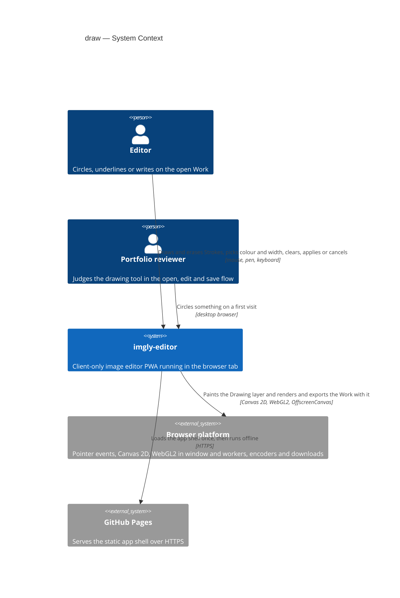

The Editor and the Portfolio reviewer drive the app by mouse, pen and keyboard. The app paints the Drawing layer with the browser's Canvas 2D and renders the Work with it through WebGL2, in the Preview and in the export worker. GitHub Pages is only the first-load source of the code. The operating system's file dialog belongs to export and is unchanged.

## 4. Solution strategy

**Target surface.** `target_surfaces: [web-frontend]` (frontmatter). The feature extends the one runnable surface, the Editor SPA in the browser tab. The export worker it changes is an internal container of that surface (§5). Decided inline: there is no server (repo ADR 0001) and no published library, so §2 excludes the other surfaces.

**UI architecture (web-frontend).** Inherited from open-and-view, export, crop-rotate and adjust: a client-rendered SPA with one editor view and no router. The "Draw" tool (SCR-03) is a mode of that view in the same tool slot as "Crop and rotate" and "Adjust". Like "Adjust", it keeps the Work's Crop and the View as they are (AC-18), takes over the tool panel in place and never opens a page (ux-flows §Platform decisions). A DOM overlay over the Preview takes the pointer, as crop-rotate's frame does (crop-rotate ADR-0005). State lives in Pinia setup stores, and the controls reuse `src/shared/ui/` primitives (`SegmentedControl` for the mode, `SliderField` and `NumberField` for the width, `BaseButton`) and `tokens.css`. No new ADR: §2 excludes server rendering, and crop-rotate ADR-0003 already provides the tool-mode mechanism.

**Top strategic choices (the seeds for ADRs):**

1. **The Drawing layer is one bitmap on the Original's pixel grid, created on the first mark** — [ADR-0001](adr/0001-hold-the-drawing-layer-as-one-bitmap-in-the-original-pixel-space-created-on-the-first-mark.md). `Work.drawing` is `null` for a new Work and becomes a W₀×H₀ Canvas 2D bitmap when a Brush first paints in a Draft. Each applied layer carries a new id. The bitmap is never resampled when the Geometry changes, so Geometry round trips and hidden marks under a narrower Crop are exact by construction (AC-08). Serves quality goals 1, 2 and 3.
2. **Each Stroke segment is painted straight into the Draft in Original coordinates, through the Geometry's transform and clipped to the Crop** — [ADR-0002](adr/0002-paint-each-stroke-segment-straight-into-the-draft-in-original-coordinates.md). Pointer positions, coalesced ones included, are mapped through the View into the Crop's frame. Canvas 2D paints centripetal Catmull–Rom segments with round caps under `setTransform(frameToOriginal)` and `clip(crop)`. The Brush paints with `source-over` and the Eraser with `destination-out`. Only the dirty rectangle reaches the GPU each frame. The live line is the applied line (AC-01, AC-04, AC-09). Serves quality goals 1 and 3.
3. **The layer is composited in the shared fragment shader, after the Adjustments and before the JPEG flatten** — [ADR-0003](adr/0003-composite-the-drawing-layer-in-the-shared-fragment-shader-after-the-adjustments.md). A second sampler, `u_layer`, is read with the same `v_uv` as the Original and composited as premultiplied "over" under `u_draw`. The Preview, the export worker and its window fallback, the crop-transparency check and `previewAt100()` all use this one path. "Crop and rotate" shows every mark, and "Adjust" and Compare leave the marks unadjusted without tool-specific code (AC-10, AC-11). Serves quality goals 1 and 2.
4. **The Draft is a full copy of the layer, handed to the Work on Apply; an applied layer is never painted again** — [ADR-0004](adr/0004-hold-the-draft-as-a-full-copy-of-the-layer-and-hand-it-to-the-work-on-apply.md). The `draw` store copies `work.drawing` on open. The Preview shows the Draft through `editor.setPreviewLayer`. Apply is `editor.applyDrawing(draft, changed)`, a reference handover. Cancel, Escape and replacing the Work release the Draft. Every release is explicit and counted (AC-05, AC-06, AC-13). Serves quality goals 2 and 3.
5. **One Apply of the tool is one undo step; there is no per-Stroke history** — [ADR-0005](adr/0005-make-one-apply-of-the-draw-tool-one-undo-step.md). This answers spec §8's open question in favour of its default, the same unit as "Crop and rotate" and "Adjust". With ADR-0004's immutable layers, step 7 undoes an Apply by swapping layers.

Decided inline, below the ADR gate:
- **Unsaved edits come from a per-Draft change flag, never a pixel comparison** (AC-12, ux-flows design input 4). The flag starts false on open and turns true on the first of these:
  - a Brush Stroke whose footprint (its path widened by half the width, with round ends) reaches inside the Crop, judged geometrically by a pure `core/draw` function;
  - an Eraser segment that lowered the alpha of some layer pixel, judged by comparing the segment's dirty rectangle before and after painting, and only until the flag is true;
  - a Clear of a Draft whose bitmap had some pixel with alpha above 0, judged by one scan of the bitmap.

  Drawing a mark and erasing it again therefore still counts (AC-12). `editor.applyDrawing` raises the revision only when the flag is true. The comparison is only ever with the layer from when the tool was opened, because nothing else can change `work.drawing` while the tool is open.
- **The tool keeps the Work's Crop and the View** (AC-18). `openTool('draw')` sets no `previewGeometry`, as for "Adjust", so the Editor draws on the image as it stands, with its Geometry and its applied Adjustments (AC-11). A Stroke's footprint outside the Crop is clipped (ADR-0002).
- **No persistence.** The layer lives in session memory and ends with the Work (spec §3). Step 8 stores it as a PNG Blob with a forward migration, as repo ADR 0003 plans.

Each tactical decision in later sections traces to one of these seeds. A tactical decision that contradicts one is surfaced in §11.

## 5. Building block view

The layering is the repo's functional core with feature folders (repo ADR 0002), unchanged. Pure rules go in `src/core/draw/` (the width rules, the stroke curve and the footprint test), with the two coordinate maps next to their siblings: `frameToOriginal` in `src/core/geometry/transform.ts` beside `cropToOriginalUv`, and `deviceToFrame` in `src/core/view/`. The Canvas 2D bitmap and its painter go in `src/render/drawing/`, next to the WebGL2 renderer that composites them. The tool, its Draft, its overlay and its keys go in `src/features/draw/`, following crop-rotate and adjust. Features still never import each other: the `draw` store reaches the Work and the Preview only through the `editor` store (`setPreviewLayer`, `layerChanged`, `applyDrawing`), as adjust does through `setPreviewAdjustments` and `applyAdjustments`. The hot path does not go through Vue reactivity. A pointer event goes to the `draw` store's Stroke session, which calls the painter. Once per frame the dirty rectangle goes to `editor.layerChanged(rect)` and on to the renderer. The bitmap handle sits in a plain field, so a pointer move triggers no reactive update.

**The tool slot is extracted from the `editor` store before the third tool lands** (decided inline; it answers adjust sad.md §11's risk, due before this step's `tasks`). The store is 515 lines today and draw adds the layer preview, `applyDrawing` and the snapshot's layer. One refactoring task moves `activeTool`, `openTool`, `closeTool`, the per-tool previews (`previewGeometry`, `previewAdjustments`, `previewLayer`) and their setters into `src/features/editor/tool-slot.ts`, which the store composes. The store's public API stays as it is, and its existing tests must pass unchanged before any draw code is added.

**Cross-feature changes (editor, export, crop-rotate, adjust, app shell):**
- **editor** (`store.ts`, `tool-slot.ts`): `ToolId` gains `'draw'`. `openTool('draw')` keeps the Crop and the View, as for `'adjust'`. New: `previewLayer` with `setPreviewLayer(layer | null)` (only while the "Draw" tool is open; `null` there means an empty Draft, for example after Clear, not "show the Work's layer"), `layerChanged(rect)`, which forwards to the renderer, and `applyDrawing(layer, changed)`, which is refused while exporting and raises the revision only when `changed` is true (§4). `closeTool()` clears `previewLayer`. `replace()` closes the tool, and the `draw` store releases its Draft when its tool is closed this way (AC-13). `ExportSnapshot` gains `drawing`, the applied layer or `null`.
- **editor `PreviewCanvas.vue`**: passes `activeTool === 'draw' ? previewLayer : work.drawing` to `renderer.setLayer()`, so an empty Draft after Clear shows no marks at once (AC-05) and closing the tool shows the Work's layer again. While the "Draw" tool is open, a main-button drag over the image belongs to the draw overlay, not to the pan gesture. Space-drag, the wheel, pinch and the zoom keys keep their open-and-view behaviour (AC-18), through the existing `spacePan` flag that lets a drag through an overlay.
- **render** (`shaders.ts`, `preview-renderer.ts`): `u_layer`, `u_draw`, `setLayer` and `updateLayer` (ADR-0003). `sampleCrop` stays without the layer.
- **render/export** (`worker-handler.ts`, `client.ts`): `ExportRequest` and `AlphaRequest` gain `layer: ImageData | null`, transferred. Single-pass rendering now applies only when the Export is full size, or when the Adjustments are neutral and there is no layer. Otherwise the two passes of adjust sad.md §5 run with the layer in the first pass (AC-10).
- **export** (`store.ts`, `messages.ts`): the snapshot's layer is read with `getImageData` once per export and per alpha check. The alpha check's cache key gains the layer id (ADR-0003). `infoToolOpen('draw')` says "Apply or cancel the drawing first, then export." for the action and Ctrl/Cmd+S (AC-15).
- **crop-rotate, adjust**: no change. Their actions and keys already refuse with "Apply or cancel the open tool first." whenever another tool is open, and stay silent in a text field (AC-16). An e2e test runs that rule with "Draw" open.
- **app shell** (`App.vue`, `test-hooks.ts`): `DrawAction` sits in `top-bar-actions` after `AdjustAction` (AC-19), with `DrawOverlay` in `tool-canvas` and `DrawTool` in `tool-panel`. The e2e hooks gain a way to put a reference drawing on the Work without driving the pointer, and `previewAt100()` renders with the layer.

**Internal decomposition:**

```
src/core/draw/                 pure rules, no DOM
├── settings.ts                PALETTE (10 colours, AC-02), DEFAULT_COLOUR #E53935, DEFAULT_WIDTH 12, MIN/MAX_WIDTH 1…200
├── width.ts                   parseWidth (AC-03 field rules, "px" suffix), stepWidth ([ ] ±1, ±10 with Shift, clamped; AC-19)
├── stroke.ts                  catmullRomSegments (points → Bézier control points), segmentBounds, footprintReachesCrop (AC-12)
└── index.ts
src/core/geometry/transform.ts + frameToOriginal(g, original) — the pixel-unit form of cropToOriginalUv's frame step
src/core/view/                 + deviceToFrame(view, crop, point) — the inverse of the View for one point
src/core/document.ts           + Work.drawing: DrawingLayer | null; DrawingLayer { id, width, height, pixels }
src/render/drawing/            Canvas 2D bitmap (repo ADR 0004)
├── layer.ts                   createLayer, copyLayer, releaseLayer (0×0 + ledger), readRect, hasAnyMark
├── painter.ts                 paintSegment / paintDot (Brush source-over, Eraser destination-out) under setTransform + clip
└── index.ts
src/render/shaders.ts          + u_layer, u_draw, setLayerUniforms
src/render/preview-renderer.ts + setLayer, updateLayer (dirty rect + mipmaps)
src/render/export/             + layer in ExportRequest / AlphaRequest, two-pass condition
src/features/draw/
├── DrawAction.vue             top-bar "Draw" button, D key, hints (AC-14, AC-16, AC-17, AC-19)
├── DrawTool.vue               panel: mode, palette + custom colour, width slider + field, Clear, Cancel, Apply
├── DrawOverlay.vue            tool-canvas: pointer capture, coalesced events, width circle under the pointer
├── store.ts                   Draft, changed flag, mode, colour, width, the Stroke session
├── shortcuts.ts               B, E, [ ], Enter, Escape inside the tool (AC-19); letter-first, then key position
├── messages.ts                hints and labels
└── index.ts
src/features/editor/tool-slot.ts   extracted active-tool slot and per-tool previews (above)
```

`screens` decides whether the palette needs a new swatch primitive. A new primitive is built in `src/shared/ui/` and registered in `docs/design-system.md`.

**C4 Container (L2):**

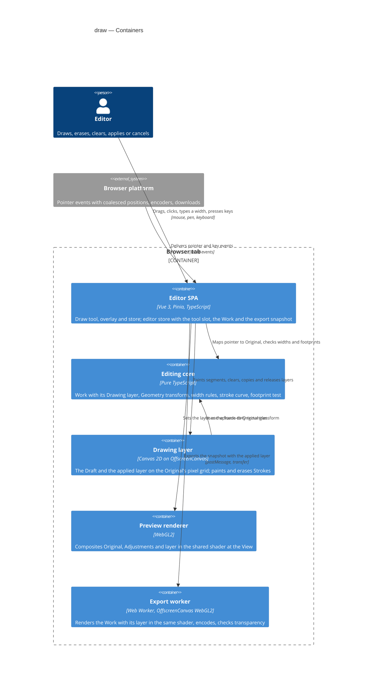

The Editor drives the Editor SPA, where the draw tool and its store live. The SPA asks the editing core to map pointer positions onto the Original and to check widths and footprints. It has the Drawing layer container paint each segment through core's transform, hands the dirty rectangle to the WebGL2 Preview renderer, and sends the applied layer with the export snapshot to the export worker. The renderer and the worker composite the layer with the same shader. The browser platform delivers the pointer and key events. The decode worker, the service worker and the Works store are unchanged and left out.

## 6. Runtime view

The participants are the §5 containers: the Editor SPA (the draw overlay, the `draw` store and the `editor` store), the Editing core, the Drawing layer, the Preview renderer and the Export worker. Messages are semantic. This stage seeds the two critical flows, and `sequences` covers every remaining AC as a flow or a branch.

**Critical flow 1: open the tool, draw a Stroke, then Apply or Cancel**

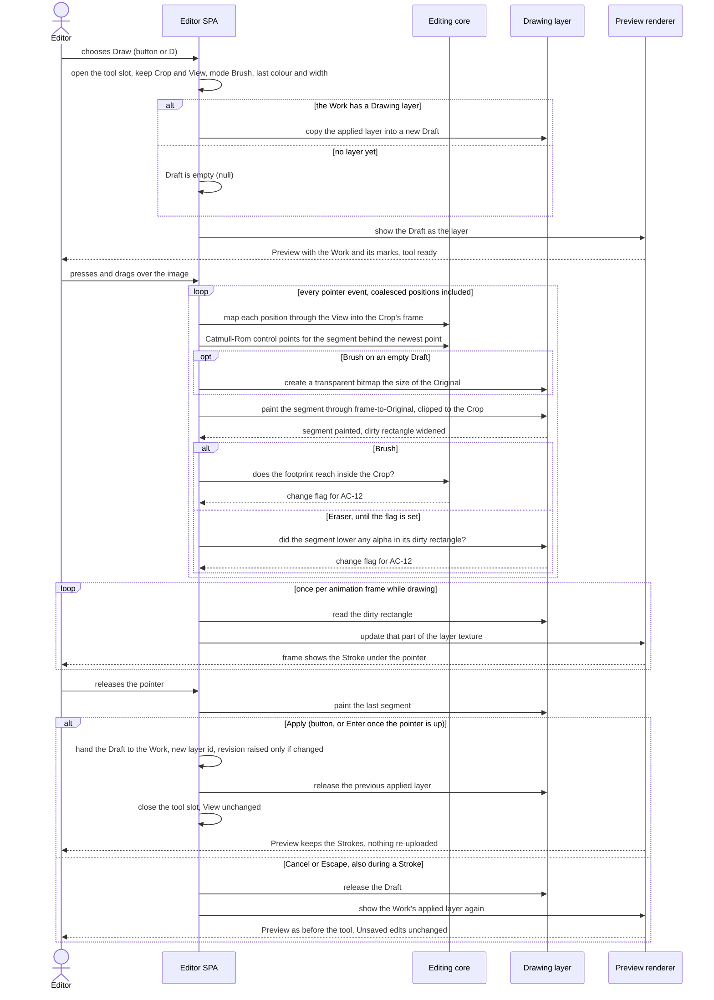

**Critical flow 2: export a Work with marks, at full or smaller size**

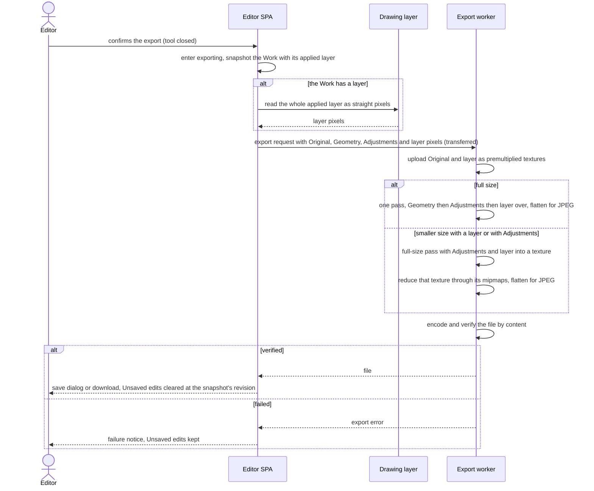

**Branches the `sequences` stage draws:**
- the Eraser path, a dot from a click, and Clear (AC-04, AC-05), with the AC-12 flag in each;
- a Stroke that starts or ends outside the Crop (AC-09);
- zoom, pan and Space during a Stroke, a pointer cancel, losing focus and a second touch (AC-18);
- opening another image while the tool is open (AC-13);
- the refusals: "Draw" during an export, export or Ctrl/Cmd+S while the tool is open, and one tool at a time (AC-14, AC-15, AC-16, AC-17);
- "Crop and rotate" and "Adjust" over applied marks (AC-08, AC-11), and the crop-transparency check with a layer (AC-10).

<!-- Flows below were added by `sequences` and use the generic participant vocabulary: <user> is the Editor or the Portfolio reviewer; <ui> is the editor view with the Draw action, the tool's controls, the draw overlay and the width circle (SCR-01 to SCR-08 of ux-flows.md); <service> is the feature logic (the draw and editor stores with the core rules: width, curve, footprint and coordinate maps); <service> (layer) is the Drawing layer container of §5 (the Draft and applied bitmaps and their painter); <service> (render) is the Preview renderer and the export worker; <external-system> is the browser and the operating system (pointer events, the colour picker, decoding, the file dialog). Nothing in these flows is written to persistent storage: the Draft, the applied layer and the tool settings are in-memory session state, so there are no persist notes for data-model. -->

### F1 — Open the tool, and the refusals to open

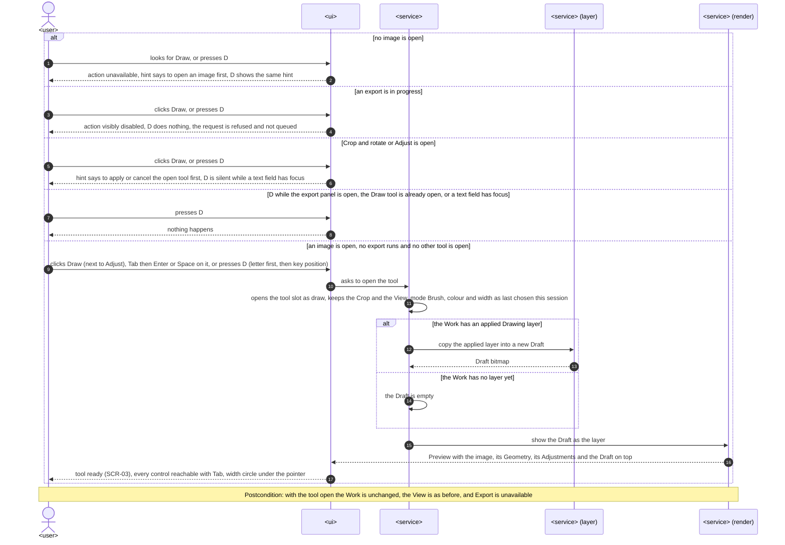

Opening needs an image (AC-17) and no export in progress, and a refused request is not queued (AC-14). While "Crop and rotate" or "Adjust" is open, Draw and D show "apply or cancel the open tool first", and D stays silent in a text field (AC-16). D is also silent while the export panel is open or the tool is already open (AC-19). On opening, the tool starts on the Brush with the colour and width last chosen in this session (red #E53935 and 12 px the first time), copies the Work's applied layer into the Draft or starts empty, and keeps the View (AC-01, AC-18).

### F2 — Draw a Stroke with the Brush

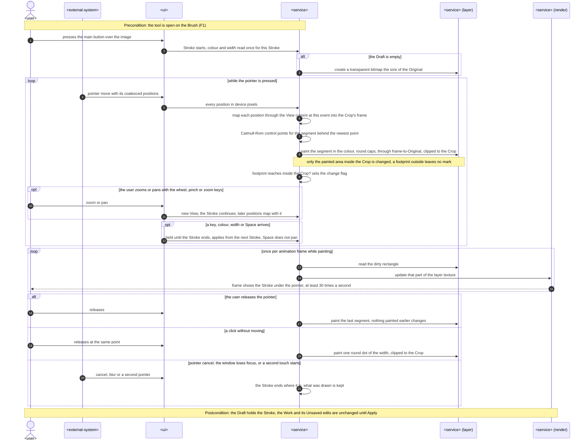

A press starts a Stroke with the colour and width chosen at that moment. On an empty Draft, the first Brush Stroke creates the bitmap. Each pointer event's positions, coalesced ones included, are mapped with the View current at that event. They are joined by a curve that passes through every one, painted with round ends and clipped to the Crop by painted area (AC-01, AC-09). The change flag turns on when the footprint reaches inside the Crop (AC-12). Once per frame only the changed rectangle reaches the Preview (§6 timing). A zoom or pan during the Stroke does not break it. A key, a colour or width change, or Space waits for the Stroke to end, and Space does not pan (AC-18). Release paints the last segment without changing what was drawn. A click without moving paints one round dot. A pointer cancel, losing focus or a second touch ends the Stroke and keeps it (AC-01, AC-18).

### F3 — Pick the colour, the width and the mode

```mermaid
sequenceDiagram
    autonumber
    actor U as <user>
    participant B as <external-system>
    participant UI as <ui>
    participant S as <service>

    Note over U,S: Precondition: the tool is open and no Stroke is in progress (a change during a Stroke waits, F2)
    alt a palette colour
        U->>UI: picks one of the 10 preset colours
        UI->>S: that colour
        S-->>UI: the colour is marked in the palette
    else a custom colour
        U->>UI: opens the custom colour
        UI->>B: browser colour picker
        B-->>UI: any fully opaque colour
        UI->>S: that colour, marked only when it is one of the 10
    else the width slider
        U->>UI: drags the width slider
        UI->>S: the whole width, 1 to 200
    else the [ or ] key (by character, else by the two key positions right of P)
        U->>UI: presses or holds [ or ], with or without Shift
        UI->>S: width 1 smaller or larger, 10 with Shift, repeated while held, kept within 1 to 200
    else typed in the width field
        U->>UI: types, then leaves the field or presses Enter in it
        Note over UI,S: nothing is checked while typing, and Enter here never applies the tool
        UI->>S: the typed text
        alt plain decimal number, optional sign, one point or comma, optional "px" in any case
            S->>S: snaps a value outside 1 to 200 to the nearest bound, rounds a fraction half up
        else empty, scientific notation or not a number
            S->>S: returns to the previous width
        end
        S-->>UI: the field shows the checked width
    else B or E (letter first, then key position)
        U->>UI: presses B or E
        UI->>S: Brush or Eraser, same width
    else any of these keys while a text field has focus
        U->>UI: types into the field
        UI-->>U: the character is typed, no shortcut runs
    end
    S->>S: remembers colour and width for this page, never as an edit
    S-->>UI: width circle under the pointer shows the width at the current zoom
    Note over U,S: Postcondition: later Strokes use the new colour and width, earlier ones keep theirs, and they stay chosen on Apply, Cancel and a new image until reload
```

The colour comes from the 10-colour palette, where the chosen one is marked, or from the browser's colour picker, which offers any fully opaque colour. The width comes from the slider, from [ and ] (±1, ±10 with Shift, repeating while held and kept within 1 to 200, recognised by the character or by key position), or from the field (AC-02, AC-19). A typed width is checked only when the field is left or Enter is pressed in it. It snaps to 1 or 200, rounds half up, or returns to the previous width, and "px" is accepted in any case (AC-03). B and E switch the mode, and every one of these keys types normally in a text field (AC-19). Colour and width are remembered until reload, never count as edits, and apply only to later Strokes (AC-02).

### F4 — Erase and Clear

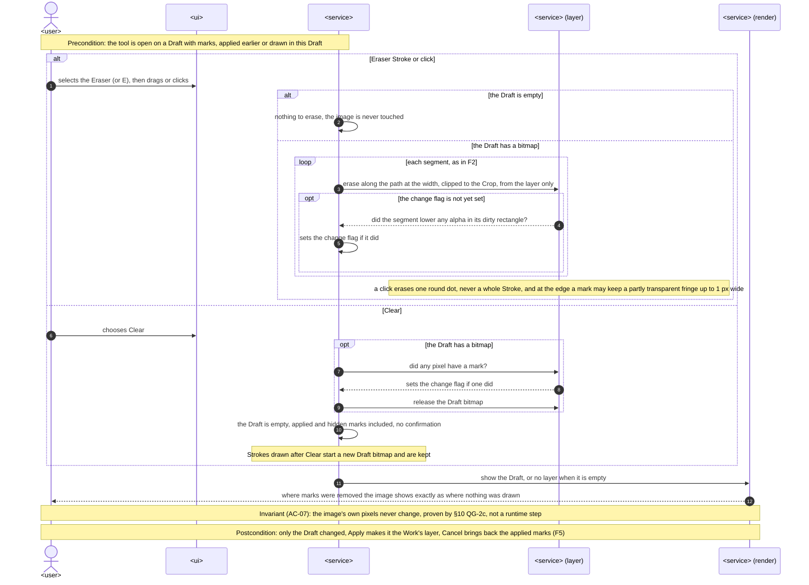

The Eraser removes marks along its path at the shared width, clipped to the Crop. It works on the layer only, so where nothing is drawn it changes nothing. A click erases one round dot and never a whole Stroke, and a mark's edge may keep a partly transparent fringe up to 1 px wide (AC-04). The change flag turns on once a segment actually lowered some layer pixel's alpha (AC-12). Clear empties the whole Draft at once, without a confirmation, including marks applied earlier and marks hidden outside a narrower Crop. It counts as a change only when the Draft had a mark, and Strokes drawn after it are kept (AC-05, AC-12). The image's own pixels never change, an invariant that §10 QG-2c proves (AC-07).

### F5 — Apply, Cancel, or open another image while drawing

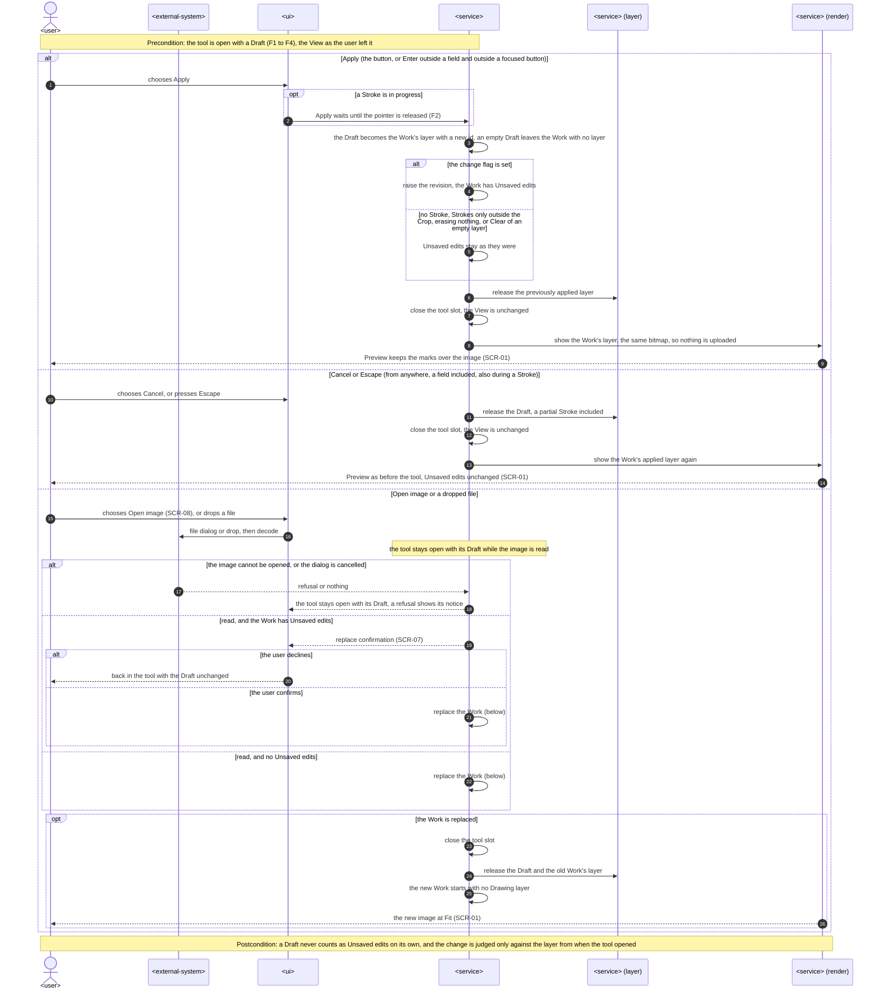

Apply waits for a Stroke in progress to end, then hands the Draft to the Work as its layer with a new id. The Work gets Unsaved edits only when the change flag is set: a mark drawn and erased again in one Draft still counts, while an Apply with no Stroke, with Strokes only outside the Crop, with erasing where nothing was drawn, or with a Clear of an empty layer does not (AC-12). The previous applied layer is released, nothing is uploaded, the tool closes and the View stays (AC-01, AC-18). Cancel or Escape, from anywhere and even during a Stroke, releases the Draft and shows the Work's layer from before, with Unsaved edits unchanged (AC-06, AC-18). Opening another image keeps the tool open with its Draft until the image has been read and any replace confirmation answered. A failed read or a declined replacement leaves the tool open. A replacement closes the tool, discards the Draft with the old Work, and the new Work has no layer (AC-13).

### F6 — Change the Geometry, or adjust, over applied marks

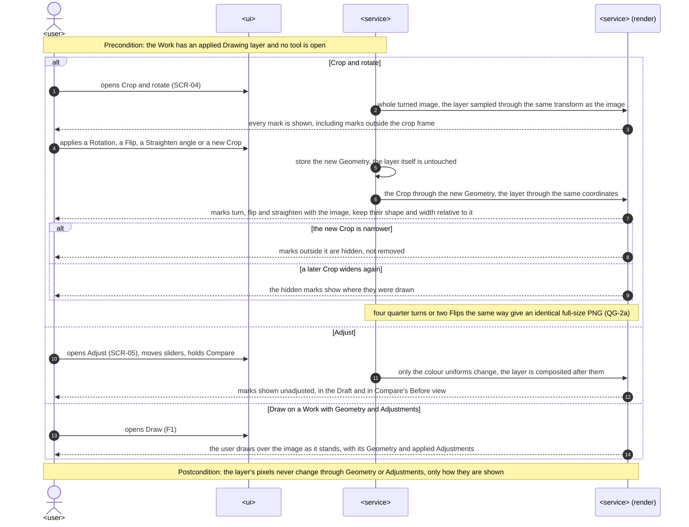

In "Crop and rotate", the tool shows the whole turned image with every mark, including those outside the crop frame, so widening the frame shows them where they will be (AC-11). Applying a Rotation, a Flip, a Straighten angle or a Crop stores only the Geometry, and the layer follows the image because it is sampled through the same coordinates. Marks keep their shape and width relative to the image, a narrower Crop hides marks without removing them, and widening it again shows them (AC-08). In "Adjust", including Compare's "Before" view, only the colour values change and the marks stay unadjusted on top (AC-11). Opening "Draw" afterwards draws over the image as it stands (AC-11).

### F7 — Export with marks, and Export or another tool while drawing

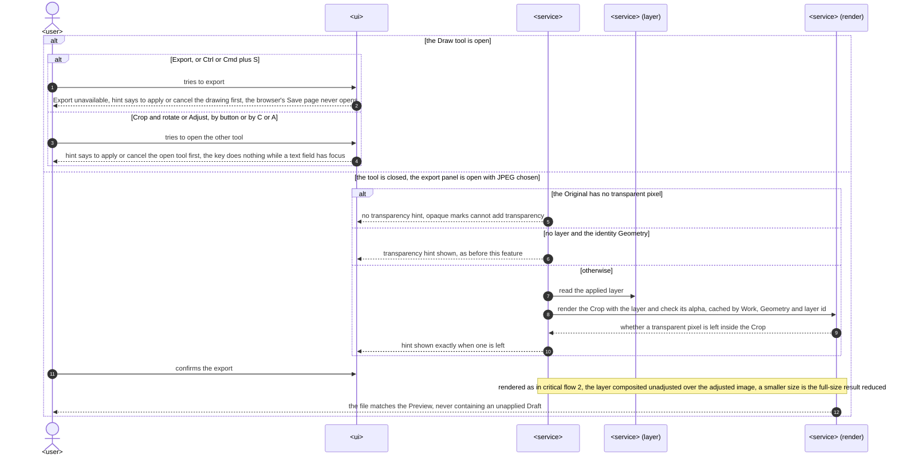

While "Draw" is open, Export and Ctrl/Cmd+S show "apply or cancel the drawing first" and never open the browser's "Save page" (AC-15). "Crop and rotate" and "Adjust" show "apply or cancel the open tool first", and C and A do nothing in a text field (AC-16). With the tool closed, the JPEG transparency hint follows the drawn result. An opaque Original never shows it. Without a layer and with the identity Geometry it shows, as before. Otherwise the export renders the Crop with the layer and shows the hint exactly when a transparent pixel is left inside the Crop (AC-10). The Export itself is critical flow 2: the layer composited unadjusted over the adjusted image, and a smaller size is the full-size result reduced (AC-10).

**Coverage (use cases and acceptance criteria).**

| User story | Flows |
|---|---|
| US-01 Draw freehand | F1, F2, critical flow 1 |
| US-02 Pick colour and width | F3 |
| US-03 Fix mistakes | F4 |
| US-04 Change my mind | F5 |
| US-05 Keep marks in place | F6 |
| US-06 Export what I see | F6, F7, critical flow 2 |
| US-07 Draw on the first try | F1, F3 |

| AC | Shown by |
|---|---|
| AC-01 | F1 (opening state), F2 (live line, dot), F5 (Apply) |
| AC-02 | F3 |
| AC-03 | F3, the typed-width branch |
| AC-04 | F4, the Eraser branch |
| AC-05 | F4, the Clear branch |
| AC-06 | F5, the Cancel or Escape branch |
| AC-07 | Non-runtime: an invariant of every outcome, noted in F4 and proven by §10 QG-1b and QG-2c |
| AC-08 | F6, the Crop and rotate branch |
| AC-09 | F2, the clip to the Crop |
| AC-10 | F7, the transparency hint, and critical flow 2 |
| AC-11 | F6 (all three branches) |
| AC-12 | F2 and F4 (the change flag), F5 (Apply's branches) |
| AC-13 | F5, the Open image or drop branch |
| AC-14 | F1, the export-in-progress branch |
| AC-15 | F7, the tool-open Export branch |
| AC-16 | F1 (Draw while another tool is open), F7 (another tool while Draw is open) |
| AC-17 | F1, the no-image branch |
| AC-18 | F2 (input during a Stroke, zoom, cancel, blur, second touch), F5 (Enter waits, Escape during a Stroke, View unchanged) |
| AC-19 | F1 (Draw action and D), F3 (B, E, [ and ], silence in a field), F5 (Enter and Escape) |

**Flags for design:** none for participants. Every participant is in §5: the Editor SPA as `<ui>` and `<service>`, the Drawing layer as `<service> (layer)`, the Preview renderer and the export worker as `<service> (render)`, and the browser and operating system as `<external-system>`. No flow is async, and nothing is persisted, so data-model has no indexes to derive.

## 7. Deployment view

The topology is unchanged. The feature ships inside the existing static app on GitHub Pages under `/imgly/`, as part of the same Vite build, and runs entirely in one browser tab. There is no server, replica or scaling unit to add. The service worker precaches the larger app shell and the changed export worker script exactly as it does today, so the tool works offline after the first load. No new hosting configuration, header or permission is needed. Canvas 2D on an `OffscreenCanvas` in the window is available in every target browser, and OffscreenCanvas and WebGL2 are already start-up requirements (open-and-view capability gate).

**Monitoring:**
- No runtime telemetry, by design: the app sends nothing anywhere (§2 Regulatory).
- Performance marks in the e2e build are the measurement points for spec §6:
  - a "tool ready" mark when SCR-03 is first drawn;
  - a mark per frame that shows a Stroke, matched to the scripted pointer move that caused it;
  - marks from Apply, Cancel, Clear and a "Crop and rotate" Apply to the redrawn Preview.

  Frame timing uses the existing performance trace, and memory uses whole-page memory through `e2e/perf-memory.ts`. The `@perf` suite (`PERF=1`) reads them on the reference machine, not in CI.
- The bitmap ledger counts created and released layers in DEV and e2e builds, so e2e can assert that exactly one applied layer, or none, is retained after Apply, Cancel and replacing the Work (ADR-0004).
- CI runs the fidelity, empty-layer and Geometry round-trip pixel checks on Chromium, Firefox and WebKit with every push (§10).

**Scaling thresholds:**
- The Downscale limit bounds everything: the Original's long side is at most 4096 px, so a layer is at most 4096 × 4096 px (64 MB of RGBA).
- While the tool is open there are at most two layers in memory (the applied one and the Draft, up to 128 MB) and one layer texture with mipmaps on the GPU (about 85 MB). With the tool closed there is one layer, or none for a Work that was never drawn on (ADR-0001, ADR-0004).
- An export with a layer moves up to 64 MB of straight pixels to the worker by transfer, not by copy. A smaller Export with a layer holds one extra full-size texture in the worker for the length of that export (adjust sad.md §5).
- 4096 × 4096 is exactly the largest canvas area some Safari builds allow (16,777,216 px), so a layer never exceeds it (§11).
- 50 Applies stay within spec §6's ≤ 110% of memory after the first Apply, because each Apply releases the layer it replaces.

## 8. Crosscutting concepts

| Concept | Convention | Where defined |
|---|---|---|
| Error handling | `Result<T, AppError>` in `core` and `render`, with no new error codes. The width rules never fail: out-of-range values snap, fractional values round half up, and empty or non-numeric values revert (AC-03). A failed layer upload or render is open-and-view's display-lost path (`DISPLAY_LOST`), unchanged, and a failed export with a layer is the existing `EXPORT_FAILED`. Creating a canvas larger than the engine allows is a programmer error, because the Downscale limit bounds the layer (§7) | repo `CLAUDE.md` §Conventions; here |
| Edit entry point | Every change to the Work goes through the `editor` store. The tool calls `applyDrawing(layer, changed)`, which stores the layer and raises the revision through `withEdit()` only when the per-Draft flag is true (§4, AC-12). The tool never writes the Work directly | open-and-view ADR-0005; ADR-0004 |
| Tool state | One tool at a time in the extracted tool slot (§5), separate from the editor's phase. The Draft, the change flag and the Stroke session live in the `draw` store and reach the Preview only through `editor.setPreviewLayer` and `editor.layerChanged`. The Draft never counts as Unsaved edits (AC-13). The colour and the width are tool settings kept in the `draw` store until reload, never edits (AC-02) | crop-rotate ADR-0003; ADR-0004 |
| Coordinates | Three spaces with one direction of mapping. Device pixels on the canvas map through the View (`deviceToFrame`) into the Crop's frame, which maps through the Geometry (`frameToOriginal`) onto the Original's pixel grid, where the layer lives. Widths are in image pixels, the same in the frame and on the Original, because every Geometry step keeps lengths. Nothing is ever mapped back from the layer to the screen except by the shader | ADR-0001, ADR-0002; crop-rotate ADR-0001 |
| Pixel pipeline | The Original is sampled through the Geometry. Then the Adjustments run on unpremultiplied stored sRGB values, then the layer is composited premultiplied "over" (never adjusted), then JPEG flattens onto white. Every renderer uses this one order. The layer is uploaded premultiplied from straight `ImageData`, like the export's Original | ADR-0003; adjust ADR-0002; root CONTEXT "Drawing layer" |
| Input | Pointer events with pointer capture on the draw overlay, coalesced positions where the engine offers them. Each position maps with the View current at that event. A Stroke ends on release, pointer cancel, window blur or a second pointer, and keeps what was drawn (AC-18). Key, colour, width and Space changes during a Stroke apply from the next Stroke. Escape cancels at once | ADR-0002; spec AC-18 |
| Keyboard shortcuts | Each feature owns its keys. draw owns D. It is silent while the export panel is open, while the "Draw" tool is already open, while a field has focus and during an export (AC-14, AC-19). It shows "apply or cancel the open tool first" while another tool is open (AC-16) and "open an image first" with no image (AC-17). Inside the tool it owns B, E, [ and ] (±1, ±10 with Shift, repeating while held, clamped to 1…200), Enter (apply, except in a field or on a focused button, and only after the pointer is up) and Escape (cancel from anywhere). D, B and E are matched letter-first and then by key position. [ and ] are matched by the character typed and then by the two key positions right of P, so Shift+[ and the German ü and + keys work (AC-19). All are silent in a text field. Zoom and pan keys stay with the editor (AC-18). export turns Ctrl/Cmd+S into the "apply or cancel the drawing first" hint while draw is open (AC-15) | here; crop-rotate and adjust sad.md §8 |
| Field input | The width field is checked only when it is left or Enter is pressed in it, never while typing, and Enter in it never applies the tool. Only plain decimal notation with one decimal point or comma counts as a number, and a trailing "px" is accepted in any letter case, with or without spaces (AC-03) | crop-rotate AC-07; adjust AC-05; here |
| Accessibility | Every control is a focusable DOM control with a role and label from the shared primitives. The mode is a radiogroup. Each palette colour is a radio labelled with its name and marked when chosen, and the custom colour is the browser's colour input. The width is a slider plus a field that reports its value in px. Hints on unavailable controls are reachable by keyboard. Drawing itself needs a pointer, as AC-19 states | `docs/design-system.md`; `src/shared/ui/` |
| Resource lifetime | Every layer and Draft bitmap is released explicitly (canvas set to 0×0) and counted by the bitmap ledger next to `closeBitmap()`. The Preview keeps one layer texture, re-uploaded only when the bitmap it shows changes, not when an Apply gives the same bitmap a new id. The export reads the layer once per export and transfers it, and the worker deletes its textures with its context. On Apply the Draft becomes the Work's layer and the previous applied layer is released; on Cancel, Escape and replacing the Work the Draft is released | ADR-0001, ADR-0004; open-and-view sad.md §8 |
| Privacy | An Export holds only the applied layer: Export is unavailable while the tool is open (AC-15), and an export in progress refuses the tool (AC-14). Marks are fully opaque, so covered pixels never show through in an Export (AC-07). Nothing about the drawing is logged or sent anywhere | spec §6.1 |
| ID strategy | Each applied layer gets an id from `newId()` (UUIDv7). It keys the export's alpha-check cache; the Preview's texture is keyed on the bitmap itself (ADR-0003). There are no other new entities | repo `CLAUDE.md` §Conventions; ADR-0001 |
| Persistence | None: the layer lives in session memory and ends with the Work (spec §3). Step 8 stores it as a PNG Blob with a new forward migration step | repo ADR 0003; ADR-0001 |
| Internationalisation | N/A: English microcopy in the feature's `messages.ts`, as in the shipped features. Palette colour names are English labels | — |
| Test hooks | The e2e build's `window.__imglyTest` gains a way to put a reference drawing on the Work directly: Strokes at 1, 12 and 200 px in the 10 preset colours plus erased parts, painted through the same painter. The fidelity, round-trip and memory tests then reach every case without scripting the pointer. `previewAt100()` renders with the Work's layer, so the comparison stays Preview against Export. Scripted pointer moves at 120 per second drive only the timing and the AC-01 path tests | repo `CLAUDE.md` §Commands; here |

## 9. Architecture decisions

| # | Title | Status | Section |
|---|---|---|---|
| [0001](adr/0001-hold-the-drawing-layer-as-one-bitmap-in-the-original-pixel-space-created-on-the-first-mark.md) | Hold the Drawing layer as one bitmap in the Original's pixel space, created on the first mark | Accepted | §4 |
| [0002](adr/0002-paint-each-stroke-segment-straight-into-the-draft-in-original-coordinates.md) | Paint each Stroke segment straight into the Draft in Original coordinates, through the Geometry's transform and clipped to the Crop | Accepted | §4 |
| [0003](adr/0003-composite-the-drawing-layer-in-the-shared-fragment-shader-after-the-adjustments.md) | Composite the Drawing layer in the shared fragment shader, after the Adjustments and before the JPEG flatten | Accepted | §4 |
| [0004](adr/0004-hold-the-draft-as-a-full-copy-of-the-layer-and-hand-it-to-the-work-on-apply.md) | Hold the Draft as a full copy of the layer, hand it to the Work on Apply, and never paint an applied layer again | Accepted | §4 |
| [0005](adr/0005-make-one-apply-of-the-draw-tool-one-undo-step.md) | Make one Apply of the "Draw" tool one undo step, and keep no per-Stroke history | Accepted | §4 |

ADR files live under `docs/features/draw/adr/`. Five ADRs sit at the low end of the 5–12 expected for size M. The count stays low on purpose. Repo ADR 0004 already fixes Canvas 2D and `destination-out`. The tool mechanism and the Draft-in-store pattern come from crop-rotate ADR-0003, and the shared shader path from crop-rotate ADR-0002 and adjust ADR-0002. Below the gate and decided inline: the target surface, the per-Draft change flag (§4), keeping the Crop and the View in the tool (§4), extracting the tool slot (§5) and the two-pass reduction for a smaller Export with a layer (§5, which reuses adjust's). Inherited and still binding: repo ADRs 0002, 0003 and 0004; open-and-view ADR-0003 (WebGL2 Preview) and ADR-0005 (revision counter); export ADR-0002 (export worker) and ADR-0003 (window fallback); crop-rotate ADR-0001 (Geometry and its transform), ADR-0002 (one-pass shader), ADR-0003 (tool slot and Draft store), ADR-0004 (crop-transparency check) and ADR-0005 (DOM overlay over the Preview); adjust ADR-0002 (Adjustments in the shared shader) and ADR-0004 (Auto's sample, which stays without the layer).

## 10. Quality requirements

Each top-3 goal from §1 is expanded below into full scenarios. Every number is quoted from spec §6 or §7, or from the AC named next to it. The reference machine, the 4096×3072 Work, "p95 over 20 runs after 2 warm-up runs", "measured at Fit and at 100%", "scripted pointer moves at 120 per second", "covered by marks over the whole image" and "a Stroke across the whole image" are as spec §6 defines them.

**QG-1. Fidelity, Preview to Export, with marks**

*QG-1a. An Export with marks matches the Preview*
- **When:** the reference drawing (Strokes at 1, 12 and 200 px in the 10 preset colours plus erased parts) is applied with each of these: no Geometry; each Rotation; a Flip; a Straighten angle and a Crop; all seven Adjustments away from neutral. Each is exported as a full-size PNG.
- **Then:** "each pixel of a full-size PNG Export within 2 of 255 per channel of the Preview's own rendering of the Work at 100%, compared as in export §6".
- **How verify:** e2e pixel comparison on Chromium, Firefox and WebKit. A test hook paints the reference drawing through the same painter (§8), and `previewAt100()` reads back the Preview with the same layer. The same fixtures feed spec §7's KPI "100% of Exports within the §6 fidelity tolerance". A grayscale-100% case asserts that a red mark stays the same red (AC-10).

*QG-1b. An empty Drawing layer changes nothing*
- **When:** a Work is exported as a full-size PNG before anything is drawn, then marks are drawn and applied, then Clear and Apply, and it is exported again.
- **Then:** "difference 0 per channel between a full-size PNG Export after Clear and Apply and one of the same Work before anything was drawn".
- **How verify:** e2e exact comparison on Chromium, Firefox and WebKit. It holds by construction, because Clear makes the layer `null` and `u_draw` false (ADR-0001, ADR-0003). A unit test asserts that an applied empty Draft is `null`, and a shader test that `u_draw` false skips the block.

*QG-1c. Export time with a full layer*
- **When:** the 4096×3072 Work is covered by marks over the whole image and exported at full size.
- **Then:** "within export §6 targets: full-size JPEG at quality 90 p95 ≤ 1 s, full-size PNG p95 ≤ 2 s".
- **How verify:** export's `@perf` e2e test (`e2e/export/perf.spec.ts`), repeated with a full Drawing layer, on the reference machine.

*QG-1d. The transparency hint follows the drawn result*
- **When:** an Original with transparent pixels inside the Crop is exported with marks that cover some, then all, of them.
- **Then:** export AC-15's hint is shown "exactly when the drawn result still has a transparent pixel inside the Crop" (AC-10). Where a mark lies over a transparent part, the Export shows the mark's colour, and everywhere else the image keeps exactly its own transparency (AC-07).
- **How verify:** e2e on all three engines with a transparent fixture: one alpha comparison against the Export without marks, and one check of the hint's state per case.

**QG-2. Non-destructive marks that stay on the image**

*QG-2a. Geometry round trips*
- **When:** marks are applied over the whole image, then the Work is turned four quarter turns in either direction, or flipped twice in the same direction.
- **Then:** "difference 0 per channel between a full-size PNG Export before and after four quarter turns, and before and after two Flips in the same direction".
- **How verify:** e2e exact comparison on Chromium, Firefox and WebKit. It holds by construction, because the layer lies on the Original's grid and is never resampled (ADR-0001).

*QG-2b. Marks land on the same content through re-editing*
- **When:** for each reference case — each Rotation, each Flip, a Straighten angle, narrowing and then widening the Crop — marks are applied first and the Geometry is changed afterwards.
- **Then:** "for 100% of reference cases … every mark lands on the same image content as before, checked by pixel comparison against the expected Export" (spec §7). A mark outside a narrower Crop is hidden, not removed, and shows again when the Crop is widened (AC-08). A Stroke that reached outside the Crop leaves no mark there when the Crop is widened later (AC-09).
- **How verify:** e2e pixel comparison on all three engines against expected Exports computed from the same layer through `frameToOriginal`. `core/draw` and `core/geometry` unit tests cover the mapping and the footprint test.

*QG-2c. The image itself never changes*
- **When:** any mix of Brush Strokes, Eraser Strokes and Clear is applied, on opaque and on transparent fixtures.
- **Then:** "everywhere no mark lies, the Preview and a full-size PNG Export show exactly the pixels the Work has with an empty Drawing layer". Inside an Eraser path the image shows as where nothing was ever drawn, except that "at the edge of its path a mark may keep a partly transparent fringe up to 1 px wide" (AC-04, AC-07).
- **How verify:** e2e exact comparison outside a mask of the drawn area on all three engines. The Eraser's edge is checked with the 1 px fringe excluded.

*QG-2d. Unsaved edits change only with a real change*
- **When:** Applies are made with no Stroke, with Brush Strokes only outside the Crop, with an Eraser Stroke only where nothing was drawn, with a Clear of an empty layer, with a mark drawn and erased again in one Draft, and with a mark drawn in one Apply and erased in a later one after an Export.
- **Then:** the first four leave the Unsaved edits as they were, and the last two give the Work Unsaved edits (AC-12).
- **How verify:** store-level tests with a real `editor` store and the `draw` store. The painter is faked only where the flag's pixel checks need it, and the footprint test is covered in `core/draw` units.

**QG-3. Live, leak-free drawing**
- **When:** on the reference machine with the 4096×3072 Work, at Fit and at 100%, the Editor draws with the Brush and the Eraser at 200 px and at 1 px, opens the tool, chooses Apply, Cancel and Clear with the layer covered by marks over the whole image, applies a "Crop and rotate" change over such a layer, and makes 50 Applies each with a new Stroke across the whole image.
- **Then:**
  - Preview update while drawing: "p95 frame interval ≤ 33 ms (at least 30 updates per second), at the widest width of 200 px and at 1 px".
  - From a pointer move to the frame that shows the Stroke reaching that point: "p95 ≤ 50 ms".
  - From choosing "Draw" to the tool being ready to draw: "p95 ≤ 150 ms".
  - From choosing Apply, Cancel or Clear to the updated Preview: "p95 ≤ 150 ms, with the Drawing layer covered by marks over the whole image".
  - From choosing Apply in "Crop and rotate" to the updated Preview, with marks over the whole image: "p95 ≤ 150 ms".
  - Memory after 50 Applies, each with a new Stroke across the whole image: "≤ 110% of memory after the first Apply".
- **How verify:**
  - A new `e2e/draw/perf.spec.ts` tagged `@perf`, run with `PERF=1` on the reference machine.
    - It drives scripted pointer moves at 120 per second.
    - It reads a frame-timing trace while drawing, and the per-frame Stroke marks matched to their pointer moves (§7).
    - It times from the action marks to the redrawn Preview and to the tool-ready mark.
    - It measures whole-page memory as export §6 does (`e2e/perf-memory.ts`), Chromium only.
  - The bitmap ledger assertion (§7) runs in every e2e build, so a missed release fails CI before the memory row does.
  - AC-01's path rules (through every reported position, a round dot for a click, unchanged after release) are e2e checks on Chromium. They compare the Preview read during the Stroke with the Preview after release, and the curve's control points are covered by `core/draw` units.
  - Spec §7's "≤ 3 actions" KPI is the e2e tool flow of AC-19.

## 11. Risks and technical debt

| Risk / debt | Severity | Mitigation | Owner |
|---|---|---|---|
| The ±2/255 tolerance between an Export with marks and the Preview at 100% may not hold on every engine. The layer's antialiased edges are partly transparent, and premultiplying them is exactly where WebKit's bitmap path went wrong before (export, adjust ADR-0005). Linux WebKit renders exports in the window (export ADR-0003) | High | The layer is uploaded as straight `ImageData` with the premultiply flag, the path the export already trusts on all engines (ADR-0003). Both textures are sampled with the same filters, and the Preview and the Export use one shader. QG-1a runs on all three engines from the first shader task. A measured engine gap at the mark edges is recorded as an engine deviation, as adjust ADR-0005 did, never a silent loosening | Blazheiko |
| The hot path may miss 33 ms per frame or 50 ms from pointer to frame at Fit on 4096×3072. Each frame reads back a dirty rectangle and uploads it, below 100% it also regenerates the whole layer's mipmaps (ADR-0003), and a 200 px Brush rasterises on the CPU (`willReadFrequently`) | Medium | The first draw task is a spike that measures the per-frame cost at 1 px and 200 px, at Fit and at 100%, with `@perf` on the reference machine, before the tool UI is built. If it misses, the fallbacks in order are: during a Stroke below 100%, regenerate the mipmaps at most every other frame and once more on release; paint at most one coalesced batch per frame; move the painter into a worker behind the same `render/drawing` interface (ADR-0002 Neutral) | Blazheiko |
| Brownfield: the export's crop-transparency hint short-cuts to "yes" whenever the Original has a transparent pixel and the Geometry is the identity (`src/features/export/store.ts`, `cropTransparency`). Its cache key is the Work id plus the Geometry. With marks, opaque Strokes can cover every transparent pixel, so both would answer wrongly for AC-10 | Medium | The export task changes both. The identity short-cut applies only when `work.drawing` is `null`, the alpha check renders with the layer (ADR-0003), and the key gains the layer id. The opaque-Original short-cut stays correct, because marks cannot add transparency. QG-1d covers both a partly and a fully covered transparent fixture | Blazheiko |
| Memory: while the tool is open on the largest Original, two 64 MB layers and an 85 MB texture coexist with the Original and its texture. Canvas memory is freed only by an explicit release, so one missed release grows memory by 64 MB per Apply | Medium | Every create and release goes through `render/drawing` and is counted by the bitmap ledger (ADR-0001, ADR-0004). e2e asserts the retained count after Apply, Cancel, Escape and replacing the Work on every engine. The 50-Apply memory row (QG-3) is the backstop | Blazheiko |
| Canvas 2D antialiasing differs between engines (Skia, Gecko, Core Graphics), so the same Stroke gives slightly different edge pixels on each engine. A cross-engine expected Export would not match exactly | Medium | Every pixel comparison compares within one engine. QG-1a compares Preview against Export, and QG-2a and QG-2b compare the same Work before and after, or against an Export computed in that engine from the same layer. No test compares a layer across engines | Blazheiko |
| Undo (step 7) inherits up to 64 MB per kept layer, because one undo step is one Apply that swaps immutable layers (ADR-0005) | Medium | Step 7 bounds its stack by memory, not only by count, or stores the difference between consecutive layers. This SAD keeps layers immutable so either is possible | Blazheiko — before `/sdd:design` of roadmap step 7 |
| `getCoalescedEvents()` is missing on some engine versions, which then deliver only one position per frame. A very fast curve then has fewer points than AC-01 assumes ("including the coalesced positions between frames") | Low | Feature-detect it and fall back to the event itself. The Catmull–Rom joins keep the line smooth through the points that exist, and AC-01's path e2e runs on Chromium, where coalesced events are reliable (QG-3) | Blazheiko |
| A Straighten angle makes the Crop's edges diagonal on the Original's grid. Canvas `clip()` antialiases them, so a pixel straddling the edge can keep up to a 1 px partly transparent fringe from the part of a Stroke just outside the Crop. It shows if the Crop is widened later (AC-09) | Low | Without a Straighten angle, the Crop's edges fall on pixel boundaries of the layer, so no fringe exists. With one, the fringe is at most 1 px and partly transparent, the same order as the Eraser's accepted fringe (AC-04). QG-2b measures it, and a visible case becomes an AC-09 clarification for the owner | Blazheiko |
| 4096 × 4096 equals the largest canvas area some Safari builds allow (16,777,216 px). A future Downscale limit above 4096 would make the layer's canvas fail on them | Low | The layer is always the Original's size, which the Downscale limit bounds. Raising that limit must re-check this, and the note sits in §7 | Blazheiko |
| Brownfield: `docs/architecture-map.md` reflects `71f9628`, before adjust shipped (78 commits). This SAD was designed against the code at `36f250f`, read directly | Low | Run `/sdd:survey` before `/sdd:tasks draw`, so tasks and implement read a current map | Blazheiko — before `/sdd:tasks draw` |
| Brownfield: `PreviewCanvas.vue` pans on any main-button drag over the canvas, and the draw overlay must take that drag instead (AC-18) | Low | The overlay sits above the canvas in the `tool-canvas` slot and lets drags through only while `editor.spacePan` is set, the mechanism crop-rotate's frame already uses. An e2e test checks that drag draws, Space-drag pans, and the wheel zooms in the tool | Blazheiko |
| Resolved by this SAD: adjust sad.md §11's risk "extract the tool slot before step 6 adds a third tool" | Low | §5 makes the extraction the first draw task, with the store's tests unchanged | Blazheiko — closed by §5 |

**Accepted debt (acceptable in v1, plan to fix later):**
- Stroke segments overlap at their joints, so a partly transparent brush cannot be added later without repainting whole Strokes (ADR-0002). Spec §3 rules out brush opacity.
- A layer that the Eraser has emptied by hand keeps its 64 MB until Clear or the next Work (ADR-0001).
- Below 100% zoom the Preview composites the mipmapped layer over the mipmapped image, so it can differ slightly from a reduced Export at the same scale. Only the Preview at 100% is held to the Export, as spec §6 measures (as in adjust).
- Inside one drawing session there is no per-Stroke undo: the Eraser and Cancel are the ways back (ADR-0005, spec §3).
- Spec §8's open question (undo granularity) is answered by ADR-0005. The spec's checkbox is left for the owner to tick.

## 12. Glossary

Domain terms come from the glossaries ([root CONTEXT](../../../CONTEXT.md) and [draw CONTEXT](./CONTEXT.md)), which stay canonical. Technical terms are this document's.

| Term | Meaning |
|---|---|
| Drawing layer | The Work's one layer of freehand marks, as large as the Original and attached to it, so every Flip, Rotation, Straighten angle and Crop moves it together with the image. It is painted over the adjusted image, never adjusted, and empty for a newly opened Work (root CONTEXT). Here: one Canvas 2D bitmap on the Original's pixel grid, or `null` while empty (ADR-0001) |
| Stroke | One continuous mark on the Drawing layer, made with the Brush or the Eraser from pressing the pointer down until releasing it (root CONTEXT) |
| Brush | The "Draw" tool's mode that paints fully opaque Strokes of the chosen colour and width onto the Drawing layer (draw CONTEXT) |
| Eraser | The "Draw" tool's mode that removes marks along its Stroke, uncovering the image under them; where nothing is drawn it changes nothing (draw CONTEXT). Here: `destination-out` on the layer only (repo ADR 0004) |
| Clear | The action that removes every mark from the Draft at once, applied marks included; it reaches the Work only on Apply (draw CONTEXT). Here: it sets the Draft to `null` |
| Draft | The Drawing layer being changed in the open "Draw" tool; it reaches the Work only on Apply and never counts as Unsaved edits on its own (draw CONTEXT). Here: a full copy of the applied layer, owned by the `draw` store (ADR-0004) |
| Work, Original, Geometry, Crop, Straighten angle, Adjustments, Preview, Export, View, Unsaved edits, Editor, Portfolio reviewer | As in the root CONTEXT |
| Crop's frame | The image after its Flip, Rotation and Straighten angle, in image pixels, where the Crop is an upright rectangle. Pointer positions are mapped into it through the View, and from it onto the Original through the Geometry (§8) |
| Original's pixel grid | The coordinates of the Original's own pixels, before any Geometry. The layer lives here, so it is never resampled when the Geometry changes (ADR-0001) |
| Coalesced positions | The pointer positions the browser collects between two pointer events and hands over together (`getCoalescedEvents()`). AC-01's line passes through every one (ADR-0002) |
| Catmull–Rom segment | A curve between two points that also uses the points before and after them, passing exactly through each point. It is drawn as a cubic Bézier, so the line has no corners and needs no stabiliser (ADR-0002) |
| Dirty rectangle | The part of the layer that Strokes changed since the last frame. Only it is read back and uploaded to the GPU (ADR-0002, ADR-0003) |
| Premultiplied "over" | Compositing a premultiplied mark onto the image as `mark + (1 − mark opacity) × image`: an opaque mark shows only its colour, and a transparent layer leaves the image exactly as it was (ADR-0003) |
| Change flag | The `draw` store's per-Draft flag that decides whether Apply raises the revision: set by a Brush footprint reaching inside the Crop, an Eraser segment that lowered some alpha, or a Clear of a non-empty bitmap (§4, AC-12) |
| Release | Freeing a layer's bitmap explicitly by setting its canvas to 0×0, counted by the bitmap ledger, so memory does not wait for garbage collection (ADR-0001, ADR-0004) |
