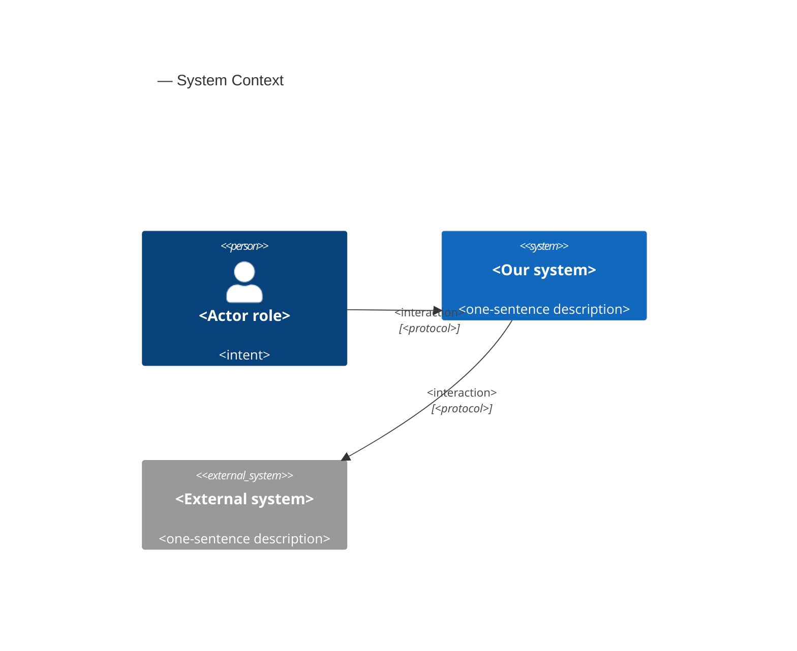
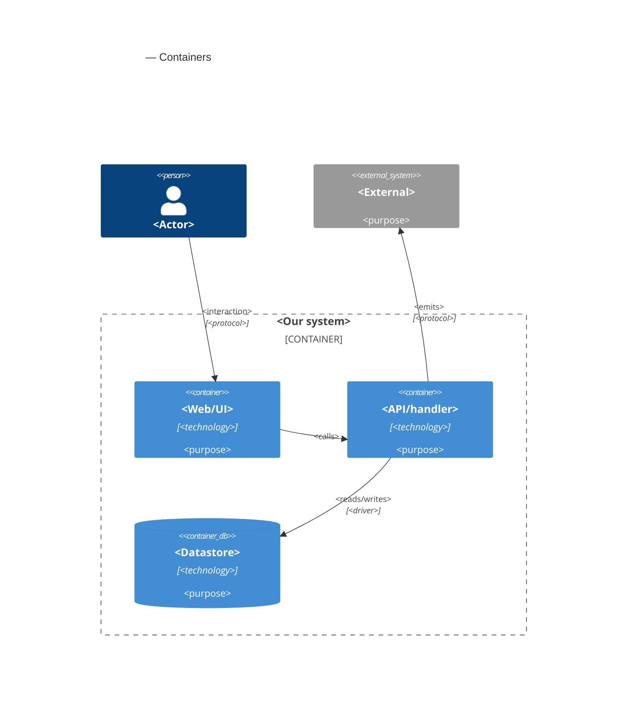

# Software Architecture Document — draw

<!-- 12 Arc42 sections. Empty section → <!-- N/A: <one-line reason> -->. -->
<!-- C4 Context (L1) lives inline in §3. C4 Container (L2) lives inline in §5. -->
<!-- Numbers in §10 come VERBATIM from spec.md §6 NFR — no inventing, no rounding. -->

## 1. Introduction and goals

**Intent.** draw gives the Editor one "Draw" tool in the shared tool slot. It has two modes, the Brush and the Eraser, a palette of 10 colours plus a custom colour, one width from 1 to 200 image pixels for both modes, and Clear (spec §1). Strokes appear under the pointer as the Editor draws, but they reach the Work only on Apply, and Cancel returns to the Drawing layer the Work had before. This is the same Draft pattern as "Crop and rotate" and "Adjust". The Drawing layer is the Work's one layer of marks. It is as large as the Original and attached to it, so every later Flip, Rotation, Straighten angle and Crop moves it together with the image. It is painted over the adjusted image and is never adjusted itself (root CONTEXT). The Original is never changed: the Eraser removes only marks, and Clear gives back exactly the image from before (spec §2). This is the third editing tool. It also adds the third part of the Work that repo ADR 0003 plans ("original + params + layer"), and undo and redo (roadmap step 7) and the gallery (step 8) build on it.

**Top-3 quality goals (1-liners; full scenarios in §10):**

1. **Fidelity, Preview to Export, with marks**: what the Editor applies is exactly what every Export contains. A full-size PNG Export is within 2 of 255 per channel of the Preview at 100% on all three engines, for every Geometry case and with Adjustments. An empty Drawing layer changes no pixel at all.
2. **Non-destructive marks that stay on the image**: no Stroke ever changes the Original's pixels, and the Eraser and Clear uncover exactly the image beneath. Marks follow every Geometry exactly. Four quarter turns or two Flips give an Export with a difference of 0, and a narrower Crop hides marks without removing them.
3. **Live, leak-free drawing**: on a 4096×3072 Work, a Stroke reaches the Preview at least 30 times per second and at most 50 ms after the pointer moves, at 1 px and 200 px, at Fit and at 100%. Opening the tool, Apply, Cancel and Clear, and a "Crop and rotate" Apply over a full layer, each take at most 150 ms. 50 Applies do not grow memory.

**Stakeholders.**

| Role | Interest | Sign-off owner? |
|---|---|---|
| Editor | Circles, underlines or writes on a photo in the colour and width they choose, fixes slips with the Eraser or Clear, and trusts that the photo underneath is never lost and that the Export matches the Preview | No |
| Portfolio reviewer | Finds the tool and circles something on the first try, by mouse or keyboard, in at most three actions (open the tool, draw, Apply) | No |
| Tech Lead | SAD approval. The Drawing layer's model, its place in the shared shader and the Draft's lifetime are inherited by roadmap steps 7 (undo and redo) and 8 (gallery) | Yes |
| Security Lead | Spec §6.1: the photos are confidential. An Export never contains a Draft that was not applied (AC-14, AC-15), and opaque marks used to hide something never let the covered pixels show through (AC-07). No full security review is needed | Yes |

<!-- Decision overrides (¶4) — populated by the critic resolution loop, empty otherwise. -->

## 2. Constraints

**Technical.**
- TypeScript 5.9 (`strict`), Node 24 toolchain, pnpm — repo ADR [0001](../../adr/0001-build-a-client-only-vue-pwa.md)
- Vue 3.5 (Composition API, `<script setup>`), Pinia 4 setup stores, Vite 8 and vite-plugin-pwa 2. It is a client-only static app on GitHub Pages under `/imgly/`, with no server, accounts or sync — repo ADR 0001
- **The drawing layer is a Canvas 2D bitmap composited over the adjusted image, and the Eraser uses `destination-out` on the layer only** — repo ADR [0004](../../adr/0004-render-adjustments-on-webgl2-and-drawing-on-canvas2d.md). It is binding for this feature, so painting Strokes on the GPU is not an option here. The open choices are where the bitmap lives, in which coordinates it is painted, and how it joins the WebGL2 render (§4)
- WebGL2 renders the Work, and the Preview and the Export share one shader source (`src/render/shaders.ts`). The shader maps each output pixel to the Original through `u_geometry` in one pass (crop-rotate [ADR-0002](../crop-rotate/adr/0002-render-the-geometry-in-the-shared-shader-in-one-pass.md)), then runs the Adjustments block under `u_adjust` on unpremultiplied stored sRGB values (adjust [ADR-0002](../adjust/adr/0002-apply-the-adjustments-in-the-shared-fragment-shader-on-stored-srgb-values.md)), then flattens onto white for JPEG under `u_flatten`. The Original is one premultiplied, mipmapped RGBA8 texture (open-and-view ADR-0003 and ADR-0004, `uploadTexture`)
- The Preview draws on `requestAnimationFrame` only after something changed (`src/render/preview-renderer.ts`). It uses nearest-texel magnification at 100% and above without a Straighten angle and mipmapped minification below, and it survives WebGL context loss by re-uploading the bitmap it keeps. The export worker renders on an `OffscreenCanvas` with the same program (export [ADR-0002](../export/adr/0002-render-and-encode-exports-in-a-dedicated-web-worker.md)), or in the window where the worker has no WebGL2 (export ADR-0003). It uploads the Original as `ImageData` because WebKit premultiplies bitmap copies wrongly. A smaller Export with Adjustments renders in two passes, full size and then reduced (adjust sad.md §5). Data crosses threads only by structured clone or transfer
- The Geometry is integer parameters on the Work, with one forward transform from the Crop's frame to the Original in `src/core/geometry/transform.ts` (crop-rotate ADR-0001). Every Geometry step is a rotation, a mirror or a translation, so it keeps lengths: one image pixel in the Crop's frame is one Original pixel
- Tools open in the `editor` store's `activeTool` slot, with their Draft in the tool's own store (crop-rotate [ADR-0003](../crop-rotate/adr/0003-open-tools-in-an-active-tool-slot-with-the-draft-in-the-feature-store.md)). `ToolId` is `'crop-rotate' | 'adjust'` today. "Crop and rotate" shows the whole turned image (`previewGeometry`, mode `whole`), and "Adjust" keeps the Work's Crop and the View
- Unsaved edits are a revision counter on the Work. Every edit goes through the `editor` store and `withEdit()`, which raises `revision`, and a successful Export sets `cleanRevision` (open-and-view ADR-0005)
- Functional core with feature folders: `core` is pure TypeScript with no DOM, features never import each other and coordinate through the `editor` store, and `infra` and `render` may call pure `core` functions — repo ADR [0002](../../adr/0002-organize-code-as-functional-core-with-feature-folders.md), repo `CLAUDE.md` §Module boundaries
- Non-destructive editing as "Original plus parameters plus a separate drawing layer" — repo ADR [0003](../../adr/0003-persist-works-in-indexeddb-as-original-plus-params-plus-layer.md). No persistence in this feature: the Drawing layer lives in session memory only, and IndexedDB is not touched (spec §3, §6.1)
- No undo or redo in this feature (spec §3, roadmap step 7)
- Targets: the latest desktop Chromium, Firefox and Safari. A pen or a finger draws as the mouse does, but no touch gestures are designed (spec §3, `docs/design-system.md` §Platform posture)

**Organisational.**
- Solo, spare-time project; owner Blazheiko. There is no per-feature effort budget beyond the 4–6 week MVP budget for the whole roadmap, and no hard deadline. Size M, route standard (`.size`, `.route`)
- TDD is on (`.claude/sdd.local.md`): Vitest units, and Playwright e2e on Chromium, Firefox and WebKit. `@perf` runs by hand on the reference machine (Apple M1 MacBook Air, latest stable Chrome, spec §6)

**Conventions.**
- Repo `CLAUDE.md` §Conventions: `core` and `render` return `Result<T, AppError>` and throw only for programmer errors. Unit tests are co-located as `*.test.ts`, and e2e tests live in `e2e/draw/*.spec.ts`, only for what happy-dom can't do (WebGL and Canvas 2D pixels, pointer timing, frame timing). Styling is plain CSS with tokens from `src/shared/styles/tokens.css`. Features expose `index.ts` and are mounted from `src/app/`
- A new editing tool follows the crop-rotate and adjust precedent (`docs/architecture-map.md` §Where things live): `src/features/draw/` with an action, the tool, `store.ts`, `messages.ts`, `shortcuts.ts` and `index.ts`, pure rules in `src/core/draw/`, a new `ToolId`, and slots filled in `App.vue`. The controls reuse `SegmentedControl`, `SliderField`, `NumberField` and `BaseButton` from `src/shared/ui/`
- `docs/design-system.md` §Interaction & writing conventions: one notice boundary, every action reachable by keyboard, and short plain microcopy. Refusals are hints on the unavailable control (ux-flows §Platform decisions)
- Field input rules follow crop-rotate AC-07 and adjust AC-05: values are checked when the Editor leaves the field or presses Enter in it, never while typing, and only plain decimal notation counts as a number (spec AC-03)
- `closeBitmap()` before dropping any `ImageBitmap` (`src/shared/bitmap-ledger.ts`), so e2e can count what is retained

**Regulatory / external.**
- Data classification: confidential (spec §6.1). Pixels never leave the device except as the file the Editor exports. An Export holds only the applied Drawing layer, never a Draft (AC-14, AC-15). Brush marks are fully opaque, so a mark used to hide something never lets the covered pixels show through in an Export (AC-07). The Original still holds them until the Work is replaced, which is the non-destructive promise
- No accounts, so no AuthN/AuthZ. The only refusals are the app's own rules: no "Draw" tool during an export (AC-14), no Export while the tool is open (AC-15) and one tool at a time (AC-16)
- Abuse cases are bounded by the model: the Drawing layer is one bitmap the size of the Original, so memory does not grow with the number of Strokes, and the width field accepts only whole numbers from 1 to 200 (AC-03)
- Security review: N/A per spec §6.1

## 3. Context and scope

<!-- 🎯 Why: draws the SYSTEM BOUNDARY — who talks to it from outside, where the trust zone ends.
     Without §3, §5 and §8 (authorization) blur — unclear what's «inside» vs «outside».
     📋 Write: 2–3 sentences of business context + an external-systems table + a C4Context block.
     📌 «External: none (deliberate, no third-party in v1)» is itself a decision worth stating.
     Trust boundary — the line past which you don't trust data without checking it.
     Never N/A — greenfield still draws the planned actors + external systems. -->

<Business context in 2–3 sentences. What the system does for whom.>

<!-- brownfield: <one-line scan summary> (or «N/A — greenfield repo» if no source existed) -->

**External systems (in / out):**

| Actor or system | Type | Interaction |
|---|---|---|
| <author role> | Person | <what they do> |
| <external service> | System (internal/external) | <interaction> |
| <identity provider> | System (external) | <provides auth tokens> |

**C4 Context (L1):** <!-- syntax → references/c4-mermaid-syntax.md. Real names, no <placeholder> stubs. -->



## 4. Solution strategy

<!-- 🎯 Why: the 3–4 STRATEGIC PILLARS every ADR grows from. Without §4 each ADR looks random —
     there's no umbrella. ⭐ The densest section — the blast-radius gate fires almost always here
     (decisions are irreversible + multi-module).
     📋 Write: 3–4 choices; each a heading + 2–3 sentences of rationale.
     📌 «Store content as a table of typed blocks» is a pillar — ADR-0001 grows from it. -->

**Top strategic choices (the seeds for ADRs):**

1. **<e.g. Module isolation through events>** — <2–3 sentences citing quality goals + constraints>.
2. **<e.g. Single-store persistence>** — <2–3 sentences>.
3. **<e.g. Server-rendered read side>** — <2–3 sentences>.

Each tactical decision in later sections should trace to one of these seeds. Tactical decisions that *contradict* a strategic choice are red flags — surface them in §11.

## 5. Building block view

<!-- 🎯 Why: INTERNAL DECOMPOSITION — modules, containers, datastores. The static topology: who
     may talk to whom. Without §5, §6 (the flows) has no vocabulary of participants.
     📋 Write: 1 ¶ on the style (layered / hexagonal / clean / event-driven) + a folder tree + a
     C4Container block.
     📌 Draw ONE Container per declared `target_surface` (frontmatter): a fullstack
     [backend-service, web-frontend] = a backend-API container + a web/SPA container; a
     [backend-service, mobile-app] = the API + the mobile app. The Container(web, …) line below is
     just one surface's container — swap/add per what was declared in §4. → _shared/surfaces.md
     📌 e.g. «web app, content API, media worker, datastore, object store, CDN». -->

<One paragraph: layered / hexagonal / clean / event-driven, and why.>

**Internal decomposition:**

```
<e.g. modules/<feature>/>
├── domain/       <entities + sentinel errors>
├── app/          <use cases / services>
├── infra/        <repository + integration impl>
├── ports/        <handlers, DTOs, error mapping>
└── wiring        <self-wiring entry point>
```

**C4 Container (L2):** <!-- syntax → references/c4-mermaid-syntax.md. Real names, no <placeholder> stubs. ONE Container per declared target_surface (frontmatter); the web container below is one example surface. -->



## 6. Runtime view

<!-- 🎯 Why: the RUNTIME FLOW of 1–2 critical scenarios — who talks to whom, when, in what order.
     Without §6, §5 is just boxes with no life.
     📋 Write: a Mermaid sequenceDiagram. Participants are names from §5 (don't invent new ones).
     Messages are semantic («saves a draft»), NO HTTP verbs / paths / status codes — endpoint-level
     sequences arrive at the `api` stage.
     📌 e.g. «author → web: composes draft → web → content API: save». Seed the primary flow(s) here;
     the `sequences` stage then covers every §5 AC (no cap). Never N/A for M+; XS/S keeps ≥1 happy-path flow. -->

**Critical flow 1: <flow name>**

```mermaid
sequenceDiagram
    actor Actor
    participant Web
    participant Service
    participant Store
    Actor->>Web: <action>
    Web->>Service: <call>
    Service->>Store: <write>
    Store-->>Service: ok
    Service-->>Web: result
    Web-->>Actor: confirmation
```

**Critical flow 2: <e.g. async event propagation>** — <if applicable, otherwise N/A>.

## 7. Deployment view

<!-- 🎯 Why: the TOPOLOGY DevOps must know without reading the deploy charts — how many replicas,
     where the background worker lives, AT WHAT NUMBERS we scale.
     📋 Write: 2–3 sentences on topology + monitoring + concrete threshold numbers.
     📌 e.g. «500 authors → partition by quarter» (not «we'll think about scale later»).
     🎯 N/A allowed for XS/S that reuses an existing deployment unit with no change.
     Deployment-diagram scaffold → templates/deployment.md. -->

<Topology in 2–3 sentences. Where it runs, replicas, scaling thresholds.>

**Monitoring:**
- <Metrics — e.g. `<metric_name>`>
- <Alerts — e.g. «worker lag > 10 min → page on-call»>
- <Tracing — e.g. spans on the request boundary>

**Scaling thresholds:**
- <e.g. comfortable in one table up to N rows/year>
- <e.g. partition by quarter above N rows/year>

<!-- For XS/S with no deployment change: <!-- N/A: reuses existing deployment unit, no infra change --> -->

## 8. Crosscutting concepts

<!-- 🎯 Why: CROSS-CUTTING PATTERNS spanning several modules: logging, errors, authorization, ID
     strategy, events, caching. ⭐ The second-densest section. A pattern inside one module is NOT
     here; a project-wide convention belongs in the convention file.
     📋 Write: a table — concept / convention / where defined. One row per concept.
     📌 e.g. «sortable time-based IDs generated in the app layer» as a default from the convention file. -->

| Concept | Convention | Where defined |
|---|---|---|
| Logging | <e.g. structured, fields `module=<name>`> | <convention file §X or here> |
| Authentication | <e.g. token-based via middleware> | <convention file §X> |
| Error handling | <e.g. domain sentinel → ports error mapping → JSON> | <convention file §X> |
| ID strategy | <e.g. sortable time-based ID in the app layer> | <convention file §X> |
| Internationalisation | <e.g. N/A, single language> | — |
| Observability | <e.g. tracing on the request boundary> | — |
| Events | <module-specific patterns, if any> | <here> |

## 9. Architecture decisions

<!-- 🎯 Why: the REVERSE INDEX onto the adr/ folder. `ls adr/` gives the files; §9 gives the
     semantics — why they exist, which SAD section they attach to, what status.
     📋 Write: a 4-column table, one row per ADR. Mixed status is fine.
     📌 e.g. «0001 | Store content as a table of typed blocks | Accepted | §4». -->

| # | Title | Status | Section |
|---|---|---|---|
| <NNNN> | <imperative — e.g. "Use a sliding-window counter for rate limiting"> | Accepted | §<N> |
| <NNNN> | <imperative — e.g. "Co-locate the worker in the API process"> | Accepted | §<N> |

ADR files live under `docs/features/<slug>/adr/NNNN-<title>.md`.

## 10. Quality requirements

<!-- 🎯 Why: the QUALITY TREE — take a goal from §1 and break it into concrete leaves: tests,
     metrics, configs, drills. ⭐ Without §10, §1 is a manifesto. With §10 each declaration maps
     to something PROVABLE.
     📋 Write: per §1 goal — When / Then / How-verify. Numbers from spec §6 NFR VERBATIM (don't
     round ≤250ms to ≤300ms — that's a critic F6 hit).
     📌 e.g. «p95 ≤ 500 ms on a block update, verified by a 100 req/s load test». -->

Each top-3 goal from §1 expanded into a full scenario:

**QG-1. <quality attribute>**
- **When:** <trigger condition>
- **Then:** <expected behaviour with numbers from spec §6 NFR>
- **How verify:** <test / chaos drill / load test / metric>

**QG-2. <quality attribute>**
- **When:** <trigger>
- **Then:** <expected>
- **How verify:** <how>

**QG-3. <quality attribute>**
- **When:** <trigger>
- **Then:** <expected>
- **How verify:** <how>

## 11. Risks and technical debt

<!-- 🎯 Why: ⭐ collects EVERYTHING that can break — not only the technical. Without §11 risks get
     discussed at standups and lost; debt lives only in the head of whoever accepted it.
     📋 Write: a risk/debt table — severity — mitigation — owner. Accepted debt in its own block.
     📌 The first risk is often a product risk, not a technical one. That's normal. -->

<!-- Severity literals: Low / Medium / High for regular risks; "Open question" for rows created by
     a Save-as-OQ resolution during the Socratic walk (see references/socratic.md). -->

| Risk / debt | Severity | Mitigation | Owner |
|---|---|---|---|
| <e.g. Worker lag may reach hours during a downstream outage> | Medium | <alert >10 min, on-call playbook, retry backoff> | <DevOps> |
| <e.g. No event-schema versioning in v1> | Medium | <ADR-NNNN planned for v2, tolerate unknown fields> | <Backend> |
| Open architectural decision: <decision-headline> | Open question | Resolve before <stage trigger or YYYY-MM-DD>; <inline rationale from the Save-as-OQ> | <owner> |

**Accepted debt (acceptable in v1, plan to fix later):**
- <e.g. the entity is immutable / unversioned — OK for v1, may need audit versioning in v2>

## 12. Glossary

<!-- 🎯 Why: ⭐ the DOMAIN GLOSSARY that ends arguments a year later («checkpoint — weekly or
     biweekly? quarter — calendar or fiscal?»).
     📋 Write: a term / meaning table. Business + technical terms mixed.
     📌 e.g. «Lesson | a unit inside a course made of blocks (text, video)». -->

| Term | Meaning |
|---|---|
| <e.g. domain object A> | <its meaning in this domain> |
| <e.g. domain object B> | <its meaning> |
| <e.g. domain invariant name> | <the rule, in plain language> |
