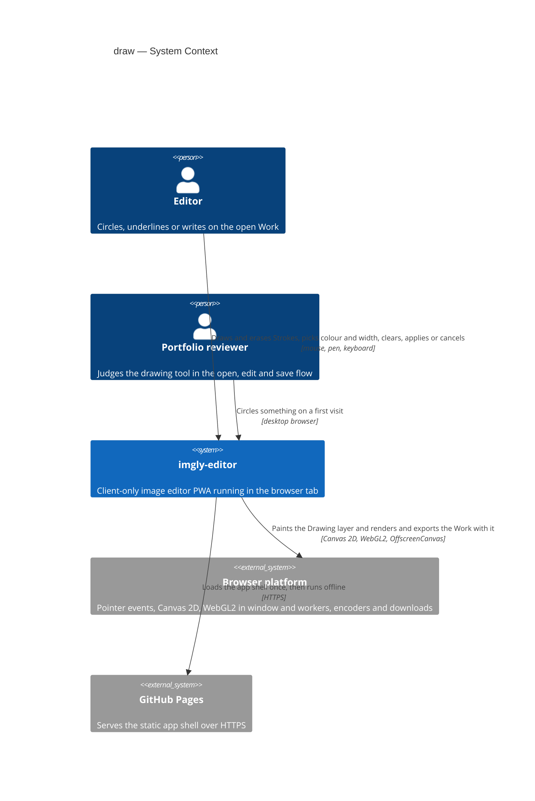
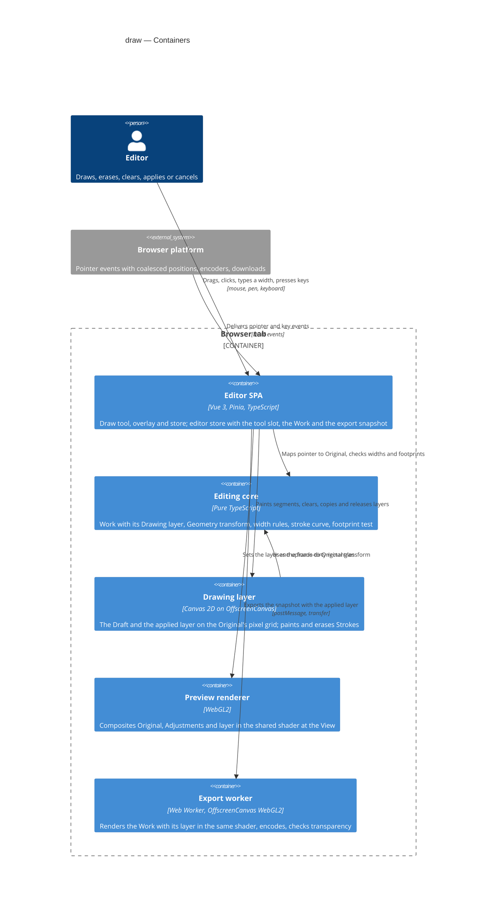
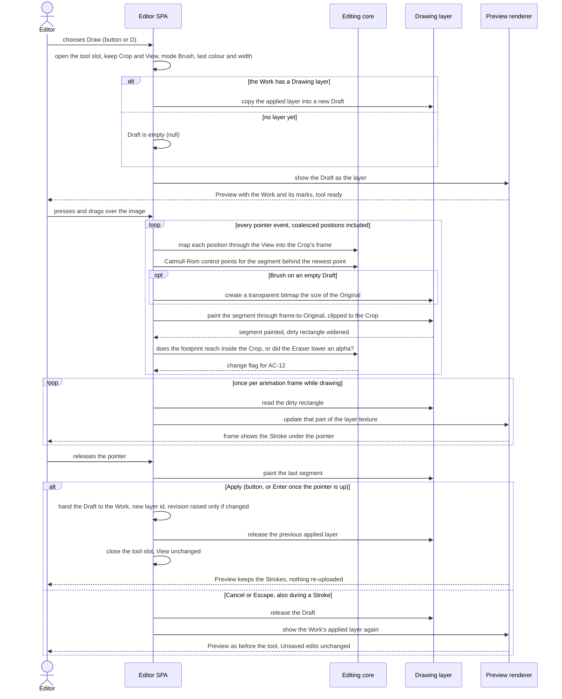
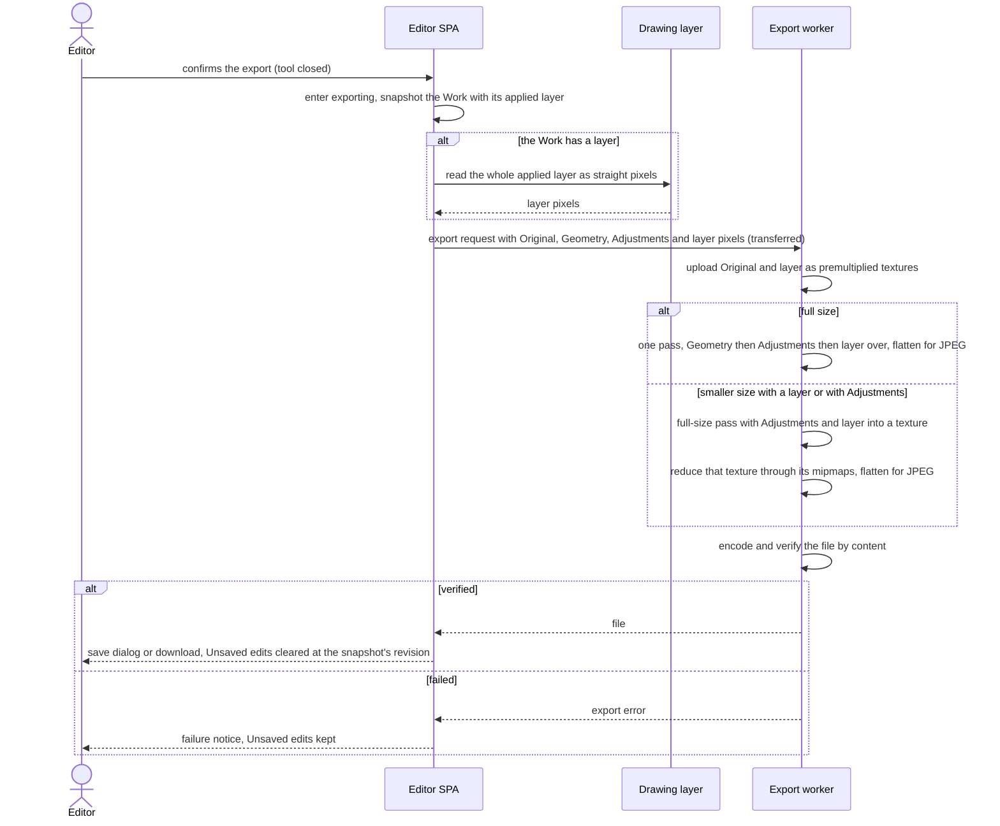

# Software Architecture Document — draw

<!-- 12 Arc42 sections. Empty section → <!-- N/A: <one-line reason> -->. -->
<!-- C4 Context (L1) lives inline in §3. C4 Container (L2) lives inline in §5. -->
<!-- Numbers in §10 come VERBATIM from spec.md §6 NFR — no inventing, no rounding. -->

## 1. Introduction and goals

**Intent.** draw gives the Editor one "Draw" tool in the shared tool slot. It has two modes, the Brush and the Eraser, a palette of 10 colours plus a custom colour, one width from 1 to 200 image pixels for both modes, and Clear (spec §1). Strokes appear under the pointer as the Editor draws, but they reach the Work only on Apply, and Cancel returns to the Drawing layer the Work had before. This is the same Draft pattern as "Crop and rotate" and "Adjust". The Drawing layer is the Work's one layer of marks. It is as large as the Original and attached to it, so every later Flip, Rotation, Straighten angle and Crop moves it together with the image. It is painted over the adjusted image and is never adjusted itself (root CONTEXT). The Original is never changed: the Eraser removes only marks, and Clear gives back exactly the image from before (spec §2). This is the third editing tool. It also adds the third part of the Work that repo ADR 0003 plans ("original + params + layer"), and undo and redo (roadmap step 7) and the gallery (step 8) build on it.

**Top-3 quality goals (1-liners; full scenarios in §10):**

1. **Fidelity, Preview to Export, with marks**: what the Editor applies is exactly what every Export contains. A full-size PNG Export is within 2 of 255 per channel of the Preview at 100% on all three engines, for every Geometry case and with Adjustments. An empty Drawing layer changes no pixel at all.
2. **Non-destructive marks that stay on the image**: no Stroke ever changes the Original's pixels, and the Eraser and Clear uncover exactly the image beneath. Marks follow every Geometry exactly. Four quarter turns or two Flips give an Export with a difference of 0, and a narrower Crop hides marks without removing them.
3. **Live, leak-free drawing**: on a 4096×3072 Work, a Stroke reaches the Preview at least 30 times per second and at most 50 ms after the pointer moves, at 1 px and 200 px, at Fit and at 100%. Opening the tool, Apply, Cancel and Clear, and a "Crop and rotate" Apply over a full layer, each take at most 150 ms. 50 Applies do not grow memory.

**Stakeholders.**

| Role | Interest | Sign-off owner? |
|---|---|---|
| Editor | Circles, underlines or writes on a photo in the colour and width they choose, fixes slips with the Eraser or Clear, and trusts that the photo underneath is never lost and that the Export matches the Preview | No |
| Portfolio reviewer | Finds the tool and circles something on the first try, by mouse or keyboard, in at most three actions (open the tool, draw, Apply) | No |
| Tech Lead | SAD approval. The Drawing layer's model, its place in the shared shader and the Draft's lifetime are inherited by roadmap steps 7 (undo and redo) and 8 (gallery) | Yes |
| Security Lead | Spec §6.1: the photos are confidential. An Export never contains a Draft that was not applied (AC-14, AC-15), and opaque marks used to hide something never let the covered pixels show through (AC-07). No full security review is needed | Yes |

<!-- Decision overrides (¶4) — populated by the critic resolution loop, empty otherwise. -->

## 2. Constraints

**Technical.**
- TypeScript 5.9 (`strict`), Node 24 toolchain, pnpm — repo ADR [0001](../../adr/0001-build-a-client-only-vue-pwa.md)
- Vue 3.5 (Composition API, `<script setup>`), Pinia 4 setup stores, Vite 8 and vite-plugin-pwa 2. It is a client-only static app on GitHub Pages under `/imgly/`, with no server, accounts or sync — repo ADR 0001
- **The drawing layer is a Canvas 2D bitmap composited over the adjusted image, and the Eraser uses `destination-out` on the layer only** — repo ADR [0004](../../adr/0004-render-adjustments-on-webgl2-and-drawing-on-canvas2d.md). It is binding for this feature, so painting Strokes on the GPU is not an option here. The open choices are where the bitmap lives, in which coordinates it is painted, and how it joins the WebGL2 render (§4)
- WebGL2 renders the Work, and the Preview and the Export share one shader source (`src/render/shaders.ts`). The shader maps each output pixel to the Original through `u_geometry` in one pass (crop-rotate [ADR-0002](../crop-rotate/adr/0002-render-the-geometry-in-the-shared-shader-in-one-pass.md)), then runs the Adjustments block under `u_adjust` on unpremultiplied stored sRGB values (adjust [ADR-0002](../adjust/adr/0002-apply-the-adjustments-in-the-shared-fragment-shader-on-stored-srgb-values.md)), then flattens onto white for JPEG under `u_flatten`. The Original is one premultiplied, mipmapped RGBA8 texture (open-and-view ADR-0003 and ADR-0004, `uploadTexture`)
- The Preview draws on `requestAnimationFrame` only after something changed (`src/render/preview-renderer.ts`). It uses nearest-texel magnification at 100% and above without a Straighten angle and mipmapped minification below, and it survives WebGL context loss by re-uploading the bitmap it keeps. The export worker renders on an `OffscreenCanvas` with the same program (export [ADR-0002](../export/adr/0002-render-and-encode-exports-in-a-dedicated-web-worker.md)), or in the window where the worker has no WebGL2 (export ADR-0003). It uploads the Original as `ImageData` because WebKit premultiplies bitmap copies wrongly. A smaller Export with Adjustments renders in two passes, full size and then reduced (adjust sad.md §5). Data crosses threads only by structured clone or transfer
- The Geometry is integer parameters on the Work, with one forward transform from the Crop's frame to the Original in `src/core/geometry/transform.ts` (crop-rotate ADR-0001). Every Geometry step is a rotation, a mirror or a translation, so it keeps lengths: one image pixel in the Crop's frame is one Original pixel
- Tools open in the `editor` store's `activeTool` slot, with their Draft in the tool's own store (crop-rotate [ADR-0003](../crop-rotate/adr/0003-open-tools-in-an-active-tool-slot-with-the-draft-in-the-feature-store.md)). `ToolId` is `'crop-rotate' | 'adjust'` today. "Crop and rotate" shows the whole turned image (`previewGeometry`, mode `whole`), and "Adjust" keeps the Work's Crop and the View
- Unsaved edits are a revision counter on the Work. Every edit goes through the `editor` store and `withEdit()`, which raises `revision`, and a successful Export sets `cleanRevision` (open-and-view ADR-0005)
- Functional core with feature folders: `core` is pure TypeScript with no DOM, features never import each other and coordinate through the `editor` store, and `infra` and `render` may call pure `core` functions — repo ADR [0002](../../adr/0002-organize-code-as-functional-core-with-feature-folders.md), repo `CLAUDE.md` §Module boundaries
- Non-destructive editing as "Original plus parameters plus a separate drawing layer" — repo ADR [0003](../../adr/0003-persist-works-in-indexeddb-as-original-plus-params-plus-layer.md). No persistence in this feature: the Drawing layer lives in session memory only, and IndexedDB is not touched (spec §3, §6.1)
- No undo or redo in this feature (spec §3, roadmap step 7)
- Targets: the latest desktop Chromium, Firefox and Safari. A pen or a finger draws as the mouse does, but no touch gestures are designed (spec §3, `docs/design-system.md` §Platform posture)

**Organisational.**
- Solo, spare-time project; owner Blazheiko. There is no per-feature effort budget beyond the 4–6 week MVP budget for the whole roadmap, and no hard deadline. Size M, route standard (`.size`, `.route`)
- TDD is on (`.claude/sdd.local.md`): Vitest units, and Playwright e2e on Chromium, Firefox and WebKit. `@perf` runs by hand on the reference machine (Apple M1 MacBook Air, latest stable Chrome, spec §6)

**Conventions.**
- Repo `CLAUDE.md` §Conventions: `core` and `render` return `Result<T, AppError>` and throw only for programmer errors. Unit tests are co-located as `*.test.ts`, and e2e tests live in `e2e/draw/*.spec.ts`, only for what happy-dom can't do (WebGL and Canvas 2D pixels, pointer timing, frame timing). Styling is plain CSS with tokens from `src/shared/styles/tokens.css`. Features expose `index.ts` and are mounted from `src/app/`
- A new editing tool follows the crop-rotate and adjust precedent (`docs/architecture-map.md` §Where things live): `src/features/draw/` with an action, the tool, `store.ts`, `messages.ts`, `shortcuts.ts` and `index.ts`, pure rules in `src/core/draw/`, a new `ToolId`, and slots filled in `App.vue`. The controls reuse `SegmentedControl`, `SliderField`, `NumberField` and `BaseButton` from `src/shared/ui/`
- `docs/design-system.md` §Interaction & writing conventions: one notice boundary, every action reachable by keyboard, and short plain microcopy. Refusals are hints on the unavailable control (ux-flows §Platform decisions)
- Field input rules follow crop-rotate AC-07 and adjust AC-05: values are checked when the Editor leaves the field or presses Enter in it, never while typing, and only plain decimal notation counts as a number (spec AC-03)
- `closeBitmap()` before dropping any `ImageBitmap` (`src/shared/bitmap-ledger.ts`), so e2e can count what is retained

**Regulatory / external.**
- Data classification: confidential (spec §6.1). Pixels never leave the device except as the file the Editor exports. An Export holds only the applied Drawing layer, never a Draft (AC-14, AC-15). Brush marks are fully opaque, so a mark used to hide something never lets the covered pixels show through in an Export (AC-07). The Original still holds them until the Work is replaced, which is the non-destructive promise
- No accounts, so no AuthN/AuthZ. The only refusals are the app's own rules: no "Draw" tool during an export (AC-14), no Export while the tool is open (AC-15) and one tool at a time (AC-16)
- Abuse cases are bounded by the model: the Drawing layer is one bitmap the size of the Original, so memory does not grow with the number of Strokes, and the width field accepts only whole numbers from 1 to 200 (AC-03)
- Security review: N/A per spec §6.1

## 3. Context and scope

imgly-editor is an offline, client-only image editor running entirely in the browser tab. draw adds its third editing tool: the Editor paints and erases marks on the open Work's Drawing layer inside the app, and the result reaches the outside world only through export, which already renders the Work and hands the file to the browser or the operating system. Nothing goes to a server, and GitHub Pages only serves the static app shell.

<!-- brownfield: docs/architecture-map.md reflects 71f9628, before adjust shipped (78 commits since), so the code was read directly at 36f250f. open-and-view, export, crop-rotate and adjust are shipped. The Work has `geometry` and `adjustments` but no layer (`src/core/document.ts`). src/render/shaders.ts holds the one program (u_transform, u_geometry, u_flatten, u_adjust and seven colour uniforms) over one premultiplied, mipmapped RGBA8 texture. The Preview renderer keeps the Original's bitmap for context restore and has setGeometry (crop | whole), setAdjustments and sampleCrop. The editor store (515 lines) has the activeTool slot (ToolId 'crop-rotate' | 'adjust'), previewGeometry, previewAdjustments, applyGeometry, applyAdjustments, sampleWork, spacePan and ExportSnapshot { original, geometry, adjustments, ... }. The export worker-handler renders in one pass, or two for a smaller adjusted Export, and runs the alpha check with neutral Adjustments. No Canvas 2D drawing code exists yet. Run `/sdd:survey` to refresh the map. -->

**Trust boundary.** The tool adds no new input from outside the app. Its only inputs are the Editor's own pointer positions, keys and typed width, which the input rules bound (AC-03, AC-18, AC-19). The trust boundary stays where open-and-view and export put it: decoded files coming in, and what the browser's encoder and file system return going out. This feature's job at that boundary is that an Export holds only the applied Drawing layer (AC-14, AC-15).

**External systems (in / out):**

| Actor or system | Type | Interaction |
|---|---|---|
| Editor | Person | Opens the "Draw" tool, drags with the Brush or the Eraser, picks a colour and width, chooses Clear, then applies or cancels, by mouse, pen or keyboard |
| Portfolio reviewer | Person | Tries the tool on a first visit, usually on a desktop browser, and judges how closely the line follows the pointer |
| Browser platform | System (external) | Provides pointer events with coalesced positions, Canvas 2D, WebGL2 in the window and in workers, and the encoders and downloads that export already uses |
| GitHub Pages | System (external) | Serves the static app shell and the worker scripts on first load and updates; never sees an image |

**External: no third-party service** — deliberate. There is no upload, no cloud storage of drawings and no remote processing: the Drawing layer is painted, held and composited on the device (§2 Regulatory, spec §6.1).

**C4 Context (L1):**



The Editor and the Portfolio reviewer drive the app by mouse, pen and keyboard. The app paints the Drawing layer with the browser's Canvas 2D and renders the Work with it through WebGL2, in the Preview and in the export worker. GitHub Pages is only the first-load source of the code. The operating system's file dialog belongs to export and is unchanged.

## 4. Solution strategy

**Target surface.** `target_surfaces: [web-frontend]` (frontmatter). The feature extends the one runnable surface, the Editor SPA in the browser tab. The export worker it changes is an internal container of that surface (§5). Decided inline: there is no server (repo ADR 0001) and no published library, so §2 excludes the other surfaces.

**UI architecture (web-frontend).** Inherited from open-and-view, export, crop-rotate and adjust: a client-rendered SPA with one editor view and no router. The "Draw" tool (SCR-03) is a mode of that view in the same tool slot as "Crop and rotate" and "Adjust". Like "Adjust", it keeps the Work's Crop and the View as they are (AC-18), takes over the tool panel in place and never opens a page (ux-flows §Platform decisions). A DOM overlay over the Preview takes the pointer, as crop-rotate's frame does (crop-rotate ADR-0005). State lives in Pinia setup stores, and the controls reuse `src/shared/ui/` primitives (`SegmentedControl` for the mode, `SliderField` and `NumberField` for the width, `BaseButton`) and `tokens.css`. No new ADR: §2 excludes server rendering, and crop-rotate ADR-0003 already provides the tool-mode mechanism.

**Top strategic choices (the seeds for ADRs):**

1. **The Drawing layer is one bitmap on the Original's pixel grid, created on the first mark** — [ADR-0001](adr/0001-hold-the-drawing-layer-as-one-bitmap-in-the-original-pixel-space-created-on-the-first-mark.md). `Work.drawing` is `null` for a new Work and becomes a W₀×H₀ Canvas 2D bitmap when a Brush first paints in a Draft. Each applied layer carries a new id. The bitmap is never resampled when the Geometry changes, so Geometry round trips and hidden marks under a narrower Crop are exact by construction (AC-08). Serves quality goals 1, 2 and 3.
2. **Each Stroke segment is painted straight into the Draft in Original coordinates, through the Geometry's transform and clipped to the Crop** — [ADR-0002](adr/0002-paint-each-stroke-segment-straight-into-the-draft-in-original-coordinates.md). Pointer positions, coalesced ones included, are mapped through the View into the Crop's frame. Canvas 2D paints centripetal Catmull–Rom segments with round caps under `setTransform(frameToOriginal)` and `clip(crop)`. The Brush paints with `source-over` and the Eraser with `destination-out`. Only the dirty rectangle reaches the GPU each frame. The live line is the applied line (AC-01, AC-04, AC-09). Serves quality goals 1 and 3.
3. **The layer is composited in the shared fragment shader, after the Adjustments and before the JPEG flatten** — [ADR-0003](adr/0003-composite-the-drawing-layer-in-the-shared-fragment-shader-after-the-adjustments.md). A second sampler, `u_layer`, is read with the same `v_uv` as the Original and composited as premultiplied "over" under `u_draw`. The Preview, the export worker and its window fallback, the crop-transparency check and `previewAt100()` all use this one path. "Crop and rotate" shows every mark, and "Adjust" and Compare leave the marks unadjusted without tool-specific code (AC-10, AC-11). Serves quality goals 1 and 2.
4. **The Draft is a full copy of the layer, handed to the Work on Apply; an applied layer is never painted again** — [ADR-0004](adr/0004-hold-the-draft-as-a-full-copy-of-the-layer-and-hand-it-to-the-work-on-apply.md). The `draw` store copies `work.drawing` on open. The Preview shows the Draft through `editor.setPreviewLayer`. Apply is `editor.applyDrawing(draft, changed)`, a reference handover. Cancel, Escape and replacing the Work release the Draft. Every release is explicit and counted (AC-05, AC-06, AC-13). Serves quality goals 2 and 3.
5. **One Apply of the tool is one undo step; there is no per-Stroke history** — [ADR-0005](adr/0005-make-one-apply-of-the-draw-tool-one-undo-step.md). This answers spec §8's open question in favour of its default, the same unit as "Crop and rotate" and "Adjust". With ADR-0004's immutable layers, step 7 undoes an Apply by swapping layers.

Decided inline, below the ADR gate:
- **Unsaved edits come from a per-Draft change flag, never a pixel comparison** (AC-12, ux-flows design input 4). The flag starts false on open and turns true on the first of these:
  - a Brush Stroke whose footprint (its path widened by half the width, with round ends) reaches inside the Crop, judged geometrically by a pure `core/draw` function;
  - an Eraser segment that lowered the alpha of some layer pixel, judged by comparing the segment's dirty rectangle before and after painting, and only until the flag is true;
  - a Clear of a Draft whose bitmap had some pixel with alpha above 0, judged by one scan of the bitmap.

  Drawing a mark and erasing it again therefore still counts (AC-12). `editor.applyDrawing` raises the revision only when the flag is true. The comparison is only ever with the layer from when the tool was opened, because nothing else can change `work.drawing` while the tool is open.
- **The tool keeps the Work's Crop and the View** (AC-18). `openTool('draw')` sets no `previewGeometry`, as for "Adjust", so the Editor draws on the image as it stands, with its Geometry and its applied Adjustments (AC-11). A Stroke's footprint outside the Crop is clipped (ADR-0002).
- **No persistence.** The layer lives in session memory and ends with the Work (spec §3). Step 8 stores it as a PNG Blob with a forward migration, as repo ADR 0003 plans.

Each tactical decision in later sections traces to one of these seeds. A tactical decision that contradicts one is surfaced in §11.

## 5. Building block view

The layering is the repo's functional core with feature folders (repo ADR 0002), unchanged. Pure rules go in `src/core/draw/`: the width rules, the stroke curve, the footprint test and the frame-to-Original transform. The Canvas 2D bitmap and its painter go in `src/render/drawing/`, next to the WebGL2 renderer that composites them. The tool, its Draft, its overlay and its keys go in `src/features/draw/`, following crop-rotate and adjust. Features still never import each other: the `draw` store reaches the Work and the Preview only through the `editor` store (`setPreviewLayer`, `layerChanged`, `applyDrawing`), as adjust does through `setPreviewAdjustments` and `applyAdjustments`. The hot path does not go through Vue reactivity. A pointer event goes to the `draw` store's Stroke session, which calls the painter. Once per frame the dirty rectangle goes to `editor.layerChanged(rect)` and on to the renderer. The bitmap handle sits in a plain field, so a pointer move triggers no reactive update.

**The tool slot is extracted from the `editor` store before the third tool lands** (decided inline; it answers adjust sad.md §11's risk, due before this step's `tasks`). The store is 515 lines today and draw adds the layer preview, `applyDrawing` and the snapshot's layer. One refactoring task moves `activeTool`, `openTool`, `closeTool`, the per-tool previews (`previewGeometry`, `previewAdjustments`, `previewLayer`) and their setters into `src/features/editor/tool-slot.ts`, which the store composes. The store's public API stays as it is, and its existing tests must pass unchanged before any draw code is added.

**Cross-feature changes (editor, export, crop-rotate, adjust, app shell):**
- **editor** (`store.ts`, `tool-slot.ts`): `ToolId` gains `'draw'`. `openTool('draw')` keeps the Crop and the View, as for `'adjust'`. New: `previewLayer` with `setPreviewLayer(layer | null)` (only while the "Draw" tool is open), `layerChanged(rect)`, which forwards to the renderer, and `applyDrawing(layer, changed)`, which is refused while exporting and raises the revision only when `changed` is true (§4). `closeTool()` clears `previewLayer`. `replace()` closes the tool, and the `draw` store releases its Draft when its tool is closed this way (AC-13). `ExportSnapshot` gains `drawing`, the applied layer or `null`.
- **editor `PreviewCanvas.vue`**: passes `previewLayer ?? work.drawing` to `renderer.setLayer()`. While the "Draw" tool is open, a main-button drag over the image belongs to the draw overlay, not to the pan gesture. Space-drag, the wheel, pinch and the zoom keys keep their open-and-view behaviour (AC-18), through the existing `spacePan` flag that lets a drag through an overlay.
- **render** (`shaders.ts`, `preview-renderer.ts`): `u_layer`, `u_draw`, `setLayer` and `updateLayer` (ADR-0003). `sampleCrop` stays without the layer.
- **render/export** (`worker-handler.ts`, `client.ts`): `ExportRequest` and `AlphaRequest` gain `layer: ImageData | null`, transferred. Single-pass rendering now applies only when the Export is full size, or when the Adjustments are neutral and there is no layer. Otherwise the two passes of adjust sad.md §5 run with the layer in the first pass (AC-10).
- **export** (`store.ts`, `messages.ts`): the snapshot's layer is read with `getImageData` once per export and per alpha check. The alpha check's cache key gains the layer id (ADR-0003). `infoToolOpen('draw')` says "Apply or cancel the drawing first, then export." for the action and Ctrl/Cmd+S (AC-15).
- **crop-rotate, adjust**: no change. Their actions and keys already refuse with "Apply or cancel the open tool first." whenever another tool is open, and stay silent in a text field (AC-16). An e2e test runs that rule with "Draw" open.
- **app shell** (`App.vue`, `test-hooks.ts`): `DrawAction` sits in `top-bar-actions` after `AdjustAction` (AC-19), with `DrawOverlay` in `tool-canvas` and `DrawTool` in `tool-panel`. The e2e hooks gain a way to put a reference drawing on the Work without driving the pointer, and `previewAt100()` renders with the layer.

**Internal decomposition:**

```
src/core/draw/                 pure rules, no DOM
├── settings.ts                PALETTE (10 colours, AC-02), DEFAULT_COLOUR #E53935, DEFAULT_WIDTH 12, MIN/MAX_WIDTH 1…200
├── width.ts                   parseWidth (AC-03 field rules, "px" suffix), stepWidth ([ ] ±1, ±10 with Shift, clamped; AC-19)
├── stroke.ts                  catmullRomSegments (points → Bézier control points), segmentBounds, footprintReachesCrop (AC-12)
└── index.ts
src/core/geometry/transform.ts + frameToOriginal(g, original) — the pixel-unit form of cropToOriginalUv's frame step
src/core/view/                 + deviceToFrame(view, crop, point) — the inverse of the View for one point
src/core/document.ts           + Work.drawing: DrawingLayer | null; DrawingLayer { id, width, height, pixels }
src/render/drawing/            Canvas 2D bitmap (repo ADR 0004)
├── layer.ts                   createLayer, copyLayer, releaseLayer (0×0 + ledger), readRect, hasAnyMark
├── painter.ts                 paintSegment / paintDot (Brush source-over, Eraser destination-out) under setTransform + clip
└── index.ts
src/render/shaders.ts          + u_layer, u_draw, setLayerUniforms
src/render/preview-renderer.ts + setLayer, updateLayer (dirty rect + mipmaps)
src/render/export/             + layer in ExportRequest / AlphaRequest, two-pass condition
src/features/draw/
├── DrawAction.vue             top-bar "Draw" button, D key, hints (AC-14, AC-16, AC-17, AC-19)
├── DrawTool.vue               panel: mode, palette + custom colour, width slider + field, Clear, Cancel, Apply
├── DrawOverlay.vue            tool-canvas: pointer capture, coalesced events, width circle under the pointer
├── store.ts                   Draft, changed flag, mode, colour, width, the Stroke session
├── shortcuts.ts               B, E, [ ], Enter, Escape inside the tool (AC-19); letter-first, then key position
├── messages.ts                hints and labels
└── index.ts
src/features/editor/tool-slot.ts   extracted active-tool slot and per-tool previews (above)
```

`screens` decides whether the palette needs a new swatch primitive. A new primitive is built in `src/shared/ui/` and registered in `docs/design-system.md`.

**C4 Container (L2):**



The Editor drives the Editor SPA, where the draw tool and its store live. The SPA asks the editing core to map pointer positions onto the Original and to check widths and footprints. It has the Drawing layer container paint each segment through core's transform, hands the dirty rectangle to the WebGL2 Preview renderer, and sends the applied layer with the export snapshot to the export worker. The renderer and the worker composite the layer with the same shader. The browser platform delivers the pointer and key events. The decode worker, the service worker and the Works store are unchanged and left out.

## 6. Runtime view

The participants are the §5 containers: the Editor SPA (the draw overlay, the `draw` store and the `editor` store), the Editing core, the Drawing layer, the Preview renderer and the Export worker. Messages are semantic. This stage seeds the two critical flows, and `sequences` covers every remaining AC as a flow or a branch.

**Critical flow 1: open the tool, draw a Stroke, then Apply or Cancel**



**Critical flow 2: export a Work with marks, at full or smaller size**



**Branches the `sequences` stage draws:**
- the Eraser path, a dot from a click, and Clear (AC-04, AC-05), with the AC-12 flag in each;
- a Stroke that starts or ends outside the Crop (AC-09);
- zoom, pan and Space during a Stroke, a pointer cancel, losing focus and a second touch (AC-18);
- opening another image while the tool is open (AC-13);
- the refusals: "Draw" during an export, export or Ctrl/Cmd+S while the tool is open, and one tool at a time (AC-14, AC-15, AC-16, AC-17);
- "Crop and rotate" and "Adjust" over applied marks (AC-08, AC-11), and the crop-transparency check with a layer (AC-10).

## 7. Deployment view

The topology is unchanged. The feature ships inside the existing static app on GitHub Pages under `/imgly/`, as part of the same Vite build, and runs entirely in one browser tab. There is no server, replica or scaling unit to add. The service worker precaches the larger app shell and the changed export worker script exactly as it does today, so the tool works offline after the first load. No new hosting configuration, header or permission is needed. Canvas 2D on an `OffscreenCanvas` in the window is available in every target browser, and OffscreenCanvas and WebGL2 are already start-up requirements (open-and-view capability gate).

**Monitoring:**
- No runtime telemetry, by design: the app sends nothing anywhere (§2 Regulatory).
- Performance marks in the e2e build are the measurement points for spec §6:
  - a "tool ready" mark when SCR-03 is first drawn;
  - a mark per frame that shows a Stroke, matched to the scripted pointer move that caused it;
  - marks from Apply, Cancel, Clear and a "Crop and rotate" Apply to the redrawn Preview.

  Frame timing uses the existing performance trace, and memory uses whole-page memory through `e2e/perf-memory.ts`. The `@perf` suite (`PERF=1`) reads them on the reference machine, not in CI.
- The bitmap ledger counts created and released layers in DEV and e2e builds, so e2e can assert that exactly one applied layer, or none, is retained after Apply, Cancel and replacing the Work (ADR-0004).
- CI runs the fidelity, empty-layer and Geometry round-trip pixel checks on Chromium, Firefox and WebKit with every push (§10).

**Scaling thresholds:**
- The Downscale limit bounds everything: the Original's long side is at most 4096 px, so a layer is at most 4096 × 4096 px (64 MB of RGBA).
- While the tool is open there are at most two layers in memory (the applied one and the Draft, up to 128 MB) and one layer texture with mipmaps on the GPU (about 85 MB). With the tool closed there is one layer, or none for a Work that was never drawn on (ADR-0001, ADR-0004).
- An export with a layer moves up to 64 MB of straight pixels to the worker by transfer, not by copy. A smaller Export with a layer holds one extra full-size texture in the worker for the length of that export (adjust sad.md §5).
- 4096 × 4096 is exactly the largest canvas area some Safari builds allow (16,777,216 px), so a layer never exceeds it (§11).
- 50 Applies stay within spec §6's ≤ 110% of memory after the first Apply, because each Apply releases the layer it replaces.

## 8. Crosscutting concepts

| Concept | Convention | Where defined |
|---|---|---|
| Error handling | `Result<T, AppError>` in `core` and `render`, with no new error codes. The width rules never fail: out-of-range values snap, fractional values round half up, and empty or non-numeric values revert (AC-03). A failed layer upload or render is open-and-view's display-lost path (`DISPLAY_LOST`), unchanged, and a failed export with a layer is the existing `EXPORT_FAILED`. Creating a canvas larger than the engine allows is a programmer error, because the Downscale limit bounds the layer (§7) | repo `CLAUDE.md` §Conventions; here |
| Edit entry point | Every change to the Work goes through the `editor` store. The tool calls `applyDrawing(layer, changed)`, which stores the layer and raises the revision through `withEdit()` only when the per-Draft flag is true (§4, AC-12). The tool never writes the Work directly | open-and-view ADR-0005; ADR-0004 |
| Tool state | One tool at a time in the extracted tool slot (§5), separate from the editor's phase. The Draft, the change flag and the Stroke session live in the `draw` store and reach the Preview only through `editor.setPreviewLayer` and `editor.layerChanged`. The Draft never counts as Unsaved edits (AC-13). The colour and the width are tool settings kept in the `draw` store until reload, never edits (AC-02) | crop-rotate ADR-0003; ADR-0004 |
| Coordinates | Three spaces with one direction of mapping. Device pixels on the canvas map through the View (`deviceToFrame`) into the Crop's frame, which maps through the Geometry (`frameToOriginal`) onto the Original's pixel grid, where the layer lives. Widths are in image pixels, the same in the frame and on the Original, because every Geometry step keeps lengths. Nothing is ever mapped back from the layer to the screen except by the shader | ADR-0001, ADR-0002; crop-rotate ADR-0001 |
| Pixel pipeline | The Original is sampled through the Geometry. Then the Adjustments run on unpremultiplied stored sRGB values, then the layer is composited premultiplied "over" (never adjusted), then JPEG flattens onto white. Every renderer uses this one order. The layer is uploaded premultiplied from straight `ImageData`, like the export's Original | ADR-0003; adjust ADR-0002; root CONTEXT "Drawing layer" |
| Input | Pointer events with pointer capture on the draw overlay, coalesced positions where the engine offers them. Each position maps with the View current at that event. A Stroke ends on release, pointer cancel, window blur or a second pointer, and keeps what was drawn (AC-18). Key, colour, width and Space changes during a Stroke apply from the next Stroke. Escape cancels at once | ADR-0002; spec AC-18 |
| Keyboard shortcuts | Each feature owns its keys. draw owns D. It is silent while the export panel is open, while the "Draw" tool is already open, while a field has focus and during an export (AC-14, AC-19). It shows "apply or cancel the open tool first" while another tool is open (AC-16) and "open an image first" with no image (AC-17). Inside the tool it owns B, E, [ and ] (±1, ±10 with Shift, repeating while held, clamped to 1…200), Enter (apply, except in a field or on a focused button, and only after the pointer is up) and Escape (cancel from anywhere). D, B and E are matched letter-first and then by key position. [ and ] are matched by the character typed and then by the two key positions right of P, so Shift+[ and the German ü and + keys work (AC-19). All are silent in a text field. Zoom and pan keys stay with the editor (AC-18). export turns Ctrl/Cmd+S into the "apply or cancel the drawing first" hint while draw is open (AC-15) | here; crop-rotate and adjust sad.md §8 |
| Field input | The width field is checked only when it is left or Enter is pressed in it, never while typing, and Enter in it never applies the tool. Only plain decimal notation with one decimal point or comma counts as a number, and a trailing "px" is accepted in any letter case, with or without spaces (AC-03) | crop-rotate AC-07; adjust AC-05; here |
| Accessibility | Every control is a focusable DOM control with a role and label from the shared primitives. The mode is a radiogroup. Each palette colour is a radio labelled with its name and marked when chosen, and the custom colour is the browser's colour input. The width is a slider plus a field that reports its value in px. Hints on unavailable controls are reachable by keyboard. Drawing itself needs a pointer, as AC-19 states | `docs/design-system.md`; `src/shared/ui/` |
| Resource lifetime | Every layer and Draft bitmap is released explicitly (canvas set to 0×0) and counted by the bitmap ledger next to `closeBitmap()`. The Preview keeps one layer texture, replaced when the layer id changes. The export reads the layer once per export and transfers it, and the worker deletes its textures with its context. A Draft is released on Apply's handover of the old layer, on Cancel, on Escape and on replacing the Work | ADR-0001, ADR-0004; open-and-view sad.md §8 |
| Privacy | An Export holds only the applied layer: Export is unavailable while the tool is open (AC-15), and an export in progress refuses the tool (AC-14). Marks are fully opaque, so covered pixels never show through in an Export (AC-07). Nothing about the drawing is logged or sent anywhere | spec §6.1 |
| ID strategy | Each applied layer gets an id from `newId()` (UUIDv7). It keys the Preview's texture and the export's alpha-check cache. There are no other new entities | repo `CLAUDE.md` §Conventions; ADR-0001 |
| Persistence | None: the layer lives in session memory and ends with the Work (spec §3). Step 8 stores it as a PNG Blob with a new forward migration step | repo ADR 0003; ADR-0001 |
| Internationalisation | N/A: English microcopy in the feature's `messages.ts`, as in the shipped features. Palette colour names are English labels | — |
| Test hooks | The e2e build's `window.__imglyTest` gains a way to put a reference drawing on the Work directly: Strokes at 1, 12 and 200 px in the 10 preset colours plus erased parts, painted through the same painter. The fidelity, round-trip and memory tests then reach every case without scripting the pointer. `previewAt100()` renders with the Work's layer, so the comparison stays Preview against Export. Scripted pointer moves at 120 per second drive only the timing and the AC-01 path tests | repo `CLAUDE.md` §Commands; here |

## 9. Architecture decisions

<!-- 🎯 Why: the REVERSE INDEX onto the adr/ folder. `ls adr/` gives the files; §9 gives the
     semantics — why they exist, which SAD section they attach to, what status.
     📋 Write: a 4-column table, one row per ADR. Mixed status is fine.
     📌 e.g. «0001 | Store content as a table of typed blocks | Accepted | §4». -->

| # | Title | Status | Section |
|---|---|---|---|
| <NNNN> | <imperative — e.g. "Use a sliding-window counter for rate limiting"> | Accepted | §<N> |
| <NNNN> | <imperative — e.g. "Co-locate the worker in the API process"> | Accepted | §<N> |

ADR files live under `docs/features/<slug>/adr/NNNN-<title>.md`.

## 10. Quality requirements

<!-- 🎯 Why: the QUALITY TREE — take a goal from §1 and break it into concrete leaves: tests,
     metrics, configs, drills. ⭐ Without §10, §1 is a manifesto. With §10 each declaration maps
     to something PROVABLE.
     📋 Write: per §1 goal — When / Then / How-verify. Numbers from spec §6 NFR VERBATIM (don't
     round ≤250ms to ≤300ms — that's a critic F6 hit).
     📌 e.g. «p95 ≤ 500 ms on a block update, verified by a 100 req/s load test». -->

Each top-3 goal from §1 expanded into a full scenario:

**QG-1. <quality attribute>**
- **When:** <trigger condition>
- **Then:** <expected behaviour with numbers from spec §6 NFR>
- **How verify:** <test / chaos drill / load test / metric>

**QG-2. <quality attribute>**
- **When:** <trigger>
- **Then:** <expected>
- **How verify:** <how>

**QG-3. <quality attribute>**
- **When:** <trigger>
- **Then:** <expected>
- **How verify:** <how>

## 11. Risks and technical debt

<!-- 🎯 Why: ⭐ collects EVERYTHING that can break — not only the technical. Without §11 risks get
     discussed at standups and lost; debt lives only in the head of whoever accepted it.
     📋 Write: a risk/debt table — severity — mitigation — owner. Accepted debt in its own block.
     📌 The first risk is often a product risk, not a technical one. That's normal. -->

<!-- Severity literals: Low / Medium / High for regular risks; "Open question" for rows created by
     a Save-as-OQ resolution during the Socratic walk (see references/socratic.md). -->

| Risk / debt | Severity | Mitigation | Owner |
|---|---|---|---|
| <e.g. Worker lag may reach hours during a downstream outage> | Medium | <alert >10 min, on-call playbook, retry backoff> | <DevOps> |
| <e.g. No event-schema versioning in v1> | Medium | <ADR-NNNN planned for v2, tolerate unknown fields> | <Backend> |
| Open architectural decision: <decision-headline> | Open question | Resolve before <stage trigger or YYYY-MM-DD>; <inline rationale from the Save-as-OQ> | <owner> |

**Accepted debt (acceptable in v1, plan to fix later):**
- <e.g. the entity is immutable / unversioned — OK for v1, may need audit versioning in v2>

## 12. Glossary

<!-- 🎯 Why: ⭐ the DOMAIN GLOSSARY that ends arguments a year later («checkpoint — weekly or
     biweekly? quarter — calendar or fiscal?»).
     📋 Write: a term / meaning table. Business + technical terms mixed.
     📌 e.g. «Lesson | a unit inside a course made of blocks (text, video)». -->

| Term | Meaning |
|---|---|
| <e.g. domain object A> | <its meaning in this domain> |
| <e.g. domain object B> | <its meaning> |
| <e.g. domain invariant name> | <the rule, in plain language> |
