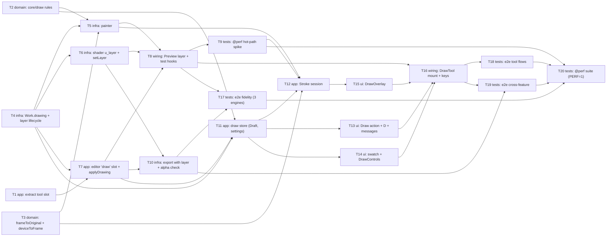

# Epic — draw

> **Spec:** [spec.md](../spec.md) · **Design:** [sad.md](../sad.md) · **Screens:** [screens.md](../screens.md) · **UX flows:** [ux-flows.md](../ux-flows.md) · **ADRs:** [adr/](../adr/)
> There is no `data-model.md`, because nothing changes in the schema: the Drawing layer lives in session memory (`sad.md` §2, §8 Persistence). There is no `contracts/` folder, because the feature has no external interface (`target_surfaces: [web-frontend]`).

## Goal

Ship roadmap step 6, the third editing tool. It is one "Draw" tool with the Brush and the Eraser, a palette of 10 colours plus a custom colour, one width from 1 to 200 px, and Clear. Every Stroke shows under the pointer and reaches the Work only on Apply (spec §2, goal 1). The Drawing layer is one bitmap on the Original's pixel grid. The Eraser and Clear therefore uncover exactly the image beneath, and marks follow every later Crop, turn, flip and straighten (goal 2). The Preview and every Export composite the layer in the one shared shader, so the Export matches the Preview in every target browser (goal 3). Size M, route standard.

## Scope

- **In:**
  - the extracted editor tool slot (`sad.md` §5);
  - `src/core/draw/` (palette, width rules, curve, footprint), `frameToOriginal` and `deviceToFrame`, and `Work.drawing` (ADR-0001, ADR-0002);
  - `src/render/drawing/` (layer lifecycle and painter), `u_layer`/`u_draw` in the shared shader, `PreviewRenderer.setLayer`/`updateLayer`, and the export worker's layer, two-pass reduction and transparency check (ADR-0003);
  - the editor's `'draw'` tool, `applyDrawing` and the snapshot's layer (ADR-0004);
  - the new `src/features/draw/` feature (store, Stroke session, action and D key, controls, overlay, in-tool keys);
  - a `swatch` option on `SegmentedControl`;
  - e2e fidelity, tool-flow, cross-feature and `@perf` suites.
- **Out** (spec §3):
  - shapes, arrows, lines, text and stickers;
  - opacity, softness, blend modes, pressure and tilt;
  - selecting, moving or restyling a Stroke, and more than one layer;
  - undo and redo (step 7; ADR-0005 fixes the unit as one Apply);
  - persisting the drawing (step 8);
  - touch-first gestures.

## Task map

**Waves** are the topological levels of `deps`. Tasks in one wave can run in parallel unless they share a lane.

| Wave | Tasks |
|---|---|
| 1 | T1, T2, T3, T4 |
| 2 | T5, T6, T7 |
| 3 | T8, T10, T11 |
| 4 | T9, T13, T14, T17 |
| 5 | T12 |
| 6 | T15 |
| 7 | T16 |
| 8 | T18, T19 |
| 9 | T20 |

**Lanes** are overlapping `files_hint`, which `implement` serializes:
- `src/features/editor/tool-slot.ts`, `tool-slot.test.ts` and `store.ts`: T1, T7
- `src/render/drawing/index.ts`: T4, T5
- `src/features/draw/store.ts` and `store.test.ts`: T11, T12
- `src/features/draw/index.ts`: T11, T13, T16
- `src/features/draw/messages.ts`: T13, T14
- `src/features/draw/shortcuts.ts`, `shortcuts.test.ts` and `src/app/App.vue`: T13, T16
- `e2e/draw/helpers.ts`: T17, T18, T19
- `e2e/draw/perf.spec.ts`: T9, T20

**Compile-coupled changes, folded in** (tasks step 5):
- `Work.drawing` (T4) fixes every `Work` constructor and fixture in the same task.
- `PreviewRenderer.setLayer`/`updateLayer` (T6) update the fake renderer.
- `ToolId` gains `'draw'` (T7) together with export's `TOOL_OPEN` record entry, and `ExportSnapshot.drawing` is set in `beginExport` in the same task.
- `ExportRequest.layer`/`AlphaRequest.layer` (T10) update the worker handler, the client, the export store and the format-check probe together.

## Tasks

See [tracker.md](./tracker.md) for status. Machine contract: [tasks.json](../tasks.json).

| # | Task | Layer | Blocked by | DoD (short) |
|---|---|---|---|---|
| [T1](./t01-editor-extract-tool-slot.md) | Extract the tool slot from the editor store into tool-slot.ts, with the store's public API and its tests unchanged | app | — | old tests pass unchanged |
| [T2](./t02-core-draw-rules.md) | Add src/core/draw: palette and defaults, parseWidth and stepWidth, Catmull–Rom segments, segment bounds and footprintReachesCrop | domain | — | AC-03 table, curve, footprint |
| [T3](./t03-core-coordinate-maps.md) | Add frameToOriginal to the Geometry transform and deviceToFrame to the View, both unit-tested against the existing UV transform | domain | — | agrees with cropToOriginalUv; View inverse |
| [T4](./t04-work-drawing-and-layer-lifecycle.md) | Add Work.drawing (DrawingLayer | null) and the render/drawing layer module: create, copy, release with ledger counts, readRect and hasAnyMark | infra | — | createWork null; release counted |
| [T5](./t05-render-drawing-painter.md) | Add the painter: paintSegment and paintDot with Brush source-over and Eraser destination-out under setTransform(frameToOriginal) and clip(crop), the dirty rectangle and the alpha-lowered check | infra | T2, T3, T4 | composite op, clip, dirty rect, alphaLowered |
| [T6](./t06-render-shader-layer-composite.md) | Composite the layer in the shared shader (u_layer, u_draw) and add PreviewRenderer.setLayer and updateLayer with context-loss restore | infra | T4 | u_draw off = today; upload rules |
| [T7](./t07-editor-draw-slot.md) | Give the tool slot the 'draw' tool: keep Crop and View on open, previewLayer and setPreviewLayer, layerChanged, applyDrawing with the change flag, ExportSnapshot.drawing and the export refusal text | app | T1, T4 | revision rules, View kept, snapshot layer |
| [T8](./t08-preview-layer-and-test-hooks.md) | Make PreviewCanvas show the Draft or the Work's layer, and give the e2e hooks a reference drawing, a scripted Stroke, a layered previewAt100 and the layer ledger | wiring | T5, T6, T7 | Draft vs Work layer; hooks |
| [T9](./t09-perf-spike-hot-path.md) | Spike the hot path: a @perf e2e that paints scripted Strokes through the hooks at 1 px and 200 px, at Fit and at 100%, and records the frame interval and the pointer-to-frame latency | tests | T8 | 4 cases measured, decision recorded |
| [T10](./t10-export-with-layer.md) | Send the applied layer to the export worker and its window fallback, render it in one or two passes, and make the crop-transparency check include the layer | infra | T6, T7 | layer transferred; 1 vs 2 passes; key |
| [T11](./t11-draw-store-draft-settings.md) | Add the draw store: open with a copy of the layer, mode reset to Brush, colour and width kept until reload, width field and steps, Clear with the change flag, Apply, Cancel and release on replace | app | T2, T4, T7 | open state, Clear flag, Apply/Cancel |
| [T12](./t12-draw-stroke-session.md) | Add the Stroke session: map coalesced positions through the View, paint Catmull–Rom segments and dots, set the change flag, flush the dirty rectangle once per frame, and hold input until the pointer is released | app | T3, T5, T9, T11 | mapping, flag, 1 flush/frame, deferred input |
| [T13](./t13-draw-action-d-key-messages.md) | Add the 'Draw' toolbar action with its hints, the D shortcut and the message catalog, mounted after 'Adjust' | ui | T11 | D rules + hints |
| [T14](./t14-swatch-and-draw-controls.md) | Add an optional swatch to SegmentedControl, register it, and build DrawControls: mode, palette, custom colour, width slider and field, Clear, Cancel and Apply | ui | T11 | swatch + panel states |
| [T15](./t15-draw-overlay.md) | Build DrawOverlay: pointer capture with coalesced positions into the Stroke session, the width circle at width × zoom, the hidden cursor over the image, Space-drag pass-through and a second touch | ui | T12 | capture, coalesced, circle, Space |
| [T16](./t16-draw-tool-mount-and-keys.md) | Mount DrawTool in the tool slot with the overlay, add the in-tool keys B, E, [ ], Enter and Escape, focus on open and close, and the tool-ready mark | wiring | T8, T13, T14, T15 | in-tool keys, focus, ready mark |
| [T17](./t17-e2e-fidelity-and-invariants.md) | Add the e2e fidelity suite: reference drawing vs Preview at 100% for each Geometry case and with Adjustments, empty layer = 0, Geometry round trips = 0, image pixels unchanged outside marks, smaller sizes and the transparency hint | tests | T8, T10 | ±2/255, 0 rows, exact outside marks |
| [T18](./t18-e2e-tool-flows.md) | Add the e2e tool-flow suite: the live line through every position, a dot, the Eraser, Clear, Apply and Cancel, the clip at the Crop, drag vs pan and zoom in the tool, the keyboard path and the layer ledger | tests | T16 | path rules, drag vs pan, ledger |
| [T19](./t19-e2e-cross-feature.md) | Add the e2e cross-feature suite: Unsaved edits rules, export and Ctrl/Cmd+S refused while drawing, one tool at a time in both directions, Draw refused during an export and with no image, replace while open, and marks in Crop and rotate and Adjust | tests | T10, T16 | refusals, Unsaved edits, replace |
| [T20](./t20-perf-suite.md) | Complete the @perf suite: drawing frame interval and latency through the real overlay, tool-ready, Apply / Cancel / Clear and Crop-and-rotate Apply over a full layer, export time with a full layer, and memory after 50 Applies | tests | T9, T17, T18, T19 | spec §6 rows in target |

## Risks / Hard rules

- **Module boundaries** (repo `CLAUDE.md`): `core` imports nothing outside `core` (no Vue, Pinia or DOM). `render` imports only `core` and `shared`. Features never import each other, and draw's only cross-feature import is `useEditorStore` from `@/features/editor`. T13 and T16 mirror adjust's shortcut helpers instead of importing them.
- **The tool slot is extracted first** (`sad.md` §5): T1 is a pure refactor, and every existing test must pass unchanged before T7 adds `'draw'`.
- **Fidelity ±2/255 on every engine** (`sad.md` §11, High): the layer is uploaded as straight `ImageData` with the premultiply flag, the same filters apply on both units, and one shader serves every renderer. T17 runs on all three engines. A gap is recorded as an engine deviation, never a silent loosening.
- **Hot path** (`sad.md` §11, Medium): T9 measures 1 px and 200 px at Fit and at 100% before the tool UI exists. If it misses, T12 implements the fallbacks in order: mipmaps every other frame below 100%, then one coalesced batch per frame, then a painter worker.
  - *T9 result (2026-10-10, Apple M1 Pro, Chrome via Playwright, 4096×3072, 2 + 20 runs of 240 moves at 120 Hz; `e2e/draw/perf.spec.ts`):*

    | Case | Frame interval p95 | Move-to-frame p95 |
    |---|---|---|
    | 1 px at Fit | 32.1 ms (a second run: 33.3 ms, a miss) | 12.3 ms |
    | 200 px at Fit | 32.7 ms | 12.1 ms |
    | 1 px at 100% | 17.6 ms | 7.5 ms |
    | 200 px at 100% | 17.5 ms | 7.2 ms |

    *Decision:* latency passes everywhere, and 100% passes with room. Below 100% every frame costs two display frames: regenerating the whole layer's mipmaps each frame dominates (width barely matters). On a machine faster than the M1 Air reference that is at the 33 ms line, so it counts as a miss. **T12 takes fallback 1**: during a Stroke below 100%, regenerate the mipmaps at most every other frame, and once more on release. The renderer already coalesces each frame's dirty rectangles into one upload inside its own frame (T8), which also covers the intent of fallback 2.
- **Image pixels never change** (AC-07): the painter only ever touches the layer. The Eraser is `destination-out` on the layer alone (repo ADR 0004).
- **The Draft never counts as Unsaved edits** (AC-12, AC-13): only `editor.applyDrawing(layer, changed)` raises the revision, and only when the per-Draft change flag is true. No pixel comparison is used.
- **An Export never holds a Draft** (AC-14, AC-15): Export is unavailable while the tool is open, and the tool is refused during an export.
- **Memory** (`sad.md` §11, Medium): every create and release goes through `render/drawing` and is counted by the ledger. T18 asserts the retained count, and T20's 50-Apply row is the backstop.
- **Transparency short-cut** (`sad.md` §11, Medium): T10 limits the identity short-cut to `work.drawing === null` and adds the layer id to the cache key.
- **Stale map:** `docs/architecture-map.md` was refreshed at `3af32b2` (reflects `29eaf3a`), which closes the `sad.md` §11 pre-tasks item.
- There is no new `AppError` code, no IndexedDB access and no new ID besides the layer id from `newId()` (`sad.md` §8).
