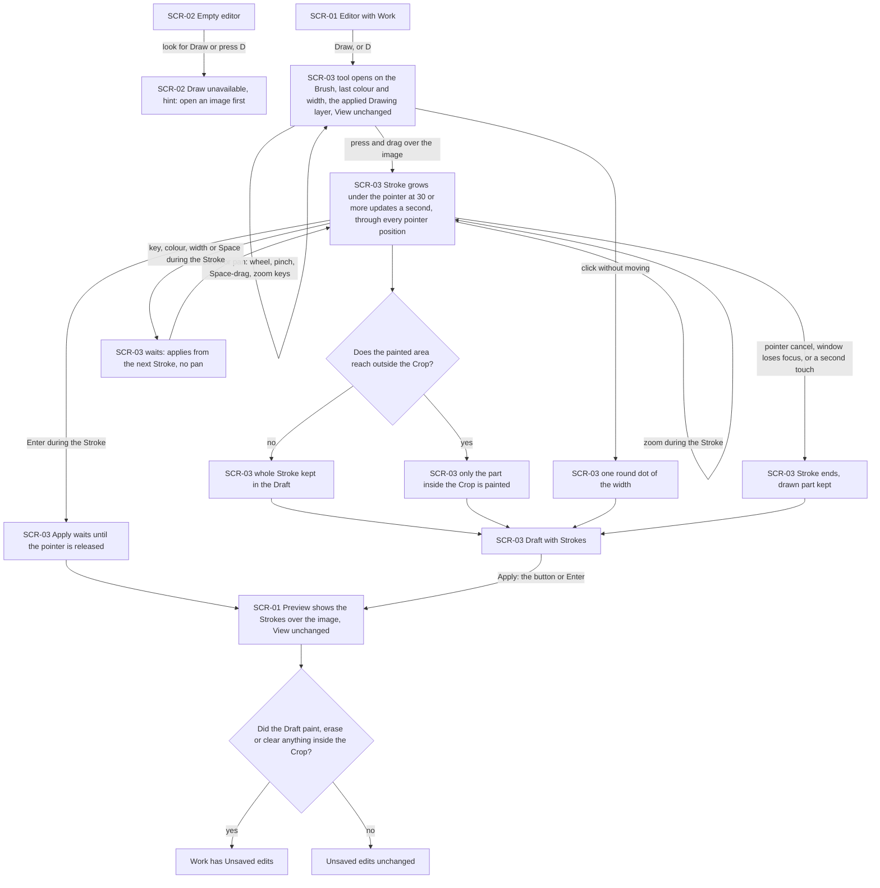
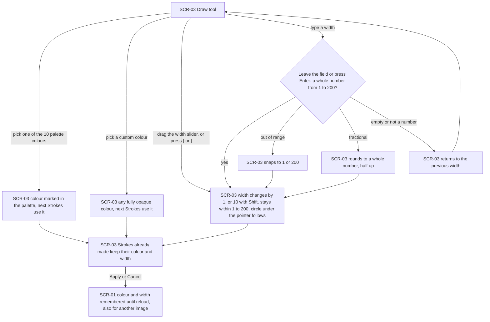
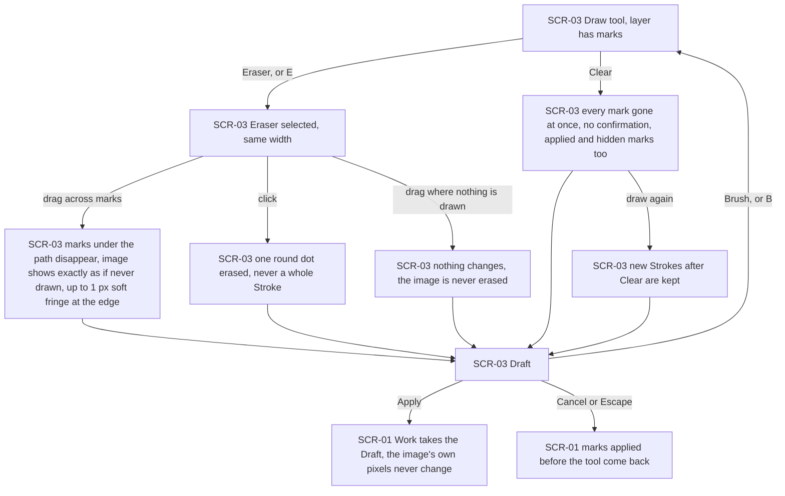
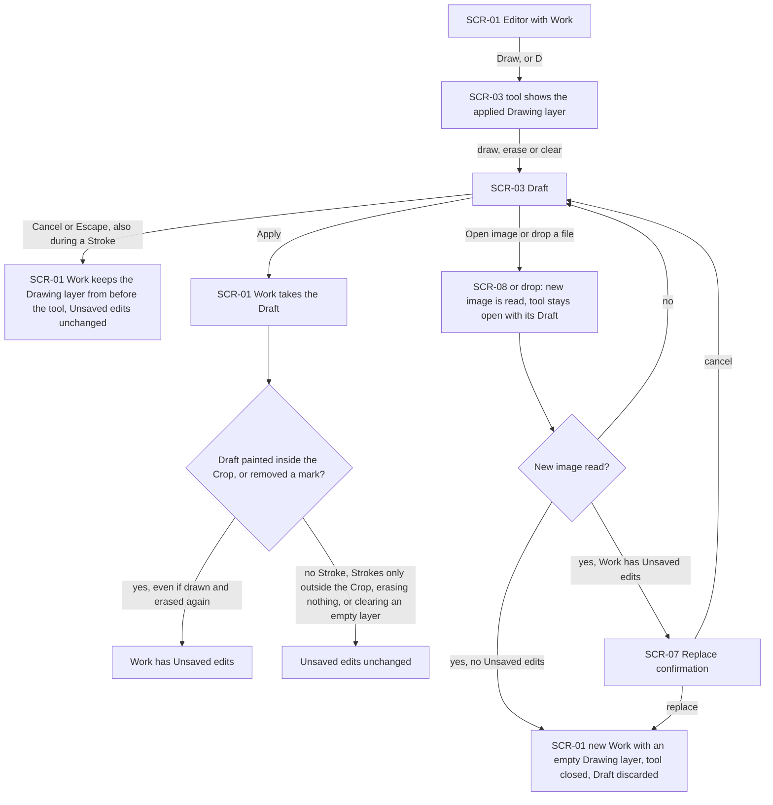
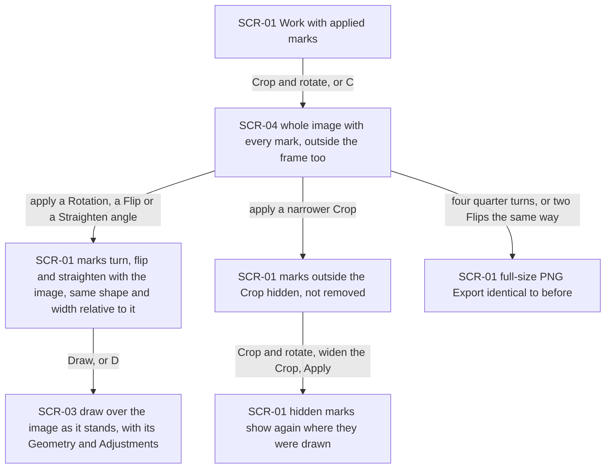
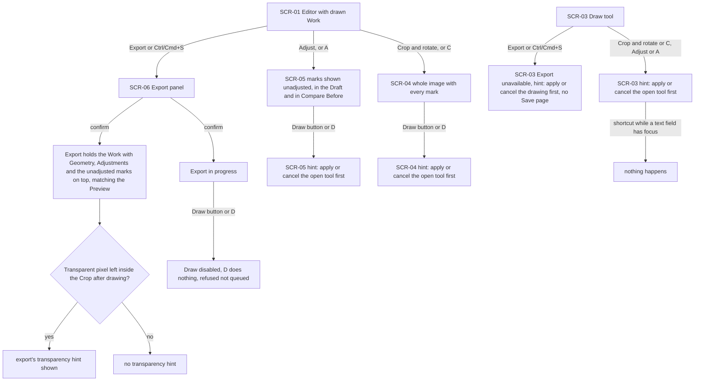
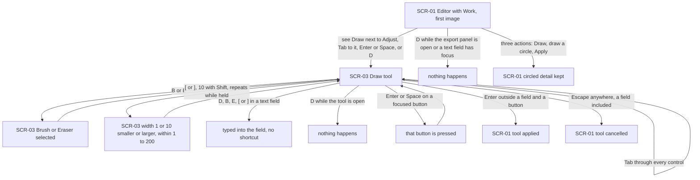

# UX flows — draw

> User flows for every UI-touching §4 user story, produced by `ux-flows` (after `clarify`, before
> `design`) and read by `design` (evidence for the target-surface + UI-architecture decisions),
> `sequences` (UI-driven flows align on SCR ids), `screens` (details every inventory row) and
> `plan-tests` (the e2e-through-UI paths). **Always markdown + mermaid `flowchart`**, whatever the
> design tool — this artifact is flow-altitude, not visual design.

## Platform decisions

- **Posture:** desktop-first, as in `docs/design-system.md` §Platform posture. The mouse (dragging to draw or erase, clicking for a dot) and the keyboard (Tab, Enter, Space, Escape, the D, B and E keys, and [ and ], AC-19) are the primary paths. Below 1024 px the same screens apply. A pen or a finger draws as the mouse does, and pinch zoom keeps working (AC-18), but no touch gestures are designed (spec §3).
- **Navigation shape:** one editor view with no page navigation, as in open-and-view, export, crop-rotate and adjust. The "Draw" tool (SCR-03) is a mode of the editor, opened in the same tool slot as "Crop and rotate" (SCR-04) and "Adjust" (SCR-05). It never opens a new page, and Apply, Cancel or Escape return to the editor with the Work (SCR-01).
- **Modality:** while the tool is open, the Editor can still zoom and pan (AC-18) and open another image (AC-13). Export and Ctrl/Cmd+S only show a hint to apply or cancel the drawing first (AC-15), and "Crop and rotate" and "Adjust" only show a hint to apply or cancel the open tool first (AC-16). The Draft is held apart from the Work until Apply: Cancel, Escape and replacing the Work discard it, and it never counts as Unsaved edits on its own (AC-06, AC-13).
- **One way out per outcome:** Apply (the button, or Enter outside a field and outside a focused button) keeps the Draft. Cancel (the button, or Escape from anywhere in the tool) discards it. The Eraser and Clear only change the Draft and take effect on Apply (AC-04, AC-05). Opening, applying and cancelling never change the View (AC-18).
- **A Stroke is a held gesture, not a screen:** from pressing the pointer to releasing it, SCR-03 shows the Stroke growing under the pointer. Input that arrives meanwhile waits for the Stroke to end, except Escape, which cancels the tool at once. A pointer cancel, the window losing focus or a second touch end the Stroke and keep what was drawn so far (AC-18).
- **Tool settings are not edits:** the colour and the width are remembered as soon as they are chosen, whether the tool is then applied or cancelled, until the app is reloaded. The mode always starts on the Brush (AC-01, AC-02).
- **Field checking:** the width field is checked when the Editor leaves it or presses Enter in it, never while typing, and Enter in the field never applies the tool (AC-03).
- **Outcomes are shown in place:** the result of the tool is the Preview (AC-01). Refusals are hints on the unavailable control (AC-14, AC-15, AC-16, AC-17), and Clear asks for no confirmation (AC-05).
- **Design input (Tech Lead flag, not decided here):**
  1. A Stroke must reach the Preview at 30 or more updates per second with at most 50 ms from pointer to frame on a 4096×3072 Work, at 1 px and 200 px, at Fit and at 100% (spec §6). `design` decides where the Draft is painted and how it joins the rendering path that already draws the Geometry and the Adjustments.
  2. Marks are attached to the Original, but the Editor draws on the image as it stands after its Geometry, Straighten angle included (AC-08, AC-11). `design` decides how pointer positions map back and how the layer is stored so that four quarter turns or two Flips give an identical Export.
  3. Clipping to the Crop is by painted area (AC-09), and Clear also removes marks hidden outside the Crop (AC-05).
  4. Unsaved edits come from a per-Draft change flag, not a pixel comparison (AC-12).
  5. "Crop and rotate" must now show the whole image with every mark, outside the frame too, and "Adjust" and its Compare "Before" view must show the marks unadjusted (AC-11).

## Screen inventory

| ID | Screen | Purpose | Entry | Exit |
|---|---|---|---|---|
| SCR-01 | Editor with Work | open-and-view's editor with a Work open. The Preview shows the Work with its Geometry, its Adjustments and its Drawing layer on top, and a "Draw" action sits next to "Adjust" | A successful open; Apply or Cancel on SCR-03, SCR-04 or SCR-05; a successful Export | SCR-03 (Draw, D), SCR-04 (Crop and rotate, C), SCR-05 (Adjust, A), SCR-06 (Export, Ctrl/Cmd+S), SCR-08 (Open image) |
| SCR-02 | Empty editor | open-and-view's empty editor. "Draw" is shown as unavailable, with a hint to open an image first | App load; no Work open | SCR-01 once an image is opened (open-and-view flows) |
| SCR-03 | Draw tool | The Preview of the Work with the Draft at the current View, the Brush and Eraser modes, the 10-colour palette and the custom colour, the width slider and field, the width circle under the pointer, and Clear, Cancel and Apply | Draw (the button, Enter or Space on it, or D) on SCR-01 | SCR-01 (Apply, Cancel, Escape, or a confirmed replacement of the Work), SCR-08 (Open image), SCR-07 (a new image read while the Work has Unsaved edits) |
| SCR-04 | Crop and rotate tool | crop-rotate's tool. It now shows the whole image with every mark, including the marks outside the crop frame | Crop and rotate (the button or C) on SCR-01 | SCR-01 (crop-rotate flows) |
| SCR-05 | Adjust tool | adjust's tool. The marks are shown over the image unadjusted, in the Draft and in Compare's "Before" view | Adjust (the button or A) on SCR-01 | SCR-01 (adjust flows) |
| SCR-06 | Export panel | export's panel. The Export contains the Work with its Geometry, its Adjustments and its Drawing layer on top | Export or Ctrl/Cmd+S on SCR-01 | SCR-01 (export flows) |
| SCR-07 | Replace confirmation | open-and-view's warning before a new image replaces a Work with Unsaved edits | A new image read successfully while the Work has Unsaved edits, from SCR-01 or SCR-03 | SCR-01 with the new Work (replace), or the screen it came from unchanged (cancel) |
| SCR-08 | System file dialog | The operating system's own file picker (not designed by us) | "Open image" on SCR-01 or SCR-03 | Open pipeline (file chosen), or the screen it came from unchanged (cancelled) |

## Flows

### Flow: US-01 — Draw freehand on the photo

From the editor with a Work open, the Editor chooses "Draw" or presses D. The tool always opens on the Brush, with the colour and width last chosen in this session (red and 12 px the first time). It shows the Work's applied Drawing layer, which is empty for a new Work, and leaves the View as it was (AC-01, AC-18). Zooming and panning keep working with the wheel, pinch, Space-drag and the zoom keys, and they never make a Stroke or count as an edit (AC-18). Pressing and dragging over the image grows a Stroke under the pointer at least 30 times a second. The line passes through every pointer position and has round ends, and a click without moving paints one round dot (AC-01). A Stroke whose painted area reaches outside the Crop is painted only inside the Crop (AC-09).

While the Stroke is in progress, input waits for it to end:
- A key, a colour or width change, or Space applies from the next Stroke, and Space does not pan.
- A zoom does not break the Stroke.
- Enter applies the tool only once the pointer is released.
- A pointer cancel, the window losing focus or a second touch end the Stroke and keep what was drawn (AC-18).

Apply, by the button or Enter, closes the tool, and the Preview shows the Strokes over the image with the View unchanged. The Work gets Unsaved edits only if the Draft painted, erased or cleared something inside the Crop (AC-12). With no image open, "Draw" is unavailable, and both the control and the D key show a hint to open an image first (AC-17).

### Flow: US-02 — Pick the colour and width

In the tool the Editor picks one of the 10 palette colours, which is then marked, or any fully opaque custom colour (AC-02). The width is set with the slider, with [ and ] (1 at a time, or 10 with Shift, held keys repeat, the result stays within 1 to 200), or by typing in the field (AC-02, AC-19). A typed width is checked when the Editor leaves the field or presses Enter in it (AC-03):
- out of range snaps to 1 or 200;
- a fractional value rounds to a whole number with a half rounding up;
- an empty or non-numeric value returns to the previous width;
- a trailing "px" is accepted in any letter case, with or without a space.

Enter in the field never applies the tool. The circle under the pointer shows the width at the current zoom. Only Strokes made afterwards use the new colour and width, and the Brush and the Eraser share the width. The colour and width are remembered from the moment they are chosen, whether the tool is applied or cancelled, until the app is reloaded, also when another image is opened. The mode is not remembered (AC-02).

### Flow: US-03 — Fix mistakes

In the tool on a layer with marks, the Editor selects the Eraser (or presses E), which uses the same width. Dragging across marks removes them along the path, and inside the path the image shows exactly as where nothing was ever drawn. At the edge a soft fringe of up to 1 px may remain. A click erases one round dot and never a whole Stroke, and erasing where nothing is drawn changes nothing, because the Eraser never touches the image itself (AC-04). Clear removes every mark at once without a confirmation, including marks applied earlier and marks hidden outside a narrower Crop. Strokes drawn after Clear are kept (AC-05). All of this changes only the Draft. On Apply the image's own pixels never change: after Clear and Apply, a full-size PNG Export is identical to one made before anything was drawn (AC-07). On Cancel or Escape the marks applied before the tool come back (AC-05, AC-06).

### Flow: US-04 — Change my mind about a drawing session

The Editor opens the tool and draws, erases or clears. Cancel or Escape, even in the middle of a Stroke, closes the tool. The Work keeps the Drawing layer it had before, with its Unsaved edits unchanged (AC-06). Apply gives the Work the Draft. It counts as an edit when the Draft painted inside the Crop or removed a mark, even if a mark was drawn and erased again in the same Draft. It does not count with no Stroke, with Strokes only outside the Crop, with an Eraser Stroke only where nothing was drawn, or with a Clear of an already empty layer (AC-12). Opening another image, by "Open image" or by dropping a file, keeps the tool open with its Draft while the image is read. If the image cannot be read, or the Editor cancels the replace confirmation, the tool stays open with its Draft. If the replacement goes ahead (directly, or after confirming when the Work has Unsaved edits), the tool closes and the Draft is discarded with the old Work. The new Work starts with an empty Drawing layer (AC-13).

### Flow: US-05 — Keep marks in place when I crop or turn later

On a Work with applied marks, the Editor opens "Crop and rotate". The tool shows the whole image with every mark, including the marks outside the crop frame, so widening the frame shows them where they will be (AC-11). Applying a Rotation, a Flip or a Straighten angle turns, flips and straightens the marks with the image, keeping their shape and width relative to it. Applying a narrower Crop hides the marks outside it without removing them, and widening the Crop again shows them where they were drawn. Four quarter turns, or two Flips in the same direction, give a full-size PNG Export identical to the one from before (AC-08). Opening "Draw" afterwards lets the Editor draw over the image as it stands, with its Geometry and its applied Adjustments (AC-11).

### Flow: US-06 — Export what I see after drawing

From the editor with a drawn Work, the Editor opens the export panel by Export or Ctrl/Cmd+S and confirms. The Export holds the Work with its Geometry and Adjustments and the Drawing layer on top, never adjusted, matching the Preview at full size. A smaller Export is the full-size one reduced. The transparency hint appears exactly when a transparent pixel is still left inside the Crop after drawing (AC-10). While an export is in progress, the "Draw" button is disabled and D does nothing; the request is refused, not queued (AC-14). While the "Draw" tool is open, Export is unavailable and both Export and Ctrl/Cmd+S show a hint to apply or cancel the drawing first, never the browser's "Save page" (AC-15). "Adjust" shows the marks over the image unadjusted, in the Draft and in Compare's "Before" view, and "Crop and rotate" shows every mark (AC-11). Only one of the three tools can be open at a time: the others' buttons and shortcuts show a hint to apply or cancel the open tool first, and a shortcut typed while a text field has focus does nothing (AC-16).

### Flow: US-07 — Draw on the first try

A Portfolio reviewer who has opened an image sees a "Draw" action in the toolbar next to "Adjust". They can reach it with Tab and press it with Enter or Space, or press D. D does nothing while the export panel is open, while the tool is already open, or while a text field has focus. Inside the tool every control can be reached with Tab. B selects the Brush and E the Eraser. [ and ] change the width by 1, or 10 with Shift, repeat while held, and stay within 1 to 200; they are matched by the character typed or, on layouts without it, by the key's position. All these keys are silent in a text field. Enter or Space on a focused button presses it, Enter anywhere else outside a field applies the tool, and Escape cancels it from anywhere, a field included. Drawing a mark itself needs a mouse, a pen or a finger. Circling something and keeping it takes three actions: Draw, draw, Apply (AC-19).

## AC coverage

| AC | Shown by | Notes |
|---|---|---|
| AC-01 | Flow US-01 → T, S, DOT, A | Opening on the Brush with the last colour and width, the live Stroke, Apply |
| AC-02 | Flow US-02 → C, CC, WS, K, R | |
| AC-03 | Flow US-02 → TF, TS, TR, TV | The "px" suffix is in the prose |
| AC-04 | Flow US-03 → ER, EP, ED, EN | |
| AC-05 | Flow US-03 → CL, CLD, X | |
| AC-06 | Flow US-04 → X; Flow US-03 → X | |
| AC-07 | Flow US-03 → A; prose | An invariant on every outcome, not a branch. Checked through the Preview and a full-size PNG Export, not the flow |
| AC-08 | Flow US-05 → G, N, WB, RT | |
| AC-09 | Flow US-01 → SC, SX | |
| AC-10 | Flow US-06 → X, TH, THY, THN | |
| AC-11 | Flow US-05 → CR, T; Flow US-06 → AD, CR | |
| AC-12 | Flow US-01 → U; Flow US-04 → U, UE, UN | |
| AC-13 | Flow US-04 → O, OR, RC, N | |
| AC-14 | Flow US-06 → EX, EXR | |
| AC-15 | Flow US-06 → TX | |
| AC-16 | Flow US-06 → TC, ADH, CRH, TN | |
| AC-17 | Flow US-01 → EH | |
| AC-18 | Flow US-01 → T (zoom or pan loop), SW, SK, SEN, A; Flow US-04 → X (Escape during a Stroke) | |
| AC-19 | Flow US-07 → all nodes | |

No §4 user story is backend-only: all seven touch the UI and each has its own flow.
