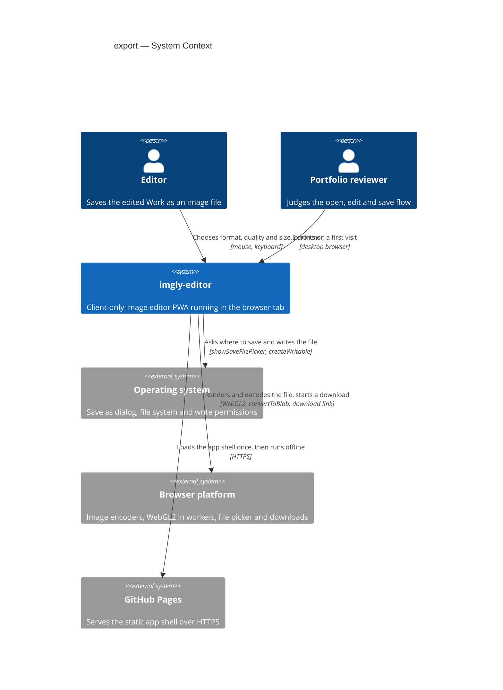
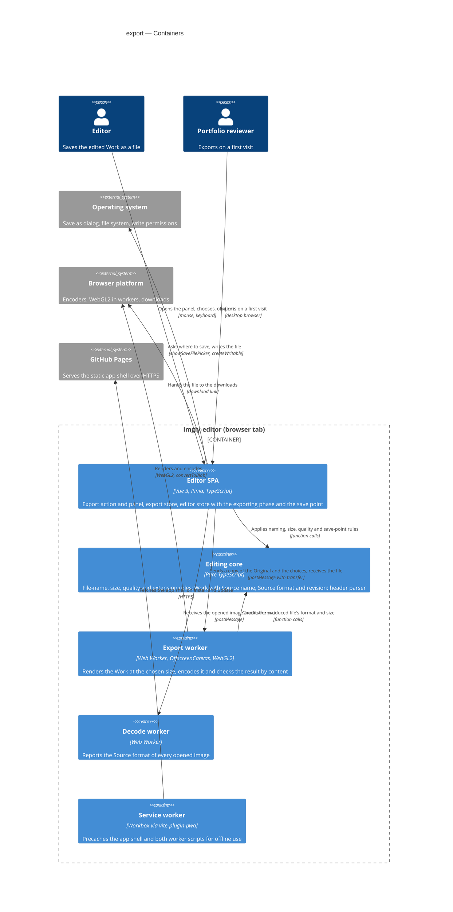
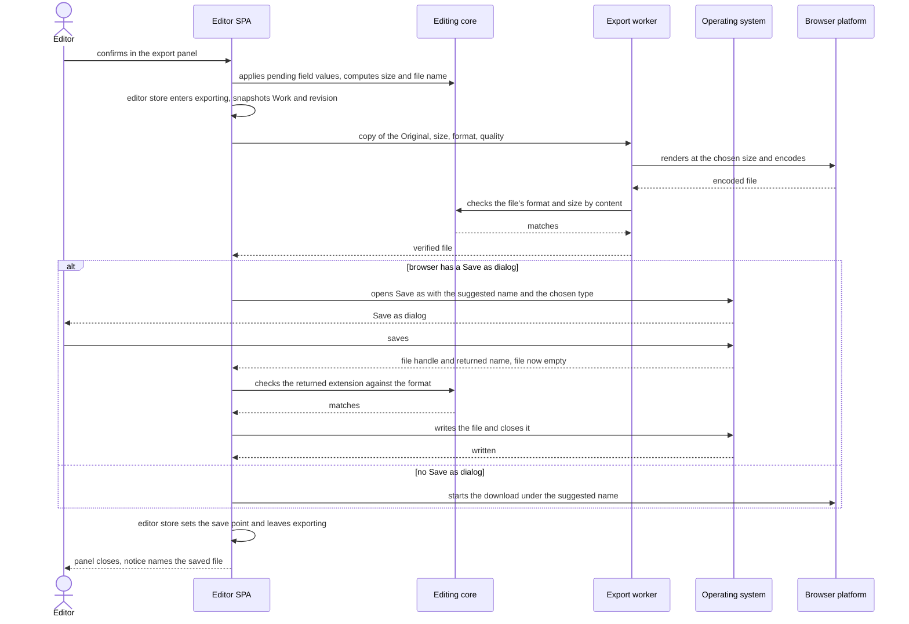
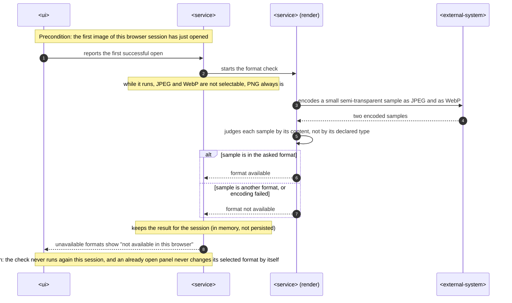
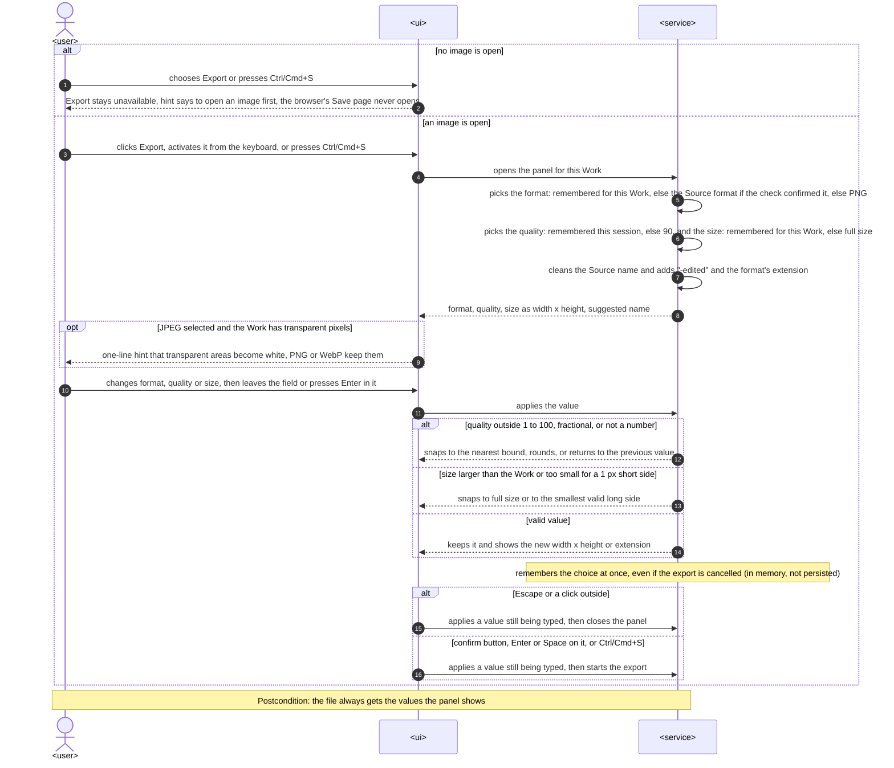
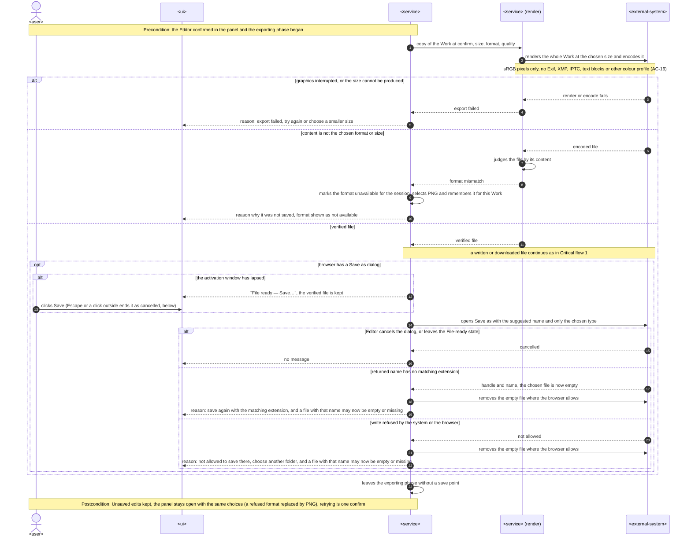
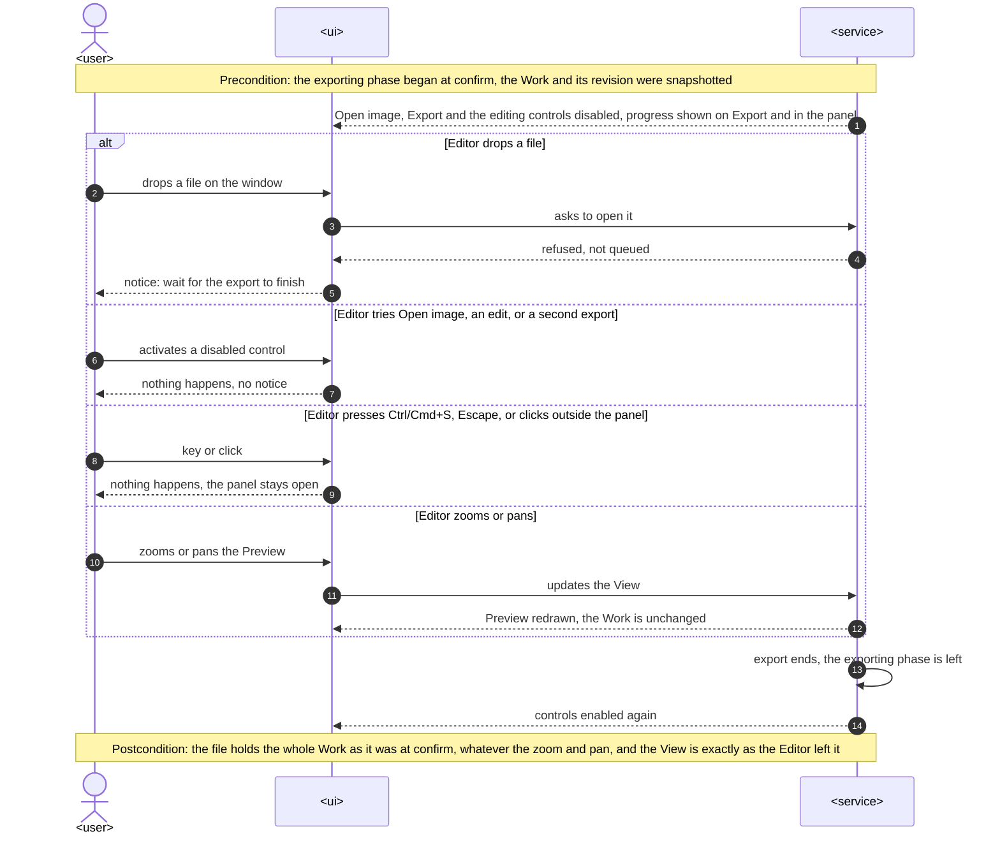
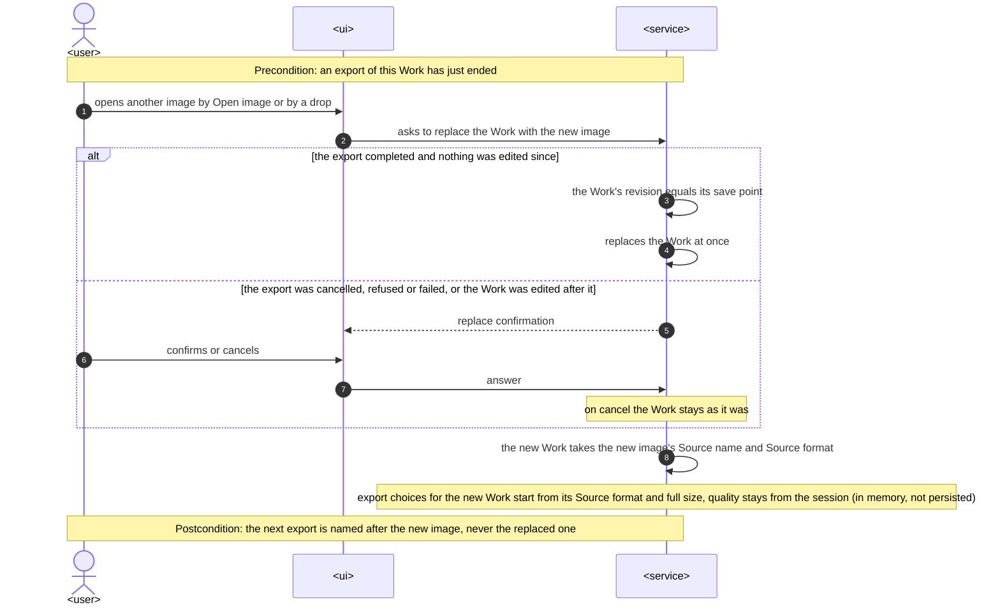

# Software Architecture Document — export

## 1. Introduction and goals

**Intent.** export lets the Editor turn the open Work into a PNG, JPEG or WebP file from one panel, at full size or a smaller size, with a quality setting for the lossy formats and a file name taken from the Source name. Browser storage is not durable, so an Export is the only reliable copy of a Work: the file must be in the format it claims, look like the Preview, carry no embedded metadata, and the Work counts as saved only when the file has really been written or handed to the browser's downloads (spec §1, §2). Where the browser has a "Save as…" dialog (Chromium) the Editor picks the folder and name there; elsewhere (Firefox, Safari) the file goes to the browser's downloads. The feature also gives every later editing tool its way to save a result, and it ends the Portfolio reviewer's "open, edit, save" story on the first try.

**Top-3 quality goals (1-liners; full scenarios in §10):**

1. **Honest save**: a file is never named for a format it is not in, a failed export never leaves a damaged file where the app could have prevented it, and the Work is marked saved only after the file was written or handed off.
2. **Fidelity to the Preview**: a full-size PNG Export is the Preview's own rendering at 100%, pixel for pixel within the spec's tolerance, whatever the View.
3. **A responsive, leak-free export**: a 12 MP export finishes in about a second or two, the interface never freezes while it runs, and repeated exports do not grow memory.

**Stakeholders.**

| Role | Interest | Sign-off owner? |
|---|---|---|
| Editor | Saves the Work as a file in a chosen format, quality and size; trusts that a saved Work is really saved | No |
| Portfolio reviewer | Finds and completes the export without instructions, in at most three steps | No |
| Tech Lead | SAD approval; the export worker and the `editor` store's exporting phase are inherited by every later editing tool | Yes |
| Security Lead | Reviews the two privacy rules (file-name cleanup AC-07, no metadata AC-16) and the file-system writes; spec §6.1 needs no full security review | Yes |

- Decision override: on a device where rendering and encoding outlast Chromium's user-activation window (about 5 s), the "Save as…" dialog can no longer open by itself, and the panel asks for one more click ("File ready — Save…"). That state is still the `exporting` phase, so everything AC-11 refuses stays refused, but Escape or a click outside there ends the export as cancelled (no message, Unsaved edits kept, AC-10), which AC-17 otherwise allows only when no export is running — rationale: encoding before the dialog keeps every render and format failure away from the disk (ADR-0001), the Editor must be able to leave a state they did not ask for, and the reference machine's targets (JPEG ≤ 1 s, PNG ≤ 2 s) stay well inside the window, so AC-17's three steps hold there. Follow-up in §11.

## 2. Constraints

**Technical.**
- TypeScript 5 (`strict`), Node 24 toolchain, pnpm — repo ADR [0001](../../adr/0001-build-a-client-only-vue-pwa.md)
- Vue 3 (Composition API, `<script setup>`) + Pinia + Vite + vite-plugin-pwa; a client-only static app with no server, accounts or sync — repo ADR 0001
- Static hosting on GitHub Pages under `/imgly/` with no custom headers, so no COOP/COEP and no `SharedArrayBuffer`: data crosses threads only by structured clone or transfer — repo ADR 0001
- WebGL2 for rendering adjustments, Canvas 2D for the drawing layer — repo ADR [0004](../../adr/0004-render-adjustments-on-webgl2-and-drawing-on-canvas2d.md); the Preview is one WebGL2 canvas with a premultiplied, mipmapped Original texture (open-and-view ADR-0003), and every Original is sRGB (open-and-view ADR-0004)
- Functional core with feature folders: `core` is pure TypeScript; features never import each other and coordinate through the `editor` store; `infra` may call pure `core` functions — repo ADR [0002](../../adr/0002-organize-code-as-functional-core-with-feature-folders.md), repo `CLAUDE.md` §Module boundaries
- Files are encoded only by the browser's own encoders (`HTMLCanvasElement.toBlob` or `OffscreenCanvas.convertToBlob`); no bundled or WASM encoders. Which of PNG, JPEG and WebP a browser can produce is detected, never assumed (spec AC-12)
- The "Save as…" dialog exists only where the File System Access API's `showSaveFilePicker` exists (Chromium). It needs a fresh user activation, and per the API's specification (step 7) the chosen file is created empty, or an existing one emptied, before the call returns ([WICG/file-system-access#360](https://github.com/WICG/file-system-access/issues/360), open; Chromium follows it). Firefox and Safari have no such dialog: the file goes to the browser's downloads
- No persistence in this feature: IndexedDB is not touched (spec §3, AC-19 "nothing across sessions")
- Targets: the latest desktop Chromium, Firefox and Safari; on mobile the app only has to not break (`docs/design-system.md` §Platform posture)

**Organisational.**
- Solo, spare-time project; owner Blazheiko. No per-feature effort budget beyond the 4–6 week MVP budget for the whole roadmap; no hard deadline. Size S, route quick (`.size`, `.route`)
- TDD is on (`.claude/sdd.local.md`): Vitest units, Playwright e2e on Chromium, Firefox and WebKit; `@perf` runs by hand on the reference machine (Apple M1 MacBook Air, latest stable Chrome, spec §6)

**Conventions.**
- Repo `CLAUDE.md` §Conventions: `core` and `infra` return `Result<T, AppError>` with a typed `code` and throw only for programmer errors; unit tests co-located as `*.test.ts`; e2e in `e2e/export/*.spec.ts`, only for what happy-dom can't do (WebGL, downloads, offline); plain CSS with tokens; features expose `index.ts` and are mounted from `src/app/`
- `docs/design-system.md` §Interaction & writing conventions: one notice boundary (informational notices dismiss themselves, failure reasons stay until dismissed), every action reachable by keyboard, short plain microcopy; new primitives are registered in the inventory
- open-and-view's patterns, reused: a dedicated Web Worker per heavy job (open-and-view ADR-0001), capabilities probed once per session with embedded samples and no user-agent sniffing, a messages catalog per feature, the bitmap ledger for leak tests (open-and-view sad.md §8)

**Regulatory / external.**
- Data classification: confidential (spec §6.1). Pixels and the Source name never leave the device except as the file the Editor saves; no network request, telemetry or logging carries them
- No accounts, so no AuthN/AuthZ; the only access check is the OS or browser permission to write the chosen file (AC-14)
- Security review: N/A per spec §6.1; the two privacy rules (AC-07 file-name cleanup, AC-16 no metadata) are verified by tests

## 3. Context and scope

imgly-editor is an offline, client-only image editor running entirely in the browser tab. export is its only way out: it renders the open Work into a file and hands it to the operating system through the browser, either as a file the Editor places with a "Save as…" dialog or as a browser download. Nothing goes to a server; GitHub Pages only serves the static app shell.

<!-- brownfield: open-and-view is shipped (merge 3020ef1): src/core (Work + revision counter, image-header parser, View maths), src/infra/image-decode (decode worker), src/infra/platform (file picker, drop guard), src/render (WebGL2 Preview), src/features/editor (store + EditorView). docs/architecture-map.md reflects 7d26cf9, 92 commits behind HEAD; this SAD read the code directly. -->

**Trust boundary.** Everything the app produces is trusted. The boundary is the other way round from open-and-view: what comes back from the platform is not. The browser's encoder may silently produce another format (Safari returns PNG when asked for WebP), the name the "Save as…" dialog returns may carry any extension, and the write may be refused. Each of these is checked before the Work is marked saved (AC-01b, AC-12, AC-14).

**External systems (in / out):**

| Actor or system | Type | Interaction |
|---|---|---|
| Editor | Person | Opens the export panel (Export or Ctrl/Cmd+S), picks format, quality and size, confirms, and in Chromium saves in the "Save as…" dialog |
| Portfolio reviewer | Person | Tries the same export on a first visit, usually on a desktop browser |
| Operating system | System (external) | Shows the "Save as…" dialog (Chromium), owns the file system, and allows or refuses the write (AC-14) |
| Browser platform | System (external) | Encodes PNG, JPEG and WebP from a canvas, provides WebGL2 in a worker, offers `showSaveFilePicker` (Chromium only) and the downloads list |
| GitHub Pages | System (external) | Serves the static app shell and the export worker script on first load and updates; never sees an image |

**External: no third-party service** — deliberate. No upload, no cloud save, no remote encoder (§2 Regulatory).

**C4 Context (L1):**



The Editor and the Portfolio reviewer drive the app; the app talks to the browser to render, encode and download, and to the operating system (through Chromium's file picker) to place and write the file; GitHub Pages is only the first-load source of the code.

## 4. Solution strategy

**Target surface.** `target_surfaces: [web-frontend]` (frontmatter). The feature extends the one runnable surface, the Editor SPA in the browser tab. The export worker is an internal container of that surface (§5), not a surface of its own: there is no server (repo ADR 0001) and no published library. Decided inline: the other surfaces are excluded by §2.

**UI architecture (web-frontend).** Inherited from open-and-view: a client-rendered SPA with one editor view and no router. The export panel (SCR-03) is a non-modal panel over the editor while idle, the "Save as…" dialog (SCR-04) is the platform's own, and every outcome is a notice at the single notice boundary (ux-flows.md §Platform decisions). State lives in Pinia setup stores; components reuse `src/shared/ui/` primitives and `tokens.css`. No new ADR: server rendering is excluded by §2.

**Top strategic choices (the seeds for ADRs):**

1. **Encode and verify before the "Save as…" dialog** — [ADR-0001](adr/0001-encode-and-verify-before-the-save-dialog.md). Confirming starts the render, the encode and the content check; only a verified file opens the dialog, and the write goes through `createWritable()`, which replaces the target only on `close()`. Because the dialog empties or creates the chosen file the moment it closes (§2), this order keeps every render and format failure (AC-12, AC-13) away from the disk; only AC-01b and AC-14 can still fail after it. Serves quality goal 1.
2. **Render and encode every export in a dedicated Web Worker** — [ADR-0002](adr/0002-render-and-encode-exports-in-a-dedicated-web-worker.md). The `editor` store hands over a copy of the Original taken at confirm; a short-lived worker renders the Work with the Preview's own WebGL2 shader code on an `OffscreenCanvas` at the chosen size, flattens onto white for JPEG, encodes with `convertToBlob`, checks the result with `sniffImageHeader`, and returns the file. The worker is terminated after each export. Serves quality goals 2 and 3, and mirrors the decode worker (open-and-view ADR-0001).
3. **Judge formats by content, both before and after** — inline. Once per session, starting with the first open, the export worker trial-encodes a small semi-transparent sample in JPEG and WebP and judges what came out with the core header parser; PNG is always offered. Every real export is judged the same way, by format and dimensions, before it is handed off. A mismatch disables that format for the session (AC-12). This reuses open-and-view ADR-0002's parser instead of trusting `Blob.type`, which the spec rules out ("decided by the content", AC-12).
4. **A save point on the Work, set only by a finished hand-off** — inline, extends open-and-view [ADR-0005](../open-and-view/adr/0005-track-unsaved-edits-with-a-revision-counter-on-the-work.md). The `editor` store enters an exclusive `exporting` phase at confirm, snapshots the Work's `revision`, and on success sets `cleanRevision` to it, which is the "later, at save" that ADR-0005 left open. Nothing else marks a Work saved, so a cancel, a refusal or a failure can never clear Unsaved edits (AC-09, AC-10).

Decided inline, below the ADR gate: the save path is chosen by feature detection (`'showSaveFilePicker' in window`) and the spec fixes both paths (AC-01, AC-02); the Source name and Source format become fields of the Work, which `CONTEXT.md` already defines as part of it.

## 5. Building block view

The feature follows the repo's functional core with feature folders (repo ADR 0002). Every rule the panel enforces (file-name cleanup, size maths and snapping, quality input, extension matching, default format) is pure TypeScript in `src/core/export/` and unit-tested without a browser. Rendering, encoding and the format check live in `src/render/export/` beside the Preview renderer, so both draw with one shader module. Saving to disk lives in `src/infra/platform/` beside the open-side file picker. export is a **new feature folder**, `src/features/export/`: the Export action, the panel, the Ctrl/Cmd+S shortcut and the panel's session memory. Its only cross-feature import is `useEditorStore` from `@/features/editor` (the folder's `index.ts`), which is the coordination path repo `CLAUDE.md` §Module boundaries sanctions ("they coordinate through the `editor` store"); it never imports the editor's components or internals. Through that store it reads the Work and requests the exporting phase, and the app shell places its Export action in a slot of the editor's top bar.

**Cross-feature changes (open-and-view):**
- `Work` gains `sourceName: string` and `sourceFormat: ImageFormat`, replacing the placeholder `name: 'Untitled'`. `openImage(file)` sets them from `File.name` (last extension removed only when it is a known image extension, CONTEXT "Source name") and from the decoder's `format`, so a replace by "Open image" or by a drop always brings the new image's name and format (AC-08). A plain `Blob` with no name gives an empty Source name, which AC-07 turns into `image`.
- The `editor` store gains the phase `exporting` and two actions. `beginExport()` refuses unless the phase is `idle` and a Work is open; otherwise it enters `exporting` and returns a snapshot `{ workId, revision, original, sourceName, sourceFormat }`. `finishExport(snapshot, saved)` returns to `idle` and, when `saved`, sets `cleanRevision = snapshot.revision`. While `exporting`, `openImage`, `openDrop` and `applyEdit` refuse, and a drop raises the "wait for the export to finish" notice (AC-11). View actions stay live.
- The decode worker scans the decoded bitmap's alpha channel once per open and reports `hasTransparency` (at least one pixel not fully opaque) with the other image facts; it becomes a field of the Original. The export panel reads it for the JPEG hint (AC-15). The scan runs off the main thread, a single pass over at most 4096 × 4096 pixels.
- `EditorTopBar` gets a named slot for actions next to "Open image"; `src/app/App.vue` fills it with the export feature's `ExportAction`.

**Internal decomposition:**

```
src/
├── core/
│   ├── document.ts               Work + sourceName, sourceFormat; Original + hasTransparency; save point via cleanRevision (ADR-0005)
│   ├── result.ts                 new codes EXPORT_FAILED, EXPORT_FORMAT_MISMATCH, EXPORT_NOT_PERMITTED, EXPORT_EXTENSION_MISMATCH
│   └── export/                   pure rules: sourceNameOf, exportFileName (AC-07), exportSize + snap (AC-05/06),
│                                 normalizeQuality (AC-04), matchesExtension (AC-01b), defaultFormat (AC-19)
├── render/
│   ├── shaders.ts                the Preview's shader program, shared by window and worker (extracted from preview-renderer)
│   └── export/
│       ├── export.worker.ts      renders the Work on an OffscreenCanvas (WebGL2), flattens JPEG onto white, convertToBlob,
│       │                         checks format and size with sniffImageHeader (ADR-0002); also runs the format check
│       └── client.ts             exportImage(request) → Result<Blob>; checkExportFormats() → per-format availability
├── infra/image-decode/           decode worker also reports hasTransparency (one alpha scan per open, AC-15)
├── infra/platform/
│   └── save-file.ts              hasSaveDialog(); pickSaveTarget(name, format); writeFile(handle, blob);
│                                 discardEmptyTarget(handle); downloadFile(name, blob) (ADR-0001)
├── features/editor/              store: exporting phase, beginExport / finishExport; Work gets Source name and format
├── features/export/
│   ├── store.ts                  `export` store: panel state, format availability, session memory (AC-19), runExport()
│   ├── ExportAction.vue          the Export button with its progress and the no-image hint (SCR-01, SCR-02)
│   ├── ExportPanel.vue           SCR-03: format, quality, size, suggested name, hints, confirm, "File ready — Save…"
│   ├── shortcuts.ts              Ctrl/Cmd+S: open the panel, confirm it, or show the hint; never the browser's "Save page"
│   ├── messages.ts               the export's notice and hint catalog
│   └── index.ts                  public surface: ExportAction, ExportPanel, useExportStore
└── app/App.vue                   mounts ExportAction into the editor's top-bar slot
```

Dependency direction stays `features → core | infra | render | shared`; `render/export` imports `core` (types plus the pure `sniffImageHeader`, as repo `CLAUDE.md` §Module boundaries allows) and `shared`.

**C4 Container (L2):**



The Editor SPA drives everything: it applies the core rules, sends a copy of the Original to the new export worker, and then either writes the verified file through the operating system's "Save as…" dialog or hands it to the browser's downloads. The export worker renders and encodes through the browser and checks its own output with the core header parser. The decode worker only contributes the Source format at open, and the service worker precaches the new worker script so export works offline.

## 6. Runtime view

**Critical flow 1: export through the "Save as…" dialog (Chromium), with the download path as the alternative**



On confirm, the panel first applies any value still being typed (AC-17), then the `editor` store enters `exporting` and snapshots the Work, so the file holds the Work exactly as it was at confirm (AC-11). The export worker renders, encodes and verifies before anything touches the disk (ADR-0001, ADR-0002). In Chromium the dialog then opens; the returned name's extension is checked (AC-01b) and the verified file is written through `createWritable()`. Elsewhere the file is handed to the downloads (AC-02). Only then is the save point set (AC-09).

**Failure branches** (the `sequences` stage draws each):
- Dialog cancelled → no message, panel unchanged, Unsaved edits kept (AC-10).
- Activation window lapsed before the dialog could open → the panel keeps the verified file and offers "File ready — Save…"; Escape there ends the export as cancelled (§1 Decision override).
- Render or encode failure, or the context or size limit hit in the worker → `EXPORT_FAILED`, nothing reaches the disk (AC-13).
- Produced content is not the chosen format or size → `EXPORT_FORMAT_MISMATCH`; the format is disabled for the session and the panel selects PNG (AC-12).
- Returned extension does not match → `EXPORT_EXTENSION_MISMATCH`, nothing written (AC-01b); the emptied target is handled as below.
- Write refused → `EXPORT_NOT_PERMITTED` (AC-14).
- After AC-01b or AC-14 the chosen file is empty, because the dialog emptied or created it (§2). The app removes it where `FileSystemHandle.remove()` exists. Either way the notice says that a file with that name may now be empty or missing (AC-13).

<!-- Flows below were added by `sequences` and use the generic participant vocabulary: <user> is the Editor or the Portfolio reviewer, <ui> is the editor view with the export action and panel (SCR-01 to SCR-05 of ux-flows.md), <service> is the feature logic (the export and editor stores with the core rules), <service> (render) is the export worker, <external-system> is the browser and operating system. Nothing in these flows is written to persistent storage: every "keeps" note is in-memory session state. -->

### Session format check



The check starts when the session's first image opens (AC-12). Until it finishes, only PNG can be chosen, so a panel opened early is preset to PNG and stays on PNG. Each format is judged by what the browser actually produced: Safari returns PNG when asked for WebP, so WebP is marked unavailable. A failed or erroring check counts as "not available". The result is kept in memory for the rest of the session.

### Open the export panel and set the choices



With no image open, Export and Ctrl/Cmd+S only show the "open an image first" hint (AC-17). Otherwise the panel opens with the format remembered for this Work, or the Source format if the format check confirmed it, or PNG. The quality is the session's remembered value or 90, and the size is this Work's remembered size or full size (AC-19). The suggested name is the cleaned Source name plus `-edited` and the format's extension (AC-07). A JPEG choice on a Work with transparent pixels shows the white-background hint (AC-15). Each value is applied when the Editor leaves the field or presses Enter in it, with the snapping and rounding rules of AC-04, AC-05 and AC-06, and it is remembered at once. Closing or confirming first applies a value still being typed (AC-17, AC-19).

### Export: cancel, refusals and failures



The export worker renders the whole Work and encodes it with no metadata (AC-16). If rendering fails because the graphics were interrupted or the size can't be produced, nothing is written and the reason suggests trying again or a smaller size (AC-13). If the file turns out not to be in the chosen format or size, it is not saved, that format becomes unavailable for the session, and the panel selects PNG (AC-12). Both failures happen before any dialog, so they never touch the disk (ADR-0001). In Chromium a lapsed activation window shows "File ready — Save…" (§1 Decision override). Cancelling the dialog, or leaving the File-ready state, ends with no message (AC-10). A wrong extension (AC-01b) or a refused write (AC-14) comes after the dialog has already emptied or created the file, so the app removes it where it can and the notice says the file may now be empty or missing (AC-13). In every case the Unsaved edits stay and the panel keeps its choices (AC-17).

### While an export runs



From confirm until the export ends, including while the "Save as…" dialog is open, "Open image", Export and the editing controls are disabled and show progress (AC-11). A dropped file is refused and a notice asks the Editor to wait; that is the only notice in this state. Ctrl/Cmd+S, Escape and a click outside do nothing (AC-17); the File-ready state is the one exception (§1 Decision override). Zoom and pan keep working. They change only the View, and the export ignores the View: the file is the whole Work as snapshotted at confirm, and the View is left as it was (AC-03).

### Open another image after an export



A completed export set the save point, so if nothing was edited since, opening another image replaces the Work without asking (AC-09). After a cancelled, refused or failed export, or after a new edit, the Work still has Unsaved edits and the replace confirmation appears (AC-10). Whichever path replaced the Work, "Open image" or a drop, the new Work carries the new image's Source name and Source format, so the next export's name and default format come from it (AC-08, AC-19).

### Coverage

| User story | Flows |
|---|---|
| US-01 | Critical flow 1; Export: cancel, refusals and failures; While an export runs |
| US-02 | Open the export panel and set the choices |
| US-03 | Open the export panel and set the choices |
| US-04 | Open the export panel and set the choices; Open another image after an export |
| US-05 | Critical flow 1; While an export runs; Open another image after an export |
| US-06 | Session format check; Export: cancel, refusals and failures |
| US-07 | Export: cancel, refusals and failures (encode step note) |
| US-08 | Open the export panel and set the choices |

| AC | Shown by |
|---|---|
| AC-01 | Critical flow 1, Save as branch |
| AC-01b | Export: cancel, refusals and failures, "no matching extension" branch |
| AC-02 | Critical flow 1, "no Save as dialog" branch |
| AC-03 | While an export runs, zoom and pan branch and postcondition |
| AC-04 | Open the export panel, quality branch |
| AC-05 | Open the export panel, size display and valid-value branch |
| AC-06 | Open the export panel, size snap branch |
| AC-07 | Open the export panel, suggested-name step |
| AC-08 | Open another image after an export, Source name step |
| AC-09 | Critical flow 1 (save point); Open another image after an export, first branch |
| AC-10 | Export: cancel branch; Open another image after an export, second branch |
| AC-11 | While an export runs |
| AC-12 | Session format check; Export: format mismatch branch |
| AC-13 | Export: render failure branch, and the empty-file handling after the dialog |
| AC-14 | Export: write refused branch |
| AC-15 | Open the export panel, transparency hint |
| AC-16 | Export: note on the encode step. The guarantee is a property of the file's content, verified by a chunk and segment scan in tests (§8 Privacy) |
| AC-17 | Open the export panel (entry, no-image hint, Enter, confirm, close); Export (panel stays open); While an export runs (keys ignored) |
| AC-18 | Non-runtime: offline, the flows are identical, because the export worker script is precached (§7) and nothing uses the network |
| AC-19 | Open the export panel (defaults and memory); Open another image after an export (new Work defaults) |

**Flags for design** (not decided here): the "File ready — Save…" state is a panel state `screens` must draw, and ux-flows.md does not have it yet (§1 Decision override). "Nothing happens, no notice" when a disabled control is activated during an export is this view's reading of AC-11 ("only a drop shows this notice"). No flow writes to persistent storage, so `data-model` has nothing to index.

## 7. Deployment view

export reuses the existing deployment unit: one static bundle built by `.github/workflows/ci.yml` and served by GitHub Pages under `/imgly/` (repo ADR 0001). There are no servers; each browser tab is its own runtime, with at most one export worker rendering an export, plus the session's short-lived format-check worker, which may still be running when a PNG export starts (AC-12 keeps PNG available meanwhile). The check encodes only a 2×2 sample, so it adds nothing measurable to the memory figures below. The one deployment change is a new build asset: Vite emits `export.worker.ts` as a separate hashed module script, and the Workbox precache must list it, as it does the decode worker, so export works with no network after the first load (spec §6 offline row, AC-18).

**Monitoring:**
- No runtime metrics, logs or traces leave the device, by design (§2 Regulatory)
- Every push: CI runs lint, typecheck, Vitest units (the `core/export` rules, the store's exporting phase and save point, the panel behaviour on happy-dom with a fake worker and fake save target) and the functional Playwright e2e suite on Chromium, Firefox and WebKit: downloads, offline export, format honesty and fidelity by pixel comparison. The Chromium "Save as…" path runs against a stubbed `showSaveFilePicker` (Playwright cannot drive the native dialog)
- Before each release: the `@perf` suite (export time, long tasks, memory after 10 exports) on the reference machine, and a manual pass in real Chrome through the native dialog (save, cancel, wrong extension, overwrite, read-only folder) and in real Safari (download path, WebP shown as unavailable)
- In development builds the export worker logs its stage timings (render, encode, check) to the console; production logs nothing about images

**Scaling thresholds** (per tab, Work at the 4096 px Downscale limit):
- During an export the tab briefly holds, on top of the retained Original (bitmap + texture, open-and-view §7), the Original's copy in the worker, the worker's texture and canvas, and the encoded file. That is about three more 4096 × 3072 × 4 byte images (≈ 150 MB) plus the file, all released when the worker is terminated and the file is written or its object URL revoked
- The export size is bounded by the Work, which the Downscale limit bounds (AC-06), so no export exceeds 4096 px per side, far inside every engine's canvas and texture limits

## 8. Crosscutting concepts

| Concept | Convention | Where defined |
|---|---|---|
| Error handling | `core`, `infra` and the export client return `Result<T, AppError>`. New codes: `EXPORT_FAILED` (render, encode, size or graphics failure, AC-13), `EXPORT_FORMAT_MISMATCH` with the asked and produced format (AC-12), `EXPORT_NOT_PERMITTED` (AC-14), `EXPORT_EXTENSION_MISMATCH` with the returned name (AC-01b). A cancelled dialog is not an error: `pickSaveTarget` resolves `Cancelled`. The worker posts errors as plain `{ code, details }` objects, as the decode worker does | repo `CLAUDE.md` §Conventions; codes in `src/core/result.ts` |
| User messages | Every export code and hint maps to one plain-language string in `src/features/export/messages.ts`; no raw browser error text reaches the Editor. A success is an informational notice naming the file (and, on the download path, saying it is in the browser's downloads); a failure reason stays until dismissed. Format and transparency hints are one line inside the panel, not notices (AC-12, AC-15) | `docs/design-system.md` §Interaction & writing conventions; here |
| Concurrency | One export at a time. The `editor` store's `exporting` phase is exclusive: opens, drops, edits and a second export are refused, not queued, while zoom and pan stay live (AC-11). The export works on the snapshot taken at confirm. The panel cannot be closed and Ctrl/Cmd+S does nothing while exporting (AC-17), except that Escape or a click outside cancels the "File ready — Save…" state (§1 Decision override) | here; `src/features/editor/store.ts` |
| Save point | Only `finishExport(snapshot, saved: true)` moves `cleanRevision`, and only to the revision at confirm (ADR-0005 extended). "Saved" means written and closed through `createWritable()`, or `click()` on the download link after the file was verified (AC-02, §1 spec override) | here; ADR-0001 |
| Capability detection | The save path by `'showSaveFilePicker' in window`; the producible formats by the once-per-session trial encode in the export worker, judged by content (AC-12); `FileSystemHandle.remove()` by presence. No user-agent sniffing. A format whose check is still running or has failed is not selectable; PNG always is, and the panel never switches the selected format by itself | here; ADR-0002 |
| Colour and alpha | The export renders in sRGB like the Preview (open-and-view ADR-0004), with the same premultiplied texture upload. A full-size render samples at texel centres, 1:1, as the Preview does at 100%; a smaller size uses the mipmapped trilinear sampling the Preview uses below 100%. JPEG is flattened onto white in the shader on the stored sRGB values: colour = premultiplied colour + (1 − opacity) × white (AC-15) | here; ADR-0002 |
| Privacy | Canvas encoders write pixels only: no Exif, XMP, IPTC, text chunks or non-sRGB profile, verified by a chunk/segment scan in tests (AC-16). The Source name is cleaned by `core/export` before it is ever suggested (AC-07). No file name, pixel or metadata is logged or sent | spec §6.1; here |
| Resource lifetime | The copy of the Original sent to the worker is transferred and closed there; the worker is terminated after each export and after the format check, which frees its WebGL2 context; a download's object URL is revoked 60 s after `click()`; the bitmap ledger counts the copy so the e2e leak test still ends on one retained Original | open-and-view sad.md §8; here |
| Session memory | The `export` store keeps, in memory only: the quality for every Work; the format and the size (preset as a percentage, typed long side in pixels) per Work id; the format check results. A new Work starts from its Source format and full size. Nothing is written to storage (AC-19) | here |
| Keyboard and focus | Export is a focusable button; Ctrl/Cmd+S is intercepted at the window with `preventDefault` in every state, so the browser's "Save page" never opens (AC-17). Enter in the quality or size field only applies the value | `docs/design-system.md`; here |
| ID strategy | No new entities; the snapshot carries the Work's existing UUIDv7 `id` | repo `CLAUDE.md` §Conventions |
| Logging / observability | No telemetry; development builds log the worker's stage timings (§7) | here |
| Authentication | N/A: no accounts (§2) | — |
| Internationalisation | English only; every string lives in the feature's messages catalog | here |

## 9. Architecture decisions

| # | Title | Status | Section |
|---|---|---|---|
| [0001](adr/0001-encode-and-verify-before-the-save-dialog.md) | Encode and verify the file before opening the "Save as…" dialog | Accepted | §4 |
| [0002](adr/0002-render-and-encode-exports-in-a-dedicated-web-worker.md) | Render and encode every export in a dedicated Web Worker with the Preview's shader code | Accepted | §4 |

ADR files live under `docs/features/export/adr/NNNN-<title>.md`. This feature also extends open-and-view [ADR-0005](../open-and-view/adr/0005-track-unsaved-edits-with-a-revision-counter-on-the-work.md) (the save point, §4 choice 4) and reuses open-and-view ADR-0002's header parser for the format check.

Decided inline, below the ADR gate: the new `features/export` folder and the top-bar slot (§5), the `editor` store's exporting phase (§5, §8), Source name and Source format on the Work (§5), the save path chosen by feature detection, the format check by trial encode (§4 choice 3), removing an emptied target where the browser allows (§6), and the session memory (§8).

## 10. Quality requirements

Each top-3 goal from §1 expanded into testable scenarios. Numbers are quoted from spec §6 and §7. "Export time" runs from confirming in the panel to the file being written or handed to the browser's downloads, minus the time the "Save as…" dialog is open; each p95 is over 20 runs after 2 warm-up runs, on the reference machine (Apple M1 MacBook Air, latest stable Chrome).

**QG-1. Honest save**
- **When:** every combination of PNG, JPEG and WebP × Chromium, Firefox and WebKit is exported from the reference set (transparent and photo images); a produced file is faked to be the wrong format; the dialog returns a wrong extension; the write is refused; the dialog is cancelled
- **Then:** format honesty — file content matches its extension in 100% of exports, or the format is not offered (spec §6, §7); a mismatched file is never saved and its format becomes unselectable for the session (AC-12); after a cancel, a refusal or a failure the Work keeps its Unsaved edits, and after a completed export it has none (AC-09, AC-10); no render or format failure ever reaches the disk (ADR-0001)
- **How verify:** Playwright e2e on all three engines saves each download and checks its type by content with `sniffImageHeader` and its dimensions. Units in `src/features/export/store.test.ts` drive the full state machine with a fake export client and a fake save target (cancel, `EXPORT_FORMAT_MISMATCH`, `EXPORT_EXTENSION_MISMATCH`, `EXPORT_NOT_PERMITTED`, activation lapse), asserting `hasUnsavedEdits` and that `writeFile` is never called after a render or format failure. The real dialog is checked by hand in Chrome before release (§7)

**QG-2. Fidelity to the Preview**
- **When:** a Work from the reference set, with a test-prepared Unsaved edit (spec §1 override), is zoomed and panned, then exported full size as PNG
- **Then:** max per-channel difference ≤ 2 of 255 against the Preview's own rendering of the Work at 100% zoom, the alpha channel compared on every pixel and the colour channels after compositing both images onto black and onto white (spec §6 Fidelity); the file is the whole Work and the View is unchanged (AC-03); a JPEG of a transparent Work matches the AC-15 white-background formula
- **How verify:** e2e pixel comparison on Chromium, Firefox and WebKit: a test hook reads back the Preview's rendering at 100% with no backdrop and no display scaling, the test decodes the exported PNG and compares as specified; the View is asserted equal before and after

**QG-3. A responsive, leak-free export**
- **When:** a 4096×3072 Work is exported at full size, as JPEG at quality 90 and as PNG; then 10 consecutive full-size PNG exports of a Work opened from JPEG; then the same export with the network off after the first load
- **Then:** export time p95 ≤ 1 s for JPEG at quality 90 and ≤ 2 s for PNG; longest interface freeze during the full-size PNG export ≤ 200 ms (progress indicator keeps animating); memory after 10 consecutive exports ≤ 110% of memory after the first export, whole-page memory including canvases and file data, after a forced garbage collection; exporting with no network connection: 100% of runs succeed (spec §6)
- **How verify:** the `@perf` suite on the reference machine times confirm-to-written with a stubbed dialog that resolves at once, and records `longtask` entries during the PNG export. The memory row uses the whole-page measurement chosen when the e2e setup is planned (spec §8, due before `sdd:plan-tests`) on Chromium, plus the bitmap ledger returning to one retained Original. Offline: functional e2e on all three engines loads, waits for the service worker, goes offline, reloads, opens and exports

## 11. Risks and technical debt

<!-- brownfield gotchas: docs/architecture-map.md is 92 commits stale (reflects 7d26cf9) and does not yet show open-and-view's modules or the widened infra → core rule; the Work's `name: 'Untitled'` placeholder is replaced here. -->

| Risk / debt | Severity | Mitigation | Owner |
|---|---|---|---|
| The "Save as…" dialog empties or creates the chosen file before it returns (§2, WICG #360), so an AC-01b or AC-14 refusal still leaves an empty file, and an overwritten file is lost | Medium | Encode and verify first (ADR-0001), so only those two refusals remain; remove the empty file where `remove()` exists; the notice names the file and says it may now be empty or missing (AC-13); the manual Chrome pass covers overwrite + wrong extension (§7) | Blazheiko (owner) |
| On a slow device, rendering and encoding outlast Chromium's ~5 s activation window, the dialog cannot open by itself, and the export takes a fourth step ("File ready — Save…") | Low | Reference-machine targets are 1–2 s; the extra state keeps the verified file, so nothing is redone; `screens` must draw the state (it is not in ux-flows.md); revisit if field reports show it | Blazheiko (owner) |
| Firefox or Safari may block or prompt for a download started by a script after asynchronous work, so the Editor sees "handed to the downloads" but no file arrives | Medium | e2e on Firefox and WebKit asserts the download event; the manual Safari pass checks the real download; the notice names the file so the Editor can look for it (spec §1 override) | Blazheiko (owner) |
| Every later editing tool must keep its rendering code worker-compatible (no DOM, context passed in), or export stops matching the Preview; the drawing layer (roadmap step 6) must reach the export worker as a transferable bitmap copy taken at confirm; a tool that changes alpha (eraser, crop to a shape) must keep the Original's `hasTransparency` fact true for the edited Work, or the AC-15 hint goes wrong | Medium | ADR-0002 records the rule; the shared `src/render/shaders.ts` is the only shader source; roadmap step 4 re-verifies AC-01 with real edits (spec §1 override) | Blazheiko (owner) |
| A later feature that changes the Work forgets to check the `exporting` phase, so an edit during an export is silently excluded from the file or marked saved | Low | Edits go through `applyEdit`, which refuses while exporting; the save point is the snapshot's revision, never the current one, so a stray edit stays unsaved | Blazheiko (owner) |
| An `OffscreenCanvas` WebGL2 context in a worker is unavailable (old engine, blocked GPU), so every export fails, PNG included | Low | All target browsers support it; the format check runs in the same worker and, if it can't render, every export ends as `EXPORT_FAILED` with the plain reason (AC-13); PNG stays shown as the spec requires | Blazheiko (owner) |
| Smaller-size exports use trilinear mipmap sampling, which may look softer than a dedicated resampler; the spec has no fidelity threshold for them yet | Low | Spec §8 open question (owner Blazheiko, due before `sdd:plan-tests`); if a threshold fails, switch the worker's downscale step without touching the rest | Blazheiko (owner) |
| Design added more than the spec's S estimate assumed ("one new module, no new interface", spec §1 override): a feature folder, `core/export`, an export worker with a shared shader module, `infra/platform/save-file.ts`, an `editor` store contract (`beginExport` / `finishExport`), a top-bar slot, and three new facts from open (Source name, Source format, transparency) | Medium | No storage migration and no breaking change; re-run `/sdd:classify-size export` before `tasks`, since the spec's own override names it as the trigger | Blazheiko (owner) |
| `docs/architecture-map.md` is stale, so later stages may read the pre-open-and-view layout | Low | Run `/sdd:survey` to refresh it before the next feature's design | Blazheiko (owner) |
| Spec §8 asks whether undoing back to the exported state clears Unsaved edits, and its default says yes; but open-and-view ADR-0005 raises the revision on every undo, so with the save point as designed here an undo back to it still counts as unsaved | Low | No editing tool exists yet, so nothing is wrong today; resolve with the spec §8 question before roadmap step 4 re-verifies AC-09, either by keying the save point to the command stack's position or by accepting ADR-0005's behaviour and updating the spec default | Blazheiko (owner) |

**Accepted debt (acceptable in v1, plan to fix later):**
- On the download path (Firefox, Safari) a failure after the hand-off is invisible to the app (spec §1 Decision override)
- One extra click when encoding outlasts the activation window (§1 Decision override)
- No file-size estimate before exporting (spec §3)

## 12. Glossary

Domain terms from `CONTEXT.md` (canonical; repeated here only as used in this SAD):

| Term | Meaning |
|---|---|
| Downscale limit | The maximum long side of an opened image, 4096 px; an Export is never larger than the Work it bounds |
| Editor | The person editing an image in the app; not the Portfolio reviewer |
| Export | An image file the Editor saves from the Work in a chosen format, at full or smaller size, independent of the View; the durable copy of the Work |
| Original | The opened image after orientation and the Downscale limit; the export renders from a copy of it |
| Portfolio reviewer | A recruiter or engineer judging the deployed app, usually on a first visit |
| Preview | What the canvas shows: the Work at the current View; its 100% rendering is the fidelity reference |
| Source name | The opened file's name with a known image extension removed; it names Exports |
| Source format | The format the Work was opened from, judged by content; it picks the default Export format |
| Unsaved edits | Changes to the Work since it was opened or last exported successfully; View changes never count |
| View | Zoom and pan of the Preview; never exported and unchanged by an export |
| Work | One image being edited: its Original, Source name and Source format plus everything applied on top |

Terms introduced or sharpened by this feature (not in `CONTEXT.md` yet; candidates for `/sdd:glossary`):

| Term | Meaning |
|---|---|
| Save point | The Work's revision at the last successful export (`cleanRevision`); Unsaved edits exist when the revision differs from it (§4, ADR-0005) |
| Exporting phase | The `editor` store state from confirm to the export's end, in which opens, drops, edits and a second export are refused (AC-11) |
| Format check | The once-per-session trial encode that decides which formats the browser can produce, judged by content (AC-12) |
| Export worker | The short-lived Web Worker that renders, encodes and verifies one export (ADR-0002) |
| Activation window | The few seconds after a real click in which Chromium lets a page open the "Save as…" dialog (ADR-0001) |
