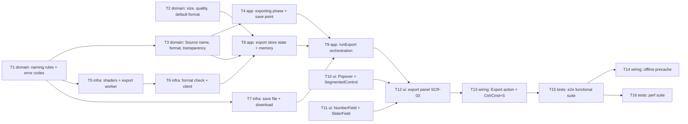

# Epic — export

> **Spec:** [spec.md](../spec.md) · **Design:** [sad.md](../sad.md) · **Screens:** [screens.md](../screens.md) · **UX flows:** [ux-flows.md](../ux-flows.md) · **ADRs:** [adr/](../adr/)
> No `data-model.md` (no schema change — IndexedDB is not touched, `sad.md` §2) and no `contracts/` (no external interface, `target_surfaces: [web-frontend]`).

## Goal

Ship roadmap step 3: the Editor turns any open Work into a PNG, JPEG or WebP file from one panel, at full or smaller size, with a quality setting and a name taken from the Source name, in every target browser (spec §2 goal 1). The file always matches what the Editor saw and the format it is named for (goal 2), and the Work counts as saved only after the file was written or handed to the browser's downloads (goal 3). Size S, route quick.

## Scope

- **In:** `src/core/export/` (naming, size, quality, default format) and four `EXPORT_*` codes; the Work's Source name, Source format and transparency fact (open-and-view change); the `editor` store's exporting phase and save point; the export worker and format check in `src/render/export/` with a shared `src/render/shaders.ts`; `src/infra/platform/save-file.ts`; the new `src/features/export/` feature (store, panel, action, shortcut, messages); four shared primitives (`Popover`, `SegmentedControl`, `NumberField`, `SliderField`); offline precache; functional and `@perf` e2e.
- **Out** (spec §3): upscaling; a file-size estimate; a JPEG background colour other than white; embedded metadata or non-sRGB profiles; a tab-close warning; AVIF/GIF/HEIC/project formats; copying to the clipboard.

## Task map

**Waves** (topological levels of `deps`; tasks in one wave can run in parallel unless they share a lane):

| Wave | Tasks |
|---|---|
| 1 | T1, T2, T10, T11 |
| 2 | T3, T5, T7 |
| 3 | T4, T6 |
| 4 | T8 |
| 5 | T9 |
| 6 | T12 |
| 7 | T13 |
| 8 | T15 |
| 9 | T14, T16 |

**Lanes** (overlapping `files_hint`, serialized by `implement`): T1 ↔ T2 (`src/core/export/index.ts`); T3 ↔ T4 (`src/features/editor/store.ts`); T3 ↔ T15 (`src/app/test-hooks.ts`); T5 ↔ T6 (`src/render/export/`); T8 ↔ T9 (`src/features/export/store.test.ts`, `src/features/export/store.ts`); T8 ↔ T12 (`src/features/export/index.ts`); T8 ↔ T13 (`src/features/export/index.ts`); T10 ↔ T11 (`docs/design-system.md`, `src/shared/ui/index.ts`, `src/shared/ui/primitives.test.ts`); T10 ↔ T13 (`docs/design-system.md`); T11 ↔ T13 (`docs/design-system.md`); T12 ↔ T13 (`src/features/export/index.ts`); T14 ↔ T15 (`e2e/export/offline.spec.ts`); T15 ↔ T16 (`e2e/export/`). No compile-coupled pair: the `Work`/`Original` contract change is folded into T3 with its only implementer.

**Suggested PR grouping** (keeps the feature inside size S's 2–5 PRs, sad §11 re-size row): PR 1 — T1, T2, T10, T11 (pure rules and primitives); PR 2 — T3, T4, T7 (open facts, exporting phase, save path); PR 3 — T5, T6 (export worker and format check); PR 4 — T8, T9, T12, T13 (feature store and UI); PR 5 — T14, T15, T16 (e2e).

## Tasks

See [tracker.md](./tracker.md) for status. Machine contract: [tasks.json](../tasks.json).

| # | Task | Layer | Blocked by | DoD (short) |
|---|---|---|---|---|
| T1 | Add the export error codes and the pure file-name rules (Source name, suggested name, extension match) | domain | — | AC-07 steps + AC-01b extensions unit-tested; 4 codes added |
| T2 | Add the pure size, quality and default-format rules (presets, long side, half-up rounding, snapping) | domain | — | AC-04/05/06 rules + defaultFormat unit-tested |
| T3 | Carry Source name, Source format and the transparency fact on the Work from every open | domain | T1 | every open sets Source name/format + hasTransparency |
| T4 | Add the editor store's exclusive exporting phase, beginExport/finishExport and the save point | app | T3 | only a finished export moves the save point; refusals while exporting |
| T5 | Extract the shared shader module and build the export worker that renders, flattens, encodes and verifies one export | infra | T1 | worker returns a content-verified Blob or EXPORT_FAILED / MISMATCH |
| T6 | Add the once-per-session format check and the main-thread export client (worker spawn, transfer, terminate) | infra | T5 | format check by content; client terminates the worker every time |
| T7 | Add the platform save path: Save as… dialog, verified write, empty-target removal and the download hand-off | infra | T1 | picker/write/discard/download outcomes as values, unit-tested |
| T8 | Create the export store: panel state, defaults, session memory, format availability and the messages catalog | app | T2, T3, T6 | AC-19 defaults + memory; format check never switches the selection |
| T9 | Orchestrate the export in the export store: snapshot, encode, Save as… or download, refusals, File ready, save point | app | T4, T7, T8 | every save/refusal/failure branch keeps or clears Unsaved edits as specified |
| T10 | Add the Popover and SegmentedControl shared primitives and register them in the design system | ui | — | non-modal Popover + radiogroup with disabled options; registered |
| T11 | Add the NumberField and SliderField shared primitives (apply on blur and Enter, apply-now) and register them | ui | — | fields apply on blur/Enter/apply(); registered |
| T12 | Build the export panel (SCR-03) in every state on the export store and the new primitives | ui | T9, T10, T11 | every SCR-03 state renders; pending values applied before confirm/close |
| T13 | Mount the Export action in the editor top bar with its states, the Ctrl/Cmd+S shortcut and the exporting lock | wiring | T12 | Export reachable; every Ctrl/Cmd+S row; lock during export |
| T14 | Precache the export worker and prove export works offline after the first load | wiring | T15 | export worker precached; offline export passes (Chromium, Firefox) |
| T15 | Write the functional e2e suite: format honesty, fidelity, quality and size, naming, metadata, downloads and Save as… | tests | T13 | honesty, fidelity, sizes, naming, metadata e2e on 3 engines |
| T16 | Write the @perf export suite: export time p95, longest freeze and memory after 10 exports | tests | T15 | @perf targets met on the reference machine |

## Tactical values

Choices the upstream artifacts left to the breakdown. Each task that relies on one quotes it with the signature `_epic.md §Tactical values`.

- **T1:** `sourceNameOf(fileName)` lives in `src/core/export/naming.ts` next to `exportFileName`; T3 calls it from the editor store at open. `matchesExtension(name, format)` judges the name the dialog returned (T9 calls it). This task owns all four new `AppErrorCode`s so T5, T7 and T9 can raise them without touching `result.ts`.
- **T2:** round half up in integers, never in floats: for a Work with long side `W` and short side `H`, a long side `L` gives short side `floor((2·L·H + W) / (2·W))`; a preset `p` gives `L = floor((2·W·p + 100) / 200)`. The smallest valid long side is the least `L` whose short side is ≥ 1 (for 4096×10 that is 205). A size choice is `{ kind: 'preset', percent }` or `{ kind: 'longSide', px }`, so the session memory (T8) can keep it "in the form it was chosen".
- **T3:** the contract change to `Work` and `Original` is folded into this task with its only implementer, `replace()` in `src/features/editor/store.ts` (the sole `createWork` call site), so the task commits green. `name` is removed, not kept alongside.
- **T5:** the worker logic sits in a testable `worker-handler.ts` (as the decode worker does) with the canvas factory injected, and `export.worker.ts` is only the entry. The session format check and the main-thread client are T6; this task returns `Result<Blob>` from the handler.
- **T6:** the check runs in its own short-lived instance of the export worker (a `check` message), so it can overlap a PNG export; `checkExportFormats()` never rejects — any error resolves that format to `false`. When to start it (first open of the session) is the export store's job (T8).
- **T7:** `pickSaveTarget` resolves one of `{ kind: 'picked', handle, name }`, `{ kind: 'cancelled' }` (`AbortError`) or `{ kind: 'activationLapsed' }` (`SecurityError`); anything else is `EXPORT_FAILED`. `writeFile` maps `NotAllowedError`, `SecurityError` and `NoModificationAllowedError` to `EXPORT_NOT_PERMITTED` and aborts the writable. The extension check itself is the store's (T9, `matchesExtension` from T1).
- **T8:** the store takes its collaborators through setters (`setFormatChecker`, `setSaveDialogProbe`), as the editor store does with `setDecoder`, so tests inject fakes. The panel registers its fields' "apply now" with `registerFlush(fn)`; `confirm()` (T9) and `closePanel()` call `flushPending()` first, so Ctrl/Cmd+S (T13) and Escape apply a value still being typed (AC-17, AC-19).
- **T9:** `confirm()` = `flushPending()` → `editor.beginExport()` (null → return) → `createImageBitmap(snapshot.original.pixels)` → `exportImage`. Store `status`: `idle | exporting | fileReady`. The success notice names the returned file on the dialog path and the suggested name on the download path. The failure suffix is appended after `EXPORT_EXTENSION_MISMATCH` and `EXPORT_NOT_PERMITTED` whether or not `discardEmptyTarget` removed the file.
- **T10:** `Popover` props: `open`, `anchor` (element), `locked`; emits `close` on Escape or a pointerdown outside it and the anchor, unless `locked`. Add a `--panel-width` token to `tokens.css` if it does not exist yet.
- **T11:** `NumberField` takes `normalize(raw: string, previous: number) => number` (T2's `normalizeQuality` / `normalizeLongSide` are passed in by the panel) and exposes `apply()` through `defineExpose`. It shares the lane with T10 (`index.ts`, `primitives.test.ts`, `docs/design-system.md`).
- **T12:** the panel registers `() => { qualityField.apply(); longSideField.apply() }` with `store.registerFlush` on mount; the confirm button calls `store.confirm()`, Escape / outside close call `store.closePanel()` (or `cancelReady()` in File ready). `Popover` gets `locked` while `status === 'exporting'`.
- **T13:** `EditorTopBar` gets `<slot name="actions" />` after "Open image"; `EditorView` forwards it as `<slot name="top-bar-actions" />`; `App.vue` fills it with `ExportAction` from `@/features/export`. "Open image" is disabled while `editor.phase === 'exporting'`. The Ctrl/Cmd+S listener is installed by `ExportAction` on mount (window, `keydown`, capture) and removed on unmount.
- **T14:** follow `e2e/open-and-view/offline.spec.ts`: assert `sw.js` lists `assets/export.worker-<hash>.js`, wait for the controller, go offline, reload, open, export. That spec skips WebKit because Playwright WebKit cannot reload while offline; do the same and say so in the test. Reuse `e2e/export/helpers.ts` from T15 (download capture, Save as… stub).
- **T15:** add test hooks `previewAt100()` (RGBA readback of the Preview at 100%, no backdrop, no DPR scaling) and `exportStatus()`; `e2e/export/helpers.ts` holds `stubSaveFilePicker(page, { returnName })` (captures written bytes in the page) and `captureExport(page)` (download event on Firefox/WebKit, stub on Chromium). Content is judged with `sniffImageHeader` from `src/core`. The metadata scan reads PNG chunks, JPEG segments and WebP RIFF chunks; use an EXIF-carrying fixture (the `orientation-*.jpg` files carry Exif; add a GPS one via `e2e/fixtures/generate.sh` if needed).
- **T16:** follow `e2e/open-and-view/perf.spec.ts`; reuse T15's Save as… stub (resolves at once) and the `bitmaps()` hook. Use `performance.measureUserAgentSpecificMemory()` (or CDP `Memory`) after a forced GC unless spec §8 OQ 4 is resolved otherwise first.

## Risks / Hard rules

- **Module boundaries** (repo `CLAUDE.md`, ADR 0002): `src/core/` stays pure (no Vue, Pinia, DOM); `render` imports only `core` and `shared`; `infra` only `core` (types and pure functions) and `shared`; `src/features/export/` imports the editor only as `useEditorStore` / types from `@/features/editor`; the app shell mounts `ExportAction` through the editor's top-bar slot.
- **Honest save** (sad §4 choice 4, §8 Save point): only `finishExport(snapshot, true)` moves `cleanRevision`, and only to the snapshot's revision. No render or format failure may reach the disk (ADR-0001).
- **Fidelity** (spec §6): the export renders with the Preview's shader code from `src/render/shaders.ts` only (ADR-0002); no DOM in render code.
- **Privacy** (spec §6.1, AC-07, AC-16): browser encoders only, pixels only; the Source name is cleaned in `core` before it is suggested; no file name or pixel is logged in production.
- **Errors and copy** (repo `CLAUDE.md`, sad §8): `Result<T, AppError>` with the four `EXPORT_*` codes; every user-facing string lives in `src/features/export/messages.ts`; no raw browser error text.
- **Styling** (repo `CLAUDE.md`): tokens only, no UI kit; new primitives registered in `docs/design-system.md`.
- **Open questions carried** (spec §8): undo back to the save point (due before roadmap step 4, sad §11 last row); the Chromium memory measurement (T16) and the JPEG/WebP/smaller-size fidelity threshold (T15), both due before `sdd:plan-tests` — defaults are used until then.
