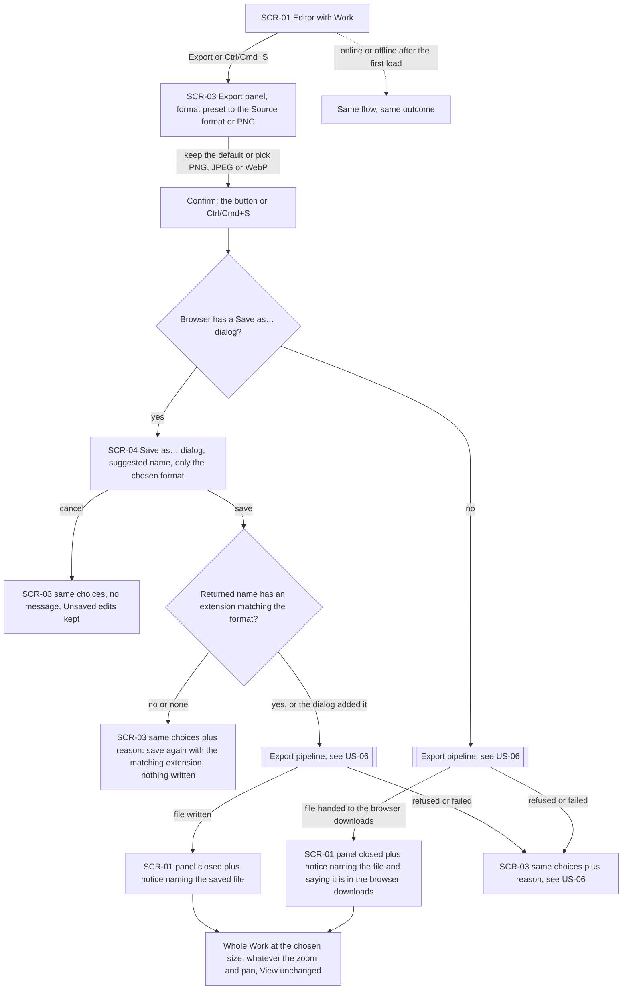
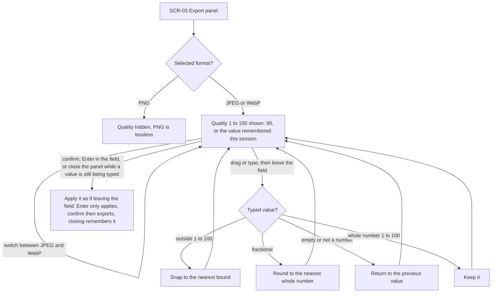
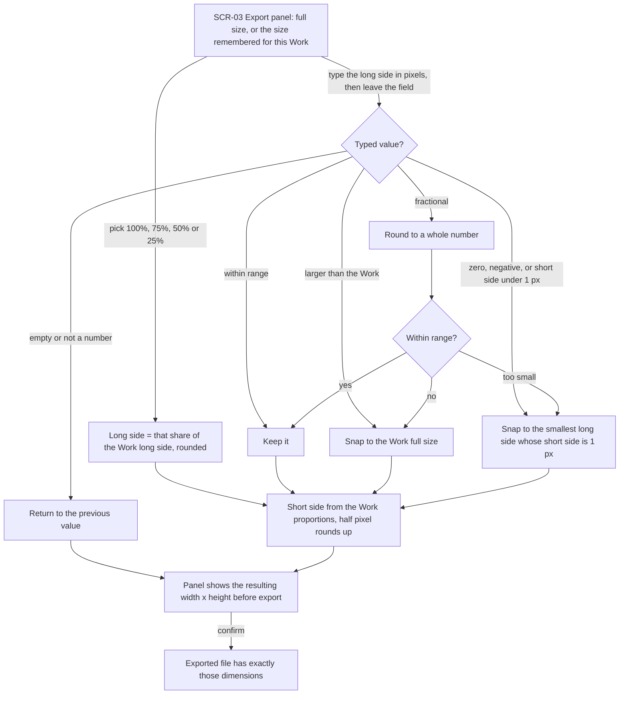
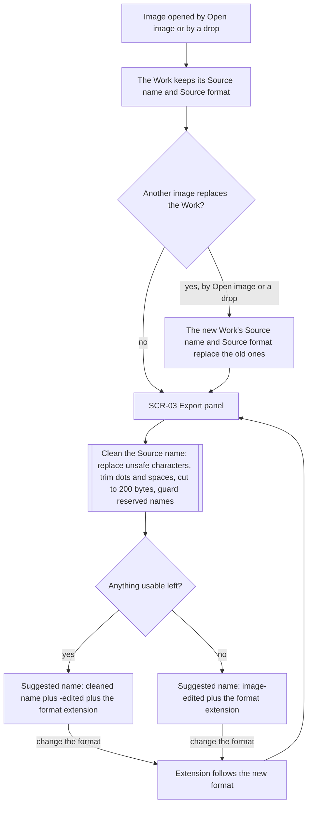
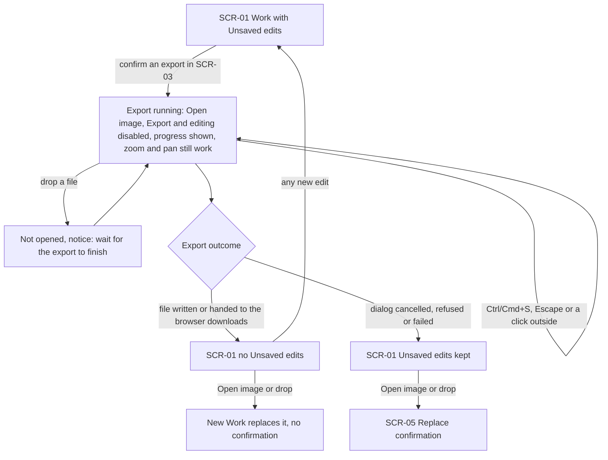
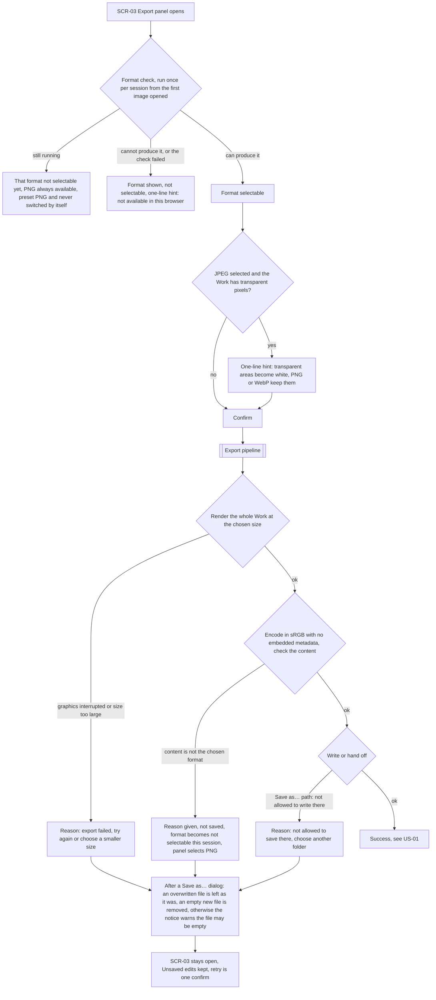
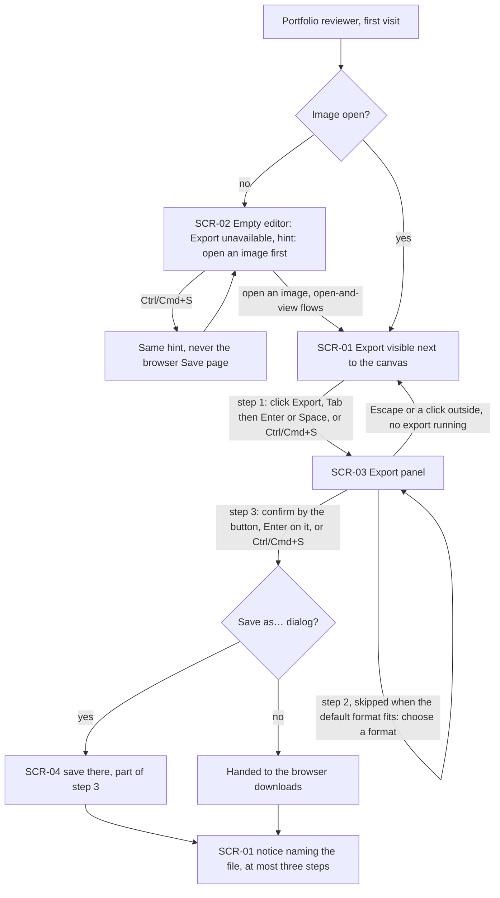

# UX flows — export

> User flows for every UI-touching §4 user story, produced by `ux-flows` (after `clarify`, before
> `design`) and read by `design` (evidence for the target-surface + UI-architecture decisions),
> `sequences` (UI-driven flows align on SCR ids), `screens` (details every inventory row) and
> `plan-tests` (the e2e-through-UI paths). **Always markdown + mermaid `flowchart`**, whatever the
> design tool — this artifact is flow-altitude, not visual design.

## Platform decisions

- **Posture:** desktop-first, as in `docs/design-system.md` §Platform posture. The Export action, the keyboard (Tab, Enter or Space, Ctrl/Cmd+S) and the two save paths are the primary paths. Below 1024 px the same screens apply and nothing is optimised for touch.
- **Navigation shape:** one editor view with no page navigation, as in open-and-view. The export panel (SCR-03) opens over the editor (SCR-01) and never replaces it, so the Preview stays visible and can still be zoomed and panned.
- **Modality:** the export panel blocks nothing while it is idle. Escape or a click outside closes it. While an export is running it cannot be closed, and "Open image", Export and the editing controls are disabled (AC-11, AC-17). The "Save as…" dialog (SCR-04) is the operating system's or browser's own and blocks until answered. Every outcome is a notice at the canon's single notice boundary. A successful save is informational, and a failure reason stays until dismissed.
- **Two save paths, chosen by the browser, not by the Editor:** where the browser has a "Save as…" dialog (Chromium), confirming in the panel opens it. Elsewhere (Firefox, Safari) confirming hands the file to the browser's downloads. Both paths run the same shared step, "Export pipeline", drawn in US-06.
- **Loading:** an export in progress is a state of SCR-01 and SCR-03 (a progress indicator on Export and in the panel, the panel's controls disabled), not a screen of its own.
- **Design input (Tech Lead flag, not decided here):** the spec puts the "Save as…" dialog *before* the file is produced, and its refusals after the dialog (AC-13), and measures the §6 export time from the panel confirm minus the time the dialog is open. `design` decides how the dialog and the encode are ordered, and verifies whether a browser empties a file chosen for overwrite when the dialog closes (spec §1, AC-13).

## Screen inventory

| ID | Screen | Purpose | Entry | Exit |
|---|---|---|---|---|
| SCR-01 | Editor with Work | open-and-view's editor with a Work open. The Export action is visible next to the canvas and reachable by keyboard. Notices about the export appear here | A successful open (open-and-view); the panel closing (success, Escape, click outside) | SCR-03 (Export, Ctrl/Cmd+S), SCR-05 (open another image with Unsaved edits) |
| SCR-02 | Empty editor | open-and-view's empty editor. Export is shown as unavailable, with a hint to open an image first | App load; no Work open | SCR-01 once an image is opened (open-and-view flows) |
| SCR-03 | Export panel | Choose the format, quality (JPEG and WebP), size and see the suggested file name and any hints, then confirm. Shows progress while an export runs | Export or Ctrl/Cmd+S on SCR-01 | SCR-04 (confirm, "Save as…" path), Export pipeline (confirm, downloads path), SCR-01 (success, Escape, click outside) |
| SCR-04 | "Save as…" dialog | The operating system's or browser's own save dialog, offering only the chosen format (not designed by us) | Confirm on SCR-03 in a browser that has it | Export pipeline (save), SCR-03 unchanged (cancel), SCR-03 plus reason (extension mismatch) |
| SCR-05 | Replace confirmation | open-and-view's warning before a new image replaces a Work with Unsaved edits. Export decides whether it appears | Opening another image while the Work has Unsaved edits | SCR-01 (replace or cancel) |

## Flows

### Flow: US-01 — Save the Work as an image file

From the editor with a Work open, the Editor chooses Export (or presses Ctrl/Cmd+S) and the export panel opens with the format preset to the Work's Source format when the browser can produce it, else PNG (AC-19). They keep the default or pick PNG, JPEG or WebP and confirm with the button or Ctrl/Cmd+S. In a browser with a "Save as…" dialog, the dialog opens with the suggested name and only the chosen format. Cancelling returns to the panel with the same choices, shows no message and keeps the Unsaved edits (AC-10). If the name the dialog returns has no extension, or one that doesn't match the format, nothing is written and the panel shows the reason (AC-01b). A matching extension, including one the dialog added itself, goes to the Export pipeline. A written file closes the panel and a notice names it (AC-01). In a browser without the dialog, confirming goes straight to the Export pipeline, and the file is handed to the browser's downloads with a notice naming it and saying where it went (AC-02). A refusal or failure on either path returns to the panel with the same choices and a reason (US-06). The file is always the whole Work at the chosen size, whatever the zoom and pan, and the View is unchanged afterwards (AC-03). The flow is the same online and offline after the first load (AC-18).

### Flow: US-02 — Balance quality against file size

In the export panel, choosing PNG hides the quality setting because PNG is lossless. Choosing JPEG or WebP shows a quality setting from 1 to 100, set to 90 or to the value remembered this session. JPEG and WebP share the one value, so switching between them keeps it (AC-04, AC-19). Values are checked when the Editor leaves the field. A value outside 1 to 100 snaps to the nearest bound, a fractional one rounds to a whole number, and an empty or non-numeric one returns to the previous value. Enter in the field, confirming, or closing the panel while still typing applies the value as if they had left the field. Enter only applies it, confirming then exports with it, so the file always has the quality the panel shows, and closing keeps it remembered (AC-17, AC-19).

### Flow: US-03 — Export a smaller image

The panel opens at the Work's full size, or at the size remembered for this Work in this session (AC-19). The Editor either picks a preset (100%, 75%, 50%, 25%), which sets the long side to that share of the Work's long side, or types the long side in pixels. A typed value is checked when they leave the field. Empty or non-numeric returns to the previous value, and a fractional value rounds to a whole number. Larger than the Work snaps to full size, and zero, negative, or too small for a 1-pixel short side snaps to the smallest long side that still gives a 1-pixel short side (AC-06). The short side follows the Work's proportions, with a half pixel rounding up (AC-05). The panel shows the resulting width × height before the export, and the file has exactly those dimensions.

### Flow: US-04 — Recognise the exported file

When an image is opened, from "Open image" or by a drop, the Work keeps its Source name and Source format. If another image replaces it, by either path, the new image's name and format replace the old ones, so an export never takes its name from the image that was replaced (AC-08). When the export panel opens, the Source name is cleaned with the strictest rules of Windows, macOS and Linux together: unsafe and control characters become `_`, leading and trailing dots and spaces are trimmed, the name is cut to 200 bytes, and reserved Windows names are guarded. If anything usable is left, the suggested name is that name plus `-edited` and the format's extension (for example `IMG_4021-edited.jpg`). If nothing is left, it is `image-edited` plus the extension. Changing the format changes the extension so it always matches (AC-07).

### Flow: US-05 — Know that my work is saved

With Unsaved edits, the Editor confirms an export. From that moment until it finishes or fails, including while the "Save as…" dialog is open, "Open image", Export and the editing controls are disabled and progress is shown. Zoom and pan still work. A file dropped then is not opened, and a notice asks the Editor to wait. Ctrl/Cmd+S does nothing, and Escape or a click outside does not close the panel. The file holds the Work as it was at confirm (AC-11, AC-17). When the file is written, or handed to the browser's downloads where there is no dialog, the Work no longer has Unsaved edits, and opening another image replaces it with no confirmation. Any later edit makes the edits unsaved again (AC-09). If the dialog is cancelled or the export is refused or fails, the Unsaved edits are kept, and opening another image still shows the replace confirmation (AC-10).

### Flow: US-06 — Understand why an export did not happen

From the first image opened in a session, each format is checked once by what the browser actually produces, not by its name or version. While the check runs, that format can't be chosen, PNG is always available, and a panel opened in that time is preset to PNG and never switches by itself. A format the browser can't produce, or whose check failed, is shown but can't be chosen, with a one-line hint that it's not available in this browser (AC-12). If JPEG is selected and the Work has any pixel that isn't fully opaque, a one-line hint says transparent areas will become white and suggests PNG or WebP (AC-15). After confirm, the Export pipeline renders the whole Work at the chosen size. If graphics are interrupted or the size can't be produced, the reason says the export failed and suggests trying again or a smaller size (AC-13). The file is then encoded in sRGB with no embedded metadata (AC-16), and its content is checked. If it isn't in the chosen format, it is not saved, the reason is given, and that format becomes unselectable for the rest of the session; the panel selects PNG, which becomes the remembered format for this Work (AC-12). On the "Save as…" path, if the OS or browser won't allow writing there, the reason says so and suggests another folder (AC-14). After any refusal past the dialog, a file chosen for overwrite stays as it was, and an empty new file is removed or the notice warns that it may remain (AC-13). Where the browser has already emptied a file chosen for overwrite, the notice says that file may now be empty. In every failure the panel stays open with the same choices (except a refused format, replaced by PNG), the Unsaved edits are kept, and trying again is one confirm (AC-17).

### Flow: US-08 — Export on the first try

On a first visit with no image open, Export is shown as unavailable with a hint to open an image first. Ctrl/Cmd+S shows the same hint and never opens the browser's "Save page". After an image is opened, the Export action is visible next to the canvas and can be clicked, reached with Tab and activated with Enter or Space, or opened with Ctrl/Cmd+S. In the panel, choosing a format is a step only when the default doesn't fit. Confirming, with the confirm button (clicked, or Enter or Space on it) or Ctrl/Cmd+S, finishes the export; Enter inside the quality or size field only applies the value: in a browser with a "Save as…" dialog, saving there is part of that same step, and otherwise the file goes to the browser's downloads. That makes at most three steps, ending on the editor with a notice naming the file. Escape or a click outside closes the panel when no export is running (AC-17).

### Not drawn

- **US-07 — Share an image without leaking where it was taken.** No movement through the UI of its own. The guarantee lives in the file's content, shown as the "Encode in sRGB with no embedded metadata" step of the Export pipeline in US-06 (AC-16).

## AC coverage

| AC | Shown by | Notes |
|---|---|---|
| AC-01 | Flow US-01 → "Save as… dialog yes" → save → Export pipeline → "file written" | Fidelity to the Preview is a §6 measurement, not a flow branch |
| AC-01b | Flow US-01 → "Returned name has an extension matching the format? no or none" | The check uses the name the dialog returns |
| AC-02 | Flow US-01 → "Save as… dialog no" → Export pipeline → "handed to the browser downloads" | |
| AC-03 | Flow US-01 → "Whole Work at the chosen size, View unchanged" | |
| AC-04 | Flow US-02 (all branches) | |
| AC-05 | Flow US-03 → preset or typed long side → short side → "Panel shows the resulting width x height" | |
| AC-06 | Flow US-03 → "larger than the Work" and "too small" snaps | |
| AC-07 | Flow US-04 → "Clean the Source name" → suggested name or `image-edited` fallback | Cleanup order, the exact reserved-name list and the known image extensions are the spec's |
| AC-08 | Flow US-04 → "Another image replaces the Work? yes" | |
| AC-09 | Flow US-05 → "file written or handed off" → no Unsaved edits → replace with no confirmation | §8 question on undo back to the save point stays open until roadmap step 4 |
| AC-10 | Flow US-05 → "dialog cancelled, refused or failed" → SCR-05; Flow US-01 → cancel | |
| AC-11 | Flow US-05 → "Export running" node, drop notice | |
| AC-12 | Flow US-06 → format check branches; "content is not the chosen format" | After this refusal the panel selects PNG |
| AC-13 | Flow US-06 → "graphics interrupted or size too large"; the "After a Save as… dialog" node | |
| AC-14 | Flow US-06 → "Save as… path: not allowed to write there" | |
| AC-15 | Flow US-06 → "JPEG selected and the Work has transparent pixels?" | Shown while JPEG is selected, however it was selected |
| AC-16 | Flow US-06 → "Encode in sRGB with no embedded metadata" | US-07 has no flow of its own (see Not drawn) |
| AC-17 | Flow US-08 (whole flow); Flow US-01 and US-06 → panel stays open with the same choices; Flow US-05 → Ctrl/Cmd+S and Escape ignored while running | |
| AC-18 | Flow US-01 → dashed "online or offline" edge | |
| AC-19 | Flow US-01 → panel preset; Flow US-02 → remembered quality; Flow US-03 → remembered size | |
