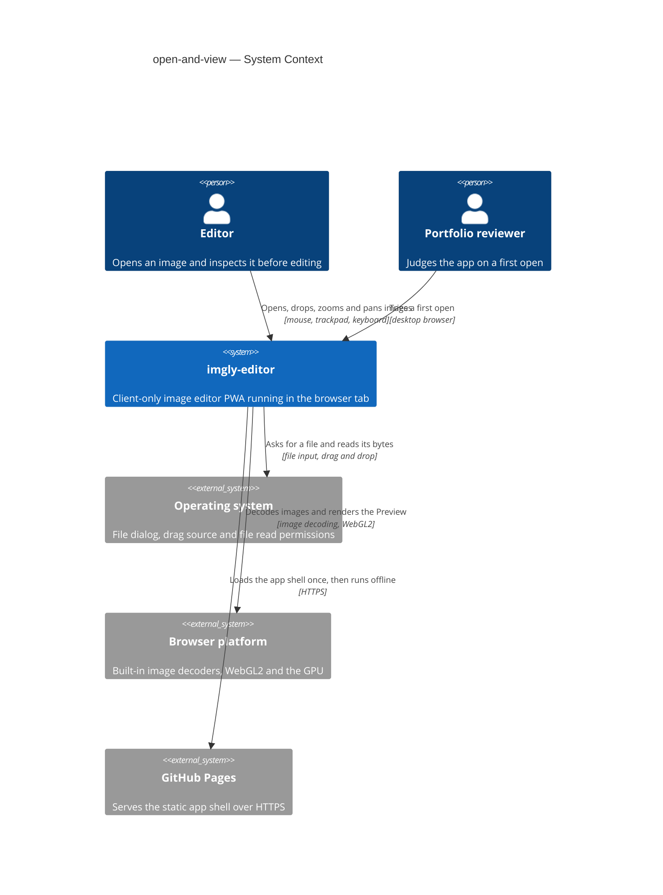
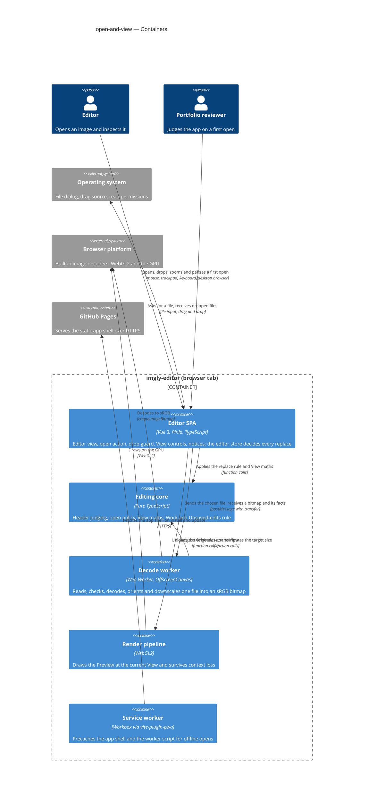
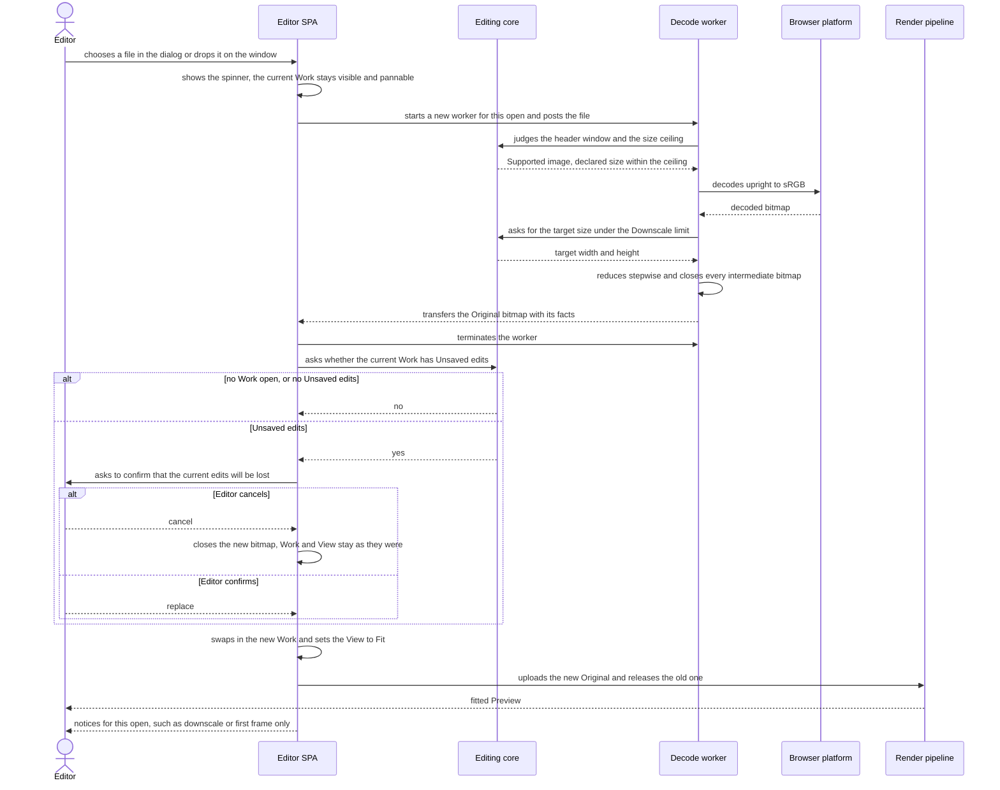
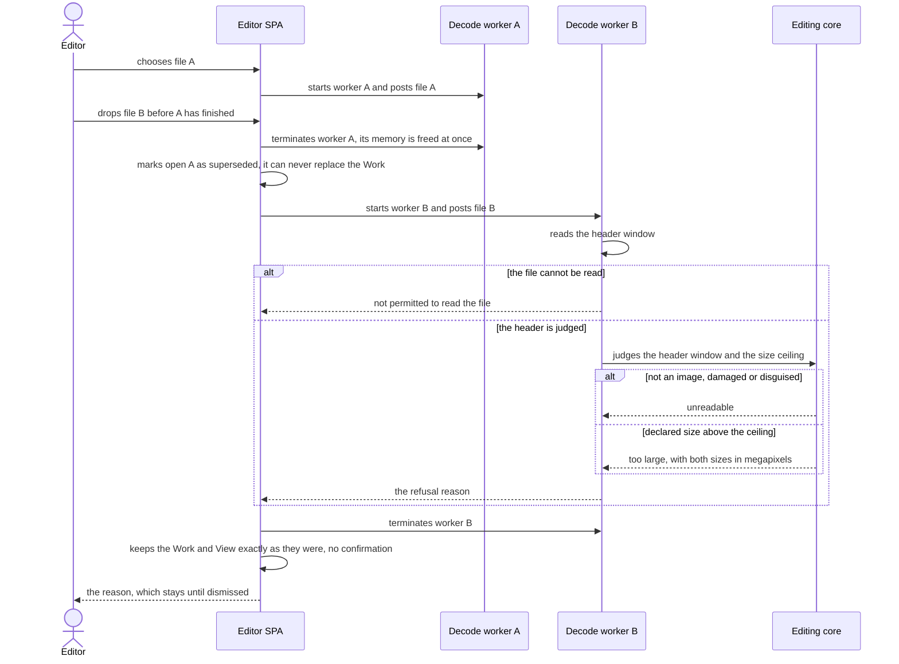

# Software Architecture Document — open-and-view

<!-- 12 Arc42 sections. Empty section → <!-- N/A: <one-line reason> -->. -->
<!-- C4 Context (L1) lives inline in §3. C4 Container (L2) lives inline in §5. -->
<!-- Numbers in §10 come VERBATIM from spec.md §6 NFR — no inventing, no rounding. -->

## 1. Introduction and goals

**Intent.** open-and-view lets the Editor bring one photo from disk into the app, through the "Open image" action or by dropping it anywhere on the window, and see it as an upright, ready-to-edit Preview within seconds, with no dialogs on the happy path. The new file is read completely before it can replace the open Work. Anything larger than the Downscale limit (4096 px) becomes an Original at that limit, announced in one line, and every refusal comes with a plain-language reason. The feature also fixes the View (Fit, 100%, zoom, pan) and the replace rule that every later editing feature inherits, and it gives the Portfolio reviewer an honest first impression even when their browser cannot render (spec §1, §2).

**Top-3 quality goals (1-liners; full scenarios in §10):**

1. **Open responsiveness**: the fitted Preview appears fast and the interface never freezes while a file is read.
2. **Work integrity under untrusted input**: the open Work is never lost or replaced by something unreadable, no hostile, oversize or mis-named file can exhaust the tab, and every open ends in a correct Preview or a plain reason.
3. **Smooth, stable View**: zoom and pan stay fluid on a 4096 px Original, and memory stays flat across repeated opens.

**Stakeholders.**

| Role | Interest | Sign-off owner? |
|---|---|---|
| Editor | Opens images by dialog or drop, inspects them with Fit, 100%, zoom and pan, keeps Unsaved edits safe | No |
| Portfolio reviewer | A first open that works first time, and an honest message when the browser can't render | No |
| Tech Lead | SAD approval; the View and the replace rule are inherited by every later tool | Yes |
| Security Lead | Mandatory security review (spec §6.1): this is the app's only intake of untrusted files | Yes |

<!-- Decision overrides (¶4) — populated by the critic resolution loop, empty otherwise. -->

## 2. Constraints

**Technical.**
- TypeScript 5 (`strict`), Node 24 toolchain, pnpm — repo ADR [0001](../../adr/0001-build-a-client-only-vue-pwa.md)
- Vue 3 (Composition API, `<script setup>`) + Pinia + Vite + vite-plugin-pwa; a client-only static app with no server, accounts or sync — repo ADR 0001
- Static hosting on GitHub Pages under `/imgly/` with no custom response headers, so no COOP/COEP and no `SharedArrayBuffer`: data crosses threads only by structured clone or transfer — repo ADR 0001 (Consequences)
- WebGL2 is required for the Preview, with no CPU fallback; Canvas 2D is reserved for the drawing layer — repo ADR [0004](../../adr/0004-render-adjustments-on-webgl2-and-drawing-on-canvas2d.md)
- Functional core with feature folders: `src/core/` is pure TypeScript with no Vue, Pinia or DOM; imports flow `features → core | render | infra | shared`; features never import each other and coordinate through the `editor` store — repo ADR [0002](../../adr/0002-organize-code-as-functional-core-with-feature-folders.md)
- Images are decoded only by the browser's own decoders; no bundled codecs or WASM decoders. HEIC/HEIF opens only where the current browser decodes it itself (CONTEXT "Supported image", spec AC-07)
- No persistence in this feature: IndexedDB is not touched and the Work lives only in the current session (spec §3)
- Targets: the latest desktop Chromium, Firefox and Safari; on mobile the app only has to not break (`docs/architecture-map.md` §Constraints, `docs/design-system.md` §Platform posture)

**Organisational.**
- Solo, spare-time project; owner Blazheiko. No per-feature effort budget: the only limit is the 4–6 week MVP budget for the whole roadmap (spec §1). No hard deadline
- TDD is on (`.claude/sdd.local.md`): unit tests with Vitest, e2e with Playwright
- The spec §6 targets bind to the reference machine: Apple M1 MacBook Air with the latest Chrome (spec §8 open question, due before `sdd:plan-tests`)

**Conventions.**
- `docs/architecture-map.md` §Conventions: `core` and `infra` return `Result<T, AppError>` with a typed `code` and throw only for programmer errors; UUIDv7 IDs from `newId()`; unit tests co-located as `*.test.ts`; e2e in `e2e/*.spec.ts`; features expose `index.ts` and are mounted from `src/app/App.vue`; plain CSS with tokens from `src/shared/styles/tokens.css`
- `docs/design-system.md` §Interaction & writing conventions: one toast boundary, where informational notices dismiss themselves and failure reasons stay until dismissed; a blocking condition (no WebGL2) gets a full-canvas message instead of a toast; an indeterminate spinner overlay on the canvas while decoding; every action reachable by keyboard; short, plain microcopy
- New UI primitives are added to `src/shared/ui/` and registered in the `docs/design-system.md` inventory (screens may only use inventory names or a justified `NEW:`)

**Regulatory / external.**
- Data classification: confidential (spec §6.1). Image pixels and embedded metadata never leave the device: the feature makes no network request carrying image data and ships no telemetry or analytics
- No accounts, so no AuthN/AuthZ; the only access check is the OS or browser permission to read the chosen file (AC-10)
- Security review: required (spec §6.1). This feature is the app's only intake of untrusted files
- No other compliance regime applies: no personal data is processed off the device or stored

## 3. Context and scope

imgly-editor is an offline, client-only image editor that runs entirely in the browser tab. open-and-view is its intake: the only place where untrusted files from the Editor's computer enter the app, and the first thing a Portfolio reviewer tries. Nothing in this feature talks to a server: GitHub Pages serves the static app shell once, and every image stays on the device.

<!-- brownfield: N/A — greenfield repo. No source exists yet; the target foundation is docs/architecture-map.md (mode: greenfield-bootstrap) + repo ADRs 0001–0004, materialized by /sdd:scaffold. -->

**Trust boundary.** Every byte that arrives from the operating system (a chosen or dropped file) is untrusted until the app has judged it by content and checked its declared size (spec §6.1). The browser's own decoders and GPU are trusted to be memory-safe, but their format support and their availability (WebGL2, context loss) vary per browser and are treated as capabilities to detect, not assumptions.

**External systems (in / out):**

| Actor or system | Type | Interaction |
|---|---|---|
| Editor | Person | Opens an image with "Open image" or by dropping it; fits, zooms and pans the Preview; confirms or cancels a replace |
| Portfolio reviewer | Person | Opens the deployed app for the first time and tries the same open, usually on a desktop browser |
| Operating system | System (external) | Shows the file dialog, supplies dropped files, and allows or refuses reading them (permissions, cloud placeholders, AC-10) |
| Browser platform | System (external) | Decodes the Supported image formats with its built-in decoders and provides WebGL2 on the GPU, which it may interrupt (AC-18, AC-19) |
| GitHub Pages | System (external) | Serves the static app shell over HTTPS on first load and updates; never sees an image |

**External: no third-party service** — deliberate. No upload, no telemetry, no remote decoder (§2 Regulatory).

**C4 Context (L1):**



## 4. Solution strategy

**Target surface.** `target_surfaces: [web-frontend]` (frontmatter). The feature owns one runnable surface, the Editor SPA in the browser tab. The decode worker, the editing core and the render pipeline are internal containers of that surface (§5), not surfaces of their own: there is no server (repo ADR 0001), no event-consumer `worker` surface, and no published library. Decided inline: the only alternative surfaces are excluded by §2.

**UI architecture (web-frontend).** A client-rendered SPA with one editor view and no router; the empty editor, the editor with a Work, and the unsupported-browser and display-lost messages are alternative contents of the same canvas area (ux-flows.md §Platform decisions). State lives in the `editor` Pinia setup store; components are built from `src/shared/ui/` primitives and `tokens.css`. Inherited from repo ADR 0001 and `docs/architecture-map.md` §Frontend; no new ADR, because server rendering is excluded by §2 (no server).

**Top strategic choices (the seeds for ADRs):**

1. **A two-phase open, decoded off the main thread** — [ADR-0001](adr/0001-decode-and-downscale-in-a-dedicated-web-worker.md). Every open reads, checks, decodes, orients and downscales the file in a dedicated Web Worker and hands back a finished bitmap; only then does the `editor` store decide (no Unsaved edits → replace; Unsaved edits → confirm) and swap the Work in one step. A newer open terminates the older worker. Serves quality goal 1 (no freeze above 200 ms) and quality goal 2 (the Work is only ever replaced by an image read successfully).
2. **Judge by content before decoding** — [ADR-0002](adr/0002-parse-image-headers-in-core-before-decoding.md). A pure-TypeScript header parser in `src/core/image-header/` names the format, reads the declared dimensions, animation and orientation from a bounded byte window, and the open policy refuses oversize images before any pixel is decoded. Serves quality goal 2 and is the single point of the security review.
3. **One WebGL2 Preview with the View as a transform** — [ADR-0003](adr/0003-render-the-preview-in-one-webgl2-canvas-with-a-view-transform.md). The Original becomes a mipmapped texture in one canvas at physical-pixel resolution; zoom and pan are a shader uniform computed by pure View maths in `src/core/view/`. Serves quality goal 3 and is the surface later tools (adjust, crop, draw) extend unchanged.
4. **One colour space: sRGB** — [ADR-0004](adr/0004-convert-every-original-to-srgb-on-open.md). Every Original is converted to sRGB while decoding, so Preview, adjustments and export agree in every browser. Resolves the spec §8 wide-gamut question.

Each tactical decision in later sections should trace to one of these seeds. Tactical decisions that *contradict* a strategic choice are red flags — surface them in §11.

## 5. Building block view

The feature follows the repo's functional core with feature folders (repo ADR 0002), which works like a small hexagonal layout: `src/core/` holds every rule as pure TypeScript (header judging, the open policy, View maths, the Work and its Unsaved-edits rule) and is unit-tested without a browser; `src/infra/` and `src/render/` are the adapters to the browser (file intake, the decode worker, WebGL2); `src/features/editor/` is the only UI and the `editor` store is the one place that decides whether a decoded image replaces the Work. open-and-view extends the existing `editor` feature instead of adding a new feature folder, because the open, the replace rule and the View are the editor's own baseline, and every later intake (paste, "Open with…", gallery re-open) calls the same store action. No datastore is touched (§2).

The Work knows it has Unsaved edits through a revision counter ([ADR-0005](adr/0005-track-unsaved-edits-with-a-revision-counter-on-the-work.md)): every edit, undo and redo raises `revision`, and `hasUnsavedEdits(work)` compares it with the revision at open (later, at save). The View lives next to the Work in the `editor` store, never inside it, so zoom and pan can never count as edits (AC-14).

**Internal decomposition:**

```
src/
├── core/                         pure TypeScript: no Vue, Pinia, DOM or browser APIs
│   ├── result.ts                 Result<T, AppError>; new open error codes (§8)
│   ├── document.ts               Work = Original + revision counters; hasUnsavedEdits(work) (ADR-0005)
│   ├── image-header/             sniffImageHeader(bytes) → format, size, animated, orientation (ADR-0002)
│   ├── open/                     checkOpenPolicy (size ceiling), targetSize (Downscale limit), pickFromDrop order
│   └── view/                     View maths: fit, zoom steps, clamp, zoom-at-point, pan clamp, auto-fit flag
├── infra/
│   ├── image-decode/             decodeImage(blob) on the main thread + decode.worker.ts (ADR-0001, ADR-0004)
│   └── platform/                 file picker, window-level drop guard, files from a DataTransfer
├── render/
│   ├── capabilities.ts           start-up capability gate (WebGL2, texture size, worker canvas)
│   └── preview-renderer.ts       one WebGL2 canvas, mipmapped Original texture, View uniform, context loss (ADR-0003)
├── shared/
│   ├── ui/                       BaseButton + the new primitives this feature registers (Toast, Spinner, Dialog…)
│   └── notices/                  notice queue: informational notices self-dismiss, failure reasons stay (AC-11b)
└── features/editor/
    ├── store.ts                  `editor` store: Work, View, open state; openImage(blob) and replace confirmation
    ├── EditorView.vue            canvas area: SCR-01 empty, SCR-02 Work, SCR-04 unsupported, SCR-05 display lost
    ├── components/               open action, drop overlay, zoom controls, dimensions readout, replace dialog (SCR-03)
    └── index.ts                  public surface: EditorView + useEditorStore
```

Dependency direction stays as repo ADR 0002 sets it: `features/editor → core | infra | render | shared`, `infra → core (types and pure functions) | shared`, and `core` imports nothing. The decode worker runs the same `core/image-header` and `core/open` code the unit tests cover, so the security review reads one parser in one place.

**C4 Container (L2):**



## 6. Runtime view

Two flows are seeded here: the open itself, including the replace confirmation, and the failure and supersede paths that protect the Work. The `sequences` stage expands them to cover every spec §5 AC. Participants are the §5 containers; the Browser platform from §3 appears where the worker decodes.

**Critical flow 1: open an image and replace the Work** (AC-01, AC-02, AC-05, AC-06, AC-11, AC-14, AC-15)



The Work changes in one step, inside the `editor` store, and only after the worker has returned a finished bitmap. On cancel nothing after the confirmation runs, and the new bitmap is closed at once so its memory is freed. The old Original's bitmap and texture are released after the new texture is uploaded, so the Preview never shows an empty frame.

**Critical flow 2: a superseded open and a refused file leave the Work untouched** (AC-08, AC-09, AC-10, AC-16, AC-16b)



Every refusal ends the same way: the worker reports a typed reason, the `editor` store changes nothing, and the reason goes to the notice queue as a failure that stays until dismissed. A late answer from a terminated worker can never arrive, and the store also ignores any result whose open is no longer the latest.

## 7. Deployment view

open-and-view reuses the existing deployment unit: one static bundle built by `.github/workflows/ci.yml` and served by GitHub Pages under `/imgly/` (repo ADR 0001). There are no servers or replicas; every visitor's browser tab is its own runtime, with one decode worker alive per open at most. The only deployment change is a new build asset: Vite emits the decode worker as a separate hashed module script (`new Worker(new URL('./decode.worker.ts', import.meta.url), { type: 'module' })`), and the Workbox precache must list it, so an open works with no network after the first load (spec §6, offline row). The capability probes' sample images are embedded in the worker script, so the probes never fetch anything.

**Monitoring:**
- No runtime metrics, logs or traces leave the device, by design (§2 Regulatory). The feature's health is measured before release, not in production
- Every push: CI runs lint, typecheck, Vitest units (header parser, open policy, View maths, `hasUnsavedEdits`, the fuzz test of ADR-0002) and the functional Playwright e2e suite on Chromium, Firefox and WebKit, including an offline open after the first load. This widens the repo's Chromium-only e2e (`docs/architecture-map.md` §Conventions) for this feature, because orientation, the capability probes and drop behave differently per engine. WebGL pixel checks stay on Chromium only
- Before each release: the `@perf` Playwright suite (time to first Preview, long tasks, frame rate, memory after 10 opens) runs on the reference machine, because CI runners are not the machine the spec §6 targets bind to. The same pre-release pass opens the HEIC samples in real Safari, since WebKit on Linux does not decode HEIC (§11)
- In the tab: failures surface only as notices to the Editor; in development builds the decode worker also logs its stage timings to the console

**Scaling thresholds** (per tab, on the reference machine):
- Peak memory of one open is the decoded size inside the worker: at most the size ceiling × 4 bytes (§8), plus the reduced Original
- While a Work is open the tab holds the Original twice, as a bitmap for context restore and as a mipmapped texture (ADR-0003): about 150 MB at 4096 × 4096, and about twice that for a moment during a replace, until the old Original is released (§6, flow 1)
- An open whose declared size is above the size ceiling never reaches the decoder (AC-09)

## 8. Crosscutting concepts

| Concept | Convention | Where defined |
|---|---|---|
| Error handling | `core` and `infra` return `Result<T, AppError>`; hostile input never throws. New codes: `FILE_NOT_PERMITTED` (AC-10), `NOT_AN_IMAGE` and `DECODE_FAILED` (AC-08, one message), `UNSUPPORTED_FORMAT` with the format name (AC-07), `TOO_LARGE` with both sizes in megapixels (AC-09), `UNSUPPORTED_BROWSER` (AC-18), `DISPLAY_LOST` (AC-19b). The worker posts errors as plain `{ code, details }` objects. A superseded open is not an error: `decodeImage` resolves it as `Superseded` and the store ignores it | `docs/architecture-map.md` §Conventions; codes in `src/core/result.ts` |
| User messages | Every `AppError` code maps to exactly one plain-language message in one catalog, `src/features/editor/messages.ts`; no raw browser error text ever reaches the Editor. Notices go through one queue in `src/shared/notices/`: informational ones (downscale, first frame only, files ignored) dismiss themselves, failure reasons stay until dismissed, and all notices of one open are shown together without hiding each other (AC-11b). Blocking conditions (SCR-04, SCR-05) replace the canvas area instead of using a notice | `docs/design-system.md` §Interaction & writing conventions; here |
| Size ceiling | 100 MP, measured as the declared width × height and checked before any decode (AC-09). No separate limit on file size in bytes or on the length of one side: intermediate canvases in the worker never exceed 16 384 px per side, so a very elongated image within the ceiling is reduced in a first, larger step instead of being refused, and a file the browser itself cannot decode ends as AC-08. Resolves spec §8 (size ceiling) | here; `src/core/open/` |
| Resource lifetime | Every `ImageBitmap` is `close()`d as soon as it is no longer needed: intermediates in the worker, the new bitmap on a cancelled replace, the old Original after a replace. The old texture is deleted after the new one is uploaded (§6, flow 1). Each open's worker is terminated when its result arrives or when a newer open starts. Exactly one Original (bitmap + texture) is retained while a Work is open | here; ADR-0001, ADR-0003 |
| Concurrency | Latest open wins: the store gives every open an increasing id and accepts a result only if its id is still the latest; the previous worker is terminated at once (AC-16b). The View stays live during an open; the Work is swapped in one synchronous store action | here; ADR-0001 |
| Capability detection | Probed once, never assumed: the start-up gate in `src/render/capabilities.ts` (WebGL2, texture size, worker canvas, AC-18) and the worker's per-session probes (does the browser apply EXIF orientation, does it decode HEIC). Results are cached for the session. No user-agent sniffing | ADR-0001, ADR-0003 |
| Pixel units | The View maths in `src/core/view/` works in device pixels, so 100% is one image pixel per physical screen pixel (AC-12). Pointer and wheel positions are converted from CSS pixels by `devicePixelRatio` at the component edge, and the canvas is sized with `device-pixel-content-box` where available | here; ADR-0003 |
| Privacy | The Original holds pixels only: no EXIF or other metadata is copied into the Work (spec §6.1); the header parser reads orientation and nothing else. No image data, file name or metadata is logged, sent or stored | spec §6.1; here |
| ID strategy | A new Work gets a UUIDv7 from `newId()` | `docs/architecture-map.md` §Conventions |
| Logging / observability | No telemetry or remote logging (§2, §7). Development builds log the worker's stage timings to the console; production builds log nothing about images | here |
| Authentication | N/A: no accounts (§2). The only access check is the OS or browser permission to read the file (AC-10) | — |
| Internationalisation | English only; every user-visible string lives in the messages catalog, so a later translation touches one file | here |
| Keyboard and focus | Every control (Open image, zoom in and out, Fit, 100%, the replace dialog, notice dismiss) is a focusable button with a visible focus ring; the replace dialog traps focus and returns it on close. Specific shortcuts are fixed by `screens` | `docs/design-system.md` §Interaction & writing conventions |

## 9. Architecture decisions

| # | Title | Status | Section |
|---|---|---|---|
| [0001](adr/0001-decode-and-downscale-in-a-dedicated-web-worker.md) | Decode, orient and downscale every opened image in a dedicated Web Worker | Accepted | §4 |
| [0002](adr/0002-parse-image-headers-in-core-before-decoding.md) | Judge every file by a pure-TypeScript header parser in core before any decoding | Accepted | §4 |
| [0003](adr/0003-render-the-preview-in-one-webgl2-canvas-with-a-view-transform.md) | Render the Preview in one WebGL2 canvas, with the Original as a mipmapped texture and the View as a shader transform | Accepted | §4 |
| [0004](adr/0004-convert-every-original-to-srgb-on-open.md) | Convert every Original to sRGB on open | Accepted | §4 |
| [0005](adr/0005-track-unsaved-edits-with-a-revision-counter-on-the-work.md) | Track Unsaved edits with a revision counter on the Work | Accepted | §5 |

ADR files live under `docs/features/open-and-view/adr/NNNN-<title>.md`. The repo-wide foundation decisions this feature builds on are in `docs/adr/` (0001 client-only Vue PWA, 0002 functional core with feature folders, 0004 WebGL2 and Canvas 2D); repo ADR 0003 (IndexedDB persistence) is not touched here.

Decided inline, below the ADR gate: extending `features/editor` rather than a new feature folder (§5), the performance suite running on the reference machine and the e2e suite on three engines (§7), and the 100 MP size ceiling with no byte or side limit (§8).

## 10. Quality requirements

<!-- 🎯 Why: the QUALITY TREE — take a goal from §1 and break it into concrete leaves: tests,
     metrics, configs, drills. ⭐ Without §10, §1 is a manifesto. With §10 each declaration maps
     to something PROVABLE.
     📋 Write: per §1 goal — When / Then / How-verify. Numbers from spec §6 NFR VERBATIM (don't
     round ≤250ms to ≤300ms — that's a critic F6 hit).
     📌 e.g. «p95 ≤ 500 ms on a block update, verified by a 100 req/s load test». -->

Each top-3 goal from §1 expanded into a full scenario:

**QG-1. <quality attribute>**
- **When:** <trigger condition>
- **Then:** <expected behaviour with numbers from spec §6 NFR>
- **How verify:** <test / chaos drill / load test / metric>

**QG-2. <quality attribute>**
- **When:** <trigger>
- **Then:** <expected>
- **How verify:** <how>

**QG-3. <quality attribute>**
- **When:** <trigger>
- **Then:** <expected>
- **How verify:** <how>

## 11. Risks and technical debt

<!-- 🎯 Why: ⭐ collects EVERYTHING that can break — not only the technical. Without §11 risks get
     discussed at standups and lost; debt lives only in the head of whoever accepted it.
     📋 Write: a risk/debt table — severity — mitigation — owner. Accepted debt in its own block.
     📌 The first risk is often a product risk, not a technical one. That's normal. -->

<!-- Severity literals: Low / Medium / High for regular risks; "Open question" for rows created by
     a Save-as-OQ resolution during the Socratic walk (see references/socratic.md). -->

| Risk / debt | Severity | Mitigation | Owner |
|---|---|---|---|
| <e.g. Worker lag may reach hours during a downstream outage> | Medium | <alert >10 min, on-call playbook, retry backoff> | <DevOps> |
| <e.g. No event-schema versioning in v1> | Medium | <ADR-NNNN planned for v2, tolerate unknown fields> | <Backend> |
| Open architectural decision: <decision-headline> | Open question | Resolve before <stage trigger or YYYY-MM-DD>; <inline rationale from the Save-as-OQ> | <owner> |

**Accepted debt (acceptable in v1, plan to fix later):**
- <e.g. the entity is immutable / unversioned — OK for v1, may need audit versioning in v2>

## 12. Glossary

<!-- 🎯 Why: ⭐ the DOMAIN GLOSSARY that ends arguments a year later («checkpoint — weekly or
     biweekly? quarter — calendar or fiscal?»).
     📋 Write: a term / meaning table. Business + technical terms mixed.
     📌 e.g. «Lesson | a unit inside a course made of blocks (text, video)». -->

| Term | Meaning |
|---|---|
| <e.g. domain object A> | <its meaning in this domain> |
| <e.g. domain object B> | <its meaning> |
| <e.g. domain invariant name> | <the rule, in plain language> |
