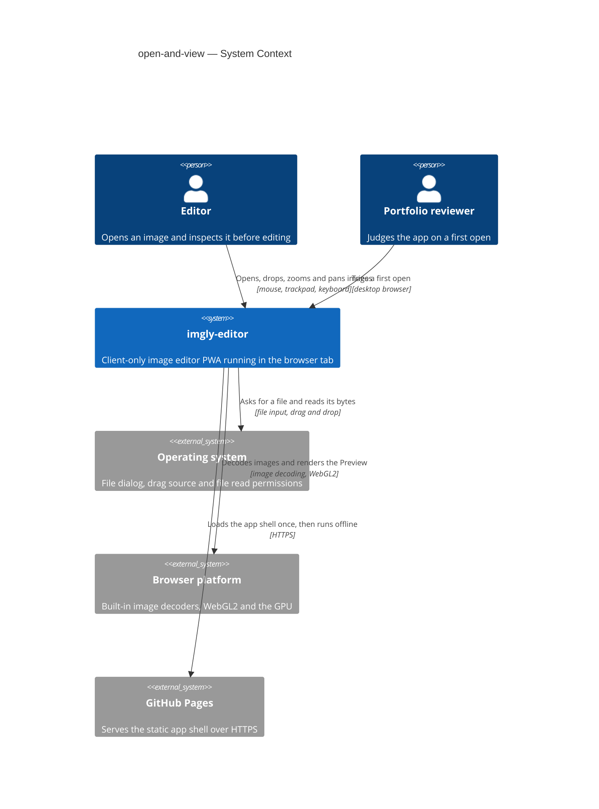
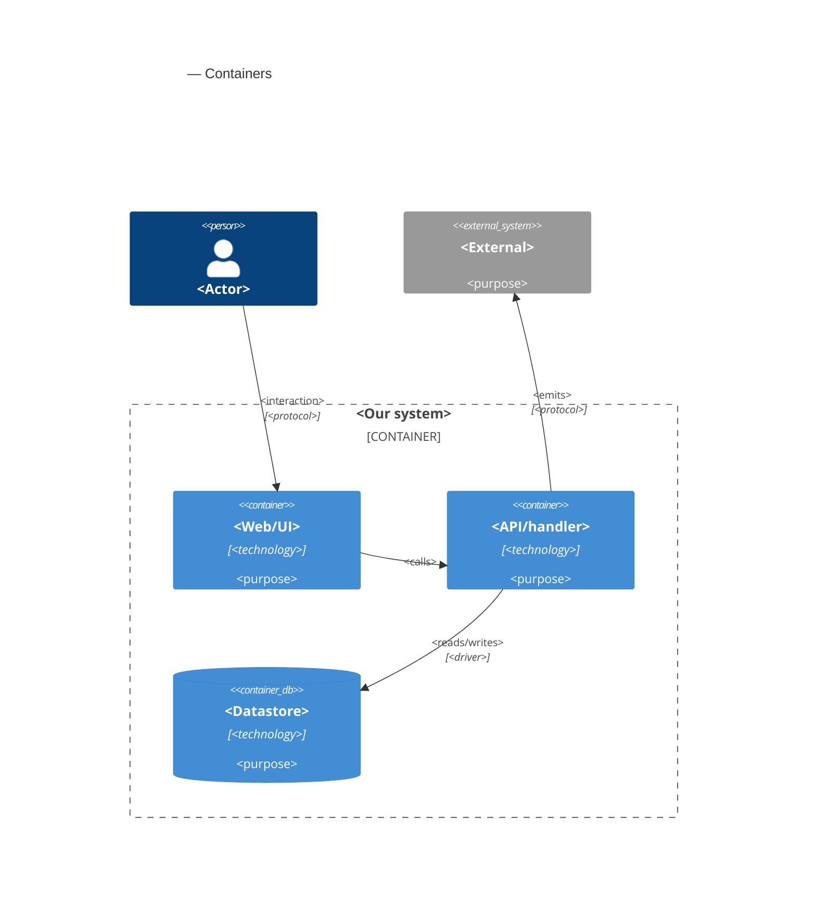

# Software Architecture Document — open-and-view

<!-- 12 Arc42 sections. Empty section → <!-- N/A: <one-line reason> -->. -->
<!-- C4 Context (L1) lives inline in §3. C4 Container (L2) lives inline in §5. -->
<!-- Numbers in §10 come VERBATIM from spec.md §6 NFR — no inventing, no rounding. -->

## 1. Introduction and goals

**Intent.** open-and-view lets the Editor bring one photo from disk into the app, through the "Open image" action or by dropping it anywhere on the window, and see it as an upright, ready-to-edit Preview within seconds, with no dialogs on the happy path. The new file is read completely before it can replace the open Work. Anything larger than the Downscale limit (4096 px) becomes an Original at that limit, announced in one line, and every refusal comes with a plain-language reason. The feature also fixes the View (Fit, 100%, zoom, pan) and the replace rule that every later editing feature inherits, and it gives the Portfolio reviewer an honest first impression even when their browser cannot render (spec §1, §2).

**Top-3 quality goals (1-liners; full scenarios in §10):**

1. **Open responsiveness**: the fitted Preview appears fast and the interface never freezes while a file is read.
2. **Work integrity under untrusted input**: the open Work is never lost or replaced by something unreadable, no hostile, oversize or mis-named file can exhaust the tab, and every open ends in a correct Preview or a plain reason.
3. **Smooth, stable View**: zoom and pan stay fluid on a 4096 px Original, and memory stays flat across repeated opens.

**Stakeholders.**

| Role | Interest | Sign-off owner? |
|---|---|---|
| Editor | Opens images by dialog or drop, inspects them with Fit, 100%, zoom and pan, keeps Unsaved edits safe | No |
| Portfolio reviewer | A first open that works first time, and an honest message when the browser can't render | No |
| Tech Lead | SAD approval; the View and the replace rule are inherited by every later tool | Yes |
| Security Lead | Mandatory security review (spec §6.1): this is the app's only intake of untrusted files | Yes |

<!-- Decision overrides (¶4) — populated by the critic resolution loop, empty otherwise. -->

## 2. Constraints

**Technical.**
- TypeScript 5 (`strict`), Node 24 toolchain, pnpm — repo ADR [0001](../../adr/0001-build-a-client-only-vue-pwa.md)
- Vue 3 (Composition API, `<script setup>`) + Pinia + Vite + vite-plugin-pwa; a client-only static app with no server, accounts or sync — repo ADR 0001
- Static hosting on GitHub Pages under `/imgly/` with no custom response headers, so no COOP/COEP and no `SharedArrayBuffer`: data crosses threads only by structured clone or transfer — repo ADR 0001 (Consequences)
- WebGL2 is required for the Preview, with no CPU fallback; Canvas 2D is reserved for the drawing layer — repo ADR [0004](../../adr/0004-render-adjustments-on-webgl2-and-drawing-on-canvas2d.md)
- Functional core with feature folders: `src/core/` is pure TypeScript with no Vue, Pinia or DOM; imports flow `features → core | render | infra | shared`; features never import each other and coordinate through the `editor` store — repo ADR [0002](../../adr/0002-organize-code-as-functional-core-with-feature-folders.md)
- Images are decoded only by the browser's own decoders; no bundled codecs or WASM decoders. HEIC/HEIF opens only where the current browser decodes it itself (CONTEXT "Supported image", spec AC-07)
- No persistence in this feature: IndexedDB is not touched and the Work lives only in the current session (spec §3)
- Targets: the latest desktop Chromium, Firefox and Safari; on mobile the app only has to not break (`docs/architecture-map.md` §Constraints, `docs/design-system.md` §Platform posture)

**Organisational.**
- Solo, spare-time project; owner Blazheiko. No per-feature effort budget: the only limit is the 4–6 week MVP budget for the whole roadmap (spec §1). No hard deadline
- TDD is on (`.claude/sdd.local.md`): unit tests with Vitest, e2e with Playwright
- The spec §6 targets bind to the reference machine: Apple M1 MacBook Air with the latest Chrome (spec §8 open question, due before `sdd:plan-tests`)

**Conventions.**
- `docs/architecture-map.md` §Conventions: `core` and `infra` return `Result<T, AppError>` with a typed `code` and throw only for programmer errors; UUIDv7 IDs from `newId()`; unit tests co-located as `*.test.ts`; e2e in `e2e/*.spec.ts`; features expose `index.ts` and are mounted from `src/app/App.vue`; plain CSS with tokens from `src/shared/styles/tokens.css`
- `docs/design-system.md` §Interaction & writing conventions: one toast boundary, where informational notices dismiss themselves and failure reasons stay until dismissed; a blocking condition (no WebGL2) gets a full-canvas message instead of a toast; an indeterminate spinner overlay on the canvas while decoding; every action reachable by keyboard; short, plain microcopy
- New UI primitives are added to `src/shared/ui/` and registered in the `docs/design-system.md` inventory (screens may only use inventory names or a justified `NEW:`)

**Regulatory / external.**
- Data classification: confidential (spec §6.1). Image pixels and embedded metadata never leave the device: the feature makes no network request carrying image data and ships no telemetry or analytics
- No accounts, so no AuthN/AuthZ; the only access check is the OS or browser permission to read the chosen file (AC-10)
- Security review: required (spec §6.1). This feature is the app's only intake of untrusted files
- No other compliance regime applies: no personal data is processed off the device or stored

## 3. Context and scope

imgly-editor is an offline, client-only image editor that runs entirely in the browser tab. open-and-view is its intake: the only place where untrusted files from the Editor's computer enter the app, and the first thing a Portfolio reviewer tries. Nothing in this feature talks to a server: GitHub Pages serves the static app shell once, and every image stays on the device.

<!-- brownfield: N/A — greenfield repo. No source exists yet; the target foundation is docs/architecture-map.md (mode: greenfield-bootstrap) + repo ADRs 0001–0004, materialized by /sdd:scaffold. -->

**Trust boundary.** Every byte that arrives from the operating system (a chosen or dropped file) is untrusted until the app has judged it by content and checked its declared size (spec §6.1). The browser's own decoders and GPU are trusted to be memory-safe, but their format support and their availability (WebGL2, context loss) vary per browser and are treated as capabilities to detect, not assumptions.

**External systems (in / out):**

| Actor or system | Type | Interaction |
|---|---|---|
| Editor | Person | Opens an image with "Open image" or by dropping it; fits, zooms and pans the Preview; confirms or cancels a replace |
| Portfolio reviewer | Person | Opens the deployed app for the first time and tries the same open, usually on a desktop browser |
| Operating system | System (external) | Shows the file dialog, supplies dropped files, and allows or refuses reading them (permissions, cloud placeholders, AC-10) |
| Browser platform | System (external) | Decodes the Supported image formats with its built-in decoders and provides WebGL2 on the GPU, which it may interrupt (AC-18, AC-19) |
| GitHub Pages | System (external) | Serves the static app shell over HTTPS on first load and updates; never sees an image |

**External: no third-party service** — deliberate. No upload, no telemetry, no remote decoder (§2 Regulatory).

**C4 Context (L1):**



## 4. Solution strategy

**Target surface.** `target_surfaces: [web-frontend]` (frontmatter). The feature owns one runnable surface, the Editor SPA in the browser tab. The decode worker, the editing core and the render pipeline are internal containers of that surface (§5), not surfaces of their own: there is no server (repo ADR 0001), no event-consumer `worker` surface, and no published library. Decided inline: the only alternative surfaces are excluded by §2.

**UI architecture (web-frontend).** A client-rendered SPA with one editor view and no router; the empty editor, the editor with a Work, and the unsupported-browser and display-lost messages are alternative contents of the same canvas area (ux-flows.md §Platform decisions). State lives in the `editor` Pinia setup store; components are built from `src/shared/ui/` primitives and `tokens.css`. Inherited from repo ADR 0001 and `docs/architecture-map.md` §Frontend; no new ADR, because server rendering is excluded by §2 (no server).

**Top strategic choices (the seeds for ADRs):**

1. **A two-phase open, decoded off the main thread** — [ADR-0001](adr/0001-decode-and-downscale-in-a-dedicated-web-worker.md). Every open reads, checks, decodes, orients and downscales the file in a dedicated Web Worker and hands back a finished bitmap; only then does the `editor` store decide (no Unsaved edits → replace; Unsaved edits → confirm) and swap the Work in one step. A newer open terminates the older worker. Serves quality goal 1 (no freeze above 200 ms) and quality goal 2 (the Work is only ever replaced by an image read successfully).
2. **Judge by content before decoding** — [ADR-0002](adr/0002-parse-image-headers-in-core-before-decoding.md). A pure-TypeScript header parser in `src/core/image-header/` names the format, reads the declared dimensions, animation and orientation from a bounded byte window, and the open policy refuses oversize images before any pixel is decoded. Serves quality goal 2 and is the single point of the security review.
3. **One WebGL2 Preview with the View as a transform** — [ADR-0003](adr/0003-render-the-preview-in-one-webgl2-canvas-with-a-view-transform.md). The Original becomes a mipmapped texture in one canvas at physical-pixel resolution; zoom and pan are a shader uniform computed by pure View maths in `src/core/view/`. Serves quality goal 3 and is the surface later tools (adjust, crop, draw) extend unchanged.
4. **One colour space: sRGB** — [ADR-0004](adr/0004-convert-every-original-to-srgb-on-open.md). Every Original is converted to sRGB while decoding, so Preview, adjustments and export agree in every browser. Resolves the spec §8 wide-gamut question.

Each tactical decision in later sections should trace to one of these seeds. Tactical decisions that *contradict* a strategic choice are red flags — surface them in §11.

## 5. Building block view

<!-- 🎯 Why: INTERNAL DECOMPOSITION — modules, containers, datastores. The static topology: who
     may talk to whom. Without §5, §6 (the flows) has no vocabulary of participants.
     📋 Write: 1 ¶ on the style (layered / hexagonal / clean / event-driven) + a folder tree + a
     C4Container block.
     📌 Draw ONE Container per declared `target_surface` (frontmatter): a fullstack
     [backend-service, web-frontend] = a backend-API container + a web/SPA container; a
     [backend-service, mobile-app] = the API + the mobile app. The Container(web, …) line below is
     just one surface's container — swap/add per what was declared in §4. → _shared/surfaces.md
     📌 e.g. «web app, content API, media worker, datastore, object store, CDN». -->

<One paragraph: layered / hexagonal / clean / event-driven, and why.>

**Internal decomposition:**

```
<e.g. modules/<feature>/>
├── domain/       <entities + sentinel errors>
├── app/          <use cases / services>
├── infra/        <repository + integration impl>
├── ports/        <handlers, DTOs, error mapping>
└── wiring        <self-wiring entry point>
```

**C4 Container (L2):** <!-- syntax → references/c4-mermaid-syntax.md. Real names, no <placeholder> stubs. ONE Container per declared target_surface (frontmatter); the web container below is one example surface. -->



## 6. Runtime view

<!-- 🎯 Why: the RUNTIME FLOW of 1–2 critical scenarios — who talks to whom, when, in what order.
     Without §6, §5 is just boxes with no life.
     📋 Write: a Mermaid sequenceDiagram. Participants are names from §5 (don't invent new ones).
     Messages are semantic («saves a draft»), NO HTTP verbs / paths / status codes — endpoint-level
     sequences arrive at the `api` stage.
     📌 e.g. «author → web: composes draft → web → content API: save». Seed the primary flow(s) here;
     the `sequences` stage then covers every §5 AC (no cap). Never N/A for M+; XS/S keeps ≥1 happy-path flow. -->

**Critical flow 1: <flow name>**

```mermaid
sequenceDiagram
    actor Actor
    participant Web
    participant Service
    participant Store
    Actor->>Web: <action>
    Web->>Service: <call>
    Service->>Store: <write>
    Store-->>Service: ok
    Service-->>Web: result
    Web-->>Actor: confirmation
```

**Critical flow 2: <e.g. async event propagation>** — <if applicable, otherwise N/A>.

## 7. Deployment view

<!-- 🎯 Why: the TOPOLOGY DevOps must know without reading the deploy charts — how many replicas,
     where the background worker lives, AT WHAT NUMBERS we scale.
     📋 Write: 2–3 sentences on topology + monitoring + concrete threshold numbers.
     📌 e.g. «500 authors → partition by quarter» (not «we'll think about scale later»).
     🎯 N/A allowed for XS/S that reuses an existing deployment unit with no change.
     Deployment-diagram scaffold → templates/deployment.md. -->

<Topology in 2–3 sentences. Where it runs, replicas, scaling thresholds.>

**Monitoring:**
- <Metrics — e.g. `<metric_name>`>
- <Alerts — e.g. «worker lag > 10 min → page on-call»>
- <Tracing — e.g. spans on the request boundary>

**Scaling thresholds:**
- <e.g. comfortable in one table up to N rows/year>
- <e.g. partition by quarter above N rows/year>

<!-- For XS/S with no deployment change: <!-- N/A: reuses existing deployment unit, no infra change --> -->

## 8. Crosscutting concepts

<!-- 🎯 Why: CROSS-CUTTING PATTERNS spanning several modules: logging, errors, authorization, ID
     strategy, events, caching. ⭐ The second-densest section. A pattern inside one module is NOT
     here; a project-wide convention belongs in the convention file.
     📋 Write: a table — concept / convention / where defined. One row per concept.
     📌 e.g. «sortable time-based IDs generated in the app layer» as a default from the convention file. -->

| Concept | Convention | Where defined |
|---|---|---|
| Logging | <e.g. structured, fields `module=<name>`> | <convention file §X or here> |
| Authentication | <e.g. token-based via middleware> | <convention file §X> |
| Error handling | <e.g. domain sentinel → ports error mapping → JSON> | <convention file §X> |
| ID strategy | <e.g. sortable time-based ID in the app layer> | <convention file §X> |
| Internationalisation | <e.g. N/A, single language> | — |
| Observability | <e.g. tracing on the request boundary> | — |
| Events | <module-specific patterns, if any> | <here> |

## 9. Architecture decisions

<!-- 🎯 Why: the REVERSE INDEX onto the adr/ folder. `ls adr/` gives the files; §9 gives the
     semantics — why they exist, which SAD section they attach to, what status.
     📋 Write: a 4-column table, one row per ADR. Mixed status is fine.
     📌 e.g. «0001 | Store content as a table of typed blocks | Accepted | §4». -->

| # | Title | Status | Section |
|---|---|---|---|
| <NNNN> | <imperative — e.g. "Use a sliding-window counter for rate limiting"> | Accepted | §<N> |
| <NNNN> | <imperative — e.g. "Co-locate the worker in the API process"> | Accepted | §<N> |

ADR files live under `docs/features/<slug>/adr/NNNN-<title>.md`.

## 10. Quality requirements

<!-- 🎯 Why: the QUALITY TREE — take a goal from §1 and break it into concrete leaves: tests,
     metrics, configs, drills. ⭐ Without §10, §1 is a manifesto. With §10 each declaration maps
     to something PROVABLE.
     📋 Write: per §1 goal — When / Then / How-verify. Numbers from spec §6 NFR VERBATIM (don't
     round ≤250ms to ≤300ms — that's a critic F6 hit).
     📌 e.g. «p95 ≤ 500 ms on a block update, verified by a 100 req/s load test». -->

Each top-3 goal from §1 expanded into a full scenario:

**QG-1. <quality attribute>**
- **When:** <trigger condition>
- **Then:** <expected behaviour with numbers from spec §6 NFR>
- **How verify:** <test / chaos drill / load test / metric>

**QG-2. <quality attribute>**
- **When:** <trigger>
- **Then:** <expected>
- **How verify:** <how>

**QG-3. <quality attribute>**
- **When:** <trigger>
- **Then:** <expected>
- **How verify:** <how>

## 11. Risks and technical debt

<!-- 🎯 Why: ⭐ collects EVERYTHING that can break — not only the technical. Without §11 risks get
     discussed at standups and lost; debt lives only in the head of whoever accepted it.
     📋 Write: a risk/debt table — severity — mitigation — owner. Accepted debt in its own block.
     📌 The first risk is often a product risk, not a technical one. That's normal. -->

<!-- Severity literals: Low / Medium / High for regular risks; "Open question" for rows created by
     a Save-as-OQ resolution during the Socratic walk (see references/socratic.md). -->

| Risk / debt | Severity | Mitigation | Owner |
|---|---|---|---|
| <e.g. Worker lag may reach hours during a downstream outage> | Medium | <alert >10 min, on-call playbook, retry backoff> | <DevOps> |
| <e.g. No event-schema versioning in v1> | Medium | <ADR-NNNN planned for v2, tolerate unknown fields> | <Backend> |
| Open architectural decision: <decision-headline> | Open question | Resolve before <stage trigger or YYYY-MM-DD>; <inline rationale from the Save-as-OQ> | <owner> |

**Accepted debt (acceptable in v1, plan to fix later):**
- <e.g. the entity is immutable / unversioned — OK for v1, may need audit versioning in v2>

## 12. Glossary

<!-- 🎯 Why: ⭐ the DOMAIN GLOSSARY that ends arguments a year later («checkpoint — weekly or
     biweekly? quarter — calendar or fiscal?»).
     📋 Write: a term / meaning table. Business + technical terms mixed.
     📌 e.g. «Lesson | a unit inside a course made of blocks (text, video)». -->

| Term | Meaning |
|---|---|
| <e.g. domain object A> | <its meaning in this domain> |
| <e.g. domain object B> | <its meaning> |
| <e.g. domain invariant name> | <the rule, in plain language> |
