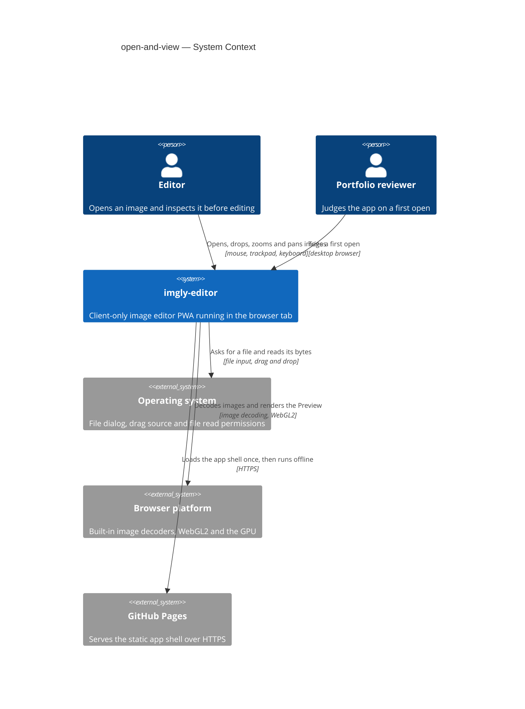
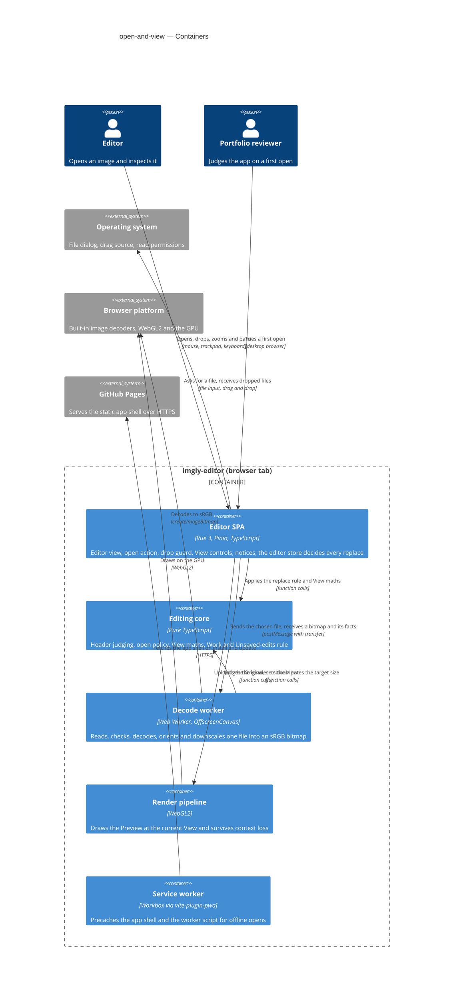
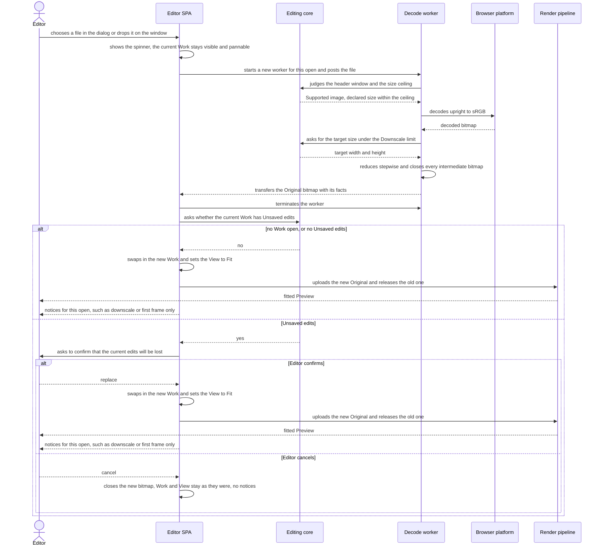
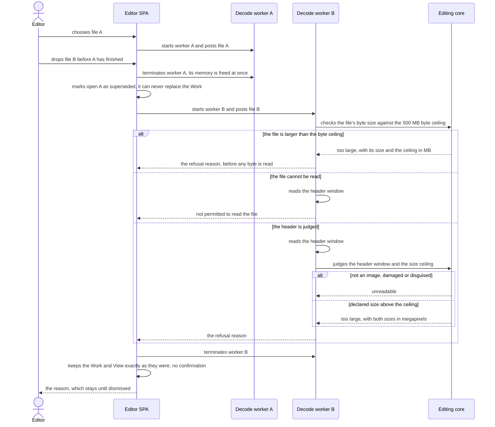
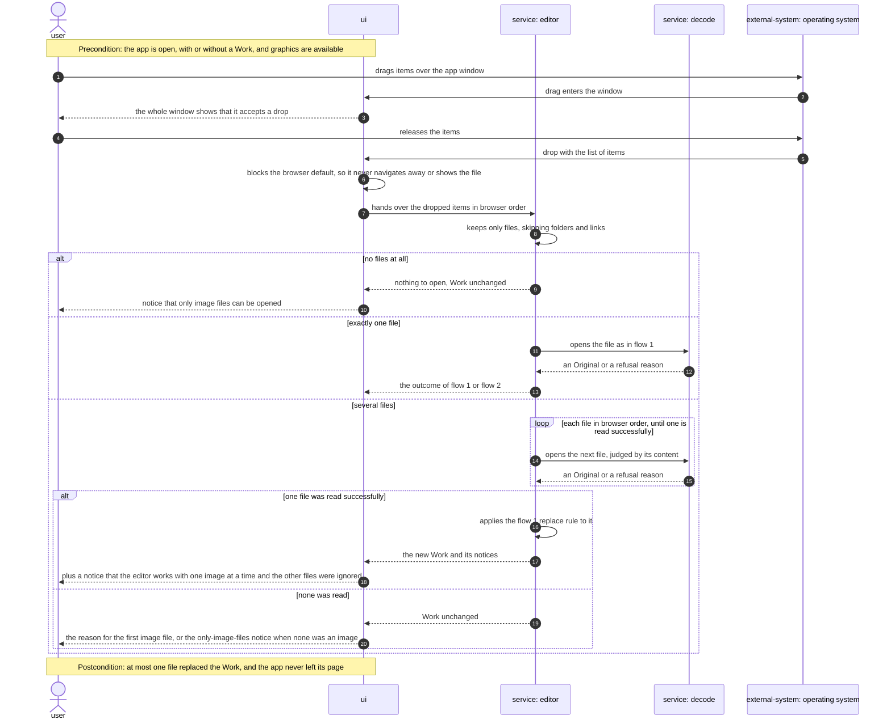
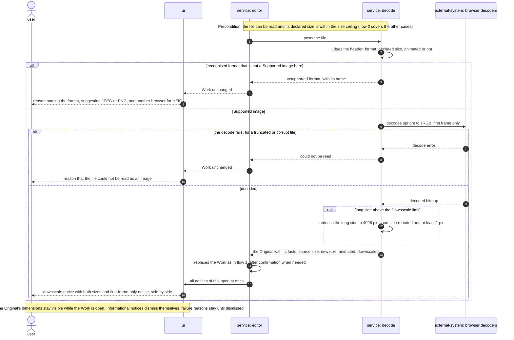
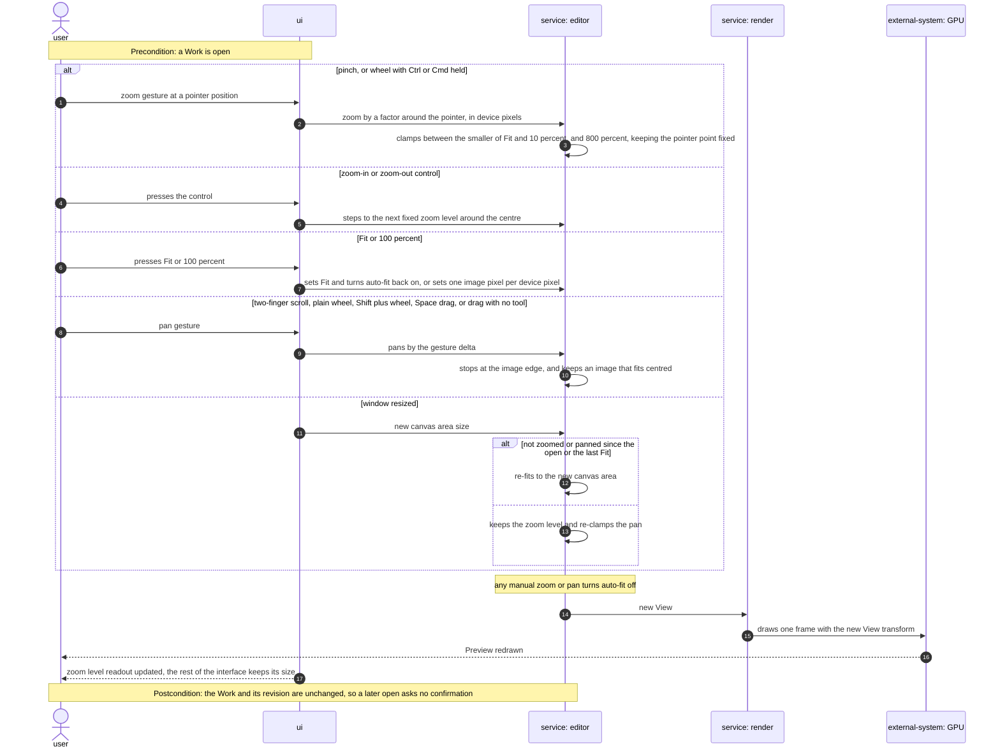
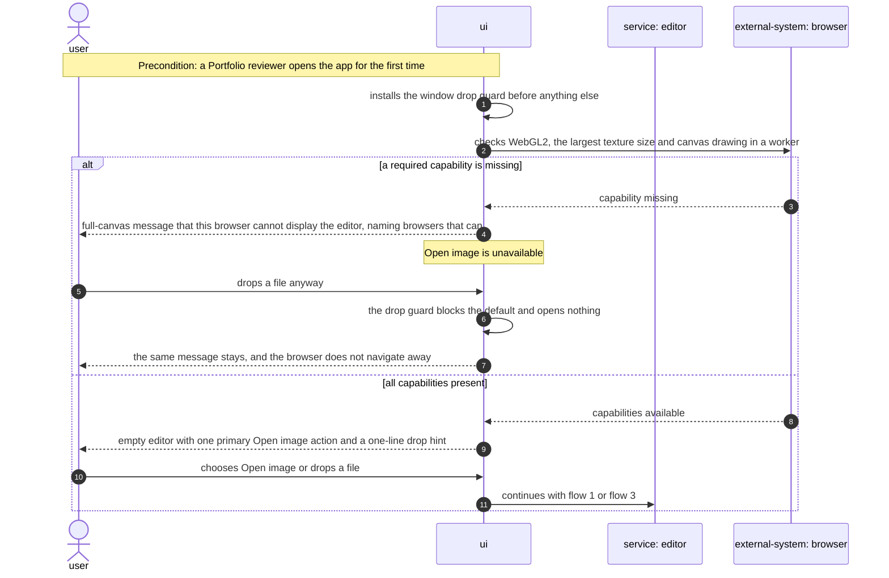
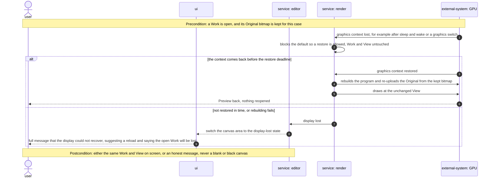

# Software Architecture Document — open-and-view

## 1. Introduction and goals

**Intent.** open-and-view lets the Editor bring one photo from disk into the app, through the "Open image" action or by dropping it anywhere on the window, and see it as an upright, ready-to-edit Preview within seconds, with no dialogs on the happy path. The new file is read completely before it can replace the open Work. Anything larger than the Downscale limit (4096 px) becomes an Original at that limit, announced in one line, and every refusal comes with a plain-language reason. The feature also fixes the View (Fit, 100%, zoom, pan) and the replace rule that every later editing feature inherits, and it gives the Portfolio reviewer an honest first impression even when their browser cannot render (spec §1, §2).

**Top-3 quality goals (1-liners; full scenarios in §10):**

1. **Open responsiveness**: the fitted Preview appears fast and the interface never freezes while a file is read.
2. **Work integrity under untrusted input**: the open Work is never lost or replaced by something unreadable, no hostile, oversize or mis-named file can exhaust the tab, and every open ends in a correct Preview or a plain reason.
3. **Smooth, stable View**: zoom and pan stay fluid on a 4096 px Original, and memory stays flat across repeated opens.

**Stakeholders.**

| Role | Interest | Sign-off owner? |
|---|---|---|
| Editor | Opens images by dialog or drop, inspects them with Fit, 100%, zoom and pan, keeps Unsaved edits safe | No |
| Portfolio reviewer | A first open that works first time, and an honest message when the browser can't render | No |
| Tech Lead | SAD approval; the View and the replace rule are inherited by every later tool | Yes |
| Security Lead | Mandatory security review (spec §6.1): this is the app's only intake of untrusted files | Yes |

- Decision override: the decode worker in `src/infra/image-decode/` calls pure `core` functions (`sniffImageHeader`, `checkOpenPolicy`, the target-size maths), not only `core` types. This widens the repo rule "`infra → core` (types only)" (repo ADR 0002, `docs/architecture-map.md` §Module inventory) to "types and pure, side-effect-free functions" — rationale: the worker must run exactly the checks the unit tests cover, so the security review reads one parser in one place (ADR-0001, ADR-0002). Follow-up in §11.
- Decision override: this feature's functional e2e suite runs in CI on Chromium, Firefox and WebKit, and the `@perf` suite runs by hand on the reference machine before release (§7) — widening the repo convention of Chromium-only e2e and a CI of install → lint → typecheck → unit → build (`docs/architecture-map.md` §Conventions). Rationale: orientation, capability probes and drop differ per engine, and the spec §6 targets bind to the reference machine, not to CI runners. Follow-up in §11.

## 2. Constraints

**Technical.**
- TypeScript 5 (`strict`), Node 24 toolchain, pnpm — repo ADR [0001](../../adr/0001-build-a-client-only-vue-pwa.md)
- Vue 3 (Composition API, `<script setup>`) + Pinia + Vite + vite-plugin-pwa; a client-only static app with no server, accounts or sync — repo ADR 0001
- Static hosting on GitHub Pages under `/imgly/` with no custom response headers, so no COOP/COEP and no `SharedArrayBuffer`: data crosses threads only by structured clone or transfer — repo ADR 0001 (Consequences)
- WebGL2 is required for the Preview, with no CPU fallback; Canvas 2D is reserved for the drawing layer — repo ADR [0004](../../adr/0004-render-adjustments-on-webgl2-and-drawing-on-canvas2d.md)
- Functional core with feature folders: `src/core/` is pure TypeScript with no Vue, Pinia or DOM; imports flow `features → core | render | infra | shared`; features never import each other and coordinate through the `editor` store — repo ADR [0002](../../adr/0002-organize-code-as-functional-core-with-feature-folders.md)
- Images are decoded only by the browser's own decoders; no bundled codecs or WASM decoders. HEIC/HEIF opens only where the current browser decodes it itself (CONTEXT "Supported image", spec AC-07)
- No persistence in this feature: IndexedDB is not touched and the Work lives only in the current session (spec §3)
- Targets: the latest desktop Chromium, Firefox and Safari; on mobile the app only has to not break (`docs/architecture-map.md` §Constraints, `docs/design-system.md` §Platform posture)

**Organisational.**
- Solo, spare-time project; owner Blazheiko. No per-feature effort budget: the only limit is the 4–6 week MVP budget for the whole roadmap (spec §1). No hard deadline
- TDD is on (`.claude/sdd.local.md`): unit tests with Vitest, e2e with Playwright
- The spec §6 targets bind to the reference machine: Apple M1 MacBook Air with the latest Chrome (resolved 2026-10-04, spec §8)

**Conventions.**
- `docs/architecture-map.md` §Conventions: `core` and `infra` return `Result<T, AppError>` with a typed `code` and throw only for programmer errors; UUIDv7 IDs from `newId()`; unit tests co-located as `*.test.ts`; e2e in `e2e/*.spec.ts`; features expose `index.ts` and are mounted from `src/app/App.vue`; plain CSS with tokens from `src/shared/styles/tokens.css`
- `docs/design-system.md` §Interaction & writing conventions: one toast boundary, where informational notices dismiss themselves and failure reasons stay until dismissed; a blocking condition (no WebGL2) gets a full-canvas message instead of a toast; an indeterminate spinner overlay on the canvas while decoding; every action reachable by keyboard; short, plain microcopy
- New UI primitives are added to `src/shared/ui/` and registered in the `docs/design-system.md` inventory (screens may only use inventory names or a justified `NEW:`)

**Regulatory / external.**
- Data classification: confidential (spec §6.1). Image pixels and embedded metadata never leave the device: the feature makes no network request carrying image data and ships no telemetry or analytics
- No accounts, so no AuthN/AuthZ; the only access check is the OS or browser permission to read the chosen file (AC-10)
- Security review: required (spec §6.1). This feature is the app's only intake of untrusted files
- No other compliance regime applies: no personal data is processed off the device or stored

## 3. Context and scope

imgly-editor is an offline, client-only image editor that runs entirely in the browser tab. open-and-view is its intake: the only place where untrusted files from the Editor's computer enter the app, and the first thing a Portfolio reviewer tries. Nothing in this feature talks to a server: GitHub Pages serves the static app shell once, and every image stays on the device.

<!-- brownfield: N/A — greenfield repo. No source exists yet; the target foundation is docs/architecture-map.md (mode: greenfield-bootstrap) + repo ADRs 0001–0004, materialized by /sdd:scaffold. -->

**Trust boundary.** Every byte that arrives from the operating system (a chosen or dropped file) is untrusted until the app has judged it by content and checked its declared size (spec §6.1). The browser's own decoders and GPU are trusted to be memory-safe, but their format support and their availability (WebGL2, context loss) vary per browser and are treated as capabilities to detect, not assumptions.

**External systems (in / out):**

| Actor or system | Type | Interaction |
|---|---|---|
| Editor | Person | Opens an image with "Open image" or by dropping it; fits, zooms and pans the Preview; confirms or cancels a replace |
| Portfolio reviewer | Person | Opens the deployed app for the first time and tries the same open, usually on a desktop browser |
| Operating system | System (external) | Shows the file dialog, supplies dropped files, and allows or refuses reading them (permissions, cloud placeholders, AC-10) |
| Browser platform | System (external) | Decodes the Supported image formats with its built-in decoders and provides WebGL2 on the GPU, which it may interrupt (AC-18, AC-19) |
| GitHub Pages | System (external) | Serves the static app shell over HTTPS on first load and updates; never sees an image |

**External: no third-party service** — deliberate. No upload, no telemetry, no remote decoder (§2 Regulatory).

**C4 Context (L1):**



## 4. Solution strategy

**Target surface.** `target_surfaces: [web-frontend]` (frontmatter). The feature owns one runnable surface, the Editor SPA in the browser tab. The decode worker, the editing core and the render pipeline are internal containers of that surface (§5), not surfaces of their own: there is no server (repo ADR 0001), no event-consumer `worker` surface, and no published library. Decided inline: the only alternative surfaces are excluded by §2.

**UI architecture (web-frontend).** A client-rendered SPA with one editor view and no router; the empty editor, the editor with a Work, and the unsupported-browser and display-lost messages are alternative contents of the same canvas area (ux-flows.md §Platform decisions). State lives in the `editor` Pinia setup store; components are built from `src/shared/ui/` primitives and `tokens.css`. Inherited from repo ADR 0001 and `docs/architecture-map.md` §Frontend; no new ADR, because server rendering is excluded by §2 (no server).

**Top strategic choices (the seeds for ADRs):**

1. **A two-phase open, decoded off the main thread** — [ADR-0001](adr/0001-decode-and-downscale-in-a-dedicated-web-worker.md). Every open reads, checks, decodes, orients and downscales the file in a dedicated Web Worker and hands back a finished bitmap; only then does the `editor` store decide (no Unsaved edits → replace; Unsaved edits → confirm) and swap the Work in one step. A newer open terminates the older worker. Serves quality goal 1 (no freeze above 200 ms) and quality goal 2 (the Work is only ever replaced by an image read successfully).
2. **Judge by content before decoding** — [ADR-0002](adr/0002-parse-image-headers-in-core-before-decoding.md). A pure-TypeScript header parser in `src/core/image-header/` names the format, reads the declared dimensions, animation and orientation from a bounded byte window, and the open policy refuses oversize images before any pixel is decoded. Serves quality goal 2 and is the single point of the security review.
3. **One WebGL2 Preview with the View as a transform** — [ADR-0003](adr/0003-render-the-preview-in-one-webgl2-canvas-with-a-view-transform.md). The Original becomes a mipmapped texture in one canvas at physical-pixel resolution; zoom and pan are a shader uniform computed by pure View maths in `src/core/view/`. Serves quality goal 3 and is the surface later tools (adjust, crop, draw) extend unchanged.
4. **One colour space: sRGB** — [ADR-0004](adr/0004-convert-every-original-to-srgb-on-open.md). Every Original is converted to sRGB while decoding, so Preview, adjustments and export agree in every browser. Resolves the spec §8 wide-gamut question.


## 5. Building block view

The feature follows the repo's functional core with feature folders (repo ADR 0002), which works like a small hexagonal layout: `src/core/` holds every rule as pure TypeScript (header judging, the open policy, View maths, the Work and its Unsaved-edits rule) and is unit-tested without a browser; `src/infra/` and `src/render/` are the adapters to the browser (file intake, the decode worker, WebGL2); `src/features/editor/` is the only UI and the `editor` store is the one place that decides whether a decoded image replaces the Work. open-and-view extends the existing `editor` feature instead of adding a new feature folder, because the open, the replace rule and the View are the editor's own baseline, and every later intake (paste, "Open with…", gallery re-open) calls the same store action. No datastore is touched (§2).

The Work knows it has Unsaved edits through a revision counter ([ADR-0005](adr/0005-track-unsaved-edits-with-a-revision-counter-on-the-work.md)): every edit, undo and redo raises `revision`, and `hasUnsavedEdits(work)` compares it with the revision at open (later, at save). The View lives next to the Work in the `editor` store, never inside it, so zoom and pan can never count as edits (AC-14).

**Internal decomposition:**

```
src/
├── core/                         pure TypeScript: no Vue, Pinia, DOM or browser APIs
│   ├── result.ts                 Result<T, AppError>; new open error codes (§8)
│   ├── document.ts               Work = Original + revision counters; hasUnsavedEdits(work) (ADR-0005)
│   ├── image-header/             sniffImageHeader(bytes) → format, size, animated, orientation (ADR-0002)
│   ├── open/                     checkOpenPolicy (size ceiling), targetSize (Downscale limit), pickFromDrop order
│   └── view/                     View maths: fit, zoom steps, clamp, zoom-at-point, pan clamp, auto-fit flag
├── infra/
│   ├── image-decode/             decodeImage(blob) on the main thread + decode.worker.ts (ADR-0001, ADR-0004)
│   └── platform/                 file picker, window-level drop guard, files from a DataTransfer
├── render/
│   ├── capabilities.ts           start-up capability gate (WebGL2, texture size, worker canvas)
│   └── preview-renderer.ts       one WebGL2 canvas, mipmapped Original texture, View uniform, context loss (ADR-0003)
├── shared/
│   ├── ui/                       BaseButton + the new primitives this feature registers (Toast, Spinner, Dialog…)
│   └── notices/                  notice queue: informational notices self-dismiss, failure reasons stay (AC-11b)
└── features/editor/
    ├── store.ts                  `editor` store: Work, View, open state; openImage(blob) and replace confirmation
    ├── EditorView.vue            canvas area: SCR-01 empty, SCR-02 Work, SCR-04 unsupported, SCR-05 display lost
    ├── components/               open action, drop overlay, zoom controls, dimensions readout, replace dialog (SCR-03)
    └── index.ts                  public surface: EditorView + useEditorStore
```

Dependency direction follows repo ADR 0002 — `features/editor → core | infra | render | shared`, and `core` imports nothing — with one widening recorded as a §1 Decision override: `infra → core` allows pure, side-effect-free functions as well as types. The decode worker runs the same `core/image-header` and `core/open` code the unit tests cover, so the security review reads one parser in one place.

**C4 Container (L2):**



## 6. Runtime view

Two flows are seeded here: the open itself, including the replace confirmation, and the failure and supersede paths that protect the Work. The `sequences` stage expands them to cover every spec §5 AC. Participants are the §5 containers; the Browser platform from §3 appears where the worker decodes.

**Critical flow 1: open an image and replace the Work** (AC-01, AC-02, AC-05, AC-06, AC-11, AC-14, AC-15)



The Work changes in one step, inside the `editor` store, and only after the worker has returned a finished bitmap. On cancel nothing after the confirmation runs, and the new bitmap is closed at once so its memory is freed. The old Original's bitmap and texture are released after the new texture is uploaded, so the Preview never shows an empty frame.

**Critical flow 2: a superseded open and a refused file leave the Work untouched** (AC-08, AC-09, AC-10, AC-16, AC-16b)



The byte ceiling is judged from the file's size alone, so a file above 500 MB is refused before any of it is read (AC-09). Every refusal ends the same way: the worker reports a typed reason, the `editor` store changes nothing, and the reason goes to the notice queue as a failure that stays until dismissed. A late answer from a terminated worker can never arrive, and the store also ignores any result whose open is no longer the latest.

### Flow 3: drop several files or something that is not an image (US-02: AC-02, AC-03, AC-04)



The drop guard is installed on the whole window before anything else, so even a drop that the app ignores never opens the file in the tab. Files are tried one at a time; a newer drop supersedes this sequence exactly as in flow 2.

### Flow 4: what decoding finds out (US-03, US-04: AC-05, AC-07, AC-08, AC-11, AC-11b)



HEIC counts as a Supported image only where the worker's probe found that this browser decodes it; elsewhere it takes the first branch. Notices for a new image are raised only after the replace, so a cancelled confirmation shows none.

### Flow 5: inspect the image with zoom, pan, Fit and 100% (US-05: AC-12, AC-12b, AC-13, AC-14)



All View maths runs in the pure View model; the store keeps the View next to the Work, never inside it. A frame is drawn only when the View or the canvas size changed.

### Flow 6: first visit and the capability gate (US-07, US-08: AC-17, AC-18)



The gate runs once per page load; nothing in it depends on the user agent string.

### Flow 7: graphics interrupted, then restored or lost (US-08: AC-19, AC-19b)



The restore deadline is a tactical value fixed in `tasks` (§11).

**Coverage (`sequences`):** every spec §4 user story and §5 AC is shown at runtime; none is marked non-runtime.

| AC | Shown by | AC | Shown by |
|---|---|---|---|
| AC-01 | Flow 1, no-edits branch | AC-12 | Flow 5, zoom branches |
| AC-02 | Flow 1 (single file); Flow 3, one-file branch and drop guard | AC-12b | Flow 5, clamp, fixed steps and resize branch |
| AC-03 | Flow 3, several-files branch | AC-13 | Flow 5, pan branch |
| AC-04 | Flow 3, no-files branch | AC-14 | Flow 1, no-edits branch; Flow 5 postcondition |
| AC-05 | Flow 4, downscale step and notice | AC-15 | Flow 1, confirm and cancel branches |
| AC-06 | Flow 4, downscale step skipped and no downscale notice | AC-16 | Flow 2 |
| AC-07 | Flow 4, unsupported-format branch | AC-16b | Flow 2 |
| AC-08 | Flow 2, unreadable branch; Flow 4, decode-fails branch | AC-17 | Flow 6, capabilities-present branch |
| AC-09 | Flow 2, byte-ceiling branch (before the header read) and too-large branch | AC-18 | Flow 6, capability-missing branch |
| AC-10 | Flow 2, not-permitted branch | AC-19 | Flow 7, restored branch |
| AC-11 | Flow 4, first-frame decode and notice | AC-19b | Flow 7, lost branch |
| AC-11b | Flow 4, all notices at once | | |

| User story | Flows |
|---|---|
| US-01 Open from disk | 1 |
| US-02 Drop | 1, 3 |
| US-03 Know when reduced | 1, 4 |
| US-04 Understand why not | 2, 4 |
| US-05 Inspect | 5 |
| US-06 Keep my work | 1, 2 |
| US-07 First visit | 6 |
| US-08 Honest browser message | 6, 7 |

**Flags for design:** none. Flows 3–7 use the generic runtime vocabulary; `service: editor`, `service: decode` and `service: render` are the §5 Editor SPA store, Decode worker and Render pipeline. No flow writes to a data store, so there are no persist notes for `data-model`.

## 7. Deployment view

open-and-view reuses the existing deployment unit: one static bundle built by `.github/workflows/ci.yml` and served by GitHub Pages under `/imgly/` (repo ADR 0001). There are no servers or replicas; every visitor's browser tab is its own runtime, with one decode worker alive per open at most. The only deployment change is a new build asset: Vite emits the decode worker as a separate hashed module script (`new Worker(new URL('./decode.worker.ts', import.meta.url), { type: 'module' })`), and the Workbox precache must list it, so an open works with no network after the first load (spec §6, offline row). The capability probes' sample images are embedded in the worker script, so the probes never fetch anything.

**Monitoring:**
- No runtime metrics, logs or traces leave the device, by design (§2 Regulatory). The feature's health is measured before release, not in production
- Every push: CI runs lint, typecheck, Vitest units (header parser, open policy, View maths, `hasUnsavedEdits`, the fuzz test of ADR-0002) and the functional Playwright e2e suite on Chromium, Firefox and WebKit, including an offline open after the first load. This widens the repo's Chromium-only e2e (`docs/architecture-map.md` §Conventions) for this feature, because orientation, the capability probes and drop behave differently per engine. WebGL pixel checks stay on Chromium only
- Before each release: the `@perf` Playwright suite (time to first Preview, long tasks, frame rate, memory after 10 opens) runs on the reference machine, because CI runners are not the machine the spec §6 targets bind to. The same pre-release pass opens the HEIC samples in real Safari, since WebKit on Linux does not decode HEIC (§11)
- In the tab: failures surface only as notices to the Editor; in development builds the decode worker also logs its stage timings to the console

**Scaling thresholds** (per tab, on the reference machine):
- Peak memory of one open is inside the worker, during the first reduction step: the decoded bitmap (at most the size ceiling × 4 bytes, §8) plus the first intermediate canvas (about a quarter of that), so about 1.25 × the ceiling × 4 bytes, roughly 500 MB at 100 MP
- While a Work is open the tab holds the Original twice, as a bitmap for context restore and as a mipmapped texture (ADR-0003): about 150 MB at 4096 × 4096, and about twice that for a moment during a replace, until the old Original is released (§6, flow 1)
- An open whose declared size is above the size ceiling never reaches the decoder (AC-09)

## 8. Crosscutting concepts

| Concept | Convention | Where defined |
|---|---|---|
| Error handling | `core` and `infra` return `Result<T, AppError>`; hostile input never throws. New codes: `FILE_NOT_PERMITTED` (AC-10), `NOT_AN_IMAGE`, `UNREADABLE` (declared size not found in the header window) and `DECODE_FAILED` (AC-08, one message), `UNSUPPORTED_FORMAT` with the format name (AC-07), `TOO_LARGE` with both sizes in megapixels (AC-09), `UNSUPPORTED_BROWSER` (AC-18), `DISPLAY_LOST` (AC-19b). The worker posts errors as plain `{ code, details }` objects. A superseded open is not an error: `decodeImage` resolves it as `Superseded` and the store ignores it | `docs/architecture-map.md` §Conventions; codes in `src/core/result.ts` |
| User messages | Every `AppError` code maps to exactly one plain-language message in one catalog, `src/features/editor/messages.ts`; no raw browser error text ever reaches the Editor. Notices go through one queue in `src/shared/notices/`: informational ones (downscale, first frame only, files ignored) dismiss themselves, failure reasons stay until dismissed, and all notices of one open are shown together without hiding each other (AC-11b). Blocking conditions (SCR-04, SCR-05) replace the canvas area instead of using a notice | `docs/design-system.md` §Interaction & writing conventions; here |
| Size ceiling | 100 MP, measured as the declared width × height and checked before any decode (AC-09), and checked again on the decoded bitmap in case a header understated it. A separate byte ceiling of 500 MB (`SIZE_CEILING_BYTES`) refuses a file from its size before any of it is read, so a small-header file with a huge body never reaches the worker whole (review 2026-10-04, Q5). No limit on the length of one side: intermediate canvases in the worker never exceed 16 384 px per side, so a very elongated image within the ceiling is reduced in a first, larger step instead of being refused, and a file the browser itself cannot decode ends as AC-08. Resolves spec §8 (size ceiling) | here; `src/core/open/` |
| Resource lifetime | Every `ImageBitmap` is `close()`d as soon as it is no longer needed: intermediates in the worker, the new bitmap on a cancelled replace, the old Original after a replace. The old texture is deleted after the new one is uploaded (§6, flow 1). Each open's worker is terminated when its result arrives or when a newer open starts. Exactly one Original (bitmap + texture) is retained while a Work is open | here; ADR-0001, ADR-0003 |
| Concurrency | Latest open wins: the store gives every open an increasing id and accepts a result only if its id is still the latest; the previous worker is terminated at once (AC-16b). The View stays live during an open; the Work is swapped in one synchronous store action | here; ADR-0001 |
| Capability detection | Probed once, never assumed: the start-up gate in `src/render/capabilities.ts` (WebGL2, texture size, worker canvas, AC-18) and the worker's per-session probes (does the browser apply EXIF orientation, does it decode HEIC). Results are cached for the session. No user-agent sniffing | ADR-0001, ADR-0003 |
| Pixel units | The View maths in `src/core/view/` works in device pixels, so 100% is one image pixel per physical screen pixel (AC-12). Pointer and wheel positions are converted from CSS pixels by `devicePixelRatio` at the component edge, and the canvas is sized with `device-pixel-content-box` where available | here; ADR-0003 |
| Privacy | The Original holds pixels only: no EXIF or other metadata is copied into the Work (spec §6.1); the header parser reads orientation and nothing else. No image data, file name or metadata is logged, sent or stored | spec §6.1; here |
| ID strategy | A new Work gets a UUIDv7 from `newId()` | `docs/architecture-map.md` §Conventions |
| Logging / observability | No telemetry or remote logging (§2, §7). Development builds log the worker's stage timings to the console; production builds log nothing about images | here |
| Authentication | N/A: no accounts (§2). The only access check is the OS or browser permission to read the file (AC-10) | — |
| Internationalisation | English only; every user-visible string lives in the messages catalog, so a later translation touches one file | here |
| Keyboard and focus | Every control (Open image, zoom in and out, Fit, 100%, the replace dialog, notice dismiss) is a focusable button with a visible focus ring; the replace dialog traps focus and returns it on close. Specific shortcuts are fixed by `screens` | `docs/design-system.md` §Interaction & writing conventions |

## 9. Architecture decisions

| # | Title | Status | Section |
|---|---|---|---|
| [0001](adr/0001-decode-and-downscale-in-a-dedicated-web-worker.md) | Decode, orient and downscale every opened image in a dedicated Web Worker | Accepted | §4 |
| [0002](adr/0002-parse-image-headers-in-core-before-decoding.md) | Judge every file by a pure-TypeScript header parser in core before any decoding | Accepted | §4 |
| [0003](adr/0003-render-the-preview-in-one-webgl2-canvas-with-a-view-transform.md) | Render the Preview in one WebGL2 canvas, with the Original as a mipmapped texture and the View as a shader transform | Accepted | §4 |
| [0004](adr/0004-convert-every-original-to-srgb-on-open.md) | Convert every Original to sRGB on open | Accepted | §4 |
| [0005](adr/0005-track-unsaved-edits-with-a-revision-counter-on-the-work.md) | Track Unsaved edits with a revision counter on the Work | Accepted | §5 |

ADR files live under `docs/features/open-and-view/adr/NNNN-<title>.md`. The repo-wide foundation decisions this feature builds on are in `docs/adr/` (0001 client-only Vue PWA, 0002 functional core with feature folders, 0004 WebGL2 and Canvas 2D); repo ADR 0003 (IndexedDB persistence) is not touched here.

Decided inline, below the ADR gate: extending `features/editor` rather than a new feature folder (§5), the performance suite running on the reference machine and the e2e suite on three engines (§7), and the 100 MP size ceiling, the 500 MB byte ceiling and no side limit (§8).

## 10. Quality requirements

Each top-3 goal from §1 expanded into testable scenarios. Numbers are quoted from spec §6 and §7; every timed and memory scenario runs on the reference machine (Apple M1 MacBook Air or equivalent, latest Chrome, spec §6) in the `@perf` suite before release (§7).

**QG-1. Open responsiveness**
- **When:** the Editor opens the 12 MP JPEG (4032×3024, within the limit) or the 48 MP JPEG (8064×6048, downscale path) by the file dialog or by a drop, with no replace confirmation
- **Then:** Time to first Preview p95 ≤ 1.5 s for the 12 MP JPEG and ≤ 3 s for the 48 MP JPEG, measured from the moment the file is chosen or released to the first paint of the fitted Preview; the longest interface freeze while opening any accepted image is ≤ 200 ms (loading indicator keeps animating)
- **How verify:** Playwright `@perf` test opens each file 20 times on the reference machine; the start is the file-input change or the dispatched drop, the end is a `performance.mark` the renderer sets on the first frame after a new Original, and p95 is computed over the runs. A `PerformanceObserver` for `longtask` records the longest main-thread task during every open of the reference set and fails above 200 ms

**QG-1b. Opening offline**
- **When:** the app has been loaded once, the network is switched off, and the Editor opens an image
- **Then:** 100% of runs succeed (spec §6, opening with no network connection); the decode worker script comes from the precache (§7)
- **How verify:** functional e2e in CI on all three engines: load, wait for the service worker, set the context offline, reload, open the 12 MP JPEG, and assert the fitted Preview and the dimensions readout

**QG-2. Work integrity under untrusted input**
- **When:** each file of the reference test set (JPEG, PNG, WebP, AVIF, animated GIF, HEIC, damaged, truncated, oversize, mis-named files, spec §7) and the 8 EXIF orientation images is opened, once with no Work and once over a Work with Unsaved edits; plus a decompression bomb (a small file declaring dimensions above the size ceiling, default 100 MP, fixed in §8) and fuzzed headers
- **Then:** 100% of files end in either a correct Preview or a plain-language reason, with 0 blank canvases or tab crashes (spec §7); 8 of 8 orientation images display upright (spec §7); on every refusal the open Work stays exactly as it was and no confirmation is asked (AC-16); the bomb is refused before any pixel is decoded (AC-09)
- **How verify:** Vitest units with the fixture set for `sniffImageHeader` and `checkOpenPolicy`, plus a property test over truncated and mutated samples asserting that it always returns a `Result`, never throws and never allocates in proportion to a declared size (ADR-0002). Playwright e2e on Chromium, Firefox and WebKit runs the whole set and asserts the outcome, the message text from the catalog, and that the Work's `id` and `revision` are unchanged after each refusal; for the bomb it asserts the too-large notice. That the worker never reaches its decode stage is proven at unit level: the pipeline refuses before `createImageBitmap` is called (`src/infra/image-decode/pipeline.test.ts`, review 2026-10-05 R5). The HEIC files are opened by hand in real Safari before release (§7)

**QG-3. Smooth, stable View**
- **When:** a scripted zoom and pan runs over a 4096 px Original; then the 48 MP JPEG is opened 10 times in a row
- **Then:** zoom and pan smoothness ≥ 50 fps; memory after 10 consecutive opens of the 48 MP image ≤ 110% of memory after the first open, where memory is the tab's total memory, GPU memory included (spec §6)
- **How verify:** the `@perf` suite records a Chrome performance trace during scripted pinch, Ctrl/Cmd+wheel and pan gestures and computes the frame rate from presented frames. For memory, the harness forces garbage collection after the first and the tenth open and sums the memory footprint of the tab's renderer process and the GPU process as reported by the operating system. Because happy-dom has no `ImageBitmap`, the leak guard lives in e2e: a development-build counter of bitmaps created and closed by the decode and replace paths must return to the one retained Original after the ten opens (§8, resource lifetime)

## 11. Risks and technical debt

<!-- brownfield gotchas: N/A — greenfield repo, no existing code to drift from. -->

| Risk / debt | Severity | Mitigation | Owner |
|---|---|---|---|
| A Portfolio reviewer on Firefox or Safari sees a photo rotated twice or not at all, because engines differ on applying EXIF orientation; the first impression is lost | Medium | The worker probes orientation once per session instead of assuming it (ADR-0001); the 8 orientation images run in e2e on Chromium, Firefox and WebKit (§7, §10 QG-2) | Blazheiko (owner) |
| The hand-written header parser is the only code reading untrusted bytes; a bug could hang the worker or misjudge a file | Medium | Bounds-checked reads, iteration caps and no allocation proportional to a declared size; property and fuzz tests over truncated and mutated samples (ADR-0002, §10 QG-2); mandatory security review before ship; decoding itself stays in the browser's own decoders | Security Lead |
| On the mobile "must not break" tier, a large open (the worker's peak is about 500 MB at the 100 MP ceiling, §7) can get the tab killed for memory, breaking the "0 tab crashes" KPI there | Medium | The size ceiling is one constant in `src/core/open/`; open a 48 MP photo on a recent iPhone and an Android phone before release; lower the ceiling for small-memory devices if they crash | Blazheiko (owner) |
| The `@perf` suite runs only by hand on the reference machine (§7), so a speed or memory regression can ship unnoticed between releases | Medium | A "run `@perf` on the reference machine" item in the `ship` checklist; between releases, the development build logs the worker's stage timings (§8), so a large slowdown shows up while working on the app | Blazheiko (owner) |
| A later editing feature forgets to raise the Work's revision, so its edits are lost on replace without a confirmation | Medium | Edits go through the `editor` store's edit entry point, which raises the revision (ADR-0005); roadmap step 4 re-verifies AC-15 with a real edit (spec §1 Decision override) | Blazheiko (owner) |
| A valid JPEG with more than 1 MiB of metadata before its frame header is refused as unreadable (ADR-0002) | Low | Keep such a sample in the reference set; raise `HEADER_WINDOW_BYTES` if real photos hit it | Blazheiko (owner) |
| A GIF whose first image descriptor lies past the 1 MiB header window (for example after a long comment extension) can't be sized before decoding, and its frame may hide a decompression bomb (re-review N1) | Low | The header parser refuses a GIF with no complete image descriptor inside the window as `UNREADABLE` (AC-09), the same as the JPEG with over 1 MiB of metadata; a padded-GIF sample is in the reference set. A real GIF with that much metadata before its first frame is refused too — accepted | Blazheiko (owner) |
| WebKit decodes a damaged PNG into a blank bitmap instead of failing, so a damaged file could open as a blank Preview (found by the T19 reference set) | Low | The header parser verifies the CRC of every PNG chunk inside the 1 MiB window and refuses a mismatch as `UNREADABLE` (AC-08) on every engine. Damage that lies only beyond the first 1 MiB is still decoded leniently by WebKit — accepted; revisit with a full-file CRC pass in the worker if it is seen in practice | Blazheiko (owner) |
| HEIC decoding can be checked only in real Safari, because WebKit on Linux does not decode it (§7) | Low | Manual open of the HEIC samples in Safari in the pre-release pass; CI covers the HEIC refusal path (AC-07) | Blazheiko (owner) |
| **Resolved.** The WebGL context-restore deadline (ADR-0003) needed a value: too short shows SCR-05 needlessly, too long leaves a black canvas | Low | Fixed at 5000 ms (`RESTORE_DEADLINE_MS` in `src/render/preview-renderer.ts`), asserted in `src/render/context-loss.test.ts` and covered by the `WEBGL_lose_context` e2e for AC-19 and AC-19b (`e2e/open-and-view/blocking.spec.ts`) | Blazheiko (owner) |
| The widened `infra → core` rule and the three-engine CI (§1 Decision overrides) are not yet reflected in `docs/architecture-map.md` or an import lint rule, so a later feature could read the old rule | Low | During `implement`, update `docs/architecture-map.md` §Module inventory and §Conventions, and encode "infra may import only types and pure functions from core" in the ESLint import rules | Blazheiko (owner) |
| **Resolved.** The spec §6 targets needed a confirmed reference machine | Low | Confirmed 2026-10-04 in `sdd:plan-tests` (spec §8): Apple M1 MacBook Air with the latest stable Chrome | Blazheiko (owner) |

**Accepted debt (acceptable in v1, plan to fix later):**
- Colours outside sRGB in Display P3 photos are clipped without a notice (ADR-0004); wide-gamut support would need a colour space on the Original and a re-open of the source file
- After the Editor undoes every edit, replacing the Work still asks for confirmation (ADR-0005)
- TIFF and TIFF-based camera RAW are named together in the AC-07 notice (ADR-0002)
- Full-resolution 108 MP and 200 MP phone photos are refused by the 100 MP size ceiling (§8)
- The Original is held twice while a Work is open, as a bitmap for context restore and as a texture (ADR-0003)
- No CPU fallback for browsers without WebGL2 (repo ADR 0004); they get SCR-04
- Embedded metadata (capture date, location) is not kept; whether export needs any of it stays a spec §8 open question, due before the export feature's `sdd:specify`

## 12. Glossary

Domain terms from `CONTEXT.md` (canonical; repeated here only as used in this SAD):

| Term | Meaning |
|---|---|
| Downscale limit | The maximum length of an opened image's long side, 4096 px; larger images are reduced to it proportionally on open |
| Editor | The person editing an image in the app; not the Portfolio reviewer |
| Original | The opened image after orientation is applied and it is reduced to the Downscale limit; not the source file on disk |
| Portfolio reviewer | A recruiter or engineer judging the deployed app, usually on a first open and on a desktop browser |
| Preview | What the canvas shows: the Work rendered at the current View; not the exported image |
| Supported image | A file whose content is JPEG, PNG, WebP, AVIF or GIF, or HEIC/HEIF where the browser decodes it itself |
| Unsaved edits | Changes to the open Work that exist nowhere else; View changes never count. Tracked by the Work's revision (ADR-0005) |
| View | The zoom level and pan position of the Preview; not part of the Work, never saved or exported |
| Work | One image being edited: its Original plus everything applied on top of it |

Terms introduced or sharpened by this feature (not in `CONTEXT.md` yet; candidates for `/sdd:glossary`):

| Term | Meaning |
|---|---|
| Canvas area | The space left for the Preview after toolbars and panels; Fit and pan limits are measured against it (spec AC-01) |
| Fit | The largest zoom at which the whole image fits inside the canvas area, never above 100% (spec AC-01) |
| Size ceiling | The largest declared pixel count the editor accepts, 100 MP; checked before decoding (AC-09, §8) |
| Notice | A non-blocking message in the notice queue: informational notices dismiss themselves, failure reasons stay until dismissed (AC-11b, §8) |
| Superseded open | An open that a newer open replaced before it finished; its worker is terminated and its result can never replace the Work (AC-16b, §8) |
| Revision | The Work's edit counter; every edit, undo and redo raises it, and Unsaved edits exist when it differs from the revision at open or save (ADR-0005) |
| Header window | The first 1 MiB of a file, the only bytes the header parser reads (ADR-0002) |
| Capability gate | The start-up check for WebGL2 and the worker features the editor needs; failing it shows the unsupported-browser message (AC-18, ADR-0003) |
