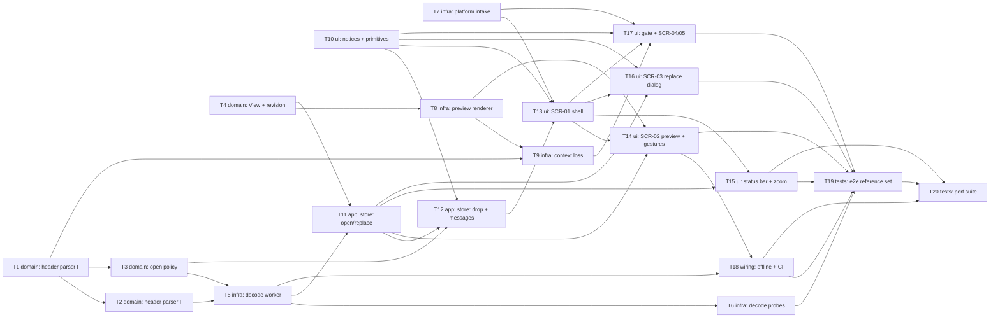

# Epic — open-and-view

> **Spec:** [spec.md](../spec.md) · **Design:** [sad.md](../sad.md) · **Screens:** [screens.md](../screens.md) · **UX flows:** [ux-flows.md](../ux-flows.md) · **ADRs:** [adr/](../adr/)
> **Data model:** none — the feature touches no datastore (sad.md §2, §6 "no persist notes"). **API:** none — `target_surfaces: [web-frontend]`, client-only, no `contracts/` (screens.md §Source).

## Goal

Ship the editor's intake and View: any common phone or desktop image opens into an upright, ready-to-edit Preview within seconds with no dialogs on the happy path; the open Work is never lost and an image is never reduced without the Editor being told how; and Fit, 100%, zoom and pan feel smooth enough for every later tool to build on unchanged (spec §2).

## Scope

- **In:** `src/core/` (header parser, open policy, View maths, Work revision), `src/infra/image-decode/` (decode worker), `src/infra/platform/` (picker, drop guard), `src/render/` (capability gate, WebGL2 preview renderer, context loss), `src/shared/notices/` + `src/shared/ui/` (notice queue, five new primitives), `src/features/editor/` (store, messages catalog, SCR-01…SCR-05), PWA precache of the worker, three-engine e2e and the `@perf` suite. Layers: domain · infra · app · ui · wiring · tests (`target_surfaces: [web-frontend]` → `ui` on; no backend layers).
- **Out:** paste, copy and "Open with…" (roadmap step 10); keeping more than 4096 px; persistence between sessions (step 8); several images at once; touch-optimised gestures; any format beyond the Supported images (spec §3).

## Prerequisite

`src/` does not exist yet — the scaffold plan (`docs/features/_scaffold/tasks.json`, S1–S7) must be materialized with `/sdd:scaffold` before `implement` runs these tasks. Every `files_hint` below assumes the scaffold layout (`src/core/result.ts`, `src/core/document.ts`, `src/features/editor/{store.ts,EditorView.vue}`, `src/shared/ui/BaseButton.vue`, `tokens.css`, Vitest + Playwright, ESLint core boundary, vite-plugin-pwa).

## Task map

**Waves** (topological phases `implement` will run; overlapping `files_hint` serialize inside a wave):

| Wave | Tasks | Mode |
|---|---|---|
| 1 | T1, T4, T7, T10 | parallel |
| 2 | T2, T3, T8 | parallel |
| 3 | T5, T9 | parallel |
| 4 | T6, T11 | parallel |
| 5 | T12 | single |
| 6 | T13 | single |
| 7 | T14, T15, T16, T17 | serialized lane (`EditorView.vue`) |
| 8 | T18 | single |
| 9 | T19 | single |
| 10 | T20 | single |

## Tasks

See [tracker.md](./tracker.md) for status. Machine contract: [tasks.json](../tasks.json).

| # | Task | Layer | Blocked by | DoD (short) |
|---|---|---|---|---|
| T1 | [Add the open error codes and the header parser for JPEG, PNG/APNG, GIF and the refused formats](./t01-header-parser-jpeg-png-gif.md) | domain | — | Vitest suites for JPEG, PNG/APNG, GIF and every refused signature pass, including the truncated and mis-named cases above |
| T2 | [Extend the header parser to WebP, AVIF and HEIC/HEIF and add the property/fuzz test](./t02-header-parser-webp-avif-heic.md) | domain | T1 | Vitest suites for WebP (VP8/VP8L/VP8X), AVIF, AVIS and HEIC fixtures pass |
| T3 | [Implement the open policy: size ceiling, Downscale-limit target size, reduction steps and drop-candidate order](./t03-open-policy.md) | domain | T1 | Vitest proves the ceiling boundary, the AC-05 example, the ≤1 px floor, portrait inputs and the 16 384 px intermediate cap |
| T4 | [Implement the pure View model (Fit, zoom steps, clamp, zoom-at-point, pan clamp, auto-fit) and the Work revision rule](./t04-view-model-and-work-revision.md) | domain | — | Vitest proves Fit (never above 100%), the clamp range, fixed steps, zoom-at-point invariance, pan clamping/centering and both resize branches |
| T5 | [Build the decode worker pipeline and the main-thread decodeImage client with supersede and error mapping](./t05-decode-worker-pipeline.md) | infra | T2, T3 | Vitest suites for the client (supersede + terminate), `mapReadError` and the message shapes pass |
| T6 | [Add the worker's orientation and HEIC capability probes and the EXIF-orientation fallback](./t06-decode-capability-probes.md) | infra | T5 | Vitest for the orientation table and the probe-cache handoff passes |
| T7 | [Add the platform intake: window drop guard, files from a DataTransfer, and the single-file picker](./t07-platform-intake.md) | infra | — | Vitest proves the guard prevents the default on `dragover` and `drop`, filters folders and links, keeps order, and the picker resolves `null` on cancel |
| T8 | [Build the WebGL2 preview renderer: mipmapped Original texture, View transform uniform, DPR sizing, draw-on-change](./t08-preview-renderer.md) | infra | T4 | Vitest for `viewToTransform` and the draw-on-change scheduler passes |
| T9 | [Handle WebGL context loss: restore from the kept bitmap within the deadline, else report DISPLAY_LOST](./t09-context-loss-restore.md) | infra | T1, T8 | Vitest proves ready → restoring → ready, restoring → lost by deadline, and restoring → lost on rebuild failure |
| T10 | [Add the notice queue and the shared UI primitives Spinner, Toast, ToastStack, Dialog and CanvasMessage](./t10-notices-and-ui-primitives.md) | ui | — | Vitest proves info auto-dismiss at 6000 ms, failures persisting, stacking without replacement, Dialog focus trap/return/`Esc` |
| T11 | [Implement the editor store's open and replace rule: latest-open-wins, confirm on Unsaved edits, cancel, and View actions](./t11-editor-store-open-replace.md) | app | T4, T5 | Vitest proves AC-14, AC-15 (with `applyEdit` preparing Unsaved edits), AC-16 and AC-16b against a fake decoder, including bitmap `close()` on cancel and on stale results |
| T12 | [Add drop sequencing, the messages catalog and the notices raised by each open](./t12-drop-sequencing-and-messages.md) | app | T3, T10, T11 | Vitest proves every catalog entry's copy, the drop order/selection rules, the first-image-file reason, and that notices appear only after a replace |
| T13 | [Build the editor shell and SCR-01: top bar, empty canvas with Open image, drop overlay, loading spinner and toast boundary](./t13-editor-shell-empty-canvas.md) | ui | T7, T10, T12 | Component tests for SCR-01 states pass |
| T14 | [Build SCR-02's PreviewCanvas with the renderer, Fit on open, and the zoom and pan gestures](./t14-preview-canvas-gestures.md) | ui | T8, T11, T13 | Playwright e2e (three engines) proves Fit on open, pointer-anchored Ctrl/Cmd+wheel zoom, edge-stopped pan, and both resize branches; Chromium proves one image pixel per device pixel at 100% |
| T15 | [Build the status bar: Original dimensions readout, zoom controls with the live zoom level, and the zoom shortcuts](./t15-status-bar-zoom-controls.md) | ui | T11, T13 | Component tests for the readout and controls pass |
| T16 | [Build SCR-03, the replace confirmation dialog, on the store's confirming phase](./t16-replace-dialog.md) | ui | T10, T11, T13 | Playwright e2e on three engines proves AC-15 (both branches) with a test-prepared Work, focus on Cancel first and focus return |
| T17 | [Add the start-up capability gate and the blocking screens SCR-04, SCR-05 plus SCR-02's restoring state](./t17-capability-gate-blocking-screens.md) | ui | T7, T9, T10, T13 | Playwright e2e proves AC-18 (SCR-04 + drop without navigation), AC-19 (restored, same View) and AC-19b (SCR-05 after the deadline) |
| T18 | [Precache the decode worker for offline opens, run e2e on three engines in CI, and record the widened rules](./t18-offline-precache-and-ci.md) | wiring | T5, T14 | `e2e/open-and-view/offline.spec.ts` passes in CI on Chromium and Firefox (skipped on WebKit, review 2026-10-04-2 F4) |
| T19 | [Add the cross-engine reference-set e2e: honest outcome per file, 8 of 8 orientations, Work integrity on every refusal](./t19-e2e-reference-set.md) | tests | T6, T14, T15, T16, T17, T18 | `e2e/open-and-view/reference-set.spec.ts` passes on Chromium, Firefox and WebKit with 100% honest outcomes and 8/8 orientations |
| T20 | [Add the @perf suite: time to first Preview, long tasks, zoom/pan frame rate and memory after 10 opens](./t20-perf-suite.md) | tests | T15, T18, T19 | The `@perf` suite runs by hand on the reference machine and reports p95 TTFP, longest task, fps and the memory ratio against the spec §6 targets |

## Tactical values

Fixed by this breakdown, because sad.md §11 and screens.md §Source left them to `tasks`:

| Value | Fixed at | Used by |
|---|---|---|
| Fixed zoom levels for the zoom-in/out controls (AC-12b) | 10, 25, 33.33, 50, 66.67, 100, 150, 200, 300, 400, 600, 800 (%) — low end still `min(Fit, 10%)`, high end 800% | T4, T15 |
| Informational notice lifetime (AC-11b) | 6000 ms; failure reasons stay until dismissed | T10 |
| WebGL context-restore deadline (AC-19 / AC-19b) | 5000 ms, then `DISPLAY_LOST` → SCR-05 | T9, T17 |

Smaller decisions taken in task bodies, each marked "breakdown decision" there: the files-ignored count `n` counts only other dropped *files* (T12); a probe that throws is read as "browser applies orientation" / "HEIC unsupported" (T6); opens are ignored while the replace dialog is open (T11, from screens.md SCR-03).

## Risks / Hard rules

- **Core purity** — `src/core/` imports no Vue, Pinia, DOM or browser API; `infra → core` may use types *and* pure functions (sad.md §1 Decision override; recorded in the map by T18).
- **Result, never throw** — `core` and `infra` return `Result<T, AppError>`; hostile bytes never throw (sad.md §8). All eight new codes land in T1.
- **Work integrity** — the Work is replaced only by an image read successfully, in one synchronous store action; latest open wins (sad.md §8 Concurrency; T11).
- **Resource lifetime** — every `ImageBitmap` is closed when no longer needed; exactly one Original (bitmap + texture) is retained (sad.md §8; T5, T8, T11, leak guard in T20).
- **Privacy** — pixels only; no metadata, file name or image data logged, sent or stored (sad.md §8, spec §6.1).
- **One message catalog** — every `AppError` has exactly one plain message; no raw browser text (sad.md §8; T12).
- **Reuse the UI foundation** — build from `BaseButton` + `tokens.css`; the five new shared primitives are registered in `docs/design-system.md` (T10).
- **Security review** is mandatory before ship (spec §6.1); T1/T2 (the parser) and T5 (the worker) are its scope.
- **AC-15** is verified against a test-prepared Work; roadmap step 4 must re-verify it with a real edit (spec §1).
