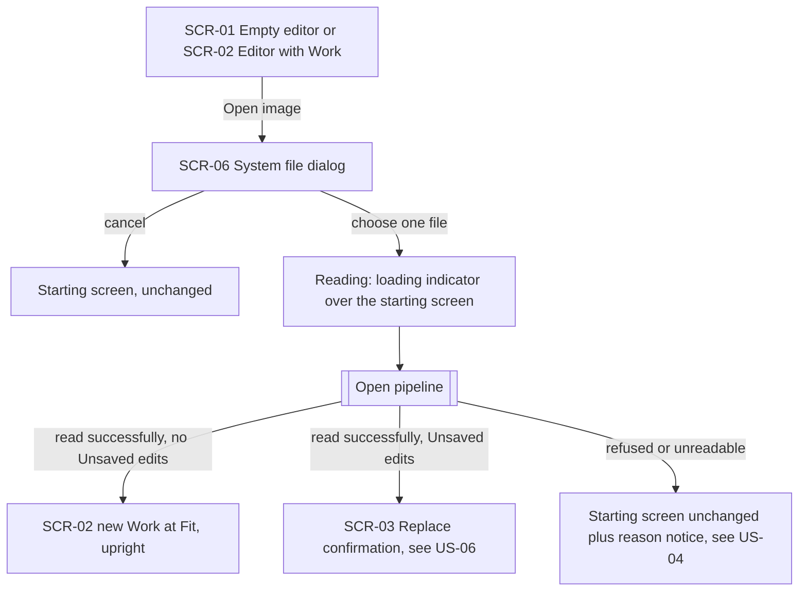
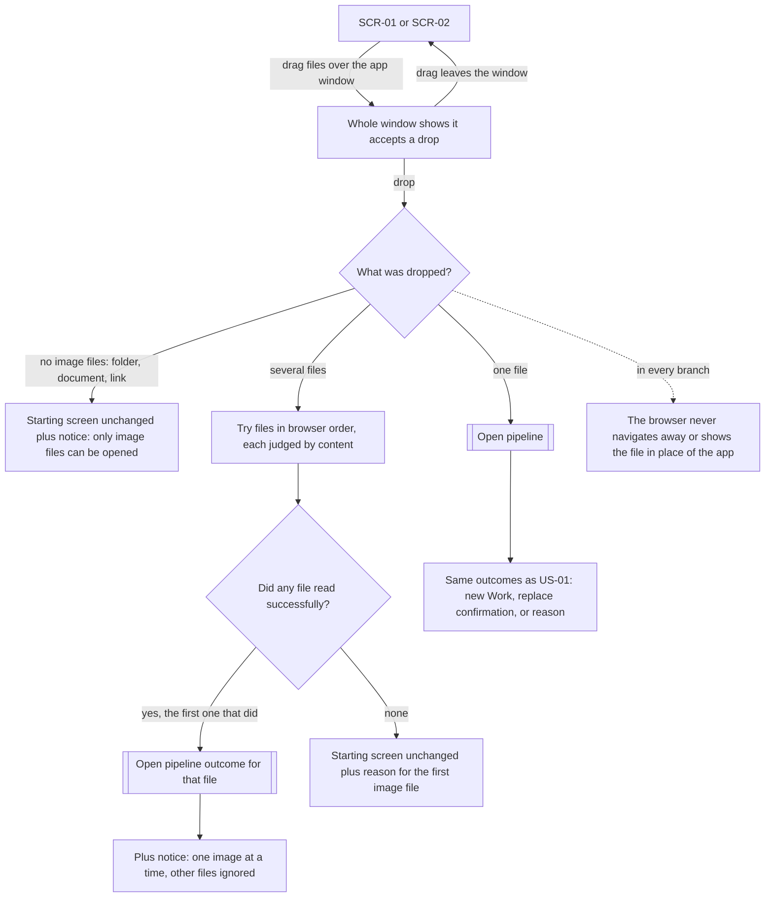
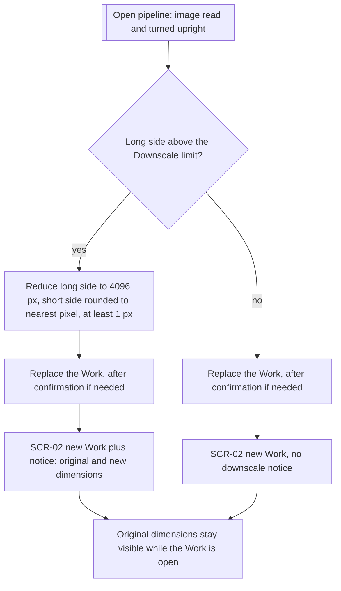
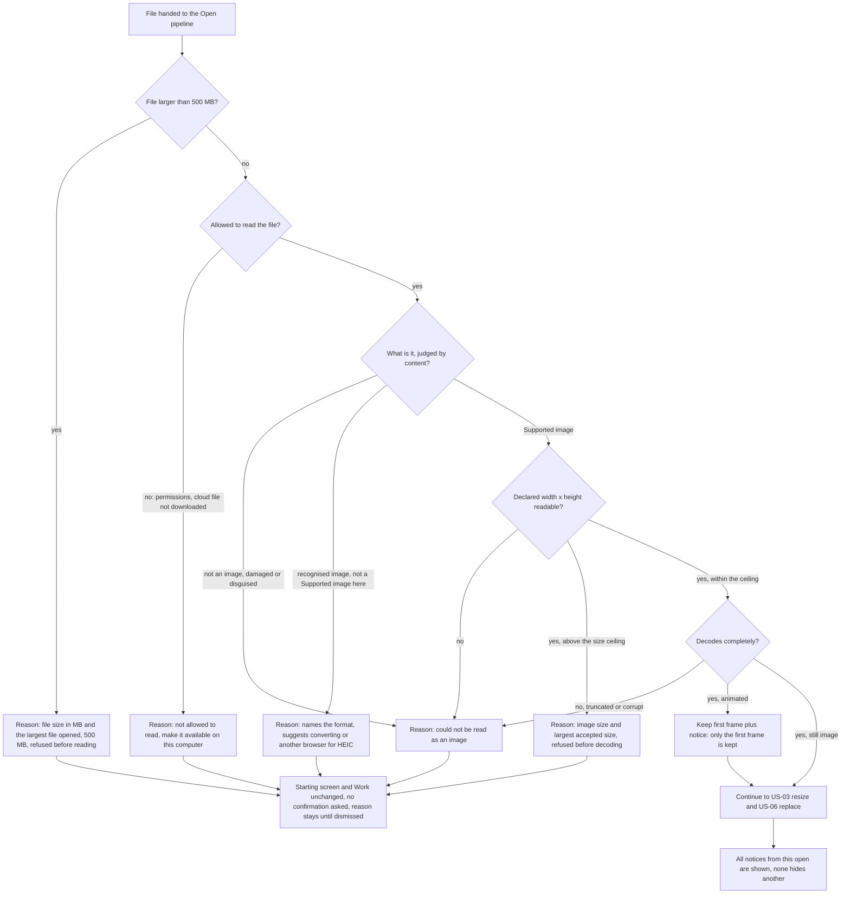
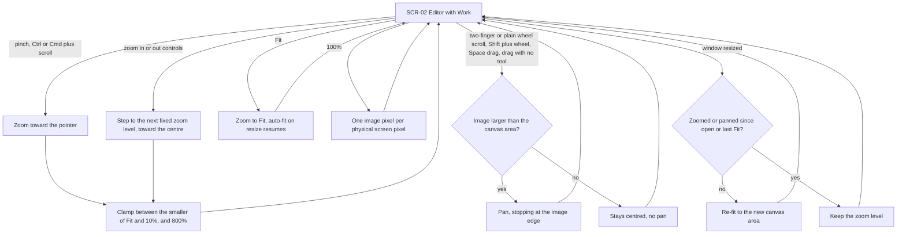
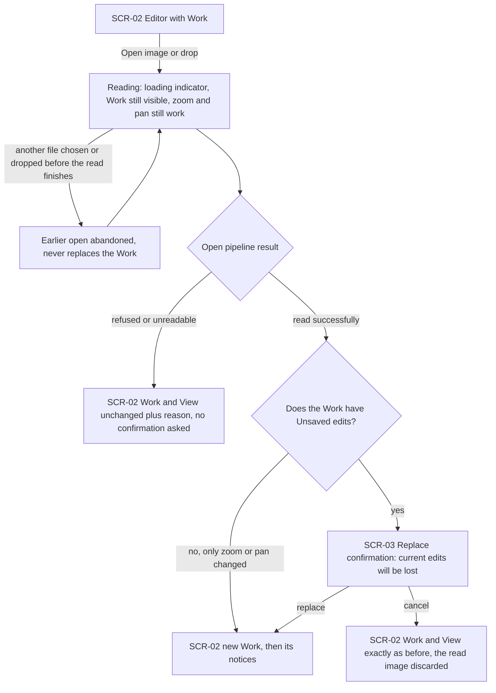
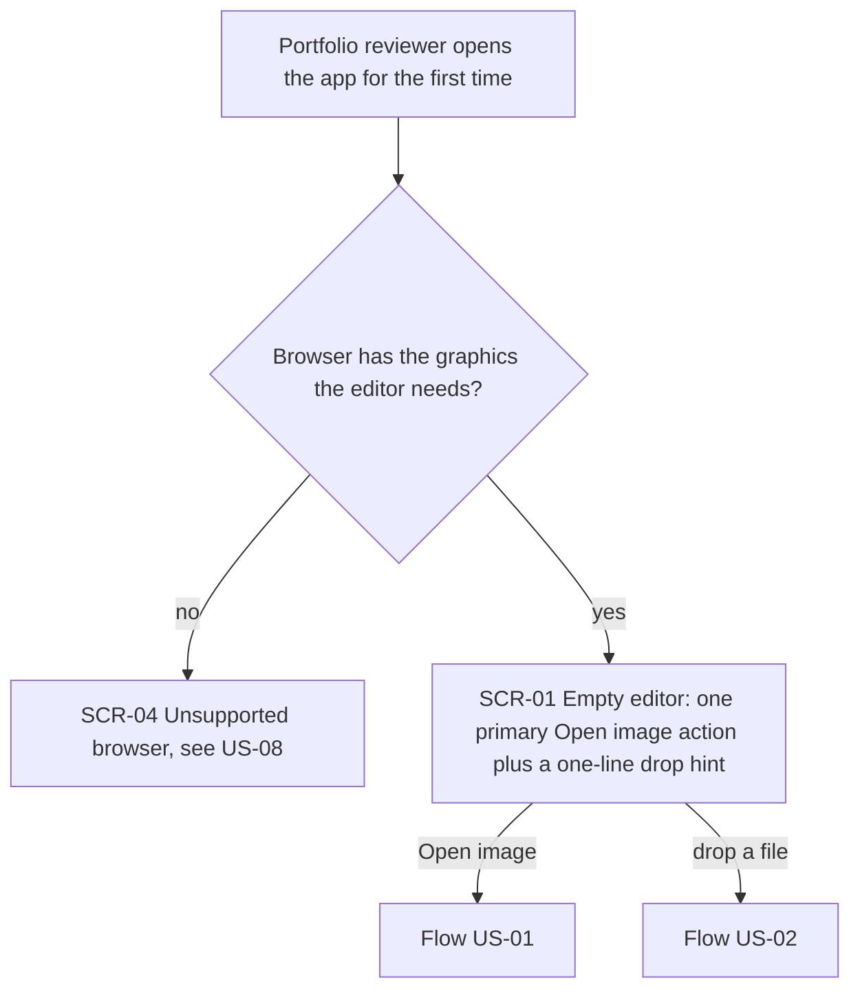
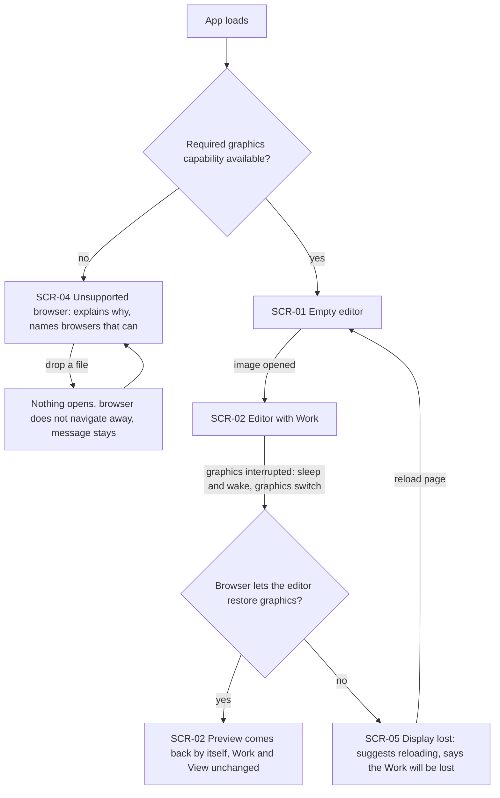

# UX flows — open-and-view

> User flows for every UI-touching §4 user story, produced by `ux-flows` (after `clarify`, before
> `design`) and read by `design` (evidence for the target-surface + UI-architecture decisions),
> `sequences` (UI-driven flows align on SCR ids), `screens` (details every inventory row) and
> `plan-tests` (the e2e-through-UI paths). **Always markdown + mermaid `flowchart`**, whatever the
> design tool — this artifact is flow-altitude, not visual design.

## Platform decisions

- **Posture:** desktop-first, as in `docs/design-system.md` §Platform posture. Drag-and-drop and trackpad/mouse gestures are primary paths. Below 1024 px the same screens apply, and only the "Open image" action is expected to work (touch gestures are a §3 non-goal).
- **Navigation shape:** one editor view with no page navigation. SCR-01, SCR-02, SCR-04 and SCR-05 are alternative contents of the same canvas area, never separate pages, so the app never leaves its own URL.
- **Modality:** the replace confirmation (SCR-03) is the only modal step and blocks until answered. Picking a file uses the operating system's own dialog (SCR-06). Every other outcome is a non-blocking notice, following the canon's single notice boundary: informational notices dismiss themselves, failure reasons stay until dismissed (AC-11b).
- **Loading:** reading a file is a state of the screen it started from (SCR-01 or SCR-02), not a screen of its own. The current Work stays visible and can still be zoomed and panned (AC-16b).
- **Shared step — "Open pipeline":** the dialog (US-01) and drop (US-02) paths both hand the chosen file to the same sequence of checks. Its outcomes are drawn in US-03 (resize), US-04 (refusals) and US-06 (replace protection), and other flows reference it as a subroutine node.

## Screen inventory

| ID | Screen | Purpose | Entry | Exit |
|---|---|---|---|---|
| SCR-01 | Empty editor | First impression with no Work: one primary "Open image" action, a one-line hint that an image can be dropped, the whole app accepts a drop | App load with graphics available; reload from SCR-05 | SCR-06 (Open image), Open pipeline (drop), SCR-02 (successful open) |
| SCR-02 | Editor with Work | Shows the Preview at the current View, the zoom level, Fit / 100% / zoom controls and the Original's dimensions | Successful open (from SCR-01, SCR-02 or SCR-03); automatic graphics recovery | SCR-06, Open pipeline (drop), SCR-03, SCR-05 |
| SCR-03 | Replace confirmation | Warns that the current Unsaved edits will be lost before a successfully read image replaces the Work | Open pipeline succeeded while the Work has Unsaved edits | SCR-02 (new Work after confirm, or the unchanged Work after cancel) |
| SCR-04 | Unsupported browser | Full-canvas message: this browser can't display the editor, with browsers that can. Open image unavailable, drops ignored | App load without the required graphics capability | None inside the app (the Portfolio reviewer switches browser) |
| SCR-05 | Display lost | Full-canvas message after a graphics interruption that could not recover: suggests reloading and says the open Work will be lost | Graphics interruption the browser does not let the editor restore, while on SCR-02 | Page reload, which lands on SCR-01 |
| SCR-06 | System file dialog | The operating system's own file picker (not designed by us) | "Open image" on SCR-01 or SCR-02 | Open pipeline (file chosen), or back to the starting screen unchanged (cancelled) |

## Flows

### Flow: US-01 — Open an image from disk

From the empty editor or an open Work, the Editor chooses "Open image" and the system file dialog opens. Cancelling the dialog returns to where they were with nothing changed. Choosing a file shows a loading indicator over the current screen while the Open pipeline reads it. Three outcomes: a successful read with no Unsaved edits lands on the editor with the new Work at Fit, upright as the OS photo viewer shows it (AC-01). A successful read with Unsaved edits goes to the replace confirmation (US-06). A refusal or unreadable file leaves the starting screen as it was and shows the reason (US-04).

### Flow: US-02 — Drop an image onto the app

Dragging files over the app makes the whole window show it will accept a drop, and dragging away returns to the previous screen. On drop the app checks what arrived. With no image files at all (a folder, a document, a link from another tab), nothing changes and a notice says only image files can be opened (AC-04). One file goes through the Open pipeline with the same outcomes as US-01 (AC-02). With several files, they are tried in the order the browser gives, each judged by content. The first one that reads successfully continues through the normal outcome (including replace protection) and a notice says the editor works with one image at a time. If none reads, nothing changes and the reason for the first image file is shown (AC-03). In every branch, the browser never navigates away or shows the dropped file instead of the app (AC-02).

### Flow: US-03 — Know when an image was reduced

After the image is read and turned upright, its long side is compared with the Downscale limit. If larger, it is reduced to 4096 px on the long side with proportions kept (short side rounded, never below 1 px). Once it has actually replaced the Work (after the confirmation in US-06 when there are Unsaved edits), a one-line notice gives the original and the new dimensions (AC-05). If it is at or below the limit, it opens at its own size with no notice (AC-06). Either way, the Original's dimensions stay visible on the editor for as long as the Work is open.

### Flow: US-04 — Understand why an image won't open

This is the inside of the Open pipeline. First, a file larger than 500 MB is refused from its size alone, before any of it is read, with its size in MB and the largest file the editor opens (AC-09). Then, if the OS or browser won't let the app read the file (permissions, a cloud file not downloaded), the reason says so and suggests making it available locally (AC-10). Then the content, not the name, decides: not an image, damaged or disguised gives "could not be read as an image" (AC-08). A recognised format that isn't a Supported image here (HEIC in a browser without support, SVG, BMP, ICO, TIFF, RAW, PSD) gets a notice that names the format and suggests converting it (AC-07). For a Supported image, the declared dimensions are read first. Unreadable dimensions count as unreadable (AC-08), and dimensions above the ceiling are refused before decoding, with the image's size and the largest accepted size (AC-09). A decode that fails is AC-08 again. An animated image keeps its first frame and adds a notice (AC-11). Every refusal leaves the screen and the Work exactly as they were, asks no confirmation, and keeps the reason on screen until dismissed (AC-16). When one open produces several notices, all are shown (AC-11b).

### Flow: US-05 — Inspect the image closely

On the editor, pinching or Ctrl/Cmd+scroll zooms toward the pointer, and the zoom controls step through fixed levels toward the centre. Zoom is always kept between the smaller of Fit and 10% and 800%, the zoom level is always visible, and the rest of the interface never changes size (AC-12, AC-12b). "Fit" returns to Fit and turns automatic re-fitting back on, and "100%" shows one image pixel per screen pixel. Two-finger scroll, a plain mouse wheel, Shift+wheel (horizontal), Space+drag or dragging with no tool active pans the image when it is larger than the canvas area, stopping at its edge. An image that fits stays centred and doesn't pan (AC-13). Resizing the window re-fits the image if the Editor hasn't zoomed or panned since it opened or since they last chose Fit, and otherwise keeps the zoom (AC-12b). None of this changes the Work.

### Flow: US-06 — Keep my work when opening another image

With a Work open, the Editor starts another open from the dialog or by dropping. While the file is read, the current Work stays on screen and can still be zoomed and panned. If they pick or drop another file before the read finishes, the earlier open is abandoned and only the latest can replace the Work (AC-16b). If the new file is refused or unreadable, the Work and View stay exactly as they were, the reason is shown, and no confirmation is asked (AC-16). If it reads successfully and the Work has no Unsaved edits (zoom and pan don't count), it replaces the Work directly (AC-14). With Unsaved edits, the replace confirmation warns that the current edits will be lost. Replace swaps in the new Work, and only then do its notices appear. Cancel leaves the Work and View exactly as before and discards the image that was read (AC-15).

### Flow: US-07 — Understand the app on first visit

When the Portfolio reviewer first opens the app, it checks that the browser has the graphics capability the editor needs. Without it they get the unsupported-browser message (US-08). With it, the canvas area shows one primary "Open image" action and a one-line hint that an image can also be dropped (AC-17), which lead into US-01 and US-02.

### Flow: US-08 — Get an honest message when the browser can't render

If the browser lacks the required graphics capability, the canvas area shows a full message explaining that it can't display the editor and naming browsers that can. "Open image" is unavailable, and dropping a file opens nothing, never navigates away, and leaves the message in place (AC-18). Otherwise the app starts on the empty editor. While an image is open, a temporary graphics interruption such as sleep and wake or a graphics switch restores the Preview by itself with the Work and View unchanged (AC-19). If the browser won't let it recover, the display-lost message replaces the canvas, suggests reloading and says plainly that the open Work will be lost. Reloading starts again from the empty editor (AC-19b).

## AC coverage

| AC | Shown by | Notes |
|---|---|---|
| AC-01 | Flow US-01 → "SCR-02 new Work at Fit, upright" | Fit definition is the screens/implement contract; the flow only shows the landing state |
| AC-02 | Flow US-02 → "one file" → Open pipeline; dashed "never navigates away" edge | Replace protection reused from US-06 |
| AC-03 | Flow US-02 → "several files" → try in order → "one image at a time" notice / "none" reason | |
| AC-04 | Flow US-02 → "no image files" | |
| AC-05 | Flow US-03 → "yes" branch → notice with original and new dimensions | Notice appears only after replace (AC-15) |
| AC-06 | Flow US-03 → "no" branch, no notice; dimensions stay visible | |
| AC-07 | Flow US-04 → "recognised image, not a Supported image here" | |
| AC-08 | Flow US-04 → "not an image, damaged or disguised", "declared size unreadable", "decode fails" | Three entry points, one reason |
| AC-09 | Flow US-04 → "larger than 500 MB", before reading; "above the size ceiling", before decoding | Ceiling value is spec §8 open question |
| AC-10 | Flow US-04 → "not allowed to read" | |
| AC-11 | Flow US-04 → "animated" → first frame plus notice | |
| AC-11b | Flow US-04 → "All notices from this open are shown"; Platform decisions → Modality | Persistence rule (informational self-dismiss, reasons stay) |
| AC-12 | Flow US-05 → pinch / Ctrl-Cmd scroll / controls / Fit / 100% | |
| AC-12b | Flow US-05 → clamp node; "window resized" decision | |
| AC-13 | Flow US-05 → pan gestures → "larger than canvas area?" | |
| AC-14 | Flow US-06 → "no, only zoom or pan changed" | |
| AC-15 | Flow US-06 → SCR-03 → replace / cancel | Verified against a test-prepared Work until roadmap step 4 (spec §1) |
| AC-16 | Flow US-06 → "refused or unreadable"; Flow US-04 → "unchanged, no confirmation asked" | |
| AC-16b | Flow US-06 → "another file chosen before the read finishes" | |
| AC-17 | Flow US-07 → SCR-01 | |
| AC-18 | Flow US-08 → SCR-04 → drop ignored | |
| AC-19 | Flow US-08 → "Browser lets the editor restore graphics? yes" | |
| AC-19b | Flow US-08 → SCR-05 Display lost → reload | |
