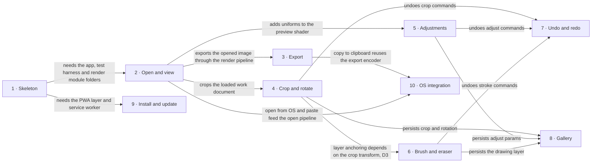

# Roadmap — imgly-editor

> **A decomposition, not a promise.** The overall idea broken into incremental steps: what each
> step is, where it comes from, how big it is — or that nobody has looked at it yet — and in which
> order, and parallel lanes, we walk them. **No dates** (except shipped history), **no scores** —
> order is the prioritization. The *solution* for any step lives in its `docs/features/<slug>/`
> spec, not here.

## Destination

A desktop user can install imgly-editor from GitHub Pages and, fully offline, crop, rotate, adjust,
draw on and export an image, then reopen any recent work later and re-edit it without loss.

## Steps

| # | Step | Source | Size | Status |
|---|---|---|:---:|---|
| 1 | Project skeleton: the app builds, boots, tests run, it deploys to GitHub Pages and works offline as a PWA shell ([`_scaffold`](features/_scaffold/)) | architecture-map.md §Module inventory | S | spec'd |
| 2 | Open and view an image: pick or drop a file, downscale it to the limit, zoom and pan the preview, get a plain reason when it can't open ([`open-and-view`](features/open-and-view/)) | idea-brief.md §5 Out of scope (downscale) + §7 Recommendation | M | shipped |
| 3 | Export the current image as PNG, JPEG or WebP with a quality setting | idea-brief.md §7 Recommendation | S | idea |
| 4 | Crop and rotate the image in 90° steps | idea-brief.md §7 Recommendation | M | idea |
| 5 | Adjust brightness, contrast, saturation, temperature/tint, grayscale and sepia with a live preview | idea-brief.md §7 Recommendation | M | idea |
| 6 | Draw freehand with a brush and an eraser, choosing colour and width, on a separate drawing layer | idea-brief.md §7 Recommendation | M | idea |
| 7 | Undo and redo every crop, adjust and draw action while the image is open | idea-brief.md §7 Recommendation | S | idea |
| 8 | Gallery of recent works: autosave, reopen and re-edit without loss, about 20 works with the oldest evicted, an honest notice that browser storage can be evicted | idea-brief.md §7 Recommendation + §6 Risks | M | idea |
| 9 | Install and update experience: an install prompt and a "new version available" toast | idea-brief.md §1 Raw idea (PWA) | S | idea |
| 10 | OS integration: paste and copy to the clipboard, and "Open with…" as the system image handler (drag-and-drop moved to step 2) | idea-brief.md §7 Recommendation | M | idea |

## Not yet specified

_Nothing. Every step can be stated precisely today. What is still undecided is a decision, listed under `## Open decisions`._

## Out of scope

- Mobile-first and touch UX: desktop is the target, and mobile only has to not break (idea-brief §5).
- Full-resolution editing and export: images are downscaled on open (idea-brief §5).
- Curves, levels, blur, sharpen, presets, text and shapes: they come after deployment, because they are the "and so on" that sinks the timeline (idea-brief §5).
- Per-stroke vector editing: there is one raster drawing layer (idea-brief §5).
- Undo history that persists across sessions: only the editable state persists (idea-brief §5).
- Accounts, cloud backup and sync: they contradict "lightweight" and need a server (idea-brief §5, ADR 0001).
- Project-file export and import: the exported image is the durable copy (idea-brief §5).

## Open decisions

| # | Question | Type | Owner | Blocks |
|---|---|:---:|:---:|:---:|
| D2 | Is the gallery capped by work count (~20) or by a storage-byte budget, and does the app call `navigator.storage.persist()`? | grilling | human | 8 |
| D3 | When a crop is re-edited, is the drawing layer anchored to the original image coordinates or to the cropped frame? | grilling | human | 6 |
| D4 | Desktop Safari cannot encode WebP. Its canvas returns a PNG blob ([caniuse](https://caniuse.com/mdn-api_htmlcanvaselement_toblob_type_parameter_webp)). Should the app hide the WebP option there, or keep it and warn that it falls back to PNG? | grilling | human | 3 |
| D5 | Verify against MDN/caniuse that `file_handlers` + `launchQueue` work only in Chromium and that image clipboard write/paste works in Chrome, Firefox and Safari. The first lookup answered from memory ([MDN](https://developer.mozilla.org/en-US/docs/Web/Progressive_web_apps/Manifest/Reference/file_handlers)) | research | agent | 10 |

## Decisions so far

- Client-only Vue 3 + TS + Vite PWA, hosted on GitHub Pages → [`docs/adr/0001-build-a-client-only-vue-pwa.md`](adr/0001-build-a-client-only-vue-pwa.md)
- Functional core + feature folders + infra shell → [`docs/adr/0002-organize-code-as-functional-core-with-feature-folders.md`](adr/0002-organize-code-as-functional-core-with-feature-folders.md)
- A work is stored in IndexedDB as original + params + drawing layer, with UUIDv7 IDs → [`docs/adr/0003-persist-works-in-indexeddb-as-original-plus-params-plus-layer.md`](adr/0003-persist-works-in-indexeddb-as-original-plus-params-plus-layer.md)
- Adjustments render on WebGL2 and drawing on Canvas 2D → [`docs/adr/0004-render-adjustments-on-webgl2-and-drawing-on-canvas2d.md`](adr/0004-render-adjustments-on-webgl2-and-drawing-on-canvas2d.md)
- Downscale limit on open is 4096 px on the long side (closes former D1) → [`docs/features/open-and-view/spec.md`](features/open-and-view/spec.md) §1
- Drag-and-drop belongs to step 2, not step 10 → [`docs/features/open-and-view/spec.md`](features/open-and-view/spec.md) §1
- Fixed MVP feature set; OS integration is last and the first thing cut → [`docs/idea-brief.md`](idea-brief.md) §7

## Dependency graph

## Execution path

| Wave | Steps | Zone per step (why parallel-safe) | Unlocks |
|:---:|---|---|---|
| 1 | 1 | repo root + `docs/features/_scaffold/` | 2, 9 |
| 2 | 2 ∥ 9 | 2: `src/features/editor/` + `src/core/` + `src/render/` (new) · 9: `src/app/pwa.ts` (new). These are disjoint | 3, 4, 5 |
| 3 | 3 ∥ 4 ∥ 5 | 3: `src/features/export/` (new) · 4: `src/features/crop/` + `src/core/crop/` (new) · 5: `src/features/adjust/` + `src/render/adjust.frag` (new). Each adds its own document fields. Step 2 owns the shared `src/core/document.ts` shape, so lanes only append | 6, 10 |
| 4 | 6 | `src/features/draw/` + `src/render/` layer compositor (new) | 7, 8 |
| 5 | 7 ∥ 8 | 7: `src/core/history/` + editor store (new) · 8: `src/infra/db/` + `src/features/gallery/` (new). Disjoint apart from read-only document types | — |
| 6 | 10 | `src/infra/platform/` + `src/features/os-integration/` (new) | — |

## Shipped

| Step | Shipped | Link |
|---|---|---|
| 2 — Open and view an image | 2026-10-05 (PR open, not merged) | [changelog](features/open-and-view/_ship/changelog.md) · PR: pending |
